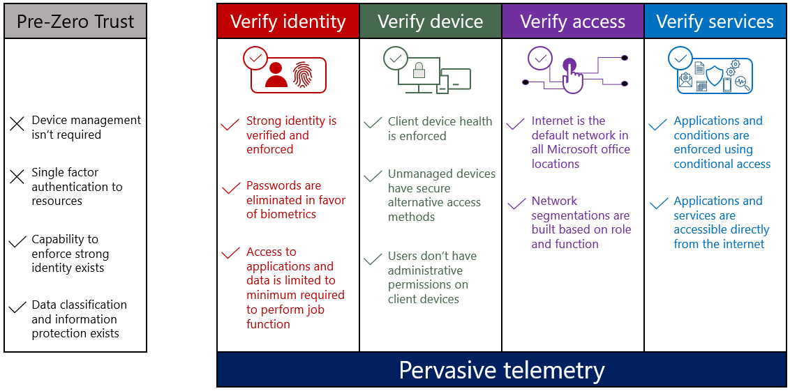
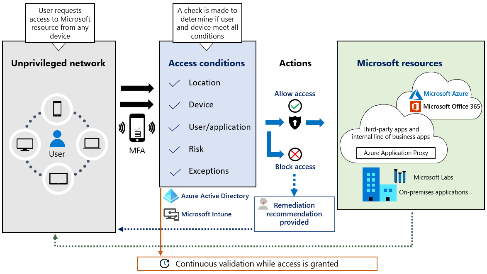
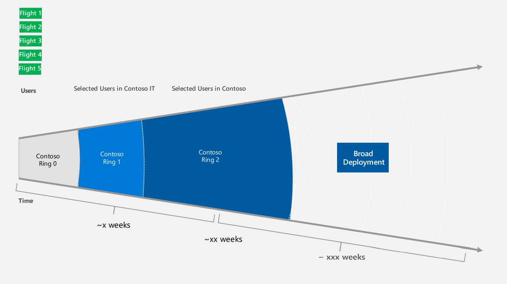

# **How to create a Zero Trust concept?**

# Still under construction - the MicroHack will be finished soon stay tuned

[MicroHack introduction and context](#microhack-introduction-and-context)

[Objectives](#objectives)

[Prerequisites](#prerequisites)

[Lab environment for this MicroHack](#lab-environment-for-this-microhack)

[Challenge 1: Understand the CA Framework](#Challenge1-Understand-the-CA-framework) 

[Challenge 2: Create Groups in Azure Active Directory](#Challenge2-Create-Groups-in-Azure-Active-Directory) 

[Challenge 3: Identify the necessary policies](#Challenge3-Identify) 

[Challenge 4: Create CA Policies in Azure Active Directory](#Challenge4-Create-Policies-in-Azure-Active-Directory) 

[Challenge 5: Create CA Rings in Azure Active Directory](#Challenge4-Create-Rings-in-Azure-Active-Directory) 

[Challenge 6: Test your CA Policies](#Challenge6-Test) 

[Challenge 7: A few ideas and resources if you plan a project](#Challenge7-Idea) 

[Finished / the end: Delete you lab environment](#Delete) 


# MicroHack introduction and context

This MicroHack scenario walks through the concept of Zero Trust and with a focus on guidance and hands on implementation. Specifically, this builds up to include working with an existing infrastructure to get an overview how the concept can be created. 

## Zero Trust Scope and phases


## Architecture for this MicroHack
This Architecture rovides a simplified reference architecture for our approach to implementing Zero Trust. The primary components of this process are Intune for device management and device security policy configuration, Azure Active Directory (Azure AD) conditional access for device health validation, and Azure AD for user and device inventory.


This lab is not a full explanation of all services that a used in a Zero Trust concept, please consider the following articles required pre-reading to build foundational knowledge.

- [Zero Trust security model at Microsoft](https://www.microsoft.com/en-us/insidetrack/implementing-a-zero-trust-security-model-at-microsoft?SilentAuth=1#:~:text=Zero%20Trust%20access%20architecture%20addresses%20the%20modern%20security,secure%2C%20least-privilege%20access%20to%20corporate%20resources%20and%20services.)
- [Zero Trust Assessment](https://info.microsoft.com/ww-landing-Zero-Trust-Assessment.html)

### Optional (read this after completing this lab to take your learning even deeper!)
- [Zero Trust Deployment Guidance](https://docs.microsoft.com/en-us/security/zero-trust/deploy/overview)
- [Resources for accelerating your Zero Trust journey](https://www.microsoft.com/security/blog/2021/05/24/resources-for-accelerating-your-zero-trust-journey/)

# Objectives 

After completing this MicroHack you will:

- Know how to build and implement a concept for Zero Trust 
- Understand various dependencies and use cases related to Zero Trust
- Have an overview of why Zero Trust is important to build an overall security baseline
- Understand the basics from Conditional Access, Policies and the connected services

# Prerequisites

In order to use the MicroHack time most effectively, the following tasks should be completed prior to starting the session.

With these pre-requisites in place, we can focus on building the differentiated knowledge in Azure Monitor and Log Analytics that is required when working with the product, rather than spending hours repeating relatively simple tasks such as setting up Log Analytics.

### At the end of this section your lab looks as follows:

Screenshots and Architecture later

# Lab environment for this MicroHack

The following components are needed for this: 

Components:


Permissions for the deployment: 


Now it should be clear which components we need and in order not to lose any time let's start directly with the first challenge. 

# MicroHack Challenges 

# Challenge 1 - Understand the CA framework

## Goal

The goal of this exercise is to understand personas and why they are necessary to better structure your policies to common access needs. 

## Task 1: Write down your own thoughts / ideas
Take a [whiteboard](https://app.int.whiteboard.microsoft.com/?ring=latest) and ask yourself which topics are necessary to structure conditional access policies and use them for a Zero Trust concept. Ask yourself the following questions.  

 💡 If necessary, and if you do not know what to do, you can also browse through the templates and get an overview. [Click here to open the documentation for Conditional Access templates directly.](https://docs.microsoft.com/en-us/azure/active-directory/conditional-access/concept-conditional-access-policy-common#conditional-access-templates-preview)

Questions:
1. What structures are necessary to identify different characters?
2. What types of policies do we need?
3. Do policies need a sequential number and if so for what?
4. What does your conditional access approach look like today? Have you adopted the Targeted Apps or Zero Trust approach?

😇 Even if you are confused now or think it is more complicated than you thought. Hereby we can tell you that at the end of this MicroHack we will give many of your open questions and thoughts a clear line. 


## Task 2: Understand personas

- In practice it can be very challenging to implement and still protect access to resources for various users 
- An example would be to define a CA policy that requires known user and known device for access to a sensitive resource that must be accessed by both guests and employees 
- As guests come from a managed device, this would not work and you would have to adjust the CA policy to meet both requirements, with typically would result in a policy that only meets lowest denominator (implies less secure). 
- Another approach would be to look at the organization and try to define access policies based on where you are in the organization. However this approach would result in way too many CA policies and seems unmanageable. 

✅ A better approach is to structure policies related to common access needs and contain a set of access needs in a persona, representing these needs for various users who have the same needs.

### Suggested Conditional Access Personas 

| Title                                   | Description                          |                  |       |
| :-------------------------------------- | :---------------------------------- | :-------------------- | :---------------------------------- |
| Internals                               | Internal users or FTE or part-time employees                |    
| Admins                                  | Administrators who are salaried and are considered FTEs          |    
| Guests                                  | Guests from other companies, partners or organizations with whom you work.            |                
| Guest Admins                            | Guests from other companies, partners or organizations who take over administrative activities          |                
| Externals                               | External people who are employed for a certain period of time but do not have access to e.g. internal stuff.            |                
| Service Accounts                        | Service accounts for classical operations activities or to maintain least privilege             |         
| BreakGlass Accounts                     | Breakglass Accounts are emergency accounts that are not subject to a policy             |         

💡 Keep in mind: Of course, there can be more personas and these can also be changed or adapted to specific use cases / requirements. Please contact your Microsoft Account Team for support. 

## Task 3: Deal with naming standards
Many organizations no longer have a proper overview of their policies, nor did they have a concept when they initially created them. Naming standards are an important part of CA policies to keep the overview. 

👽 So, the recommendation is to start using a consistent naming model for your CA policies


| Title                                   | Description                          |                  |       |
| :-------------------------------------- | :---------------------------------- | :-------------------- | :---------------------------------- |
| CA Number                              | Quickly identity Type, Scope and Order             |    
| Persona                                | Global, Admins, Internals, Externals, Guests, GuestAdmins, ...          |    
| Policy Type                                 | Base Protection, AppProtection, DataProtection, IdentityProtection, AttackSurfaceProtection, Compliance            |                
| App                            | AllApps, O365 for all O365 Services, EXO for Exchange online, ...          |                
| Platform                               | AnyPlatform, Unknown, Windows, MacOS, iOS, Android            |                
| Grant                        | Block, ADHJ, Compliant, Unmanaged, where unmanaged is specified in device state condition             |         
| Description                    | Optional Meaningful description             |    

✅ ❗ Assure strict naming convention of policies, like 

````

Framework: <CAnumber>-<Persona/User type>-< Policy Type>-<App>-<Platform>-<Grant>-<OptionalDescription>

Example: CA002-Global-IdentityProtection-AllApps-AnyPlatforms-Block-BlockLegacy

````


## Task 4: Understand the available policy types and some examples

## 1. Policy Types 
| Title                                   | Description                          |                  |       |
| :-------------------------------------- | :---------------------------------- | :-------------------- | :---------------------------------- |
| BaseProtection                              |     For each persona, we want to have a base protection that is 
covered by this policy type.       |    
| IdentityProtection                              | On top of the base protection for each persona, we can have CA 
policies that relate to identity          |    
| DataProtection                                |        Type policy type indicates delta policies that protect data as an 
extra layer on top of the base protection     |                
| AppProtection                            |  This policy type is another addition to the base protection.       |                
| AttackSurfaceReduction                               | This type of policy is to mitigate against various attacks, like if a 
user is coming from an unknown platform,            |                
| Compliance                        | Block, ADHJ, Compliant, Unmanaged, where unmanaged is specified in device state condition             |         

## 2. App Policy Types 
| Title                                   | Description                          |                  |       |
| :-------------------------------------- | :---------------------------------- | :-------------------- | :---------------------------------- |
| AllApps                             |       Indicates that "All Cloud Apps" is being targeted in the CA policy      |    
| AppName                             |     "AppName" is just an example of an app that the policy addresses   |    

## 3. Platform Policy Types 

## 4. Grant types

## 5. Examples

````
CA001-Global-BaseProtection-AllApps-AnyPlatforms-AADJorCompliant
CA002-Global-IdentityProtection-AllApps-AnyPlatforms-Block-BlockLegacy
CA100-Admins-BaseProtection-AllApps-AnyPlatforms-Unmanaged
CA101-Admins-AttackSurfaceReduction-AllApps-Unknown-Block
CA200-Internals-AppProtection-O365-Windows10-AADHJ
CA201-Internals-AppProtection-O365-Windows10-Unmanaged
CA202-Internals-DataProtection-O365-Windows10-Unmanaged-DLPSessioncontrol
CA203-Internals-AppProtection-O365-iOSAndroid-EMAppProtection
CA204-Internals-AppProtection-SPO-iOSAndroid
CA300-Externals-BaseProtection-AllApps-AnyPlatform 
CA301-Guests-Compliance-AllApps-AllDevices-RequireTOU (TOU = Terms Of Use)
CA401-GuestAdmins-Compliance-AllApps-AllDevices-RequireTOU (TOU = Terms Of Use)
````

💡 Please remember from our previous task you can also browse through the public avaiable templates and get an overview. [Click here to open the documentation for Conditional Access templates directly.](https://docs.microsoft.com/en-us/azure/active-directory/conditional-access/concept-conditional-access-policy-common#conditional-access-templates-preview)

## Task 5: What we have learned so far

Open: Summarize everything and ask questions for a small knowledge check

## Task 6: Intro to CA Principles and proven practices
Open: Review and links to the portal...

1. Use report-only mode before putting a policy into production.
2. Test both positive and negative scenarios
3. Use change and revision control on CA policies
4. Automate the management of CA policies using tools like Azure DevOps/GitHub or Logic 
Apps
5. Apply Zero Trust principles to Conditional Access
6. Limited use of block mode for general access, only if/where needed
7. Assure all applications and platform are protected (CA has no implicit "deny all")
8. Protect privileged users in all M365 RBAC systems
9. Require password change and MFA for high-risk users and sign-ins
10. Restrict access from devices with high risk (Intune compliance policy with compliance check 
in Conditional Access)
11. Protect privileged systems (like Azure Mgt. Portal, AWS, GCP)
12. Prevent persistent browser sessions for admins and on untrusted devices
13. Block legacy authentication
14. Restrict access from unknown or unsupported device platforms
15. Restrict strong credential registration
16. Consider using default session policy that allows sessions to continue working in case of 
outage given the satisfied the conditions before the outage [GotoDocumention](https://docs.microsoft.com/en-us/azure/active-directory/conditional-access/resilience-defaults)

💡 Best practices for imlementing Zero Trust at Microsoft. [Click here to open the documentation and watch the video.](https://www.microsoft.com/en-us/insidetrack/best-practices-for-implementing-zero-trust-at-microsoft?SilentAuth=1)

## Task 7: Understand CA Exclusions 

1. Use security groups for exclusions (cloud-based groups are optimal as changes to such 
groups would be applied quickly as opposed to a group that is synced from on-premises)
2. Create an exclusion group for each policy or maybe just per policy type per persona that 
normally is empty and is used to provide temporary exclusions. Static exclusions are 
assigned as a direct exclusion assignment in addition to the temporary exclusions.
3. Exclude your emergency access accounts from all policies with an emergency access 
account exclusion group
4. Regularly review your exclusion group members (e.g. Access Reviews)
5. Exclude your Azure AD Connect service accounts from policies that would prevent it from 
syncing with a AADC service accounts exclusion group or consider treating this account as 
a CorpServiceAccounts persona to limit use of this account. It should only have access to 
AAD to sync users and attributes from AD to AAD and hence it can be limited in what it can 
be (mis)used for to limit risk of someone misusing this account

## Task 8: Get familiar with the CA Architecture

An important consideration is to choose which architecture the customer wants to pursue. We 
suggest considering using a Targeted or a Zero Trust CA Architecture. The figure below shows 
the idea of the two architectures 


# Challenge 2 : Create the relevant groups in Azure Active Directory

## Goal

## Task 1: Identify all necessary groups

| Group                                                | Type                     |                    Description |
|----------                                            |----------                |----------                      |
| CA-BreakGlassAccount                                 | AAD security group       | Value C1                       |
| CA-Persona-Internals                                 | AAD security group       | Value C1                       |
| CA-Personal_Internals-BaseProtection-Exclusions      | AAD security group       | Value C1                       |
| CA-Personal_Internals-IdentityProtection-Exclusions  | AAD security group       | Value C1                       |
| CA-Personal_Internals-AppProtection-Exclusions       | AAD security group       | Value C1                       |

**Explain the background...**

## Task 4: 

Before proceeding to challenge 3, ...

# Challenge 3: Identify the necessary policies 

## Goal

## Task 1: Which policys would you create from you experience so far? 

Take your whiteboard again and think about which policy groups are necessary. 

**Explain the background...**


Before proceeding to challenge 4, ...

# Challenge 4: Create the necessary policies in Azure Active Directory

## Goal
The goal of this challenge is to create all necessary conditional access policies. We will keep it simple and not create all of them but the concept should be understood and the hard work should be done at a quiet hour. 

## Task 1: CA001-Global-BaseProtection-AllApps-AnyPlatform-BlockNonPersonas

## Task 2:  CA002-Global-AttackSurfaceReduction-VariousApps-AnyPlatform-Block

## Task 3: CA100-Admins-BaseProtection-AllApps-AnyPlatform-CompliantorAADH

## Task 4: CA101-Admins-BaseProtection-AllApps-AnyPlatform-MFA

## Task 5: CA102-Admins-IdentityProtection-AllApps-AnyPlatform-CombinedRegistration

## Task 6: CA103-Admins-IdentityProtection-AllApps-AnyPlatformMFAandPWDforMediumandHighUserRis

## Task 7: CA104-Admins-IdentityProtection-AllApps-AnyPlatform-MFAforMediumandHighSignInRisk


# Challenge 5: Create Rings for test deployment of Conditional access policies 
Some companies may prefer to manage these test users in an ad-hoc manner and include 
relevant users in a test group and just expand membership in that group until fully tested and 
applied to all users. However you should expect ongoing changes to the CA policies, it  
is useful to have a more structured approach on how to introduce changes. This also 
involves more easy and structured communication and collaboration with the stakeholders 
about exact status on various features for individual personas

## Goal




## Task 1: CA-Persona-InternalsRing0

## Task 2: A-Persona-InternalsRing1

## Task 3: A-Persona-InternalsRing2

## Task 4: A-Persona-InternalsRing3

## Task 5: All InternalsCA-Persona-Internals

**Explain the background...**

## Task 4: 

Before proceeding to challenge 6, ...

# Challenge 6: Test your policies

## Goal

## Task 1: Report only mode 

## Task 2: Onboard a device to endpoint manager 

## Task 3: Create a test users in Azure Active Directory 

## Task 4: Define the test scenario 

## Task 5: Test CA Admin

## Task 6: Test CA Internal 

## Task 7: Test CA External 

## Task 8: Test CA Guest 

# Challenge 7: A few ideas and resources if you plan a project 

## 

**Explain the background...**


# Finished? Delete your lab

Thank you for participating in this MicroHack!