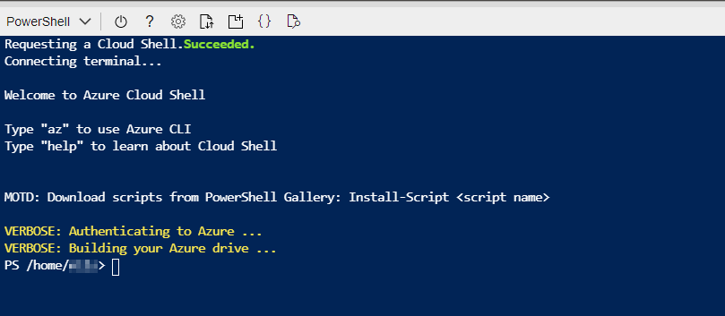
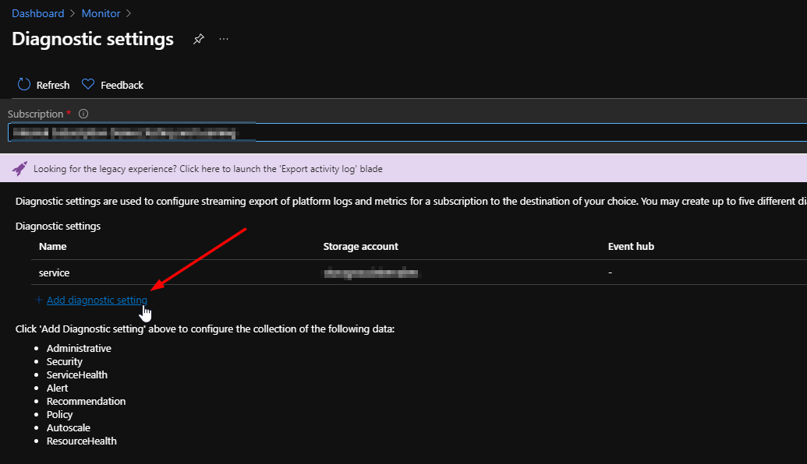

# **How to collect all my security relevant log data? (Log Analytics)**

# Contents

[MicroHack introduction and context](#microhack-introduction-and-context)

[Objectives](#objectives)

[Prerequisites](#prerequisites)

[Lab environment for this MicroHack](#lab-environment-for-this-microhack)

[Challenge 1: Deploy the Lab environment](#challenge-1---deploy-the-lab-environment) 

[Challenge 2: Collect logs from Windows VM](#challenge-2--collect-logs-from-windows-vm)

[Challenge 3: Collect logs from Linux VM](#challenge-3-collect-logs-from-linux-vm)

[Challenge 4: First query with KQL](#challenge-4-first-query-with-kql)

[Challenge 5: Onboard storage account to LA Workspace](#challenge-5-onboard-storage-account-to-log-analytics-workspace)

[Challenge 6: Onboard activity logs to LA Workspace](#challenge-6-onboard-azure-activity-logs)

[Challenge 7 : Link Automation account to LA Workspace](#challenge-7-link-automation-account-to-la-workspace)

# MicroHack introduction and context

This MicroHack scenario walks through the use of Log Analytics and with a focus on security log collection. Specifically, this builds up to include working with an existing infrastructure to get an overview how to collect relevant security logs. 

The overall architecture is designed for the Security MicroHacks in this repository. This means that some parts of the architecture of the MicroHacks contain e.g. only placeholders for services or elements that will be added in the following MicroHacks. To get a comprehensive learning experience it makes sense to start with the first MicroHack and then work your way through piece by piece. 

## Architecture for this MicroHack Series (Overall architecture at the end)


This lab is not a full explanation of Azure Monitor & Log Analytics as a technology, please consider the following articles required pre-reading to build foundational knowledge.

- [Overview Log Analytics ](https://docs.microsoft.com/en-us/azure/azure-monitor/logs/log-analytics-tutorial)
- [Azure Monitor Agent](https://docs.microsoft.com/en-us/azure/azure-monitor/agents/azure-monitor-agent-overview)
sdfsdf
### Optional (read this after completing this lab to take your learning even deeper!)
- [Azure Monitor design principles and best practices](Link to Martina & Mo´s Repo)
- [Should I switch to the new Azure Monitor agent?](https://docs.microsoft.com/en-us/azure/azure-monitor/agents/azure-monitor-agent-overview#should-i-switch-to-azure-monitor-agent)

# Objectives 

After completing this MicroHack you will:

- Know how to build a basic log analytics workspace design and connect a new workspace to relevant services
- Understand default security log configuration
- Have an overview of why log analytics is important to build an overall security baseline
- Understand the basics from log analytics and how it relates to the Azure security products

# Prerequisites

In order to use the MicroHack time most effectively, the following tasks should be completed prior to starting the session.

With these pre-requisites in place, we can focus on building the differentiated knowledge in Azure Monitor and Log Analytics that is required when working with the product, rather than spending hours repeating relatively simple tasks such as setting up Log Analytics.

### At the end of this section your base lab build looks as follows:


# Lab environment for this MicroHack

The Lab starts simply with an understanding of Log Analytics. 
The following components are needed for this: 

- Resource Group 
- Central Log Analytics Workspace
- Linux Virtual Machine
- Windows Virtual Machine
- Storage Account Archiving 
- Storage Account 
- Automation Account

Permissions for the deployment: 
- Contributor on your Resource Group
- Azure AD rights for Activity Log connection

Now it should be clear which components we need and in order not to lose any time let's start directly with the first challenge. 

# MicroHack Challenges 

# Challenge 1 - Deploy the Lab environment

## Goal

The goal of this exercise is to deploy the Lab environment and get some hands on with experience with the Azure Cloud shell. 

## Task 1: Login to Azure Cloud shell

1. Login to Azure cloud shell [https://shell.azure.com/](https://shell.azure.com/)
2. If you don´t have a storage account mounted, choose you subscription and create a new one --> otherwise move on with the next step




3. Ensure that you are operating within the correct subscription via. Please copy the command and execute it in you active Azure Cloud Shell session. 

```
az account show
```

If output shows "Welcome to Azure Cloud Shell" you are good to go. Move on with the next task. 

## Task 2: Deploy the resource group 

Please copy the command and execute it in the already existing Azure Cloud Shell session. 

```

az group create --name rg-MicroHack-AzureSecurity --location westeurope

```


💡 Keep in mind: If you want to change the name of the resource group please feel free to do it. But please be aware of that the name is used in some other commands later on.

## Task 3 : Deploy centralized Log Analytics Workspace

In this task you will deploy the centralizied Log Analytics Workspace for our lab environment. Please be aware of that there some design principles out there that will help you to get an understanding of the best practices. For this MicroHack series it is good enough to have one LA workspace up and running. To move on please copy the command and execute it in your active Cloud Shell session. 

```

az monitor log-analytics workspace create -g rg-azuresecurity-microhacks -n microhack-workspace -l westeurope

```

🔦 Here we shed some light on the best practices and design principles about Log Analytics: Click here 🔦 [Azure Monitor design principles and best practices](Link to Martina & Mo´s Repo)

<!--
[](https://portal.azure.com/#create/Microsoft.Template/uri/https%3A%2F%2Fraw.githubusercontent.com%2Fnilsbankert%2FMicroHacks-Microsoft-Security%2Fmain%2F1-MicroHacks-Azure-Security%2F1-MicroHack-Log-Analytics%2FARM%2520Templates%2FLogAnalticsWorkspace.json%3Ftoken%3DAHOMOJBICIGLSYUNSOUPCG3AII2PY)

-->


## Task 3: Deploy Virtual Machines

In the next steps you will deploy a virtual machine setup. This machines will later be used for onboarding to the relevant Azure monitoring and security services. 

🔒 After executing the command you will be asked for a password. Please save this password in secure environment or keep it in mind. We will need it in the next challenges. 

### Deploy Linux Virtual Machine with CLI 

In this task you will deploy a virtual machine with an Ubuntu Image. Pleas copy the command and execute in your Azure Cloud Shell session. 

```
az vm create -n Linux-VM -g rg-MicroHack-AzureSecurity --image UbuntuLTS --admin-username microhack
```

[](https://portal.azure.com/#create/Microsoft.Template/uri/https%3A%2F%2Fgist.githubusercontent.com%2Fnilsbankert%2F64400dda72ae30bf49cb2065b726dc70%2Fraw%2Fd1b3df74031e5c204f7a00ab06773e8e43463661%2FARM%252520Template%252520Linux-VM)


### Deploy Windows Virtual Machine with CLI 

In this task you will deploy a virtual machine with an Windows Image. Please copy the command and execute in your Azure Cloud Shell session. 

```
az vm create \ --resource-group rg-MicroHack-AzureSecurity \ --name Windows-VM \ --image win2019datacenter \ --admin-username microhack
```

✅ Congratulations our lab environment is ready and now you will get some hands on with the virtual machines and the relevant log collection configuration. 

# Challenge 2 : Collect logs from Windows VM

## Goal

## Task 1: 

## Task 2: 

## Task 3: 

**Explain the background...**

## Task 4: 

Before proceeding to challenge 3, ...

# Challenge 3: Collect logs from Linux VM 

## Goal

## Task 1: 

## Task 2: 

## Task 3: 

**Explain the background...**

## Task 4: 

Before proceeding to challenge 4, ...

# Challenge 4: First query with KQL

## Goal

## Task 1: Linux VM

## Task 2: Correlation query between Windows and Linux 


# Challenge 5: Onboard storage account to Log Analytics Workspace

## Goal

## Task 1: 

## Task 2: 

## Task 3: Immutable Storage for long term archive

**Explain the background...**

## Task 4: 

Before proceeding to challenge 6, ...

# Challenge 6: Onboard Azure Activity Logs

This challenge is a key for your overall security baseline. The configuration should be created at the beginning of every Azure enrollment or subscription. 

## Goal

After the configuration is in place you can gain insights into subscription-level events. This includes such information as when a resource is modified or when a virtual machine is started. 

## Task 1: Connect Activity Logs to Log Analytics workspace

Open the Azure Monitor threw the Azure Portal. Click on Activity Log and choose Diagnostic settings. 


Select **"Add diagnostic setting"**, choose a name for the configuration, tick all log categories and send everything to the log analytics workspace that we have created in challenge 1. Click on Save and move on with the next task. 





💡 Only new Activity log entries will be sent to the Log Analytics workspace, so perform some actions in your subscription that will be logged such as starting or stopping a virtual machine or creating or modifying another resource. You may need to wait a few minutes for the diagnostic setting to be created and for data to initially be written to the workspace. After this delay, all events written to the Activity log will be sent to the workspace within a few seconds.

## Task 2: Retrieve Log Data hands on

Select Logs in the Azure Monitor menu. If the scope isn't set to the workspace you created, then click select scope and locate it.

In the query window type in the following queries and click run to execute. Please again be aware of that only new Activity log entries will be sent to the Log Analytics workspace, so perform some actions in your subscription that will be logged such as starting or stopping a virtual machine or creating or modifying another resource.

- **"AzureActivity"** 
- **"AzureActivity | summarize count() by CategoryValue"** 


💡 If you want to learn more about Azure Monitor and the language KQL which is used in Azure Monitor see here: 

- [Design a holistic monitoring strategy on Azure](https://docs.microsoft.com/en-us/learn/modules/design-monitoring-strategy-on-azure/)
- [Analyze query results using KQL](https://docs.microsoft.com/en-us/learn/modules/analyze-results-kusto-query-language/)

 
# Challenge 7: Link Automation Account to LA Workspace

## Goal

## Task 1: 

## Task 2: 

## Task 3: 

**Explain the background...**

## Task 4: 

Before proceeding to challenge 8, ...

# Challenge 8: (Optional) Govern everything with Azure Policy 

## Goal

## Task 1: 

## Task 2: 

## Task 3: 

**Explain the background...**

## Task 4: 

Before proceeding to challenge 8, ...

# Finished? Delete your lab

Thank you for participating in this MicroHack!
