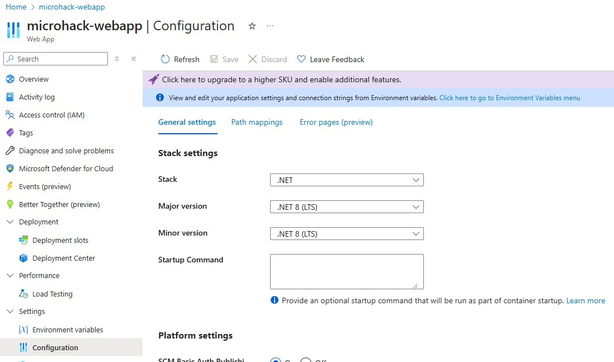
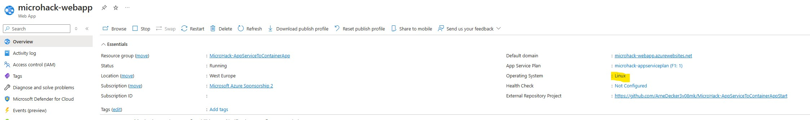
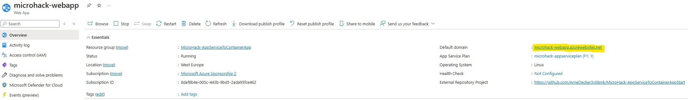

# Walkthrough Challenge 1 - Prerequisites and Landing Zone

Duration: 30 minutes

### **Familiarize yourself with the app/environment**

* In which framework and version is the application written?

    The application was written in C# in .NET version 8. You can find this information in the Web App `microhack-webapp-xyz` resource in the Azure portal in the `Configuration` tab under `Settings`:
    
    

* On which operating system (Windows or Linux) is the application currently running?

    The application is currently running on Linux. You can find this information in the App Service Resource `microhack-appservice` resource in the Azure portal in the `Overview` tab under `Operating System` setting:
    
    

* What message does the application state when you open in the browser?

    "This line here is the message you are looking for"
    
    You can start the application by accessing the URL (https://`name-of-your-webapp`.azurewebsites.net). You can find the URL in the portal in the Web App `microhack-webapp-xyz` in the `Overview` tab under the `Default Domain` setting:
    
    

    
Important: You can ignore the text fields and the button for now, the functionality behind it will be added in the last challenge. You can try it out of course, but nothing is going to happen (yet). You will probably see something like this: "Error: Failed to execute 'json' on 'Response': Unexpected end of JSON input"

### **Read through the learning resources**

* What is containerization and what is a container?
	

    Containerization is a technology used in software development and deployment that allows applications and their dependencies to be packaged together in a consistent and isolated environment called a "container." Containers provide a way to encapsulate an application, its runtime, libraries, and any other necessary components, ensuring that it runs consistently across different environments, from development to testing and production.

	A container is a lightweight, standalone, and executable software package that includes everything needed to run a piece of software, including the code, runtime, system tools, system libraries, and settings. Containers are isolated from each other and from the host system, which means that they have their own file systems, networking, and process space. This isolation ensures that applications in one container do not interfere with applications in other containers or with the host system itself.
    

* What are typical advantages of containerization?
	

    Here is a non-exhaustive list of typical benefits that containerization may bring:
	* Portability (containers encapsulate everything an app needs to run in a way that can be deployed consistently across environments, stages etc.)
	* Scalability (containers are lightweight and can be started/torn down quickly)
	* Efficiency (containers share the OS kernel of the underlying machine, multiple apps can share infrastructure in a very efficient way while they are still isolated from each other)
	* Versioning/Rollbacks (container images are stored in a registry, older versions can simple be retained and deployed without managing multiple repositories or code bases)
	* Infrastructure-agnostic (since containers encapsulate everything the app needs, they can easily be run on different machines like laptops, VMs, servers etc. as long as the infrastructure supports the respective OS)
	
	On the other hand, there are some downsides as well, for example:
    * Learning curve (developers and operators need to be familiar with containerization, respective networking, monitoring, security etc.)
    * Resource sharing (containers share the host kernel, poorly managed containerization may lead to resource constraints)
    * Complexity (containers usually require orchestration and management, which may increase complexity)
    
    

* Why would a migration from a PaaS hosting to containerization make sense?
	

    * Flexibility/customization (containerization gives more flexibility when choosing runtimes, configurations, libraries etc. compared to a managed PaaS offering like the App Service)
    * Resource efficiency and scaling (the App Service is based on instances which comparable to managed VMs, quite often they don't scale as fast and are more expensive compared to hosting containers on shared infrastructure.
    

* Which container services are available on Azure?
    Common container services are:
    - [Azure Kubernetes Service](https://learn.microsoft.com/en-us/azure/aks/intro-kubernetes) is Microsoft's managed Kubernetes cluster offering, a very common container orchestration platform used to manage large containerized applications. Compared to on-premises clusters it takes away the infrastructure management and is the most powerful container service.
    - [Azure Container Apps](https://learn.microsoft.com/en-us/azure/container-apps/overview) is an serverless hosting option that takes away a lot of management/complexity away (compared to Kubernetes). It is a simple way to host scalbale containerized applications.
    - [Azure Container Instances](https://learn.microsoft.com/en-us/azure/container-instances/container-instances-overview) is the most simple container service. It is highly efficient and fast but only allows you to host a single container (no scalability).
    - And a lot more than we can focus on here ([Azure Service Fabric](https://azure.microsoft.com/en-us/products/service-fabric), [Azure Red Hat OpenShift](https://azure.microsoft.com/en-us/products/openshift) etc.)

And the bonus question:

When migrating from the App Service to a containerized hosting, which service would be most suitable from you point of view?
	

    The Container Instances are a great service to host applications that do not require scalability, therefore it is not suitable for our web app. Kubernetes is a very powerful service but brings along a lot of complexity and management effort (cluster managment, monitoring, debugging, networking etc.). The Container Apps is a simple, cost-effective way to host the web app.
    

You successfully completed challenge 1! 🚀🚀🚀

 **[Home](../../Readme.md)** - [Next Challenge Solution](../challenge-2/solution.md)
