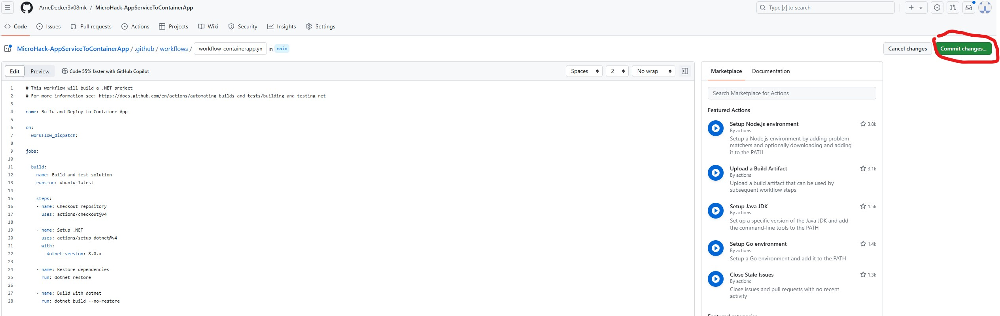
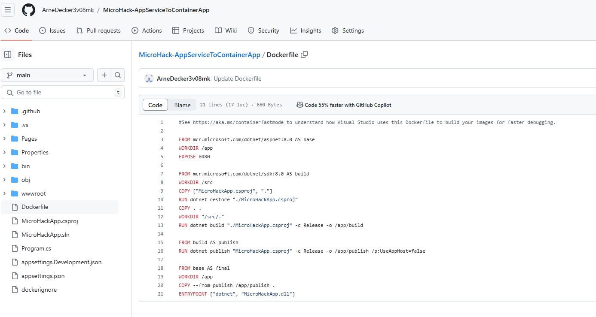

# Walkthrough Challenge 2 - Containerize the Application

Duration: 60 minutes

## Prerequisites

Please make sure thet you successfully completed [Challenge 1](../challenge-1/solution.md) before continuing with this challenge.

### **Task 1: Create an Azure Container Registry**

Open the [Azure Portal](https://portal.azure.com) and login using a user account with at least Contributor permissions on a Azure Subscription.

Search for *Container Registries* and click *Create*

In the *Basics* tab, select the resource group you want to deploy your new resources to (it can be the one with the app service or a new one).
You need to give the container registry a name which needs to be globally unique since it will be accessible via a URL with the name in it, so you can use something like "microhack-registry-xyz". Chose your preferred location. Select *Basic* as *SKU* and leave the other settings/tabs as is, then hit *Review + create* and again *Create*:

### **Task 2: Setup a new GitHub Actions workflow in the repository to build the application**

Go to your GitHub repository and open the *Actions* tab. As you can see, there is already a workflow called "Build and Deploy to App Service" in place that is currently used for the Azure App Service. Click on *New workflow*:

Search for *.NET* in the search bar to create the workflow from a template. Chose the *.NET* template (not to be confused with the *.NET Desktop*) and click *configure*:

Rename the workflow YAML file to *pipeline-containerapp.yml*. As you can see, the template is already filled with some settings and steps. Let's go through them line by line and make some first changes:

* In line 4 the name of the workflow is set. Let's rename it to *Build and Deploy to App Service*
* In line 6 to 10 the triggers when the workflow should run are defined. Currently, every time someone pushes something into the repository or someone makes a pull request the workflow will run. Since you will for the sake of simplicity only work with the main branch in GitHub directly, you should avoid automatically running the workflow. Replace the triggers simply with:
        on:
          workflow_dispatch:

* From line 9 onwards the jobs are defined and steps are defined.
* Line 12 tells GitHub to run the workflow on a Ubuntu Linux machine with the latest available version
* Line 15 checkous the repository
* Line 16 to 20 set up the required .NET tools for the workflow. Change the *dotnet-version* in line 19 to *6.x*
* Line 22 performs the build
* Line 23 performs some automated tests. This line can be removed for now since this is not part of this MicroHack.

Feel free to name all steps and format the code as you like. Your workflow should in the end look something like this:

    # This workflow will build a .NET project
    # For more information see: https://docs.github.com/en/actions/automating-builds-and-tests/building-and-testing-net
    
    name: Build and Deploy to Container App
    
    on:
      workflow_dispatch:
    
    jobs:
      build:
        name: Build and Test Solution
        runs-on: ubuntu-latest
    
        steps:
          - name: Checkout Repository
            uses: actions/checkout@v2
    
          - name: Set up .NET Core
            uses: actions/setup-dotnet@v1
            with:
              dotnet-version: '6.x'
              include-prerelease: true
    
          - name: Restore dependencies
            run: dotnet restore
    
          - name: Build with dotnet
            run: dotnet build --configuration Release

Now hit *Commit changes* to save the workflow. In the dialoge, leave the fields as is and hit *Commit changes*.

Go to the *Actions* tab. As you can see, the new workflow appears in the list. Chose the *Build and Deploy to Container App* workflow and click *Run workflow* to test it.

The workflow will run for about a minute. You can have a look in the logs to see what is happening when clicking on the workflow run. After it has completed, you should see a green mark next to the workflow run:

### **Task 3: Create a Dockerfile and add it into the repository**

In order the build a container image in a workflow, you need to define the steps how the container image is to be built. This is usually done via a Dockerfile that is then added to the repository. Open the *Code* tab to see your repository and then click on *Add file* -> *Create new file*:

Simply name it *Dockerfile* (without a file extension). This file will contain step-by-setp how the container image will be built. There are multiple ways to build the container image, the code below is only one possible solution:

    #See https://aka.ms/containerfastmode to understand how Visual Studio uses this Dockerfile to build your images for faster debugging.
    
    FROM mcr.microsoft.com/dotnet/aspnet:6.0 AS base
    WORKDIR /app
    EXPOSE 80
    
    FROM mcr.microsoft.com/dotnet/sdk:6.0 AS build
    WORKDIR /src
    COPY ["MicroHackApp.csproj", "."]
    RUN dotnet restore "./MicroHackApp.csproj"
    COPY . .
    WORKDIR "/src/."
    RUN dotnet build "./MicroHackApp.csproj" -c Release -o /app/build
    
    FROM build AS publish
    RUN dotnet publish "MicroHackApp.csproj" -c Release -o /app/publish /p:UseAppHost=false
    
    FROM base AS final
    WORKDIR /app
    COPY --from=publish /app/publish .
    ENTRYPOINT ["dotnet", "MicroHackApp.dll"]

Let's quickly go over what happens in the Dockerfile:
* Line 3 to 5 copy a base image that already contains a .NET runtime environment, a web server and some more dependencies so that you do not have to create everything from scratch. The working directory to store files is set to */app* and port 80 is opened.
* Line 7 to 13 are used to compile to application code from the repository.
* Line 15 to 16 are used to publish the ready-to-run application
* Finally line 18 to 21 are used to create the final image that will later be deployed.

Click on *Commit changes* on the top right corner to add the file to the repository.

Since you only want the application code (not the git files etc.) in your container image, you need to add a *dockerignore* file. In there you list all the paths and files that should not be included in the container image. Create a file named *dockerignore* (again without file extension) and add it to the repository as well:

    **/.classpath
    **/.dockerignore
    **/.env
    **/.git
    **/.gitignore
    **/.project
    **/.settings
    **/.toolstarget
    **/.vs
    **/.vscode
    **/*.*proj.user
    **/*.dbmdl
    **/*.jfm
    **/azds.yaml
    **/bin
    **/charts
    **/docker-compose*
    **/Dockerfile*
    **/node_modules
    **/npm-debug.log
    **/obj
    **/secrets.dev.yaml
    **/values.dev.yaml
    LICENSE
    README.md

### **Task 4: Add steps to the GitHub Actions workflow to containerize the application and push the image into the container registry**

There are multiple ways to achieve that, this is only one solution. You can use the [azure/acr-build](https://github.com/marketplace/actions/azure-container-registry-build) step to build and push an image to the Container Registry. First of all, you need to create a service principal that will be used by the workflow step to authenticate and access the Container Registry. Therefore, open the Azure CLI in the portal: https://portal.azure.com/#cloudshell/

You need to execute two commands. Keep in mind that you need information from the output of the commands. Some information (like passwords) will only be visible once, immediately after the command execution and cannot be retrieved afterwards. Please copy and keep this information since it will be lost once the console is closed or refreshes it self (which may happen from time to time). If you happen to lose this information, you can repeat the following two steps with different names.

Firstly, create the service principal with this command:
`az ad sp create-for-rbac -n "microhack-sp" --skip-assignment`

Then assign the contributor role for the container registry to the service principal:
`az role assignment create --assignee <appId from previous command> --scope <resource ID of the container registry, see hint below> --role "Contributor"`

You can get the resource ID of the container registry in the portal. Open the registry and open the JSON view, you can copy it from the top:

Next you need to store some information as secrets in GitHub. You could in theory store secret information like password directly in the workflow YAML file but for security reasons you should avoid this in every case. Instead, create secrets by going to the *Settings* tab, on the left side to *Secrets and variables* -> *Actions* and hit *New repository secret*:

Add the following secrets. You can find the password and tenant in the output of the first command you just ran (see above):

* service_principal (in Azure this is named appID in the command output)
* service_principal_password
* tenant

Now you can add the step to build and push the container image to the *pipeline-containerapp.yml* file in your repository:

    - name: Build and push image
            uses: azure/acr-build@v1
            with:
              tenant: ${{ secrets.tenant }}
              registry: microhackregistry
              service_principal: ${{ secrets.service_principal }}
              service_principal_password: ${{ secrets.service_principal_password }}
              dockerfile: ./Dockerfile
              repository: microhackapp
              image: microhackapp-containerimage

You need to give the tenant ID, the name of the container registry and the service principal + password to access it. Then you define the location of the Dockerfile. The container image will be stored in a container registry repository (comparable to a folder) named *microhackapp* under the name *microhackapp-containerimage*. 
Save and commit the changes and run the workflow to check if everything works. After the workflow completed, open the container registry, under the tab *Repositories* you should see the "microhackapp" repository, open it to see your container images:

You successfully completed challenge 2! 🚀🚀🚀

 **[Home](../../Readme.md)** - [Next Challenge Solution](../challenge-3/solution.md)
