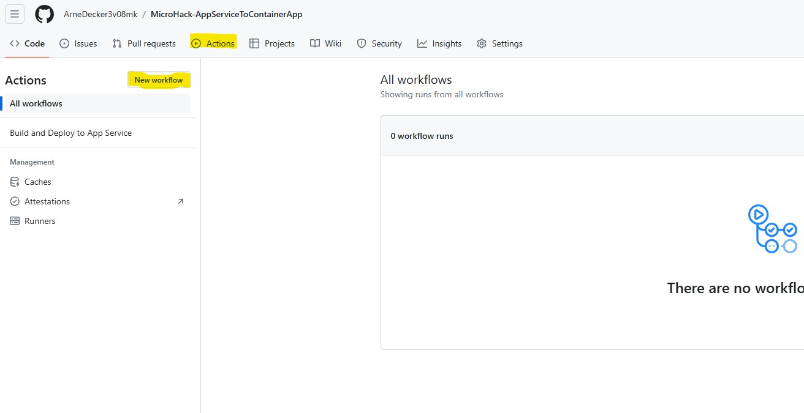
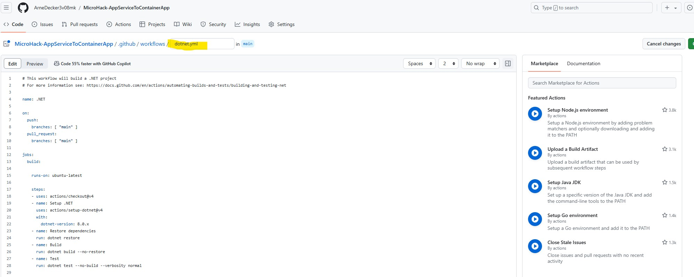

# Walkthrough Challenge 2 - Containerize the Application

Duration: 60 minutes

## Prerequisites

Please make sure thet you successfully completed [Challenge 1](../challenge-1/solution.md) before continuing with this challenge.

### **Task 1: Create an Azure Container Registry**

Open the [Azure Portal](https://portal.azure.com) and login using a user account with at least Contributor permissions on a Azure Subscription.

Search for *Container Registries* and click *Create*

In the *Basics* tab, select the resource group you want to deploy your new resources to (it can be the one with the app service or a new one).
You need to give the container registry a name which needs to be globally unique since it will be accessible via a URL with the name in it (just like the web app), so you can use something like "microhackregistryxyz" (only alphanumeric characters are allowed). Choose your preferred location. Select *Basic* as *Pricing plan* and leave the other settings/tabs as is, then hit *Review + create* and again *Create*:


### **Task 2: Setup a new GitHub Actions workflow in the repository to build the application**

Go to your GitHub repository and open the *Actions* tab. As you can see, there is already a workflow called "Build and Deploy to App Service" in place that is currently used for the Azure App Service. Click on *New workflow*:



Search for *.NET* in the search bar to create the workflow from a template. Choose the *.NET* template (not to be confused with the *.NET Desktop*) and click *configure*:


Your workflow file should look like this:



The file is currently named *dotnet.yml*. Rename the workflow YAML file to *workflow_containerapp.yml*. As you can see, the template is already filled with some settings and steps. Let's go through them line by line and make some first changes:

* In line 4 the name of the workflow is set. Let's rename it to *Build and Deploy to Container App*
* In line 6 to 10 the triggers when the workflow should run are defined. Currently, every time someone pushes something into the repository or someone makes a pull request the workflow will run. Since you will for the sake of simplicity only work with the main branch in GitHub directly, you should avoid automatically running the workflow. Replace the triggers simply with:<br>
```
on:
  workflow_dispatch:
```

(This will move everything below three lines up)

* From line 9 onwards the jobs are defined and steps are defined.
* Line 12 tells GitHub to run the workflow on a Ubuntu Linux machine with the latest available version
* From line 14 onwards the steps (sometimes called tasks) in the workflow are defined
  * Each step invokes a command/script (indicated by *run*) or a pre-defined task (indicated by *uses*)
  * Steps can have additional attributed like a name (for better readability)
  * Some steps require inputs/configuration details that are listed under *with:*
* Line 15 checkous the repository
* Line 16 to 19 set up the required .NET tools for the workflow. The *dotnet-version* should be *8.0.x*
* Line 21 to 22 restores (loads) dependencies in the project
* Line 22 to 23 performs the build
* Line 24 to 25 performs some automated tests. This line can be removed for now since this is not part of this MicroHack.

Feel free to name all steps and format the code as you like. Your workflow should in the end look something like this:

    # This workflow will build a .NET project
    # For more information see: https://docs.github.com/en/actions/automating-builds-and-tests/building-and-testing-net

    name: Build and Deploy to Container App

    on:
      workflow_dispatch:

    jobs:

      build:
        name: Build and test solution
        runs-on: ubuntu-latest

        steps:
        - name: Checkout repository
          uses: actions/checkout@v4
          
        - name: Setup .NET
          uses: actions/setup-dotnet@v4
          with:
            dotnet-version: 8.0.x
            
        - name: Restore dependencies
          run: dotnet restore
          
        - name: Build with dotnet
          run: dotnet build --no-restore

Now hit *Commit changes* to save the workflow. In the dialoge, leave the fields as is and hit *Commit changes*.


Go to the *Actions* tab. As you can see, the new workflow appears in the list. Choose the *Build and Deploy to Container App* workflow and click *Run workflow* to test it.


The workflow will run for about a minute. You can have a look in the logs to see what is happening when clicking on the workflow run. After it has completed, you should see a green mark next to the workflow run:


### **Task 3: Create a Dockerfile and add it into the repository**

In order the build a container image in a workflow, you need to define the steps how the container image is to be built. This is usually done via a Dockerfile that is then added to the repository. Open the *Code* tab to see your repository and then click on *Add file* -> *Create new file*:


Simply name it *Dockerfile* (without a file extension). This file will contain step-by-setp how the container image will be built. There are multiple ways to build the container image, the code below is only one possible solution:

    #See https://aka.ms/containerfastmode to understand how Visual Studio uses this Dockerfile to build your images for faster debugging.
    
    FROM mcr.microsoft.com/dotnet/aspnet:8.0 AS base
    WORKDIR /app
    EXPOSE 8080
    
    FROM mcr.microsoft.com/dotnet/sdk:8.0 AS build
    WORKDIR /src
    COPY ["MicroHackApp.csproj", "."]
    RUN dotnet restore "./MicroHackApp.csproj"
    COPY . .
    WORKDIR "/src/."
    RUN dotnet build "./MicroHackApp.csproj" -c Release -o /app/build
    
    FROM build AS publish
    RUN dotnet publish "MicroHackApp.csproj" -c Release -o /app/publish /p:UseAppHost=false
    
    FROM base AS final
    WORKDIR /app
    COPY --from=publish /app/publish .
    ENTRYPOINT ["dotnet", "MicroHackApp.dll"]

Let's quickly go over what happens in the Dockerfile:
* Line 3 to 5 copy a base image that already contains a .NET runtime environment, a web server and some more dependencies so that you do not have to create everything from scratch. The working directory to store files is set to */app*. Port 8080 is opened, so your application will listen on this port for incoming requests.
* Line 7 to 13 are used to compile to application code from the repository.
* Line 15 to 16 are used to publish the ready-to-run application
* Finally line 18 to 21 are used to create the final image that will later be deployed.

Click on *Commit changes* on the top right corner to add the file to the repository.


Since you only want the application code (not the git files etc.) in your container image, you need to add a *dockerignore* file. In there you list all the paths and files that should not be included in the container image. Create a file named *dockerignore* (again without file extension) and add it to the repository as well:

    **/.classpath
    **/.dockerignore
    **/.env
    **/.git
    **/.gitignore
    **/.project
    **/.settings
    **/.toolstarget
    **/.vs
    **/.vscode
    **/*.*proj.user
    **/*.dbmdl
    **/*.jfm
    **/azds.yaml
    **/bin
    **/charts
    **/docker-compose*
    **/Dockerfile*
    **/node_modules
    **/npm-debug.log
    **/obj
    **/secrets.dev.yaml
    **/values.dev.yaml
    LICENSE
    README.md

### **Task 4: Add steps to the GitHub Actions workflow to containerize the application and push the image into the container registry**

There are multiple ways to achieve that, this is only one solution. You can use the console commands to build and push a container image to the Azure container registry.

Before we can add the workflow tasks, we need to make some preparations. The workflow will need to login into the Container Regsitry with name and password. Ideally, you should always avoid credentials in plain text in your YAML files, instead you can save the credentials as secrets and use them instead. You can find the username and password of the Container Registry in the Azure portal under the *Access keys* tab. Make sure that the *Admin user* is ticked:


To add a secret in GitHub, open the *Settings* tab of the repository and go the the *Secrets and variables* -> *Actions* tab. Hit *New respository secret*:


Create two secrets, *ACR_USERNAME* and *ACR_PASSWORD* to save the credentials:


You can now access these secrets via *${{ secrets.<SECRET_NAME> }}* in the GitHub Actions workflow.

Add this snippet as a task in your GitHub Actions workflow. The name of the container registry must match the name you choose in task 1:


    - name: Build and Push Image
      run: |
        az acr login --name microhackregistry --username ${{ secrets.ACR_USERNAME }} --password ${{ secrets.ACR_PASSWORD }} &&
        docker build -t microhackregistry.azurecr.io/microhackapp:1 -f Dockerfile . &&
        docker push microhackregistry.azurecr.io/microhackapp:1

Via the `run` task you can execute console commands:
* `docker login` is used to login to the Azure Container Registry with the `ACR_USERNAME` and the `ACR_PASSWORD`.
* `docker build` is used to build the container image. The `-t` parameter sets the name of the image, the part after the `:` indicates the version (also called tag), in this case we simply use `1`. The `-f` parameter indicates the location of the Dockerfile (remember, this file includes the commands to build the container image), the `.` indicates that the file is in the repository.
* `docker push` is then used to upload the container image into the Azure Container Registry.

Save the changes and commit the file, then run the workflow:


Check the container repository in the Azure Container Registry to make sure that the container image was pushed successfully:


You successfully completed challenge 2! 🚀🚀🚀

 **[Home](../../Readme.md)** - [Next Challenge Solution](../challenge-3/solution.md)