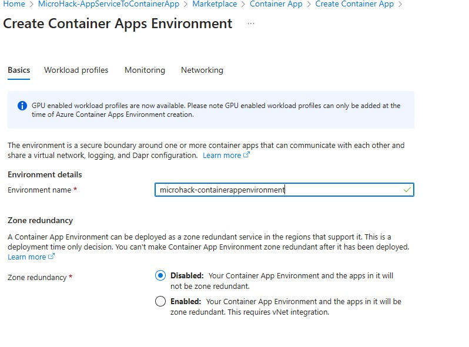
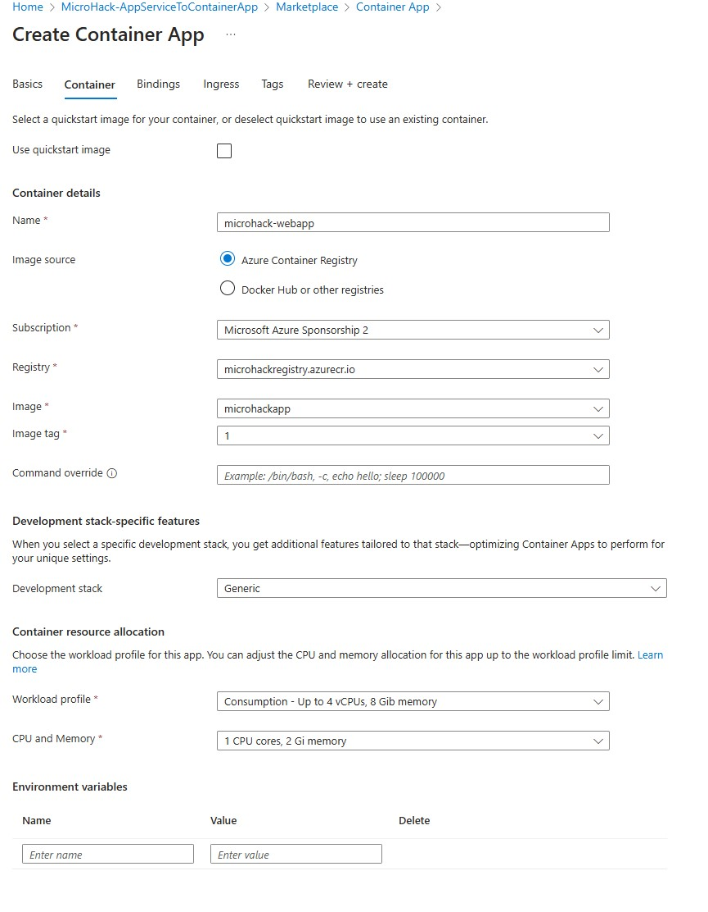
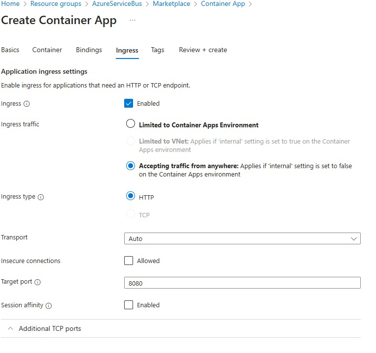

# Walkthrough Challenge 3 - Create the Container App

Duration: 60 minutes

## Prerequisites

Please make sure thet you successfully completed [Challenge 2](../challenge-2/solution.md) before continuing with this challenge.

### **Task 1: Create the Container App and the Environment**

Open the [Azure Portal](https://portal.azure.com) and navigate to the resource group that you deployed the Container Registry to.  Click *Create* in the top left corner and search for *Container App*, select the *Container App* resource and hit *Create*. 

You are now in the wizzard to create both a Container App Environment and the Container App itself. The Environment is comparable to an App Service and is used as a runtime to manage resources that are shared by multiple apps. The Container Apps itself are comparable to a Web App, they host the workloads.

Give yor container app a name, e.g. *microhack-containerapp* and choose *Container image* as deployment source and make sure that you selected the right resource group.
Next, you will configure the environment by clicking *Create new* under the *Container Apps Environment* field:


In the *Basics* tab, give your environment a name, e.g. *microhack-containerenvironment* and keep the *Zone redundancy* disabled.



In the *Workload profiles* tab you can configure the CPU and RAM that is available to the Container Apps in the environment. By default, you have a "Consumption" profile created, which offers up to 4 vCPUs and 8 GiB RAM. If you'd require more power you could create additional profiles but we won't neede that for now so just keep this tab as is.


In the *Monitoring* tab change the settings *Don't save logs*, we don't need that at the moment.


Leave the networking tab as is and hit *Create* in the bottom to return to the Container App wizzard. Switch to the *Container* tab. Give the container a name (e.g., "microhack-webapp") and select an image to deploy. You want to deploy an image from the Azure Container Registry, then select the registry you created, the image and the tag. You can also select the amount of resources you want to allocate to the Container App, 1 CPU core and 2 Gi memory should work for now. Leave the *Command override*, *Development stack* and "Environment variables* as is.



Switch to the *Ingress* tab. Here you can define wheather the Container App is accessible from the outside. Click `Enable` to allow traffic to the app. To make it accessible via public internet, you must select `Accepting traffic from anywhere`, otherwise only other Container Apps in the same environment could access the app (this is usually done for internal apps/services). The target port must match the port that you defined in the Dockerfile (port 8080). Keep the *Insecure connections* as not allowed (but keep this setting in mind for later).



Now hit *Review + create* and *Create* to deploy the Container App. It will not only deploy the app itself but also resources like a load balancer and public IP and automatically configure things like TLS encryption for you.

After the deployment, go to the Container App's *Overview* tab and open the URL to check that everything worke (it might take a few minutes for the initial startup after the creation of the Container App):


As you can see, it just requires a few clicks to deploy a container image - no cluster management, no infrastructure configuration, no networking setup - everyhing is managed for you!

### **Task 2: Automate the deployment with GitHub Actions**

You selected a container image to deploy into the Container App. But what if you make changes and update your app? Always deploying it manually might be inconvenient, instead you want to automate the deployment in your GitHub Actions workflow.

Therefore, your GitHub Actions workflow needs access to your Azure subscription. Ideally, you do not want to store any credentials anywhere, since they can be leaked, stolen or you need to have a mechanism in place for rerolling the credentials. Instead, you can create a trusted relationship. We will focus on how to set things up and only scrath on the surface of how it works under the hood. If you want to know the details, you can check them here: https://www.youtube.com/watch?v=XkhkkLBkAT4

First of all, you need a Managed Identity in Azure (comparable to a technical user). Search in the portal for *Managed Identities* and click *Create*. Make sure to choose the right resource group and give your identity a name, e.g. microhack-identity and create it:


If you open the managed identity you should see this overview. You will later require the subscription id and the client id, so you can copy them to the notepad already.


In the *Settings* section, go on the *Federated credentials tab* and hit *+ Add Credential*.


Here, you must be very precise:
* As *Federated credentiual screnario* you must choose `Configure a GitHub issued token to impersonate this application and deploy to Azure`.
* Select your GitHub organization name (most likely your GitHub name). You can look it up on the GitHub page: 
* The *Repository* is ``MicroHack-AppServiceToContainerApp` if you did not change it.
* As *Entity* you must choose `Branch` and as *Branch* set `main`
* The name is `microhack-identitycredentials`

You can create the identity now:


This identity will be used from your GitHub Actions workflow. You must assign all necessary permissions and roles that GitHub requires to this identity. Open the resource group that contains the Container App. On the *Access control (IAM)* tab, click on *+ Add* and choose *Add role assignment*:


Switch to the *Privileged administrator roles* tab and choose the `Contributor` role.


On the *Members* tab, select `Managed Identity` and choose the identity you just created and complete the assignment by clicking *Review + assign* and then *Assign*. You can leave all other tabs in default settings.


The *Contributor* role is very powerful and has very extensive write permissions on the entire resource group. It is generally fine to give these permissions but in production or real-world scenarios you might want to fine-grain the permissions. I.e., in our scenario GitHub will only interact with the Container App and Container Registry, but now it also has access to the App Service and everything else in the resource group.

Now, you need to store some information in GitHub. Open the *Settings* tab and go to *Secrets and variables* -> *Actions* and create three secrets:
* `AZURE_CLIENT_ID` (the Client ID of the managed identity)
* `AZURE_SUBSCRIPTION_ID`
* `AZURE_TENANT_ID`


If you don't know how to access your subscription or tenant ID, refer to this:
https://learn.microsoft.com/en-us/azure/azure-portal/get-subscription-tenant-id

Now, you are ready to use the managed identity form the workflow in GitHub. Open the workflow file. Before the `jobs` section (and best after the `on: workflow_dispatch:`) you need to add this section so that GitHub can fetch a token:

	permissions:
  	  id-token: write

Then add this step to login to Azure with the managed identity. You can add it as the first step in the workflow:

    - name: Login to Azure
      uses: azure/login@v2
      with:
        client-id: ${{ secrets.AZURE_CLIENT_ID }}
        tenant-id: ${{ secrets.AZURE_TENANT_ID }}
        subscription-id: ${{ secrets.AZURE_SUBSCRIPTION_ID }}

Right now, all container images are pushed into the registry with the tag "1", which means this version of the image is overwritten on every push. To change this, there are mutliple ways, this is just one solution. Add the step from the hints before the *Build and Push Image* step. It checks the registry for the latest image tag, then increments it by one for the next version and saves this tag in a variable named `image_tag`. Replace the hard-coded "1" behind the container images in the *Build and Push Image* tasks with this `${{ steps.get_tag.outputs.image_tag }}` to use the variable.

Lastly, you need to add a step at the end of the workflow to actually re-deploy the Container App. You can write your own script or use a pre-defined task form the marketplace like the *Container Apps Deploy* step:
<br>https://github.com/Azure/container-apps-deploy-action

    - name: Deploy to Container App
      uses: azure/container-apps-deploy-action@v2
      with:
        imageToDeploy: microhackregistry.azurecr.io/microhackapp:${{ steps.get_tag.outputs.image_tag }}
        acrUsername: ${{ secrets.ACR_USERNAME }}
        acrPassword: ${{ secrets.ACR_PASSWORD }}
        resourceGroup: MicroHack-AppServiceToContainerApp
        containerAppEnvironment: microhack-containerappenvironment
        containerAppName: microhack-containerapp
        targetPort: 8080

The step takes some parameters, let's have a closer look:
* `imageToDeploy` indicates the container image (container registry/container repository/image name:image tag)
* `acrUsername` and `acrPassword` are used to authenticate to the Azure Container Registry
* `resourceGroup`, `containerAppEnvironment` and `containerAppName` are used to identify the Container App
* `targetPort` should be the same you defined in the Dockerfile

Your pipeline should now look like this:

```
# This workflow will build a .NET project
# For more information see: https://docs.github.com/en/actions/automating-builds-and-tests/building-and-testing-net

name: Build and Deploy to Container App

on:
  workflow_dispatch:

permissions:
  id-token: write

jobs:

  build:
    name: Build and test solution
    runs-on: ubuntu-latest

    steps:

    - name: Login to Azure
      uses: azure/login@v2
      with:
        client-id: ${{ secrets.AZURE_CLIENT_ID }}
        tenant-id: ${{ secrets.AZURE_TENANT_ID }}
        subscription-id: ${{ secrets.AZURE_SUBSCRIPTION_ID }}
    
    - name: Checkout repository
      uses: actions/checkout@v4
      
    - name: Setup .NET
      uses: actions/setup-dotnet@v4
      with:
        dotnet-version: 8.0.x
        
    - name: Restore dependencies
      run: dotnet restore
      
    - name: Build with dotnet
      run: dotnet build --no-restore
      
    - name: Get Latest Container Image Tag
      id: get_tag
      run: |
        TAG=$(az acr repository show-tags --name microhackregistry --repository microhackapp --orderby time_desc --output tsv --detail | head -n 1 | awk '{print $4}')
        NUMERIC_TAG=$(echo "$TAG" | grep -oE '[0-9]+')
        INCREMENTED_TAG=$((NUMERIC_TAG + 1))
        UPDATED_TAG=$(echo "$TAG" | sed "s/$NUMERIC_TAG/$INCREMENTED_TAG/")
        echo "image_tag=$UPDATED_TAG" >> $GITHUB_OUTPUT
        
    - name: Build and Push Image
      run: |
        az acr login --name microhackregistry --username ${{ secrets.ACR_USERNAME }} --password ${{ secrets.ACR_PASSWORD }} &&
        docker build -t microhackregistry.azurecr.io/microhackapp:${{ steps.get_tag.outputs.image_tag }} -f Dockerfile . &&
        docker push microhackregistry.azurecr.io/microhackapp:${{ steps.get_tag.outputs.image_tag }}

    - name: Deploy to Container App
      uses: azure/container-apps-deploy-action@v2
      with:
        imageToDeploy: microhackregistry.azurecr.io/microhackapp:${{ steps.get_tag.outputs.image_tag }}
        acrUsername: ${{ secrets.ACR_USERNAME }}
        acrPassword: ${{ secrets.ACR_PASSWORD }}
        resourceGroup: MicroHack-AppServiceToContainerApp
        containerAppEnvironment: microhack-containerappenvironment
        containerAppName: microhack-containerapp
        targetPort: 8080
```

You can now make a change to the app and then deploy it to the Container App. Open the `index.cshtml` file in the repository (on *Code* tab in the *Pages* folder) and make add a new line to the landing page of the app, then commit the change and run the workflow again:


Open and run the Container App again to verify that the changes worked:


### **On the usage of ACR Credentials**

Right now, your workflow still uses the ACR name and password to authenticate to the Azure Container Registry. Generally, you should avoid using credentials like that (which is why you used a managed identity for the rest). The problem is that right now it is either not directly possible or requires a significat workaround to use managed identities to build and push images into the ACR from GitHub Actions which would be a little too much for this MicroHack. Regarding updates on the *Azure Container Apps Build and Deploy* task, please refer to this: https://github.com/Azure/container-apps-deploy-action

You successfully completed challenge 3! 🚀🚀🚀

 **[Home](../../Readme.md)** - [Next Challenge Solution](../challenge-4/solution.md)
