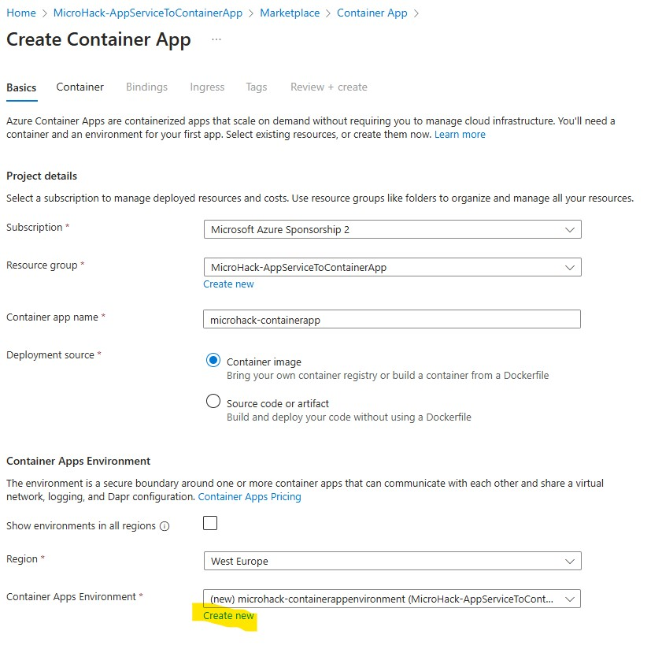
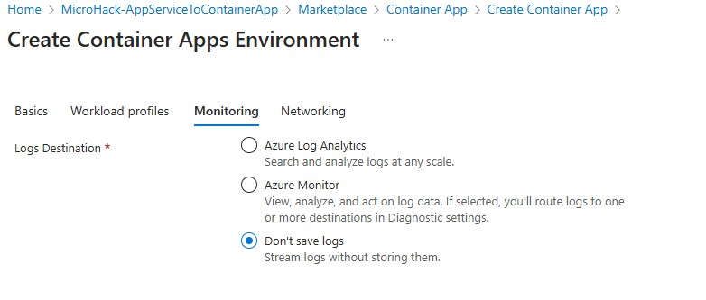

# Walkthrough Challenge 3 - Create the Container App

Duration: 60 minutes

## Prerequisites

Please make sure thet you successfully completed [Challenge 2](../challenge-2/solution.md) before continuing with this challenge.

### **Task 1: Create the Container App and the Environment**

Open the [Azure Portal](https://portal.azure.com) and navigate to the resource group that you deployed the Container Registry to.  Click *Create* in the top left corner and search for *Container App*, select the *Container App* resource and hit *Create*. 

You are now in the wizzard to create both a Container App Environment and the Container App itself. The Environment is comparable to an App Service and is used as a runtime to manage resources that are shared by multiple apps. The Container Apps itself are comparable to a Web App, they host the workloads.

Give yor container app a name, e.g. *microhack-containerapp*. 
Next, you will configure the environment by clicking *Create* under the *Container Apps Environment* field:

Give your environment a name, e.g. *microhack-containerenvironment*, select *Consumption only* and keep the *Zone redundancy* disabled.

In the *Monitoring* tab you can add a Log Analytics workspace to gather monitoring and logging data.

You can leave the *Networking* tab as is. Now hit *Create* in the bottom left.
Now we are back to the Container App itself. Switch to the *Container* tab. Here you have the possibilty to select a container image that you want to deploy. Since you want to setup the deployment with a GitHub Actions pipeline to deploy newer versions of the app automatically, select a quick start image and chose the *Simple hello world container*. Leave the other settings as is and hit *Review + create*, then *Create*.

You successfully completed challenge 3! 🚀🚀🚀

 **[Home](../../Readme.md)** - [Next Challenge Solution](../challenge-4/solution.md)
