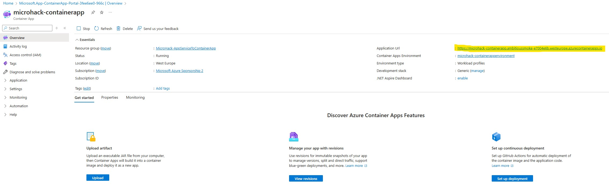

# Walkthrough Challenge 3 - Create the Container App

Duration: 60 minutes

## Prerequisites

Please make sure thet you successfully completed [Challenge 2](../challenge-2/solution.md) before continuing with this challenge.

### **Task 1: Create the Container App and the Environment**

Open the [Azure Portal](https://portal.azure.com) and navigate to the resource group that you deployed the Container Registry to.  Click *Create* in the top left corner and search for *Container App*, select the *Container App* resource and hit *Create*. 

You are now in the wizzard to create both a Container App Environment and the Container App itself. The Environment is comparable to an App Service and is used as a runtime to manage resources that are shared by multiple apps. The Container Apps itself are comparable to a Web App, they host the workloads.

Give yor container app a name, e.g. *microhack-containerapp*. 
Next, you will configure the environment by clicking *Create new* under the *Container Apps Environment* field:

Give your environment a name, e.g. *microhack-containerenvironment*, select *Consumption only* and keep the *Zone redundancy* disabled.

In the *Monitoring* tab change the settings *Don't save logs*, we don't need that at the moment.

Leave the networking tab as is and hit *Create* in the bottom to return to the Container App wizzard. Switch to the *Container* tab. Give the container a name (e.g., "microhack-containerapp") and select an image to deploy. You want to deploy an image from the Azure Container Registry, then select the registry you created, the image and the tag. You can also select the amount of resources you want to allocate to the Container App, 1 CPU core and 2 Gi memory should work for now.

Switch to the *Ingress* tab. Here you can define wheather the Container App is accessible from the outside. Click `Enable` to allow traffic to the app. To make it accessible via public internet, you must select `Accepting traffic from anywhere`, otherwise only other Container Apps in the same environment could access the app (this is usually done for internal apps/services). The target port must match the port that you defined in the Dockerfile (port 80).

Now hit *Review + create* and *Create* to deploy the Container App. It will not only deploy the app itself but also resources like a load balancer and public IP and automatically configure things like TLS encryption for you.

After the deployment, go to the Container App's *Overview* tab and open the URL to check that everything worked:

As you can see, it just requires a few clicks to deploy a container image - no cluster management, no infrastructure configuration, no networking setup - everyhing is managed for you!

### **Task 2: Automate the deployment with GitHub Actions**

You selected a container image to deploy into the Container App. But what if you make changes and update your app? Always deploying it manually might be inconvenient, instead you want to automate the deployment in your GitHub Actions workflow.

First of all, your GitHub Actions workflow needs access to your Azure resources. This is usually granted via a service principal. Open the Azure CLI in the portal: https://portal.azure.com/#cloudshell/ and enter this command: 

`az ad sp create-for-rbac -n "microhack-sp" --skip-assignment`

It will create a service principal named "microhack-sp". You will receive an output like in the image below. Please copy and keep this information since it will be lost once the console is closed or refreshes it self (which may happen from time to time). You can see this information only immediately after the creation. If you happen to lose this information, you can repeat the following steps with different names for the service principal.

You need to save the output as variables in GitHub. Open the *Settings* tab and then the *Secrets and variables* -> *Actions* tab. Add three secrets:
* *appId* named as `SERVICE_PRINCIPAL`
* *password* named as `SERVICE_PRINCIPAL_PASSWORD`
* *tenant* named as `TENANT`

You can now access these secrets by `${{ secrets.<SECRET_NAME> }}`

Before editing the workflow, you need to assign the service principal the necessary permissions in Azure. Open the *Access control (IAM)* tab in the Azure resource group, then go to *Role assignments*, click *Add* and then *Add role assignment* :

Go to the *Privileged administrator roles* tab and select the *Contributor* role.

Then go to the members tab, select *User group or service principal* and *+ Select members*, search for the service principal "microhack-sp", click on it and then on *Select*. Then hit *Review + assign* and *Aassign*. Now the service principal has the contributor role and can make changes to the resource group.

Now you can make changes to the GitHub Actions workflow. Open the workflow file, then add a step to authenticate to Azure. You can insert this between the "Build with dotnet" and the "Build and Push Image" step:

      - name: Login to Azure
        run: az login --service-principal --username ${{ secrets.SERVICE_PRINCIPAL }} --password ${{ secrets.SERVICE_PRINCIPAL_PASSWORD }} --tenant ${{ secrets.TENANT }}

Right after this step you can insert the step from the hints to get the latest container image tag. This will allow you to automatically increment the tag every time you build and push a new image. In the "Build and Push Image" step, place the hard-coded container image tag "currently 1" with the variable `image_tag`. Your pipeline should now look like this:

name: Build and Deploy to Container App

	on:
	  workflow_dispatch:

	jobs:
	  build:
		name: Build and Test Solution
		runs-on: ubuntu-latest

		steps:
		  - name: Checkout Repository
			uses: actions/checkout@v2

		  - name: Set up .NET Core
			uses: actions/setup-dotnet@v1
			with:
			  dotnet-version: '6.x'

		  - name: Restore dependencies
			run: dotnet restore

		  - name: Build with dotnet
			run: dotnet build --configuration Release

		  - name: Login to Azure
			run: az login --service-principal --username ${{ secrets.SERVICE_PRINCIPAL }} --password ${{ secrets.SERVICE_PRINCIPAL_PASSWORD }} --tenant ${{ secrets.TENANT }}

		  - name: Get Latest Container Image Tag
			id: get_tag
			run: |
			  TAG=$(az acr repository show-tags --name microhackregistry --repository microhackapp --orderby time_desc --output tsv --detail | head -n 1 | awk '{print $4}')
			  NUMERIC_TAG=$(echo "$TAG" | grep -oE '[0-9]+')
			  INCREMENTED_TAG=$((NUMERIC_TAG + 1))
			  UPDATED_TAG=$(echo "$TAG" | sed "s/$NUMERIC_TAG/$INCREMENTED_TAG/")
			  echo "::set-output name=image_tag::$UPDATED_TAG"

		  - name: Build and Push Image
			run: |
			  echo "${{ secrets.ACR_PASSWORD }}" | docker login -u "${{ secrets.ACR_USERNAME }}" --password-stdin microhackregistry.azurecr.io &&
			  docker build -t microhackregistry.azurecr.io/microhackapp:${{ steps.get_tag.outputs.image_tag }} -f Dockerfile . &&
			  docker push microhackregistry.azurecr.io/microhackapp:${{ steps.get_tag.outputs.image_tag }}

To deploy a new image to the Container App, you can use this built-in setp: https://github.com/Azure/container-apps-deploy-action

      - name: Deploy to Container App
        uses: azure/container-apps-deploy-action@v2
        with:
          imageToDeploy: microhackregistry.azurecr.io/microhackapp:${{ steps.get_tag.outputs.image_tag }}
          acrUsername: ${{ secrets.ACR_USERNAME }}
          acrPassword: ${{ secrets.ACR_PASSWORD }}
          resourceGroup: MicroHack-AppServiceToContainerApp
          containerAppEnvironment: microhack-containerappenvironment
          containerAppName: microhack-containerapp
          targetPort: 80

The step takes some parameters, let's have a closer look:
* `imageToDeploy` indicates the container image (container registry/container repository/image name:image tag)
* `acrUsername` and `acrPassword` are used to authenticate to the Azure Container Registry
* `resourceGroup`, `containerAppEnvironment` and `containerAppName` are used to identify the Container App
* `targetPort` should be the same you defined in the Dockerfile

Keep in mind that the registry must match the name you gave in challenge 2.

You can now make a change to the app and then deploy it to the Container App. Open the `index.cshtml` file in the repository (on *Code* tab in the *Pages* folder) and make add a new line to the landing page of the app, then commit the change and run the workflow again:

Open and run the Container App again to verify that the changes worked:

You successfully completed challenge 3! 🚀🚀🚀

 **[Home](../../Readme.md)** - [Next Challenge Solution](../challenge-4/solution.md)
