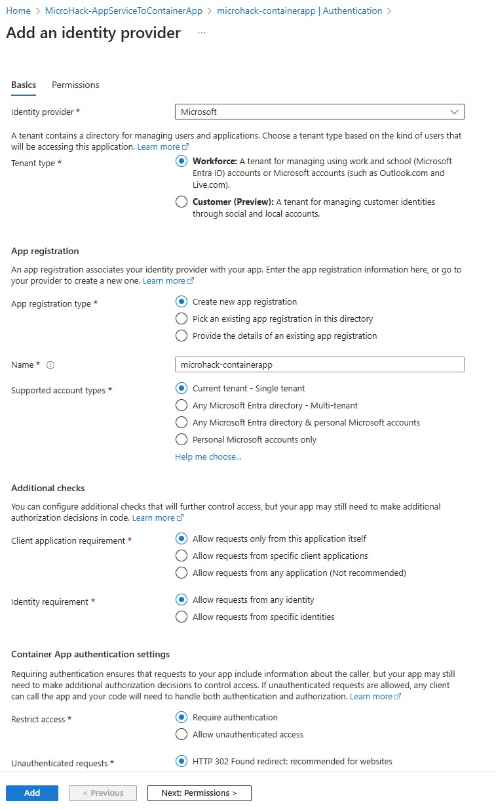
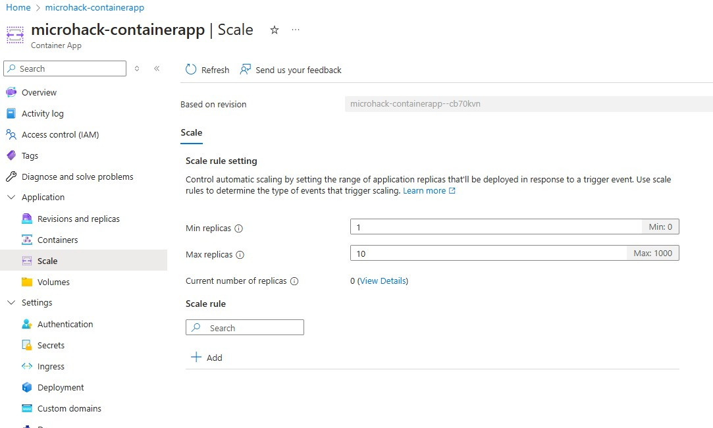
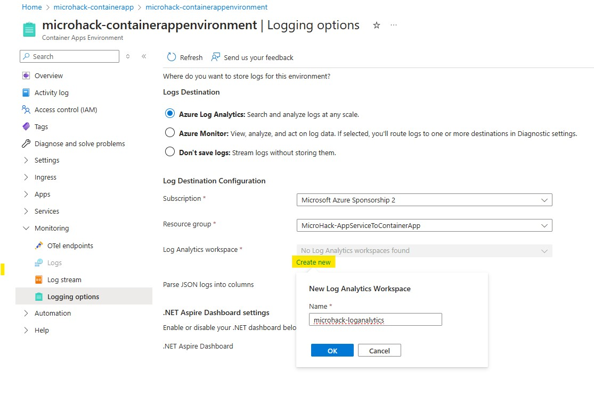

# Walkthrough Challenge 4 - Assess VM´s for the migration

Duration: 60 minutes

## Prerequisites

Please make sure thet you successfully completed [Challenge 3](../challenge-3/solution.md) before continuing with this challenge.

### **Task 1: Enable Authentication with Azure Entra ID**

You can quickly integrate an Azure Container App with Azure Entra ID (or any other OIDC identity provider like GitHub, Facebook, Google, etc.) without changing the implementation of the app. Simply go on the *Authentication* tab of the Container App and hit *Add identity provider*:

Select *Microsoft* as the ID provider:

Select `Workforce` as tenant type.
Select `Create new app registration`, name it something like "microhack-containerapp" and select `Current tenant - Single tenant` to create an App Registration in your Azure Entra ID tenant. Then mark the `Require authentication` to make sure only authenticated users can access the app. If the authentication fails, you can choose to which error page you want to redirect unauthenticated users. Hit *Add* to activate the authentication (this may take up to a minute in the background):

This will deploy a sidecar container to your app. Before a user can access the container that hosts your web app, the user has to authenticate against Azure Entra ID. You can open the app again to check if it works. Since you are probably already logged in with your Azure account, you might be authenticated automatically. If you open the app URL in private mode, you will see that authentication is required and log in with your Azure account.

### **Task 2: Configure Autoscaling**

A single Container App instance will not be able to endlessly serve an increasing amount of users. It makes sense to limit the number of connections of a single instance and then scale in and out. You can quickly configure automatic scaling. Open the *Scale and replicas* tab and click *Edit and deploy*.

Go to the *Scale* tab and set the max replicas to 10. It makes sense to keep at least 1 instance of the app running to avoid cold starts and waiting times. Next, add a scale rule.

Give the rule a name (e.g., "http-scale-rule") and set the *Type* to HTTP scaling, then set the *Concurrent requests* to 200. Click *Add* and then *Create* to finish.

You *Scale and replicas* tab should look like below. As you can see, you can simply configure the scaling of your app without managing infrastructure, configuring load balancing or seting up orchestration - you just need a few clicks and the work is done for you in the background!

### **Task 3: Enable Monitoring and Logging**

In production scenarios you want to know whats happening in your systems. Observabiliy is important. You can simply enable monitoring and logging for yout Azure Container Apps. Go to the *Logging options* of the Container Apps Environment in the portal and activate the `Azure Log Analytics` logging, then hit *Save* in the bottom:

You may need to wait some time until the logs start showing up in the Log Analytics workspace. You can play around with querys and check what information is available in the logs. Open the *Logs* tab of the Container App and create a new query. For example, you can check all the successful requests with this query:

    ContainerAppConsoleLogs
    | where ContainerAppName == "microhack-containerapp"
    | where Log contains "Request finished"

You successfully completed challenge 4! 🚀🚀🚀

 **[Home](../../Readme.md)** - [Next Challenge Solution](../challenge-5/solution.md)
