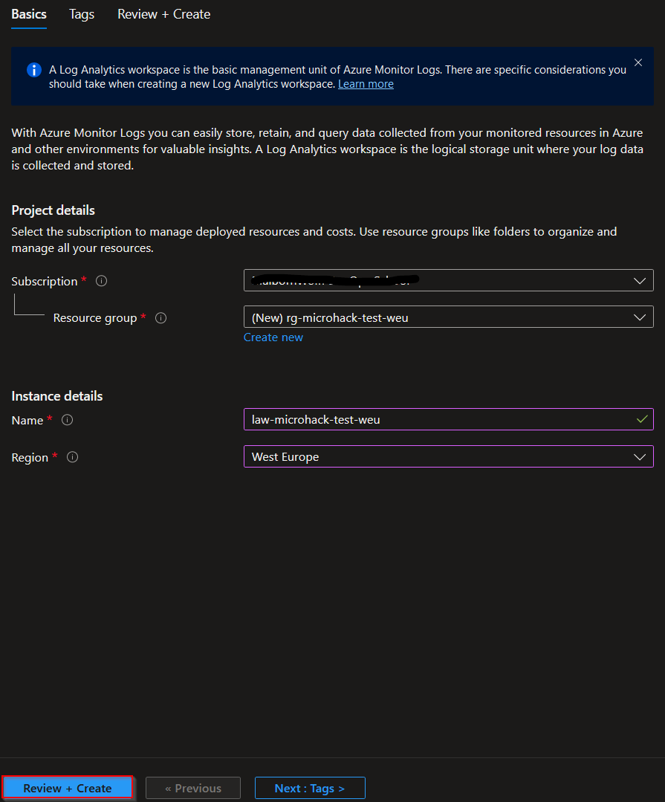
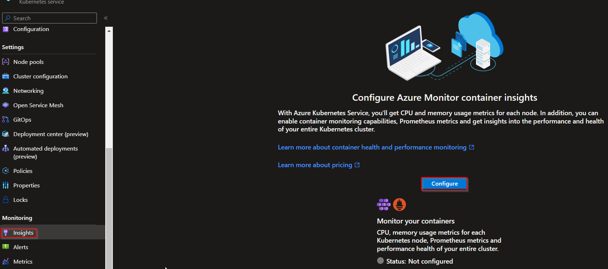
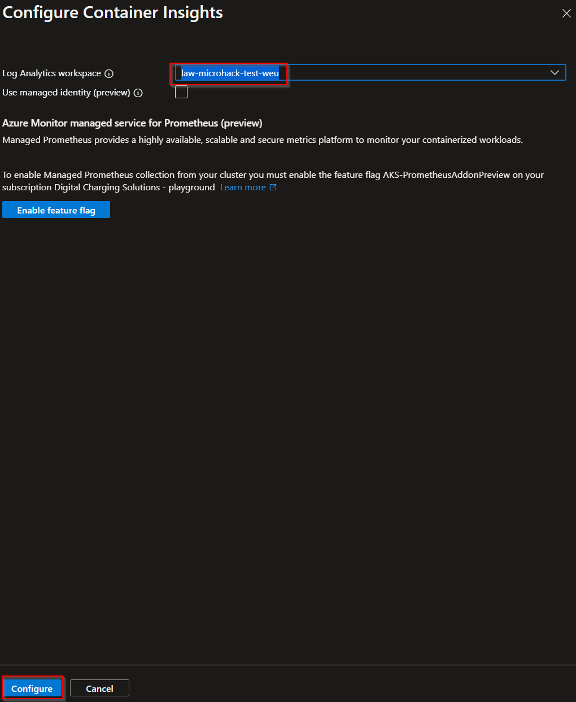

# Challenge 3: Add Azure Monitor to your environment

Duration: 10 minutes

[Previous Challange Solution](./02-Deploy-and-configure-solution.md) - **[Home](../README.md)** - [Next Challenge Solution](./04-Scale-up-solution.md)

## Task 1: Create an Azure Monitor instance

Please follow these steps to create an Azure Monitor instance:

First, create a Log Analytics Workspace.

Basics:

Afterwards, go to your kubernetes cluster and go to the Insights-Tab:

Here is a solution guide directly from Microsoft for creating Azure Monitor and configure Container Insights:

- [Azure Monitor setup](https://learn.microsoft.com/en-us/windows-server/storage/storage-spaces/configure-azure-monitor)
- [Configure Container Insights](https://learn.microsoft.com/en-us/azure/azure-monitor/containers/container-insights-onboard)
