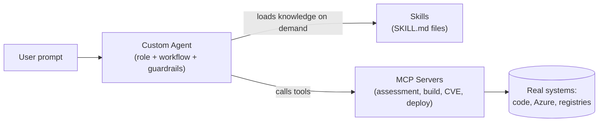
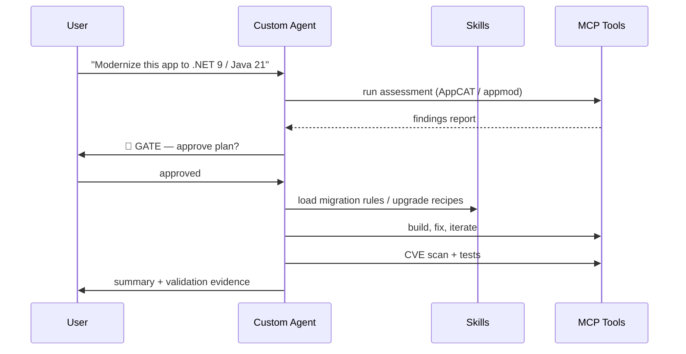

# Module 0 — Fundamentals: Custom Agents, Skills, and MCP for App Modernization

This module gives you the mental model you need before touching the challenges. Read time: ~15 minutes.

---

## 1. The Big Picture

Modernization is a **multi-step, knowledge-heavy workflow**: assess → plan → execute → validate. AI coding agents are good at executing steps, but out of the box they lack:

| Gap | Solved by |
|-----|-----------|
| A defined *role*, scope, and guardrails for the workflow | **Custom Agent** |
| Reusable *domain knowledge* (migration rules, upgrade recipes, conventions) | **Skill** |
| *Tools* to act on the real world (run AppCAT, build, scan CVEs, deploy) | **MCP server** |



**Rule of thumb:**
- *Agent* = **who** is working and **how** the workflow runs.
- *Skill* = **what** the agent knows (loaded only when relevant — progressive disclosure).
- *MCP* = **what** the agent can do (tools with typed inputs/outputs).

---

## 2. Custom Agents (`.agent.md`)

A Custom Agent is a markdown file with YAML frontmatter, placed in `.github/agents/` (repo-scoped) or your user profile. It defines:

| Element | Purpose |
|---------|---------|
| `description` | When the agent should be picked (shown in agent picker / used for routing) |
| `tools` | Allow-list of tools the agent may use (limits blast radius) |
| Body (markdown) | System-prompt-like instructions: persona, workflow stages, gates, output format |

### Why custom agents matter for modernization

- **Phased workflows with gates** — e.g., "do not modify code until the assessment report is approved by the user."
- **Tool restriction** — an *assessment* agent gets read-only tools; an *execution* agent gets build/edit tools.
- **Consistency across teams** — every team modernizes with the same playbook.

### Minimal anatomy

```markdown
---
description: One-line routing description for this agent
tools: ['codebase', 'search', 'runCommands', 'editFiles']
---

# Role
You are a <role> specialized in <scenario>.

# Workflow
1. Assess … (STOP and ask for approval)
2. Plan …
3. Execute …
4. Validate …

# Guardrails
- Never … / Always …
```

---

## 3. Skills (`SKILL.md`)

A Skill is a folder containing a `SKILL.md` (plus optional supporting files: scripts, rule books, examples). The agent reads the skill **only when the task matches its description** — this keeps context lean (progressive disclosure).

| Element | Purpose |
|---------|---------|
| `name` | Unique skill identifier |
| `description` | **Critical**: trigger phrases — "WHEN: upgrade Spring Boot, fix CVE…" — that route tasks to this skill |
| Body | The actual instructions: steps, rules, decision tables, command references |
| Supporting files | Migration rulebooks, code-mapping tables, validation scripts |

### Modernization-specific skill examples

- "Struts → Spring MVC transformation rules"
- ".NET Framework → .NET 9 breaking-changes checklist"
- "Containerization plan generator for legacy apps"
- "Integration test layers for migrated apps (TestContainers → smoke → Azure → behavioral)"

**Skill vs Agent:** A skill is *knowledge a task can pull in*; an agent is *an actor that orchestrates tasks*. Agents typically reference several skills.

---

## 4. MCP — Model Context Protocol

MCP is an open protocol that exposes **tools, resources, and prompts** from a server to any MCP-capable client (VS Code, CLI agents). Configuration lives in `.vscode/mcp.json` (workspace) or user settings.

```jsonc
{
  "servers": {
    "my-server": {
      "type": "stdio",            // or "http" / "sse" for remote servers
      "command": "npx",
      "args": ["-y", "@scope/my-mcp-server"],
      "env": { "API_KEY": "${input:api-key}" }
    }
  }
}
```

### Modernization-specific MCP tooling

The GitHub Copilot **app modernization** extensions register MCP tools the agent can call directly:

| Tool family (examples) | Stage | What it does |
|---|---|---|
| `appmod-run-assessment-*`, `appmod-dotnet-run-assessment` (AppCAT) | Assess | Scans code for cloud-readiness & migration issues |
| `appmod-get-plan`, `appmod-recommend-migration-tasks` | Plan | Generates plan.md / tasks.json |
| `appmod-dotnet-build-project`, `appmod-install-maven`, `appmod-install-jdk` | Execute | Build & toolchain management |
| `appmod-dotnet-cve-check`, `appmod-java-cve-assessment` | Validate | Dependency vulnerability scans |
| `appmod-generate-k8s-manifest`, `appmod-plan-generate-dockerfile`, `appmod-scan-docker-image` | Deploy | Containerization & deployment artifacts |
| Azure MCP server (`azure-mcp`) | Deploy | Resource queries, quotas, deployments, diagnostics |

> You don't need to write an MCP server for this MicroHack — you will **configure** existing ones and let your custom agent call them.

---

## 5. Putting It Together — the Modernization Loop



Key design principles you will apply in the challenges:

1. **Gates before writes** — the agent must pause for approval after assessment and after planning.
2. **Least-privilege tools** — only list the tools each phase needs.
3. **Skills as triggers, not dumps** — write descriptions with explicit "WHEN:" trigger phrases.
4. **Evidence-based completion** — the agent must show build output + test results + CVE scan before claiming success.

➡️ Continue to the [templates](../templates/) and then [Challenge 1 — Fundamentals](../challenges/challenge-01.md).
