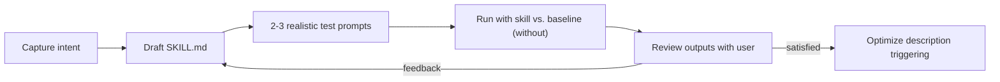

# Skill Creation Fundamentals

Background for the [skill-creator template](SKILL.md), adapted from Anthropic's [skill-creator](https://github.com/anthropics/skills) (Apache 2.0). Read time: ~10 minutes.

---

## 1. What is a skill?

A skill is a **folder of instructions, scripts, and resources** that an agent loads dynamically to get better at a specialized task. It is the "what the agent knows" layer — distinct from custom agents (who/how) and MCP servers (what it can do). See [docs/00-fundamentals.md](../../../docs/00-fundamentals.md) for the full agent/skill/MCP mental model.

```
skill-name/
├── SKILL.md          ← required: frontmatter + instructions
├── scripts/          ← optional: deterministic, reusable code
├── references/       ← optional: docs loaded on demand
└── assets/           ← optional: templates, icons, output files
```

Only two frontmatter fields are required:

| Field | Role |
|---|---|
| `name` | Unique identifier (lowercase, hyphens) |
| `description` | **The routing contract** — what the skill does + when to use it |

## 2. Progressive disclosure — the core design principle

Skills exist to keep context lean. They load in three levels:

| Level | What | When in context | Budget |
|---|---|---|---|
| 1 | `name` + `description` | Always | ~100 words |
| 2 | SKILL.md body | When the skill triggers | <500 lines |
| 3 | Bundled resources | Only when needed | Unlimited |

Design implications:

- Invest the most effort in the **description** — it's the only thing the agent sees before deciding to use the skill.
- Keep the body focused on workflow; push depth into `references/` with explicit pointers ("for Azure specifics, read `references/azure.md`").
- Scripts in `scripts/` can be *executed* without ever being loaded into context — ideal for deterministic transformations.

## 3. Why descriptions decide everything

Agents **undertrigger** skills: they only consult one when the task looks hard enough and the description matches. Two consequences:

1. **Make descriptions "pushy"** — list explicit trigger phrases and contexts, including cases where the user doesn't name the skill: *"Use whenever the user mentions X, Y, or Z, even if they don't explicitly ask for…"*
2. **Add exclusions** — "NOT for: …" prevents false triggering against adjacent skills.

Simple one-step requests ("read this file") won't trigger a skill no matter how good the description is — agents handle those directly. Design skills for multi-step, knowledge-heavy tasks.

## 4. Writing style that works

| Do | Avoid |
|---|---|
| Imperative voice ("Run the build, then…") | Passive descriptions |
| Explain **why** a rule matters | ALL-CAPS MUSTs without reasoning |
| Decision tables, commands, examples | Bullet-soup prose |
| General patterns | Overfitting to one example |
| Exact output templates | Vague "format nicely" |

Modern models have good theory of mind: a rule with a reason ("delete binding redirects — .NET 9 ignores them and they mask resolution errors") generalizes far better than a bare command.

## 5. The create → test → iterate loop

Skill quality comes from iteration, not first drafts:



Key practices:

- **Test prompts must be realistic** — concrete file names, casual phrasing, typos — not abstract requests like "format this data".
- **Always run a baseline** (no skill, or the previous version) so you can prove the skill actually helps.
- **Read transcripts, not just outputs** — if the agent wastes steps, the skill is causing it; cut that part.
- **Bundle repeated work** — if every test run wrote the same helper script, move it into `scripts/` once.
- **Trigger evals** — test the description against ~20 queries, including *near-miss negatives* (adjacent domains that share keywords but need something else). Obvious negatives test nothing.

## 6. Safety: principle of lack of surprise

A skill's contents must match what its description claims. No hidden behavior, no exploit code, nothing that facilitates unauthorized access or data exfiltration. If a user described the skill to a colleague, nothing inside should surprise them.

## 7. Relation to this microhack

The modernization skills in this repo (e.g. [dotnet-upgrade](../dotnet-upgrade/SKILL.md)) follow these fundamentals: trigger-rich descriptions, decision tables, verification checklists, and supporting rulebooks. Use the [skill-creator template](SKILL.md) when you want to author a *new* skill for your own modernization scenario.

## References

- [anthropics/skills](https://github.com/anthropics/skills) — source repository
- [Agent Skills specification](https://agentskills.io)
- [Equipping agents for the real world with Agent Skills](https://www.anthropic.com/engineering/equipping-agents-for-the-real-world-with-agent-skills)
- [Creating custom skills (Anthropic docs)](https://support.claude.com/en/articles/12512198-creating-custom-skills)
