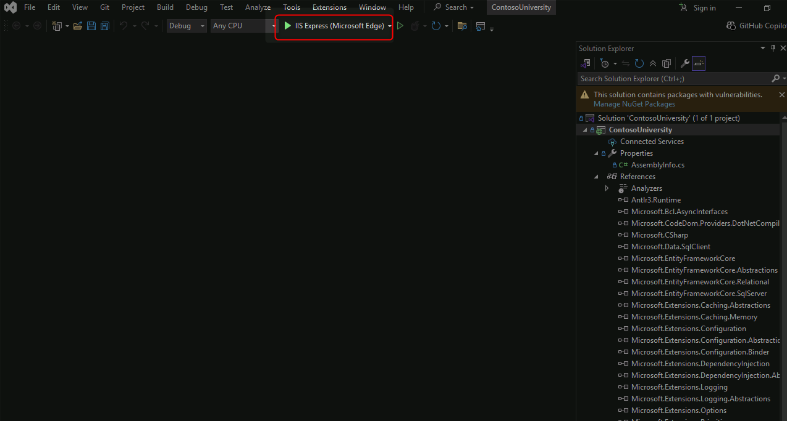
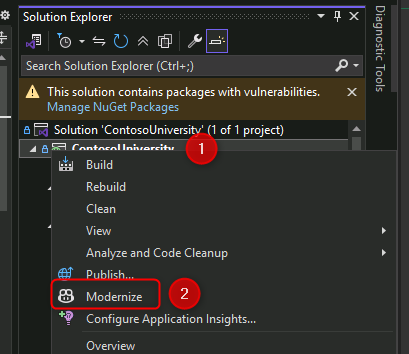
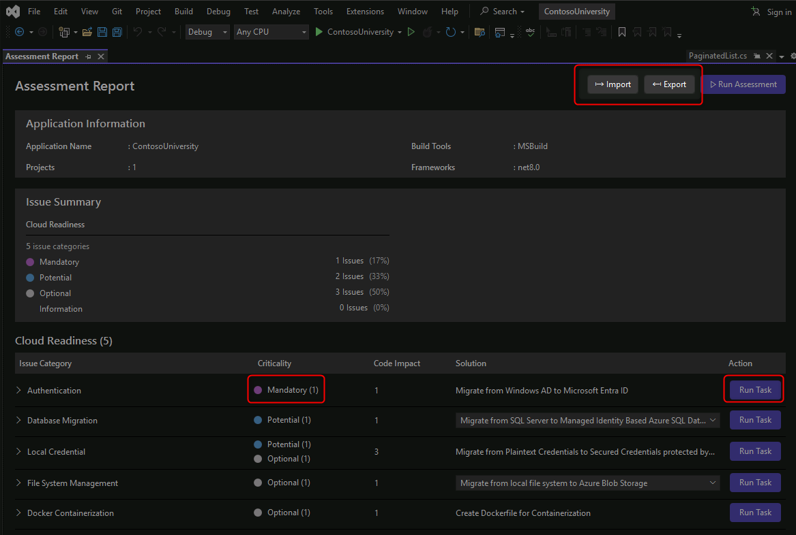

# Modernize a .NET Application

[Previous Challenge Solution](../challenge-01/solution-01.md) - **[Home](../../Readme.md)** - [Next Challenge Solution](../challenge-03/solution-03.md)

**Duration:** 30 minutes

## Goal

Modernize the Contoso University .NET Framework application to .NET 9 and deploy it to Azure App Service using GitHub Copilot's AI-powered code transformation capabilities.

## Actions

### Setup and Preparation:
1. Navigate to [../../src/ContosoUniversity](../../src/ContosoUniversity)
1. Open Visual Studio 2022
1. Select "Clone a repository" and paste your forked repository URL
1. Navigate to Solution Explorer and locate the ContosoUniversity project
1. Rebuild the project to verify it compiles successfully

### Assess and Upgrade to .NET 9:

1. Right-click the ContosoUniversity project and select "Modernize"

1. Sign in to GitHub Copilot if prompted
1. Select Claude Sonnet 4.5 as the model
1. Click "Upgrade to a newer .NET version"
1. Allow GitHub Copilot to analyze the codebase
1. Review the upgrade plan when presented
1. Allow operations when prompted during the upgrade process
1. Wait for the upgrade to complete (marked by `dotnet-upgrade-report.md` appearing)

### Migrate to Azure:

1. Right-click the project again and select "Modernize"
1. Click "Migrate to Azure" in the GitHub Copilot Chat window
1. Wait for GitHub Copilot to assess cloud readiness

### Resolve Cloud Readiness Issues:
1. Open the `dotnet-upgrade-report.md` file

1. Review the Cloud Readiness Issues section
1. Click "Migrate from Windows AD to Microsoft Entra ID"
1. Allow GitHub Copilot to implement the authentication changes
1. Ensure all mandatory tasks are resolved
1. Review the changes made to authentication configuration

### Deploy to Azure:

1. Allow GitHub Copilot to complete the Azure App Service deployment
1. Verify the deployment succeeds
1. Test the deployed application in Azure

## Success Criteria

- ✅ ContosoUniversity solution cloned and builds successfully
- ✅ Application upgraded from .NET Framework to .NET 9
- ✅ Upgrade report generated showing all changes and issues
- ✅ Authentication migrated from Windows AD to Microsoft Entra ID
- ✅ All mandatory cloud readiness issues resolved
- ✅ Application successfully deployed to Azure App Service
- ✅ Deployed application is accessible and functional

## Learning Resources

- [GitHub Copilot for Visual Studio](https://learn.microsoft.com/visualstudio/ide/visual-studio-github-copilot-extension)
- [Modernize .NET Applications](https://learn.microsoft.com/dotnet/architecture/modernize-with-azure-containers/)
- [Migrate to .NET 9](https://learn.microsoft.com/dotnet/core/migration/)
- [Azure App Service for .NET](https://learn.microsoft.com/azure/app-service/quickstart-dotnetcore)
- [Microsoft Entra ID Authentication](https://learn.microsoft.com/azure/active-directory/develop/quickstart-v2-aspnet-core-webapp)
