# Walkthrough Challenge 2 - Upgrading one Java app and one .NET app

[Previous Challenge Solution](../challenge-01/solution-01.md) - **[Home](../../Readme.md)** - [Next Challenge Solution](../challenge-03/solution-03.md)

## 2.1. Fork the sample repositories

Start by logging in your Github account and fork both the .NET and the Java app.

- <https://github.com/Azure-Samples/PhotoAlbum-Java>
- <https://github.com/Azure-Samples/PhotoAlbum>

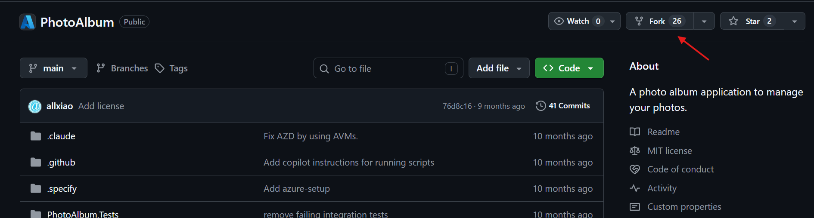

## 2.2. Set up your working directory

Create a working directory in a location at your choice.

Install the Github Copilot modernization agent (modernize CLI). We will use it for the modernization end-to-end (upgrade, assessment, plan, execute). 

Download source: <https://learn.microsoft.com/en-us/azure/developer/github-copilot-app-modernization/modernization-agent/quickstart?tabs=windows%2Cjava#prerequisites>

For batch operations across many repositories, create a JSON config file to list all repositories. For example, create it at `.github/modernize/repos.json` in your working directory, or provide a custom path.

Reference: <https://learn.microsoft.com/en-gb/azure/developer/github-copilot-app-modernization/modernization-agent/batch-assess#configure-repositories>

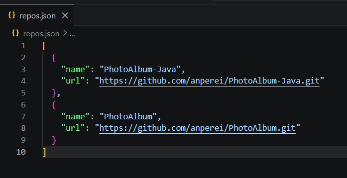

## 2.3. Run the batch assessment

In your terminal, run the modernize CLI agent and accept execution in your working directory.

Run "Assess" to analyze the code of the 2 apps and generate a report.

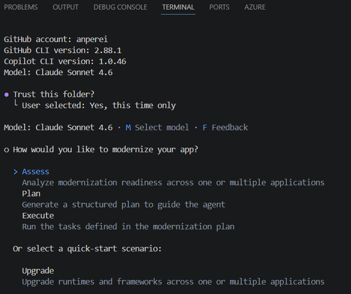

Select "From a config file".

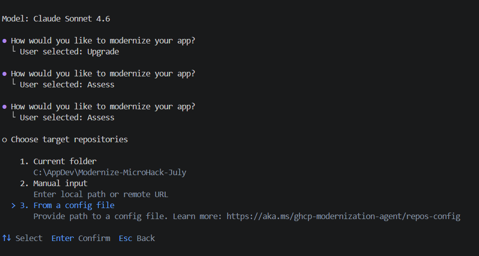

Select both apps.

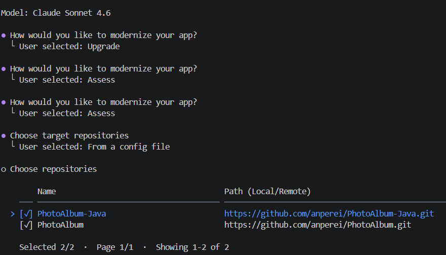

Check both "Upgrade" and "Cloud readiness". Leave "Security" unchecked.

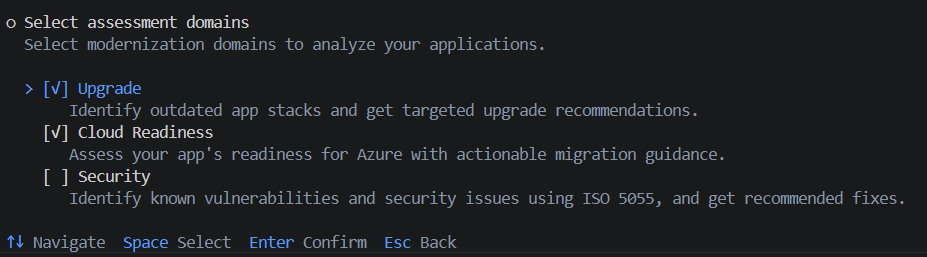

Change the Analysis coverage to "Full analysis" and press enter to continue.

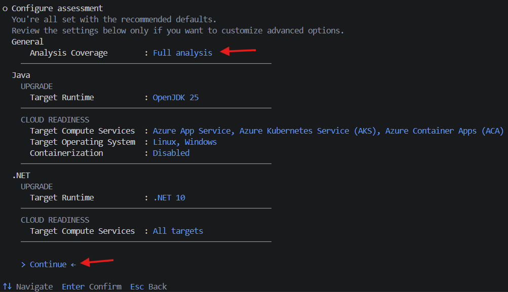

Chose to assess locally (using cloud agents is also possible)

> [!NOTE]
> Note that an assessment-config.yaml file gets automatically generated. Both repositories get cloned and assessment starts. It may take about 5-10 min to complete, so it's a good time to take a coffee break.

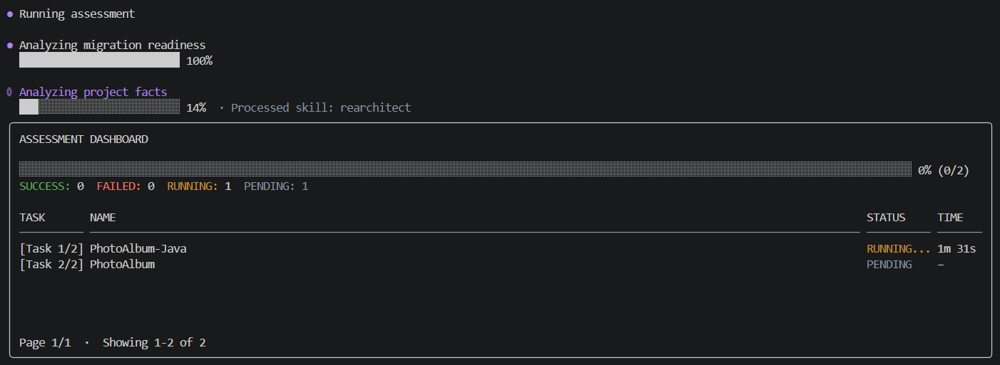

Congratulations 🎉 you have just finished the batch assessment phase. Take some time to explore the outcome results.

## 2.4. Explore the assessment results

Batch assessment is especially valuable for migration planning because it enables you to efficiently assess the readiness and requirements of various applications at once. By using batch assessment, you can evaluate different repositories at the same time and obtain detailed assessment reports for each application. It produces two kinds of reports to support your migration planning:

**Aggregated report:** Presents an overall perspective of all assessed applications, offering summary insights, recommendations on Azure services, target platforms, upgrade paths, migration strategies, and migration waves. Additionally, the aggregated report includes shortcuts for easy access to each per repository report.

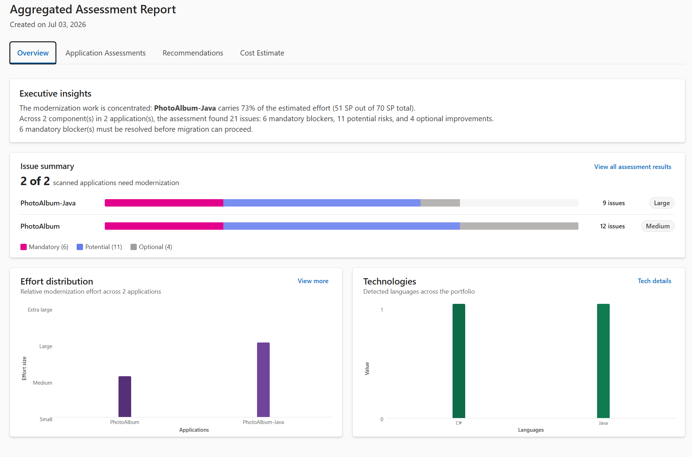

**Per repository report:** Provides detailed insights on the two aspects identified at the individual repository level.

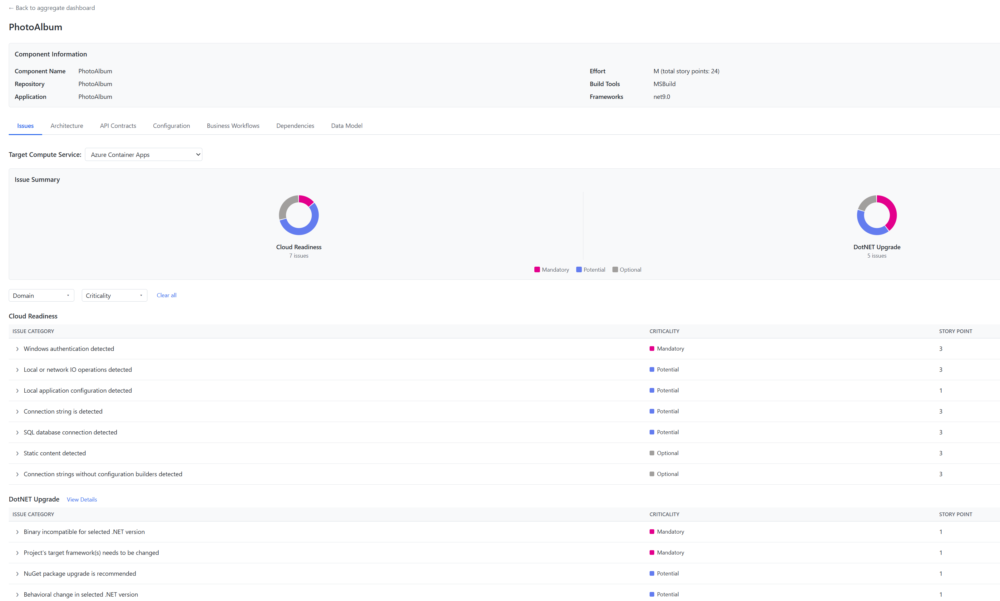

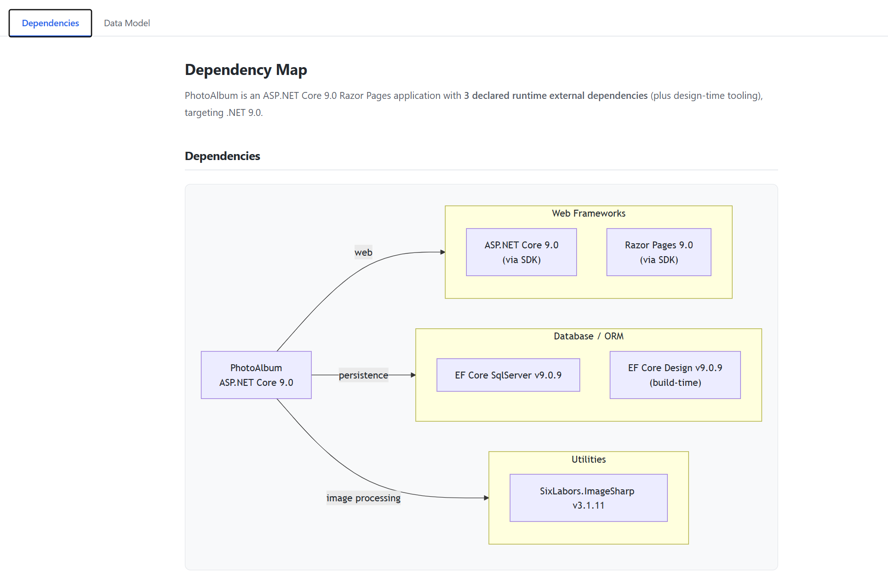

## 2.5. Upgrade each app individually

Now that we have an assessment report, we could jump straight to a modernization plan, but we want to start with an upgrade of the .NET and Java versions first.

For a batch upgrade, both repositories would need to use the same programming language, which is not the case here, so let's upgrade both apps individually.

Exit the modernize CLI, navigate to the folder of the PhotoAlbum (.NET) and relaunch the modernize CLI.

Select the Upgrade option, current folder, and upgrade locally.

In the prompt box, submit the following prompt: "Upgrade to .NET 10", as recommended previously in our assessment report.

Migrate CLI imediately starts creating an upgrade plan, followed by execution of the necessary code changes.

Check the resulting Plan Execution Summary for each app. Upgrade should show "Success".

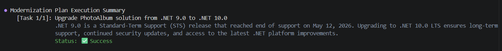

Navigate to the PhotoAlbum-Java directory and repeat the same process for the Java version of the app. Use the following prompt: "Upgrade to Java 25 and upgrade to Spring Boot 4.0", as recommended previously in our assessment report.

Exit modernize CLI, navigate to each app folder, commit and push your changes to each respective remote repository. Ensure all changes are committed and pushed.

Congratulations 🎉 your apps are now upgraded and you have completed challenge 2.

Navigate back to your parent directory and launch modernize CLI again.

You are now ready to initiate challenge 3 - modernize your upgraded apps and deploy them in Azure.
