# Walkthrough Challenge 3 - Modernize your upgraded apps and deploy them in Azure

[Previous Challenge Solution](../challenge-02/solution-02.md) - **[Home](../../Readme.md)**

## 3.1. Create the cloud modernization plan

Select the "Plan" option, then target both repositories from the config file.

Select both apps and use cloud agents. Name the plan "cloud-modernization-plan"

Type the following instruction in the prompt "An assessment has been previously completed for both apps, but after that both apps have been upgrated to their latest respective framework versions. In this plan, you should ignore any upgrade recommendations in the existing assessment report. You should focus on resolving the cloud readiness issues, set up Azure infrastructure for each app, and deploy the App on Azure. If OracleDB exists, migrate to PostgreSQL."

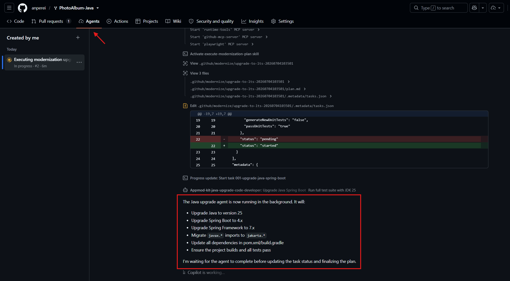

> [!NOTE]
> Generating the plan should take about 15-20 min. Once finished, you should see a series of tasks to be executed.

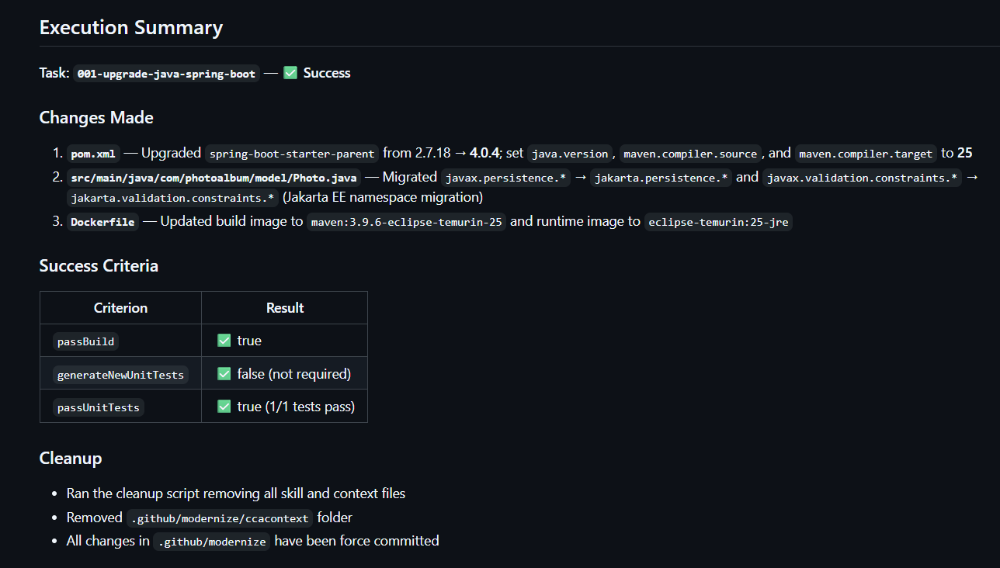

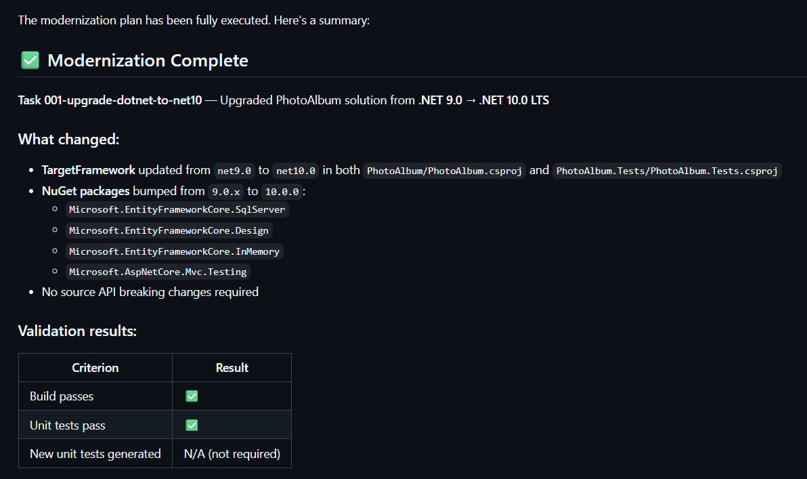

## 3.2 Review and merge the pull request

Review the pull request and merge it.

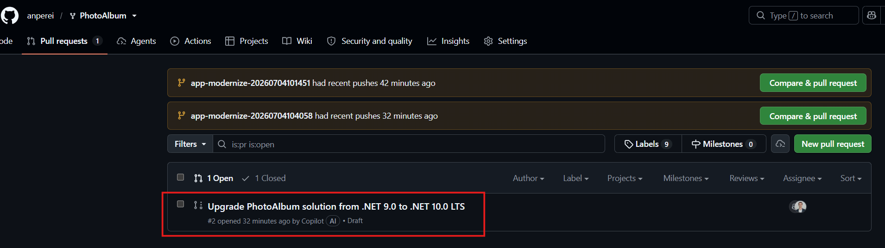

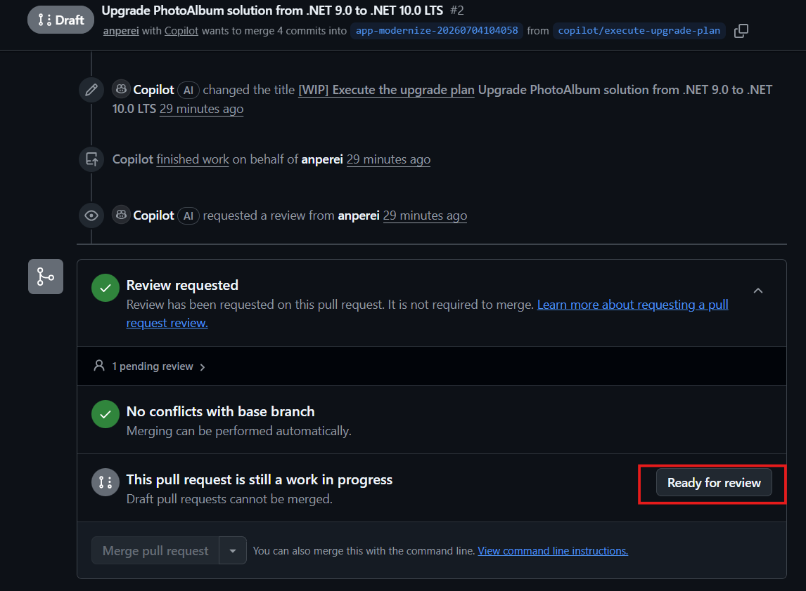

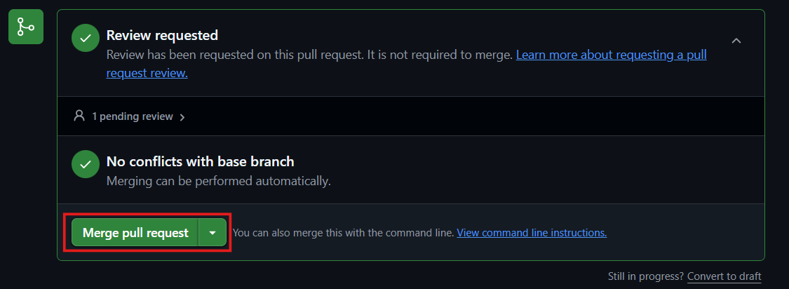

## 3.3 Deploy the PhotoAlbum-Java app

Navigate to repos\PhotoAlbum-Java and pull the latest changes in he cloud-modernization-plan branch, which include the latest plan.md.

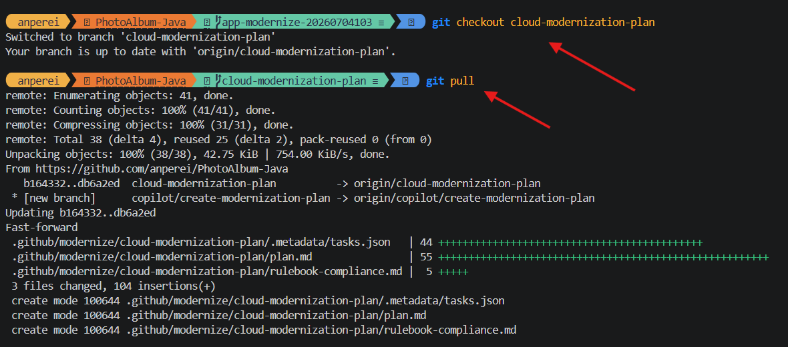

Launch Modernize CLI and execute the plan (cloud-modernization-plan).

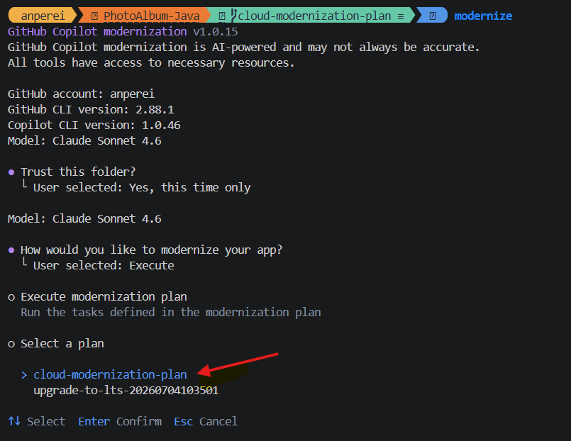

Plan execution will start. Wait for all tasks to complete. It may take a while. Maybe a good time to stretch your legs. 

Once finished, check the resource group on Azure with the deployed resources. Next, open the Frontend Container app URL.

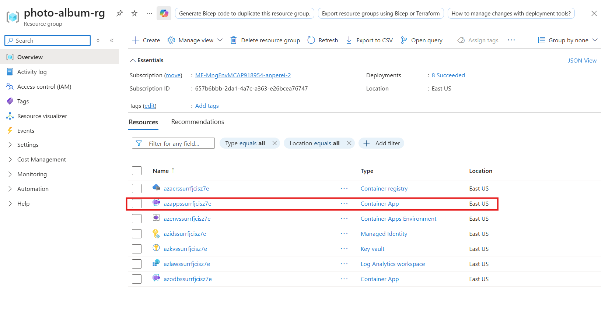

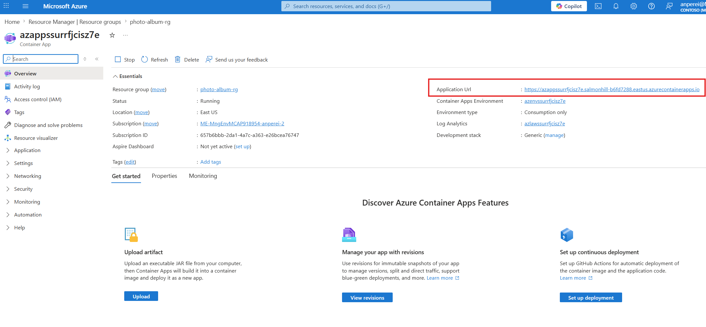

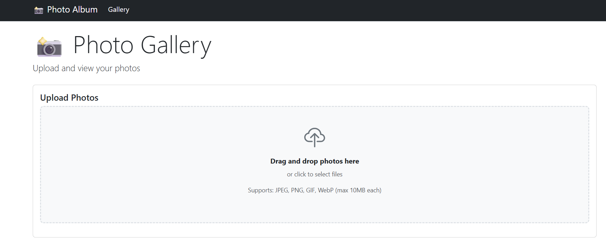

Congratulations! 🎉 You managed to migrate and deploy in Azure the upgraded PhotoAlbum-Java app.

## 3.4 Deploy the PhotoAlbum (.NET) app

Now, let's migrate and deploy in Azure the .NET version of the app. Navigate to repos\PhotoAlbum and pull the latest changes in he cloud-modernization-plan branch, which include the latest plan.md.

Launch Modernize CLI and execute the plan (cloud-modernization-plan).

Plan execution will start. Wait for all tasks to complete. It may take a while.

Notice this plan didn't create the infrastructure code nor deployed any resource in Azure. Let's create another plan and be explicit in our prompt.

Create a new plan, locally this time, name it "infra-setup-plan", and use the following prompt "Provision Azure resources and deploy the app."

Wait for the plan to be generated.

Once finished, you can check the plan at `.\.github\modernize\infra-setup-plan`

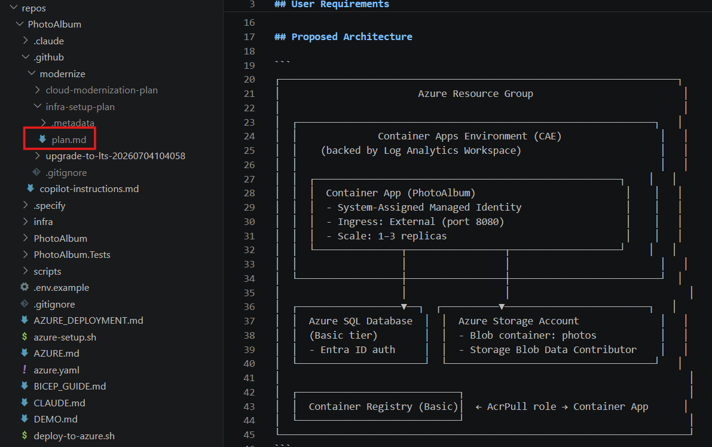

Finally, execute the plan.

Plan execution will start. Wait for all tasks to complete. It may take a while.

Once finished, check the resource group on Azure with the deployed resources. Next, open the Frontend Container app link.

> [!TIP]
> If you get any deployment error, you can use Github Copilot CLI to diagnose and help you fix it.

Congratulations! 🎉 You managed to migrate and deploy in Azure the upgraded PhotoAlbum (.NET) app, and finish the challenge 3 successfully!