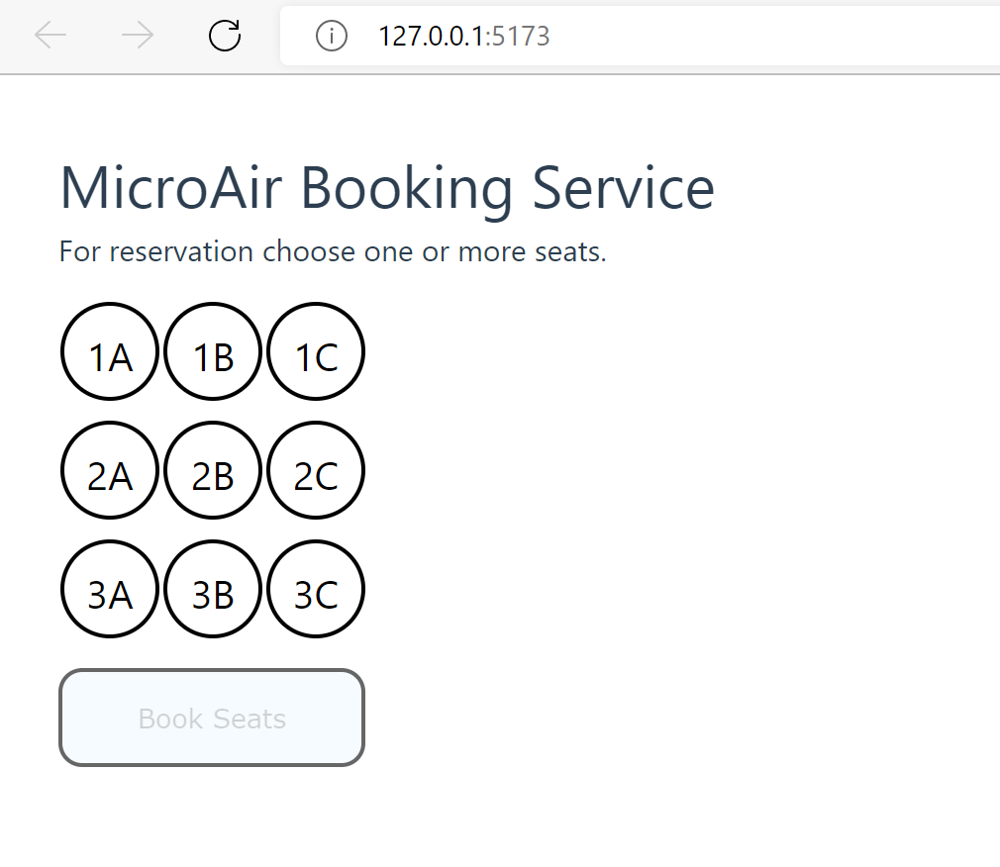

# Challenge 0: Getting started and setting up the environment

**[Home](../README.md)** - [Challenge One](./01-Build-and-push-locally.md)

## Introduction

Modern microservices typically run on a cloud environment and are the architecture of choice for applications and plattforms. This introduction will tell you more about the topic in general.
This intro will ensure that all pre-requesites and concepts are in place to start planning and deploying the architecture.

The challenge will be to set up the basic Azure resources we need to achieve our goal of deploying an app based on microservices. For this we need to create a container registry and a container app environment.

## Architecture

To have a relateable scenario, we will create a booking system for an airline, where customers can book their seats and receive a bill.

Real world scenarios can include up to hundreds of microservices within an environment. To keep it as simple as possible we will only work with two microservices for this microhack within a single environment.

Below you can find the architecture diagram of the application we are going to build:


- Web App front-end application shows users the available seats for the airline and lets them choose their preferred seats:
  

Customers can click on their preferred amount and location of seats and book them with the "book" Button. The front-end will show an order confirmation and the booked seats will no longer be available for booking:


- Backend Web API which contains the business logic of bookings management service and data storage. It stores the seats and carries out the booking process by assigning the status to the chosen seats.

#### Components

- Azure resource groups are logical containers for Azure resources. You use a single resource group to structure everything related to this solution in the Azure portal.

- Azure Container Registry to build and host container images and deploy images from the Azure Container Registry to the Container Apps.

- Azure Container Apps is a fully managed, serverless container service used to build and deploy modern apps at scale. The underlying Service is Azure Kubernetes which provides you with the needed infrastructure. In this solution, you're hosting all microservices on Azure Container Apps and deploying them into a single Container App environment. This environment acts as a secure boundary around the system.

- dapr provides a set of APIs that simplify the authoring of microservice applications. Once you enable dapr in Azure Container Apps, it exposes its APIs via a sidecar that works as a reverse proxy for the service. Here we use it for service to service invocation between frontend and backend.

- Azure Front Door is an application delivery network as a service that offers dynamic site accerleration as well as global load balancing with near real-time failover.
  It also works as a global, scalable entry-point to protect and decouple the inner structure from incoming traffic.

#### Install/Upgrade Azure Container Apps Extension

To be able to work with Azure Container Apps on the azure CLI you want to make sure you have the Container Apps extension installed.

Open your PowerShell or Bash console and sign in to Azure from the CLI.

```
az login
```

If you have multiple Azure subscriptions under your account you need to select the subscription you want to use.

```
az account set --subscription <name>
```

Ensure your CLI is updated to the latest version.

```
az upgrade
```

Now you can install/update the Azure Container Apps extension for CLI.

```
az extension add --name containerapp --upgrade
```

If you haven't already, register the "Microsoft.App" and "Microsoft.OperationalInsights" namespaces.

```
az provider register --namespace Microsoft.App
az provider register --namespace Microsoft.OperationalInsights
```

#### Challenge

- Use coherent naming conventions for resources
- Set up an Azure Container registry with admin account
- Create a Container App environment for multiple container apps in West Europe region
- Basic permission concept for accessing resources

#### Success Criteria

- Naming convention defined
- Azure container registry is deployed and accessable
- App environment is present
- Permission concept is created

#### Learning Resources

- [Microservices with Container Apps and Dapr](https://docs.microsoft.com/en-us/azure/architecture/example-scenario/serverless/microservices-with-container-apps-dapr)
- [Microservices with Azure Container Apps](https://docs.microsoft.com/en-us/azure/container-apps/microservices)
- [Container Registry](https://docs.microsoft.com/en-us/azure/container-registry/container-registry-get-started-azure-cli)
- [Container App Environment](https://docs.microsoft.com/en-us/azure/container-apps/environment)
