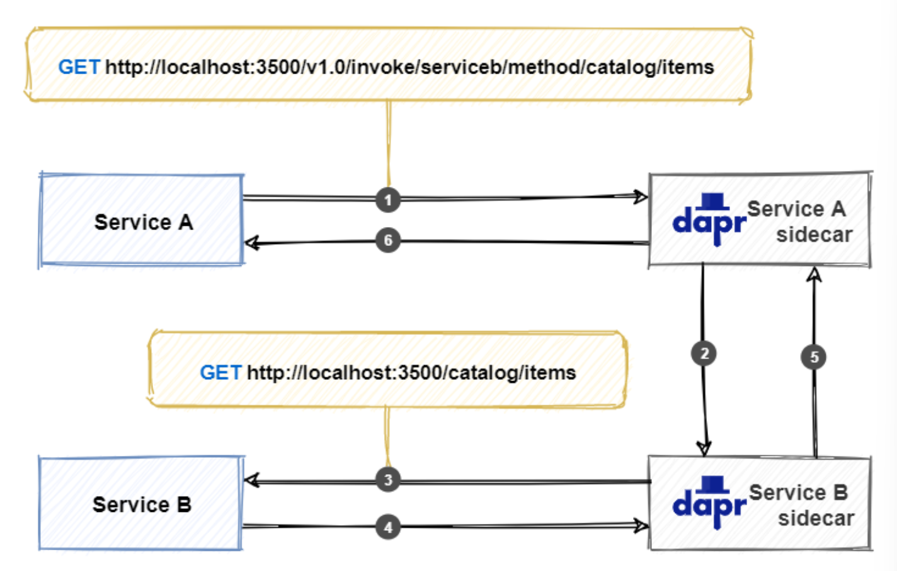

# Challenge 2: Deploy Microservices to Azure Container Apps

[Previous Challenge](./01-Build-and-push-locally.md) - **[Home](../README.md)** - **[Next Challenge](./03-GitHub-Actions.md)**

## Introduction

Since our images are now push- and pullable from our registry and the environment is set up, we can deploy our microservices to Azure. As described in the intro, we will be using Azure Container Apps. The Azure Container Apps service enables you to run microservices and containerized applications on a serverless platform. With Container Apps, you enjoy the benefits of running containers while you leave behind the concerns of manually configuring cloud infrastructure and complex container orchestrators.
We also want to enable dapr in our Azure Container Apps, so we can use it for Service to Service invocation between Frontend and Backend. dapr can solve the challenges of where the other services are located, how to call a service securely and how to handle retries in distributed applications by functioning as a reverse proxy.

## Challenge

- Create Container Apps for each microservice
- West Europe as region
- Part of our Container App environment
- Images are pulled from the ACR
- Basic Security is set up
- Set up environment variables for VITE_DAPR_HOST and VITE_DAPR_HTTP_PORT (hint: BookingService.js)
- Set scale to 0-1 replicas
- Activate dapr in Container Apps

## Success Criteria

- All Services are deployed in the environment
- The frontend is accessible under public DNS and/or IP
- The frontend can access the backend container app through the environment variables
- If you choose and book seats you'll get a confirmation and seats are no longer available
- Backend is not reachable publicly
- App runs in Container Apps with dapr

#### Learning Resources

- [Benefits of Container Apps](https://docs.microsoft.com/en-us/azure/container-apps/compare-options)
- [dapr](https://docs.dapr.io/concepts/overview/)
- [dapr Service Invocation](https://learn.microsoft.com/en-us/dotnet/architecture/dapr-for-net-developers/service-invocation)
