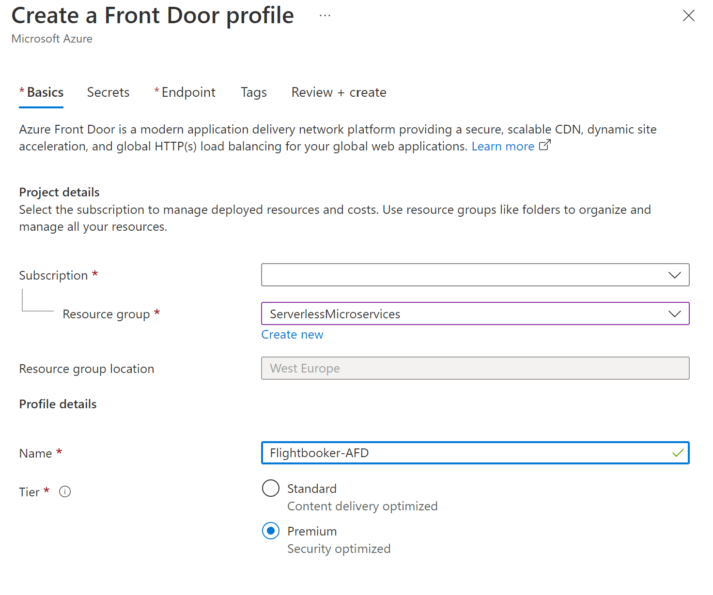
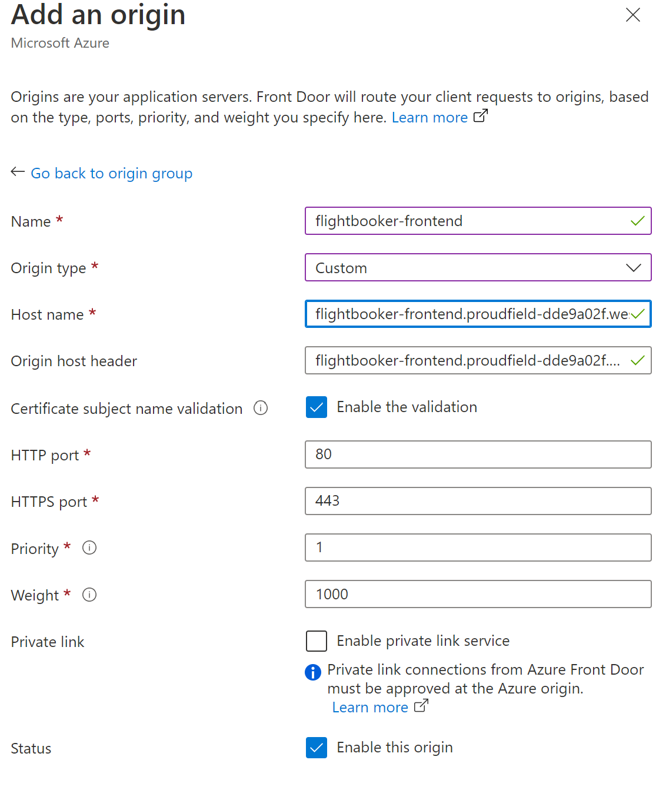

# Challenge 4: Integrate Azure Front Door

Duration: 15 minutes

[Previous Challenge Solution](03-GitHub-Actions-solution.md) - **[Home](../README.md)**

## Task 1: Add Azure FrontDoor to your platform

A quickstart for setting up Azure Front Door with Azure Portal, CLI, PowerShell or Bicep for your App Service you can find [here](https://learn.microsoft.com/en-us/azure/frontdoor/create-front-door-portal) under the "Create a Front Door for your application" section.

1. Search for Front Door and CDN profiles and select Create. Since we already have an application you can select Custom create and continue.

2. On the Basics tab enter the following information (or adjust them to your settings) and then select <b>Next:Secrets</b>. In the subscription field choose the subscription you also used to create the Microservices. Same goes for the resource group.

3. We can skip the secrets step for now but optionally if you have and existing Key Vault in azure that you plan to use to bring your own certificate for a custom domain, then add a certificate but you can also add one in the management experience after creation of the FrontDoor.

4. Go to <b>Next:Endpoint</b> and add an endpoint. You can give it a name you seem fit, it'll automatically create an endpoint hostname for you, then click "add".

5. Then select <b>Add a route</b> to configure routing to your Web App origin. On the Add a route page, enter the following information:

You will also want to create a new origin group like this:

- <b>Name</b>: A name to identify the mapping between domains and origin group.
- <b>Domains</b>: A domain name will be autogenerated for you but you can add a custom domain by selecting <b>Add a new domain</b>.
- <b>Patterns to match</b>: Set the URLs this route will accept. The default is all URL paths.
- <b>Accepted protocols</b>: Select the protocol the route will accept
- <b>Redirect</b>: Enable to redirect all HTTP traffic to HTTPS endpoint
- <b>Origin group</b>: Select <b>Add a new origin group</b>. Select a name and Add an origin. The origin host name is the FQDN of your frontend without "https://".
- <b>Forwarding protocol</b>: The protocol that will be forwarded to the origin group. Here we will match the incoming requests to origin.
- <b>Caching</b>: If you want to cache contetns closer to your users globally using Azure Front Door's edge POPs and the Microsoft network
- <b>Rules</b>: Once deployed you can configure Rules to apply to your route.

6. Select <b>+ Add a policy</b> to apply a Web Application Firewall (WAF) policy to your domain.
7. On the <b>Add security policy</b> page, give your policy a name then select your domain you want to associate it with. If you don't have a policy already just select <b>Create New</b> to create a new policy.
8. Lastly you can go on <b>Review + Create</b> and then <b>Create</b> to deploy the Azure Front Door profile.

When all steps are completed and the Azure Front Door profile is deployed you can access it and will find the endpoint hostname in the overview section. If you copy and past this into your browser you can now access the frontend through Azure Front Door endpoint.

More information on the Creation of Front Door your can find [here](https://learn.microsoft.com/en-us/azure/frontdoor/create-front-door-portal).

A guide to create Azure Front Door with the Azure CLI is linked [here](https://learn.microsoft.com/en-us/azure/frontdoor/create-front-door-cli).

## Task 2: Monitor your application

### Access Reports

Azure Front Door analytics reports provide a built-in and all-around view of how your Azure Front Door behaves along with associated Web Application Firewall metrics. You can also take advantage of Access Logs to do further troubleshooting and debugging.

Go to your Azure Front Door and in the navigation pane select Reports or Security under Analytics. You can choose between seven diferent dimensions:

- Traffic by domain
- Usage
- Traffic by location
- Cache
- Top url
- Top referrer
- Top user agent
  After choosing the dimension, you can select different filters for a select time range, location, protocol or domains.
  To learn more about what the different dimensions tell you, look [here](https://learn.microsoft.com/en-us/azure/frontdoor/standard-premium/how-to-reports).

### Metrics

Azure Front Door is integrated with Azure Monitor and has 11 metrics to help monitor Azure Front Door in real-time to track, troubleshoot, and debug issues.

From the Azure portal menu select All Resource and then your Front Door profile.  
Under Monitoring select Metrics and choose a metric to add. You can add filters and apply splitting to split data by different dimensions.

[More on metrics](https://learn.microsoft.com/en-us/azure/frontdoor/standard-premium/how-to-monitor-metrics)

### Protocols

Select your Azure Front Door profile. In the profile, go to Monitoring, select Diagnostic Setting and select Add diagnostic setting.  
Enter a name for your Diagnostic setting, then select the log from FrontDoorAccessLog, FrontDoorHealthProbeLog and FrontDoorWebApplicationFirewallLog.  
You can select destination details to "Send to Log Analytics" and save.  

For more information about the different logs, go [here](https://learn.microsoft.com/en-us/azure/frontdoor/standard-premium/how-to-logs).
