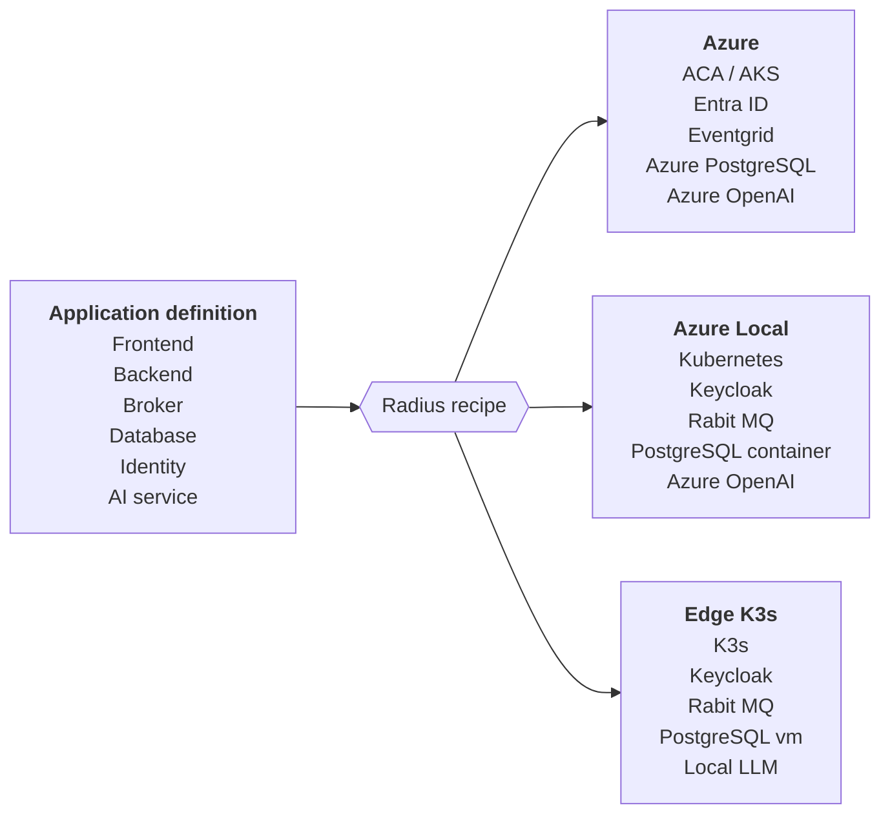
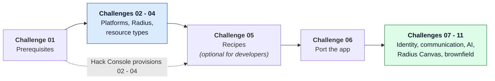

# **Adaptive Apps MicroHack**

- [MicroHack introduction](#microhack-introduction)
- [What this MicroHack builds on](#what-this-microhack-builds-on)
- [MicroHack context](#microhack-context)
- [Who is this MicroHack for?](#who-is-this-microhack-for)
- [Objectives](#objectives)
- [MicroHack challenges](#microhack-challenges)
- [Additional documentation](#additional-documentation)
- [Contributors](#contributors)

## MicroHack introduction

Modern organizations increasingly need to run the same application in very
different places: a public cloud region, an on-premises datacenter, an edge
location, or a fully disconnected site. They need to do this without rebuilding
the application for every environment.

This MicroHack is built on top of the Microsoft
[**Adaptive Apps**](https://github.com/microsoft/adaptive-apps) project - *build
once, adapt everywhere* - and uses its **Simplified Trading App** as the running
example throughout every challenge.

This MicroHack uses [Radius](https://radapp.io), an open-source, cloud-native
application platform, to make a single application adaptive. The application
declares the capabilities it needs, such as a database, message broker,
workload identity, or AI model, while each environment decides how those
capabilities are provided.

The result is one application that runs unchanged on Azure, on Azure Local, and
on a disconnected edge cluster, because the platform - not the application -
decides what backs each capability:

```mermaid
flowchart TB
    APP["<b>ONE APPLICATION</b><br/>Frontend &#124; Agent &#124; Backend &#124; Broker &#124; Database"]
    APP --> REC{{"Radius recipes"}}
    REC --> AZ["<b>Azure</b><br/>ACA / AKS<br/>Entra ID<br/>Azure PostgreSQL<br/>Azure OpenAI"]
    REC --> AL["<b>Azure Local</b><br/>Arc-enabled Kubernetes<br/>Keycloak / Entra ID<br/>PostgreSQL<br/>Azure OpenAI"]
    REC --> ED["<b>Edge</b><br/>K3s<br/>Keycloak<br/>PostgreSQL<br/>Local LLM"]
```

Across the challenges, you work through the full lifecycle of such an
application. You prepare target platforms, install Radius, define reusable
platform abstractions with resource types and recipes, and prove portability by
deploying the Simplified Trading App across multiple environments without
changing its application model. Advanced challenges apply the same approach to
identity, AI services, the developer inner loop, and brownfield modernization.

## What this MicroHack builds on

This MicroHack does not invent a new stack. It is a hands-on path through the
Microsoft Adaptive Apps project, and it consumes that project's assets directly.

| Building block | Where it comes from | How the MicroHack uses it |
| --- | --- | --- |
| **Adaptive Apps** | [microsoft/adaptive-apps](https://github.com/microsoft/adaptive-apps) | The reference architecture, capability portfolios, resource types, and recipes that the challenges install and extend. |
| **Simplified Trading App** | [`src/` in microsoft/adaptive-apps](https://github.com/microsoft/adaptive-apps/tree/main/src) | The example application used in every challenge: a Node.js frontend, a C# backend with MQTT order processing, a C# AI agent, an MQTT broker, and PostgreSQL. |

Because the trading app is the same in every challenge, any difference you see
between environments comes from the platform, never from the application code.

This MicroHack is not a complete explanation of Adaptive Apps or Radius. See
[Additional documentation](#additional-documentation) for background reading.

## MicroHack context

The scenario follows a trading firm whose stock-trading application - the
Simplified Trading App from the Adaptive Apps project - must run across cloud,
on-premises, and edge environments. Some sites may need to keep operating when
disconnected from the cloud, while connected sites should use managed Azure
services where appropriate.

Instead of maintaining a different deployment definition for every site, the
platform team wants one application definition with environment-specific
implementations of the same capability contracts. Radius resource types define
those contracts, recipes provide their implementations, and Radius
environments determine which implementation is used at each location.

The application declares *what* it needs. The recipe registered in the target
environment decides *how* that need is met:

The application model stays identical in all three columns. Only the recipes
registered in the environment change.

## Who is this MicroHack for?

This MicroHack targets two audiences, and each one has its own path through the
challenges. Both start at Challenge 01.

| Audience | Path | What you do |
| --- | --- | --- |
| **Platform engineer** | Challenges **02 - 06** | Prepare the Kubernetes platforms, install and operate Radius, author the resource-type contracts and the recipes behind them, then verify that an application deploys unchanged to every environment. |
| **Application developer** | Challenges **05 - 11** (Challenge 05 is optional) | Consume the platform contracts, deploy and port the trading application, and adapt identity, service communication, AI services, and an existing brownfield application without changing the application model. |

Challenges 05 and 06 are the deliberate handover point: the platform engineer
finishes by proving the contracts work, and the application developer starts
from the same place.

> [!TIP]
> **Challenges 02 - 04 can be provisioned automatically through the Hack
> Console.** If your lab environment is pre-provisioned, the platforms, the
> Radius control planes, and the resource-type catalog already exist. Application
> developers can then skip straight to Challenge 05 (optional) or Challenge 06,
> and platform engineers can still walk 02 - 04 manually to understand what the
> automation did.

## Objectives

After completing this MicroHack, you will:

**As a platform engineer (Challenges 02 - 06)**

- Know how to prepare Kubernetes target platforms and install Radius.
- Understand how Radius resource types and recipes define reusable platform
  capabilities.
- Offer the same capability contract on Azure, Azure Local, and edge platforms
  with environment-specific implementations.

**As an application developer (Challenges 05 - 11)**

- Deploy one application model across multiple environments with minimal
  environment-only configuration changes.
- Adapt identity, secure service communication, and AI services without
  changing the application model.
- Model, review, and deploy the application from the GitHub Copilot app with
  Radius Canvas, and judge what that preview does and does not solve.
- Apply the Adaptive Apps approach to an existing containerized application.

## MicroHack challenges

> [!NOTE]
> The challenge sequence is completed incrementally. Follow the links below for
> the currently published student and coach material. Each bucket is labelled
> with its primary audience, so you can follow either the platform engineer path
> (Challenges 02 - 06) or the application developer path (Challenges 05 - 11).

### General prerequisites

To use the MicroHack time effectively, have the following available:

- An Azure subscription with **Owner** access to the lab resource group
- Capacity to create the default two-environment topology: one Azure Kubernetes
  Service cluster, one private Linux VM hosting self-managed K3s, and one Standard
  Azure Bastion host with its managed public endpoint
- Permission and budget for a Standard Azure Container Registry in Challenge 05. Its
  non-secret pinned recipe artifacts allow anonymous pull so both Radius control planes
  can resolve them; publishing remains authenticated.
- Alternatively, an existing Azure Local or Arc-enabled Kubernetes environment to
  use in place of K3s
- [Azure CLI](https://learn.microsoft.com/cli/azure/install-azure-cli)
- Azure CLI `bastion` extension for native client tunneling
- [kubectl](https://kubernetes.io/docs/tasks/tools/)
- [Helm](https://helm.sh/docs/intro/install/)
- [Radius CLI (`rad`)](https://docs.radapp.io/getting-started/install/)
- [Visual Studio Code](https://code.visualstudio.com/)
- Bash or PowerShell 7; Windows users can also use WSL 2

If the Hack Console has pre-provisioned Challenges 02 - 04 for you, the Azure
subscription, cluster capacity, and container registry requirements are already
satisfied. You still need the local tooling above to talk to the provisioned
environments.

The recommended option is the repository
[devcontainer](../../../.devcontainer/03-azure-01-01-app-innovation-04-adaptive-apps/devcontainer.json),
which installs the Challenges 01-07 toolchain while retaining the manual host setup
path. Clone the contribution, open the repository root in VS Code, run **Dev
Containers: Reopen in Container**, and select
`03-azure-01-01-app-innovation-04-adaptive-apps` when prompted. The container then
opens this MicroHack as its workspace. See
[Challenge 01](challenges/challenge-01.md) for host prerequisites, credential
persistence, verification, and troubleshooting.

The default K3s VM has no public IP. Its Kubernetes API is reached through an Azure
Bastion native-client tunnel bound only to localhost in the participant environment.

> [!NOTE]
> Challenge 10 is the exception to the devcontainer workflow. Radius Canvas runs only in
> the GitHub Copilot app, so that challenge is completed on the host machine and needs the
> Azure CLI, GitHub CLI, and `kubectl` available there.

### Challenge 01: universal prerequisite

Complete Challenge 01 before starting a challenge in any bucket, regardless of
which audience path you follow.

- [Challenge 01 - Prerequisites: ready, set, go](challenges/challenge-01.md)
  **<- Start here**

### Bucket 1: Infrastructure setup

**Audience: platform engineer.** Prepare the target platforms and deploy the
Radius control plane.

> [!NOTE]
> Challenges 02 - 04 can be pre-provisioned automatically through the Hack
> Console. Work through them manually to learn how the platform is built, or
> use the provisioned environment and continue at Challenge 05 or 06.

- [Challenge 02 - Prepare the platforms](challenges/challenge-02.md)
- [Challenge 03 - Deploy and explore Radius](challenges/challenge-03.md)

### Bucket 2: Exploring Radius

**Audience: platform engineer** (Challenge 05 is also the optional entry point
for application developers). Define portable platform capabilities and
implement them with recipes.

- [Challenge 04 - Build the platform abstractions](challenges/challenge-04.md)
- [Challenge 05 - Build the platform abstractions with recipes](challenges/challenge-05.md)
  - *Optional for application developers - complete it to understand what backs
    each contract, or skip it and consume the registered recipes as-is.*

### Bucket 3: Portable apps across platforms

**Audience: application developer** (Challenge 06 also closes out the platform
engineer path). Deploy the application across environments and adapt its
identity, communication, and AI capabilities.

- [Challenge 06 - Port the App Across Environments](challenges/challenge-06.md)
  **<- Application developer start here**
- [Challenge 07 - Adapt Identity Services - Configure User Authentication](challenges/challenge-07.md)
- [Challenge 08 - Secure service communication](challenges/challenge-08.md)
- [Challenge 09 - Adapt AI Services](challenges/challenge-09.md)

### Bucket 4: Advanced challenges

**Audience: application developer.** Bring the application model into the
developer inner loop and apply the Adaptive Apps approach to an existing
application.

- [Challenge 10 - Model, review, and deploy with Radius Canvas](challenges/challenge-10.md)
- [Challenge 11 - Modernize a brownfield application](challenges/challenge-11.md)

## Additional documentation

**Adaptive Apps**

- [Build portable applications with adaptive apps](https://learn.microsoft.com/azure/architecture/solution-ideas/articles/adaptive-apps)
  - Azure Architecture Center
- [microsoft/adaptive-apps repository](https://github.com/microsoft/adaptive-apps)
- [Adaptive Apps getting started tutorial](https://github.com/microsoft/adaptive-apps/tree/main/tutorials/getting-started)
- [Capability portfolios overview](https://github.com/microsoft/adaptive-apps/blob/main/docs/portfolios/overview.md)
- [Simplified Trading App source](https://github.com/microsoft/adaptive-apps/tree/main/src)

**Radius**

- [What is Radius?](https://docs.radapp.io/concepts/overview/)
- [Radius application model](https://docs.radapp.io/guides/author-apps/application/overview/)
- [Radius environments](https://docs.radapp.io/guides/deploy-apps/environments/overview/)
- [Radius recipes](https://docs.radapp.io/guides/recipes/overview/)
- [Introducing Radius Canvas](https://techcommunity.microsoft.com/blog/azuredevcommunityblog/introducing-radius-canvas-visualize-review-and-deploy-applications-in-the-github/4549760)

**Supporting technologies**

- [Dapr](https://dapr.io/) - the portable programming model used by Adaptive Apps
- [Azure Arc-enabled Kubernetes](https://learn.microsoft.com/azure/azure-arc/kubernetes/overview)
- [Azure Local](https://learn.microsoft.com/azure/azure-local/)

## Contributors

- The Adaptive Apps team at Microsoft
- Dylan de Jong
- Jan Egil Ring
- Wesley Backelant

Contributions to the upstream project are welcome in the
[microsoft/adaptive-apps repository](https://github.com/microsoft/adaptive-apps).
