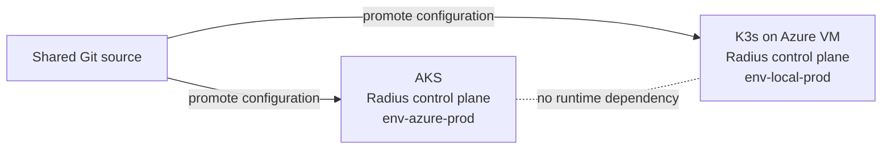
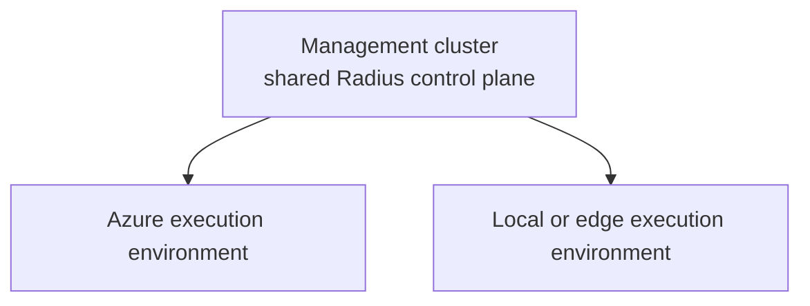

# Walkthrough Challenge 02 - Deploy and explore Radius

[< Previous Solution](../challenge-01/solution-01.md) - **[Home](../../Readme.md)** - [Next Solution](../challenge-03/solution-03.md)

Duration: 30-45 minutes per environment

## Coach notes

- The goal is to install, configure, and explore Radius on both default platforms.
- The default uses a **federated model**: one control plane on AKS and one on K3s.
- Only one team member runs each installation. Workspaces are local to each
  participant's workstation.
- Radius startup can take 5-10 minutes. Inspect pod state before rerunning commands.
- Always compare `kubectl config current-context` with the active Radius workspace.

Before any K3s work after a devcontainer restart, restore the private API tunnel:

```bash
export AZURE_SUBSCRIPTION="<subscription-id>"
bash resources/prepare-k3s-azure-vm.sh connect
export KUBECONFIG="$HOME/.kube/adaptive-apps-k3s.yaml"
```

The tunnel exposes only the Kubernetes API on localhost. Radius dashboard access still
uses `kubectl port-forward` through that API connection.

## Control-plane deployment options

### Federated control planes

Each site runs an independent Radius control plane:



Key characteristics:

- A site or WAN outage does not block the other site.
- Configuration is promoted independently from a shared source.
- Data synchronization is a separate application concern.
- The model fits edge, disconnected, and isolated failure-domain scenarios.

### Centralized control plane



Key characteristics:

- Governance and operations are centralized.
- Every site requires reliable connectivity to the management control plane.
- A control-plane outage affects all attached environments.

| Scenario | Typical choice |
| --- | --- |
| Single Azure region | Centralized |
| Azure plus always-connected datacenter | Centralized or federated |
| Azure plus intermittently connected edge | Federated |
| Disconnected or air-gapped site | Federated |
| Independent sites across a WAN | Federated unless shared connectivity and failure domains are acceptable |

The default AKS and K3s topology follows the federated model. K3s runs on an Azure VM
for workshop convenience but remains a self-managed Kubernetes platform.

## Understand the Radius hierarchy

### Control plane

A Radius control plane is installed once per Kubernetes cluster. It includes API
services, controllers, the Bicep deployment engine, UCP, CRDs, and the dashboard.

### Workspace

A workspace is local CLI configuration stored in `~/.rad/config.yaml`.

- One workspace targets one control plane.
- Switching workspace changes the destination of subsequent `rad` commands.
- Workspace configuration is per workstation, not stored in Kubernetes.

### Environment

An environment defines how and where applications are deployed:

- A Kubernetes namespace
- Optional cloud-provider configuration
- Recipe registrations added in later challenges

`env-azure-prod` can use Azure-backed recipes. `env-local-prod` has no Azure provider
and uses in-cluster implementations.

### Group

A Radius group is a logical container for applications and resources. It is not an
Azure resource group and has no Azure billing scope.

```text
Workstation rad configuration
|
|-- Workspace: ws-azure-prod
|   `-- AKS Radius control plane
|       `-- Environment: env-azure-prod
|           `-- Group: rg-trading
|               `-- Application: adaptive-apps
|
`-- Workspace: ws-local-prod
    `-- K3s Radius control plane
        `-- Environment: env-local-prod
            `-- Group: rg-trading
                `-- Application: adaptive-apps
```

## Manual tutorial: AKS

### 1. Select and verify AKS

```bash
unset KUBECONFIG
kubectl config use-context aks-adaptive-apps
kubectl config current-context
kubectl get nodes
```

### 2. Prepare Azure workload identity

Set the Azure values:

```bash
export AZURE_SUBSCRIPTION="<subscription-id>"
export RESOURCE_GROUP="rg-adaptive-apps"
export AKS_CLUSTER="aks-adaptive-apps"
export RADIUS_APP_NAME="${AKS_CLUSTER}-radius-app"

az account set --subscription "$AZURE_SUBSCRIPTION"
export OIDC_ISSUER="$(az aks show \
  --resource-group "$RESOURCE_GROUP" \
  --name "$AKS_CLUSTER" \
  --query oidcIssuerProfile.issuerUrl \
  --output tsv)"
export TENANT_ID="$(az account show --query tenantId --output tsv)"
```

Create an Entra application and service principal:

```bash
export APPLICATION_CLIENT_ID="$(az ad app create \
  --display-name "$RADIUS_APP_NAME" \
  --query appId \
  --output tsv)"
export APPLICATION_OBJECT_ID="$(az ad app show \
  --id "$APPLICATION_CLIENT_ID" \
  --query id \
  --output tsv)"

az ad sp create --id "$APPLICATION_CLIENT_ID"
```

For each Radius service account, create a federated credential. The example below is
for `applications-rp`; repeat it for `bicep-de`, `ucp`, and `dynamic-rp`, changing
both `name` and `subject`:

```bash
cat >radius-applications-rp.json <<EOF
{
  "name": "radius-applications-rp",
  "issuer": "${OIDC_ISSUER}",
  "subject": "system:serviceaccount:radius-system:applications-rp",
  "description": "Radius workload identity for applications-rp",
  "audiences": ["api://AzureADTokenExchange"]
}
EOF

az ad app federated-credential create \
  --id "$APPLICATION_OBJECT_ID" \
  --parameters @radius-applications-rp.json
```

Grant the Radius identity access to the lab resource group:

```bash
az role assignment create \
  --assignee "$APPLICATION_CLIENT_ID" \
  --role Owner \
  --scope "/subscriptions/${AZURE_SUBSCRIPTION}/resourceGroups/${RESOURCE_GROUP}"
```

### 3. Install Radius on AKS

```bash
rad install kubernetes \
  --kubecontext aks-adaptive-apps \
  --set global.azureWorkloadIdentity.enabled=true
```

If GHCR returns HTTP 403:

```bash
helm registry logout ghcr.io || true
docker logout ghcr.io || true
```

Then rerun the installation.

### 4. Create the AKS workspace and scopes

```bash
rad workspace create kubernetes ws-azure-prod \
  --context aks-adaptive-apps \
  --force
rad workspace switch ws-azure-prod

rad group create rg-trading
rad group switch rg-trading

rad env create env-azure-prod \
  --group rg-trading \
  --kubernetes-namespace env-azure-prod
rad env update env-azure-prod \
  --azure-subscription-id "$AZURE_SUBSCRIPTION" \
  --azure-resource-group "$RESOURCE_GROUP"
rad env switch env-azure-prod

rad credential register azure wi \
  --client-id "$APPLICATION_CLIENT_ID" \
  --tenant-id "$TENANT_ID"
```

## Manual tutorial: K3s

### 1. Select and verify K3s

```bash
export AZURE_SUBSCRIPTION="<subscription-id>"
bash resources/prepare-k3s-azure-vm.sh connect
export KUBECONFIG="$HOME/.kube/adaptive-apps-k3s.yaml"
kubectl config use-context k3s-azure-vm
kubectl config current-context
kubectl get nodes
```

### 2. Install Radius on K3s

```bash
rad install kubernetes --kubecontext k3s-azure-vm
```

### 3. Create the K3s workspace and scopes

```bash
rad workspace create kubernetes ws-local-prod \
  --context k3s-azure-vm \
  --force
rad workspace switch ws-local-prod

rad group create rg-trading
rad group switch rg-trading

rad env create env-local-prod \
  --group rg-trading \
  --kubernetes-namespace env-local-prod
rad env switch env-local-prod
```

Do not register Azure credentials or an Azure provider for K3s.

## Validate and explore both environments

For each active kube context and matching Radius workspace:

```bash
kubectl wait --for=condition=Available deployments --all \
  --namespace radius-system \
  --timeout=10m
kubectl get pods --namespace radius-system
kubectl get crd recipes.radapp.io deploymenttemplates.radapp.io deploymentresources.radapp.io

rad workspace list
rad env list
rad group list
```

Open the dashboard:

```bash
kubectl port-forward service/dashboard \
  --namespace radius-system 7007:80
```

Browse to <http://localhost:7007>. Stop the port-forward, switch both kube context and
Radius workspace, and repeat for the other platform.

Discuss:

- Which objects live in the cluster and which live on the workstation?
- What happens to K3s applications if AKS is unavailable?
- Why can both sites use `rg-trading` without sharing a group?
- Which environment can provision Azure-managed resources, and why?

## Optional platforms

The same Radius installation principles apply when Azure Local or an existing
Arc-enabled cluster replaces K3s:

- [Azure Local preparation](../../docs/prepare-azure-local.md)
- [Azure Arc-enabled Kubernetes preparation](../../docs/prepare-arc.md)

Use the platform's active kube context, create a distinct Radius workspace, and decide
explicitly whether that installation needs an Azure provider.

## Optional automation

The automation performs the same steps above and is intended only for participants
who choose to skip the manual tutorial.

### AKS

```bash
unset KUBECONFIG
kubectl config use-context aks-adaptive-apps

export AZURE_SUBSCRIPTION="<subscription-id>"
export RESOURCE_GROUP="rg-adaptive-apps"
export AKS_CLUSTER="aks-adaptive-apps"

# Run from the Adaptive Apps MicroHack root.
bash resources/deploy-radius-aks.sh
```

### K3s

```bash
export AZURE_SUBSCRIPTION="<subscription-id>"
bash resources/prepare-k3s-azure-vm.sh connect
export KUBECONFIG="$HOME/.kube/adaptive-apps-k3s.yaml"
kubectl config use-context k3s-azure-vm

# Run from the Adaptive Apps MicroHack root.
bash resources/deploy-radius-k3s.sh
```
