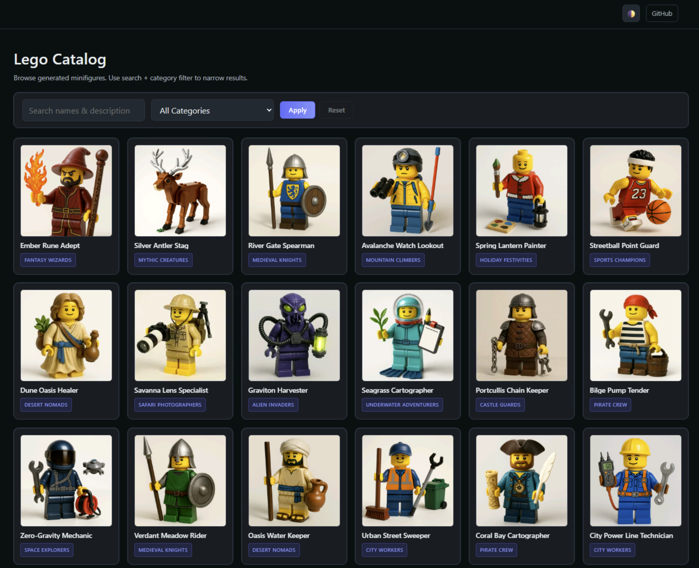

# MicroHack: Application Innovation

What is the next generation of modernization, and why does it matter?

## MicroHack context

A specialty retailer sells collectible figures. Its product catalog — 198 items across 20
categories, each with a photograph — runs the way it has run for years: one Windows Server
virtual machine, with the application and its database installed side by side on the same
box.

It works. That is the problem, because nobody can justify touching it.

- **Scaling means buying a bigger machine.** There is one instance, and a traffic spike is
  survived by hoping.
- **Releases are a weekend activity.** Someone remotes in, stops the service, copies files,
  and starts it again. There is no rollback that is not a restore.
- **The database shares a host with the web tier.** A runaway query takes the site down.
- **Nobody can explain last Tuesday.** No traces, no metrics, and the only log is a text
  file on the server.

Your job is to move the catalog to Azure Container Apps and a managed database — and to
have a good time working out how.

Note: all data in this application is AI-generated and for testing purposes only. We
generated a batch for you; if you want to generate your own, see
[dataGenerator](./dataGenerator/README.md).

## Two stacks, pick one

The same catalog exists twice, so you can practise on something close to what you actually
maintain. In [ch00](./challenges/ch00.md) you choose **one** and keep it for the
whole workshop.

| | `dotnet-sqlserver` | `java-postgresql` |
| --- | --- | --- |
| Application today | .NET 8 Blazor Server | Spring Boot 3 on Java 17 |
| Database today | SQL Server 2022 Express | PostgreSQL 18 |
| Source | [`dotnet/`](./dotnet/README.md) | [`java/`](./java/README.md) |
| Target database | Azure SQL Database (serverless) | Azure Database for PostgreSQL Flexible Server |

Both converge on the same Azure architecture, so neither is the easy option.

## MicroHack objectives

- Take an application off a VM and run it on modern platform services — containers on
  **Azure Container Apps** with a **managed database**.
- Investigate **auto-scaling** for the application and the database, including
  **scale-to-zero**.
- Use Azure to **test performance and functionality**.
- Deploy changes automatically with **GitHub Actions**, adding a staging revision and an
  approval workflow.
- Enable modern monitoring and tracing with standard **OpenTelemetry**.
- Read your real **cloud security posture** and let an **AI agent** work an incident.
- Optionally implement strict security controls, or add AI capabilities to the app.
- Learn to use **GitHub Copilot** effectively — for analysis, scripts, Infrastructure as
  Code, and the modernization itself.

## MicroHack challenges

| Challenge | What you do | Guide | Solution |
| --- | --- | --- | --- |
| **ch00** | Meet the application, choose your stack | [Challenge](./challenges/ch00.md) | [Solution](./walkthrough/ch00/README.md) |
| **ch01** | Migrate the database, containerize, deploy to Azure | [Choose a path](./challenges/ch01.md) → [ch01-A](./challenges/ch01-A.md) · [ch01-B](./challenges/ch01-B.md) | [A](./walkthrough/ch01-A/README.md) · [B](./walkthrough/ch01-B/README.md) |
| **ch02** | Test autoscaling under load | [Challenge](./challenges/ch02.md) | [Solution](./walkthrough/ch02/README.md) |
| **ch03** | Automate deployment with CI/CD | [Challenge](./challenges/ch03.md) | [Solution](./walkthrough/ch03/README.md) |
| **ch04** | Monitor performance with tracing | [Challenge](./challenges/ch04.md) | [Solution](./walkthrough/ch04/README.md) |
| **ch05-defender** | See what the migration actually exposed | [Challenge](./challenges/ch05-defender.md) | [Solution](./walkthrough/ch05-defender/README.md) |
| **ch06-sre-agent** | Let an AI agent diagnose an incident | [Challenge](./challenges/ch06-sre-agent.md) | [Solution](./walkthrough/ch06-sre-agent/README.md) |
| **ch07-enterprise** | Optional: enterprise security hardening | [Challenge](./challenges/ch07-enterprise.md) | Open-ended |
| **ch07-innovation** | Optional: add AI capabilities | [Challenge](./challenges/ch07-innovation.md) | Open-ended |
| **Wrap-up** | What you moved, and what to take home | [Wrap-up](./challenges/wrapup.md) | — |

Focus on getting through **at least ch01 and ch02** — those are the minimum. The ch07
challenges are for teams with time to spare, or as follow-up work afterwards.

See [the agenda](./docs/Agenda.md) for how this fits into the available time.

### Challenge 1 has two paths

Challenge 1 is the heart of the workshop, and there are two honest ways through it:

- **[ch01-A — Modernize the existing application](./challenges/ch01-A.md).** Keep
  the code, upgrade the framework, containerize it, and move the data to a managed
  database. The realistic upgrade workflow, and the shorter route.
- **[ch01-B — Rewrite from a specification](./challenges/ch01-B.md).** Treat the
  legacy app as the source of behaviour, have Copilot write a PRD and a plan, and rebuild
  on a modern stack of your choice — JavaScript included. Spec-driven development in
  practice.

Both end at the same Azure architecture, so nobody gets stranded. Read
[ch01](./challenges/ch01.md) to choose, then open only your path. If your table has
several people, split so you can compare notes afterwards.

## MicroHack tips

- Use **GitHub Copilot** to author Bicep/Terraform, Dockerfiles, GitHub Actions workflows,
  scripts, and application code faster and with fewer errors. If you do not have a
  Business/Enterprise/Pro license, ask a facilitator to enable it.
- Take advantage of the **Azure MCP Server** in VS Code with GitHub Copilot to ask
  questions about Azure documentation, configuration, and the services in your environment.
- Don't hesitate to **ask for help** from your peers or mentors if you get stuck.
- There are many ways to pass each challenge. Generally: go **step by step**, lean on
  Copilot, test as you go, and use **repeatable patterns** such as Infrastructure as Code.
- Some **components have their own README.md** in their folder, explaining how to run them
  and which environment variables they support.

## Prerequisites and existing infrastructure

You need a GitHub account so you can be given a GitHub Copilot license for the session and
be added to the GitHub Organization (for Codespaces and Actions billed centrally).

There is an Azure subscription and a resource group deployed for you, and the facilitator
will give you a login for the [Azure Portal](https://portal.azure.com). Because of security
rules in the training tenant you will be asked to enroll in MFA with the Microsoft
Authenticator app after first login.

Your resource group contains **two** Virtual Machines — one per stack. Each runs the legacy
catalog with a local database and image files in a folder. Access is through
**Just-in-Time VM access** over RDP; see [ch00](./challenges/ch00.md).

From ch01 onwards you write code, and the workshop assumes you do that in **GitHub
Codespaces** on your own fork or clone of this repository. The
[dev container](.devcontainer/README.md) ships both SDKs (.NET 8 and 10, Java 21 and 17),
Maven, a Docker daemon and the Azure CLI, so nothing has to be installed on your machine
and both stacks behave the same for everyone.

The VM is a fine place to *look at* the legacy application, and it has VS Code, git, the
Azure CLI and the stack's SDK — but it has no Docker daemon and only the old SDK, so do not
plan to build there.

### Facilitator instructions (participants skip this)

- Make sure you have subscription access and an Entra ID role with permission to create
  users (in MngEnv tenants you must use PIM to elevate to Global Admin in Entra).
- Configure `config.auto.tfvars` with your Entra domain and `n`, the number of participant
  environments.
- Deploy Terraform from [baseInfra](./baseInfra/README.md). For large setups (50+ seats),
  use `-parallelism=40`.
- Dev tool installation scripts run inside the VMs after deployment, so allow a few extra
  minutes.
- Provision a GitHub Organization for participants to give them Copilot licenses and an
  environment for ch03. Follow the [guide](./baseInfra/github/README.md).
- Default MngEnv subscription limits suit about 50 seats per region. To scale further,
  configure Terraform with more regions or use more subscriptions.

Delivery planning — lead times, cost, capacity, and the per-challenge runbook — is in
[the facilitator guide](./docs/Facilitator.md) and
[the cost estimate](./docs/CostEstimate.md). Selling this internally? The
[ten-minute demo](./docs/Demo.md) is the script.

## Repository map

| Path | Purpose |
| --- | --- |
| [`challenges`](./challenges) | Flat participant guides — start with [`ch00.md`](./challenges/ch00.md) |
| [`walkthrough`](./walkthrough) | Reference solutions, hints, prompts, and implementation artifacts |
| [`dotnet`](./dotnet/README.md) | .NET/SQL Server legacy baseline |
| [`java`](./java/README.md) | Java/PostgreSQL legacy baseline |
| [`data`](./data) | The canonical 198-figure, 20-category catalog and its images |
| [`dataGenerator`](./dataGenerator/README.md) | How the sample data was generated |
| [`baseInfra`](./baseInfra/README.md) | Facilitator-owned lab infrastructure (Terraform) |
| [`tests/load`](./tests/load) | JMeter plan and load-test config for ch02 |
| [`docs`](./docs) | Agenda, facilitator guide, glossary, troubleshooting, cost estimate |

Each challenge is one Markdown file; the two ch01-A stack guides are
[`ch01-A-dotnet.md`](./challenges/ch01-A-dotnet.md) and
[`ch01-A-java.md`](./challenges/ch01-A-java.md). Walkthroughs retain their per-challenge
folders so the accompanying application and Bicep files stay together.

## Safety

- Never run this workshop in a production or shared business subscription.
- Do not commit database passwords, API keys, or connection strings.
- Keep Terraform state encrypted and access controlled; it contains secrets.
