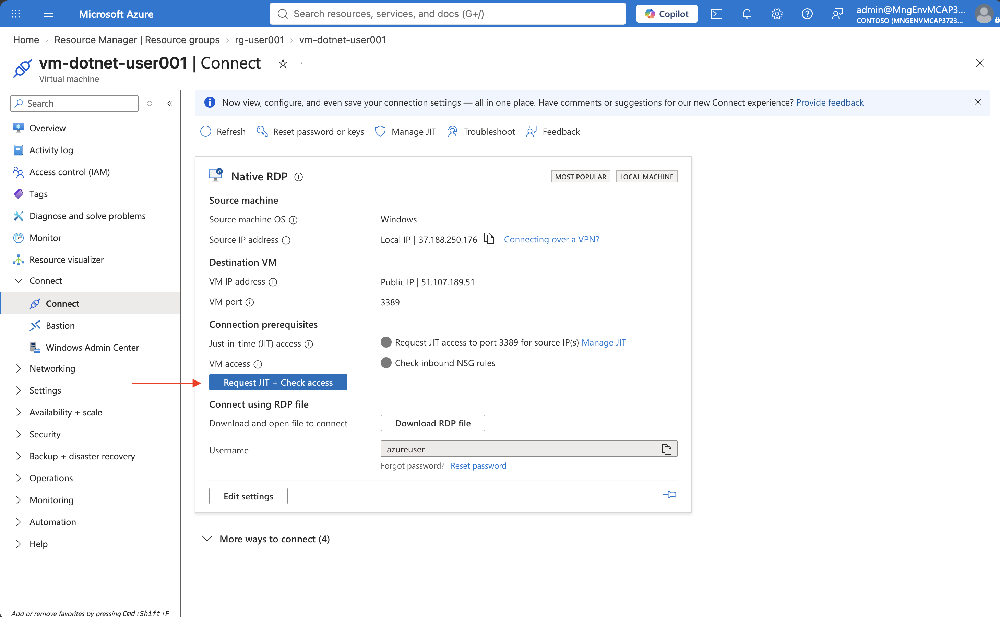
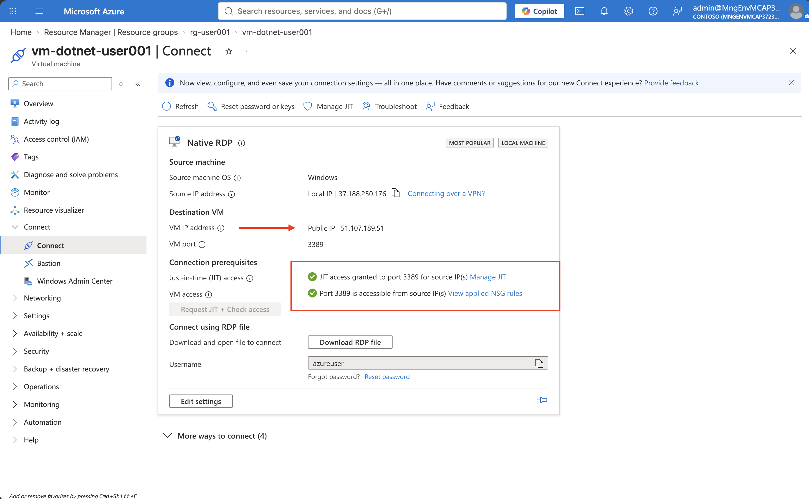
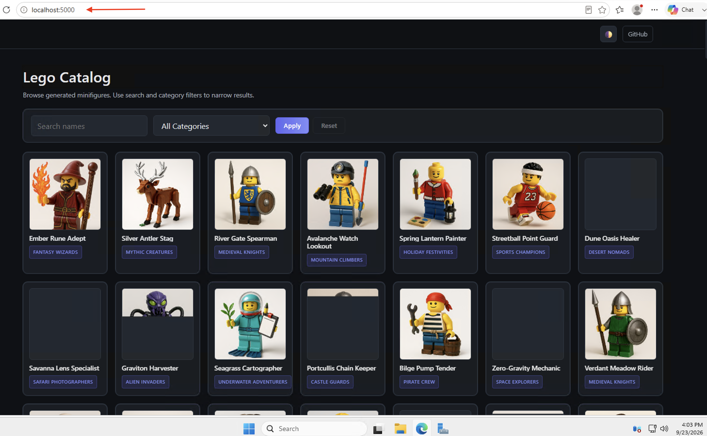

# ch00: Meet the application you are about to move

## Goal

Before you modernize anything, look at what you are modernizing. In this short challenge
you choose one of the two legacy stacks, connect to its Virtual Machine, and use the
catalog application as it exists today.

Everything the application needs sits on that one box: the web app, the database, 198
product photographs, the connection string, and the single log file. So a slow query, a
full disk, a failed patch and a bad release are all the same outage.

**Estimated time:** 15 minutes.

## Choose your stack

Do this **first**. Everything from here on is about one stack only, so there is nothing to
gain by trying both.

| | `dotnet-sqlserver` | `java-postgresql` |
| --- | --- | --- |
| VM | `vm-dotnet-userNNN` | `vm-java-userNNN` |
| Runtime today | .NET 8 Blazor Server | Spring Boot 3 on Microsoft OpenJDK 17 |
| Database today | SQL Server 2022 Express | PostgreSQL 18 |
| URL inside the VM | `http://localhost:5000` | `http://localhost:8080` |
| Source folder | [`dotnet/`](../dotnet/README.md) | [`java/`](../java/README.md) |
| Target database | Azure SQL Database (serverless) | Azure Database for PostgreSQL Flexible Server |

Both stacks converge on the same Azure architecture and the same later challenges, so
neither is the easy option. Pick the one that resembles what you actually maintain. If your
table can split, pick different ones deliberately so you have someone to compare notes
with. No preference? Take `dotnet-sqlserver`.

> [!IMPORTANT]
> The VM is scenery, not scaffolding. It exists so you can see and feel the legacy world.
> Everything you build from ch01 onwards is driven from the application **source code** in
> your own fork or clone, not from anything on the VM — and the workshop assumes you open
> that fork in **GitHub Codespaces**, where the
> [dev container](../.devcontainer/README.md) already has both SDKs, Maven, Docker and
> the Azure CLI.

## Actions

> [!NOTE]
> The screenshots use `vm-dotnet-user001` as an example. Open the VM for your chosen stack
> and assigned user number; names, IP addresses, and usernames in your environment will
> differ.

1. In the Azure portal, open your `rg-userNNN` resource group and select your chosen VM.
   Confirm that its status is **Running**, then on **Overview** select
   **Connect → Connect**.

   

2. There is no standing inbound RDP rule, and you should not create one — tenant governance
   removes rules that leave management ports open. On the **Connect** page, under
   **Native RDP**, select **Request JIT + Check access** to request Just-in-Time access to
   port 3389 from your current IP address.

   

   If Azure reports that JIT is not configured, select **Manage JIT** and enable it. If that
   option is not available, open **Microsoft Defender for Cloud → Just-in-time VM access**,
   find your VM on the **Not Configured** tab, enable JIT, and request port 3389 from
   **My IP**.

3. Wait until Azure shows green checks for both **JIT access granted** and
   **Port 3389 is accessible**. Then select **Download RDP file**.

   

4. Open the downloaded `.rdp` file and sign in with the credentials your facilitator gave
   you. If your public IP changes or the JIT window expires, repeat steps 2 and 3.

5. Inside the VM, open the browser and go to the URL for your stack:
   `http://localhost:5000` for .NET or `http://localhost:8080` for Java.

   

6. Use the application. Search for a figure, filter by a category, open a detail page, and
   load a photograph. Note that the catalog is reachable only from the machine where it
   runs — that is part of the "before" picture.

7. Look at what the application depends on: the database service running on the same box,
   the 198 PNG files in a folder on the C: drive, the connection string in a config file,
   and the single text log. Which of these would survive the VM being rebuilt?

8. Ask yourself how a one-line label fix reaches production today. Count the steps. Then
   count the steps to undo it.

## Success Criteria

- You have used your chosen catalog in a browser and can describe what it does without
  reading this page.
- You can name where the data, the images, the credential and the logs live today.
- You have written down which stack you chose — you will use it for the rest of the
  workshop.

## If RDP will not connect

| Symptom | Likely cause | Fix |
| --- | --- | --- |
| RDP times out on a VM that reports *running* | Your JIT request expired, or your public IP changed (a VPN reconnect is enough) | Request JIT access again with **My IP** |
| RDP worked, then stopped later in the day | The JIT window closed | Request access again — that is the routine, not a failure |
| Just-in-time VM access is not offered | Defender for Cloud is not enabled for servers on this subscription | Ask your facilitator; this is a subscription-level setting |

## Solution - Spoilerwarning

[Solution Steps](../walkthrough/ch00/README.md)

---

**Previous:** [Workshop overview](../README.md) · **Next:** [ch01](ch01.md)
