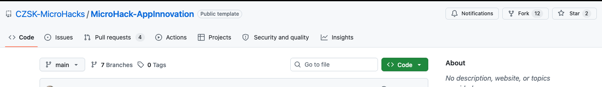
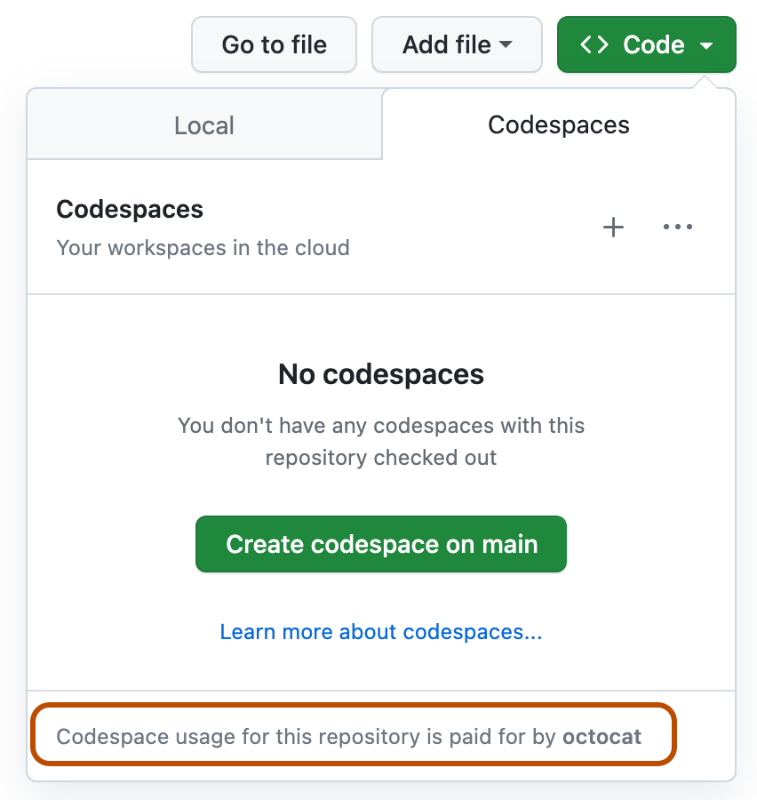
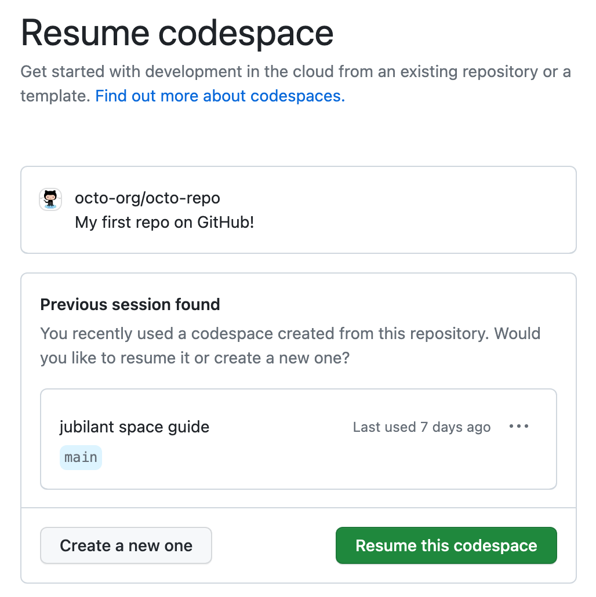

# ch01-A · .NET — Modernize the existing application

> **Path A**, `dotnet-sqlserver` stack. Chose Java instead? [Go here](./ch01-A-java.md).
> Not sure which path you are on? [Read the chooser](ch01.md).

## Goal

Keep the catalog application you have, and move it forward: a current .NET version, running
as a container on **Azure Container Apps**, talking to **Azure SQL Database**, with the
product images served from **Azure storage**.

Work in **GitHub Codespaces** on your own fork or the repository assigned by your
facilitator. The [dev container](../.devcontainer/README.md) already has both SDKs,
Maven, Docker and the Azure CLI, so nothing needs installing on your machine.
The legacy VM from [Challenge 0](ch00.md) stays exactly as it is. It
is the "before" you can go back and look at, and in path A you never deploy from it.

| | |
| --- | --- |
| Source folder | [`dotnet/`](../dotnet/README.md) |
| Runs today on | .NET 8, Blazor Server |
| Database today | SQL Server 2022 Express, on the VM |
| Managed database | Azure SQL Database (serverless) |
| Local port | 5000 |

## Open the repository in GitHub Codespaces

1. Sign in to GitHub and open your fork of
   [`CZSK-MicroHacks/MicroHack-AppInnovation`](https://github.com/CZSK-MicroHacks/MicroHack-AppInnovation),
   or the repository your facilitator assigned to you. On the repository's **Code** tab,
   find the green **Code** button above the file list.

   

2. Select **Code** → **Codespaces** → **Create codespace on main**. If GitHub shows who
   will pay for the codespace, confirm that it matches the account or organization you
   expect before continuing.

   

3. Wait for the dev container to finish building. GitHub opens the repository in VS Code
   in your browser automatically. To return later, open the repository's **Code** tab and
   press <kbd>,</kbd>, or visit [github.com/codespaces](https://github.com/codespaces),
   then resume the existing codespace.

   

> [!NOTE]
> Screenshots 2 and 3 are from GitHub Docs:
> [Creating a codespace for a repository](https://docs.github.com/en/codespaces/developing-in-a-codespace/creating-a-codespace-for-a-repository)
> and
> [Opening an existing codespace](https://docs.github.com/en/codespaces/developing-in-a-codespace/opening-an-existing-codespace),
> licensed under [CC BY 4.0](https://creativecommons.org/licenses/by/4.0/).

## Recommended steps

Six steps, in this order. Each one leaves you with something that works, so you can stop
and start again after any of them.

### Step 0 — Explore the application

Before changing code, open GitHub Copilot Chat at the repository root and start with:

```
Give me a high-level description of the application under the "dotnet" folder. I am new to the project and want to know basic stuff to start building or adding new features.
```

Use the answer to locate the application entry point, configuration, data access, tests,
and local run command. Check Copilot's summary against [`dotnet/README.md`](../dotnet/README.md)
and the source before moving on.

**Checkpoint:** you can explain how a request reaches the database, where runtime settings
come from, and which command builds and tests the application.

### Step 1 — Upgrade the framework

The application is a few versions behind. Bring it up to date **while it still runs locally
against the local database** — an upgrade is far easier to review before you add Azure to
the picture.

Use GitHub Copilot Chat directly. Start here:

```
Upgrade this project to the latest LTS .NET version.
- Move from .NET 8 to .NET 10 — the target framework, the SDK version, and all NuGet packages
- Do not change application behavior, routes, or the database schema
- Fix compilation errors and deprecated API usage introduced by the upgrade
- Work in small steps and explain each change before making it
```

> **Both SDKs are already there.** The dev container ships .NET 8 *and* .NET 10, so you can
> build before and after the upgrade without installing anything. Confirm with
> `dotnet --list-sdks`.

To run the app locally you need a database. Start SQL Server as a container in your
codespace — Docker is available:

```bash
docker run -d --name catalog-sql -p 1433:1433 \
  -e ACCEPT_EULA=Y -e MSSQL_SA_PASSWORD='<choose-a-strong-password>' \
  mcr.microsoft.com/mssql/server:2022-latest
```

The baseline configuration expects Windows SQL Server Express at `.\SQLEXPRESS` with
integrated authentication. Your Codespace is Linux and the database is now the container
on `localhost:1433`, so the application needs explicit connection settings. In the same
terminal, from `dotnet/`, export:

```bash
export CATALOG_DATABASE_HOST=localhost
export CATALOG_DATABASE_PORT=1433
export CATALOG_DATABASE_NAME=LegoCatalog
export CATALOG_DATABASE_USERNAME=sa
export CATALOG_DATABASE_PASSWORD='<same-strong-password-used-above>'
```

The password must exactly match `MSSQL_SA_PASSWORD`. These values apply only to the current
shell and must not be committed. Before starting the app, also set the data paths and
required local runtime identity variables shown in the
[`dotnet/README.md` run instructions](../dotnet/README.md#run-it).

**Checkpoint:** `dotnet test` passes and the app still serves the catalog on
`http://localhost:5000`.

> ⏱️ **Timebox this.** Getting to Azure matters far more than reaching the newest possible
> version. If the upgrade turns into a fight, stop at .NET 9 and move on — you can always
> come back.

### Step 2 — Deploy a managed database and move the data into it

Do not change the application yet. Leave it running locally and give it a cloud database to
talk to. Use the **serverless** tier so it scales with load and costs almost nothing when
idle, and allow public access for now — you lock this down in
[ch07-enterprise](ch07-enterprise.md).

You can use the Portal, the CLI, Bicep, Terraform, or Pulumi. We suggest asking Copilot for
Bicep, because you will keep extending that same template for the rest of the workshop:

```
In folder bicep, create a Bicep template deploying Azure SQL Database in the serverless SKU.
- Administrator login and password as parameters; use @secure() on the password
- A firewall rule for my client IP, with the IP as a parameter
- Derive location from the resource group
- Names must be globally unique — add a uniqueString seeded with the resource group ID
- Auto-pause after 1 hour, autoscaling between 0.5 and 2 cores
- Produce main.bicep plus an example .bicepparam file and a short README
- Check the schema with #fetch https://learn.microsoft.com/en-us/azure/templates/microsoft.sql/servers?pivots=deployment-language-bicep
- Do not stop after creating the files: use the Azure CLI to validate, preview, deploy, and verify the template
- Before deploying, confirm my Azure subscription and resource group, and ask me for any required parameter values
- Do not print or commit secrets; after deployment, report the database connection details I need for the application
```

Review the deployment preview and target resource group before allowing Copilot to
continue. It should finish by verifying the Azure deployment, not merely by producing
the Bicep files.

Then point the application at it with the `CATALOG_DATABASE_*` environment variables
documented in [`dotnet/README.md`](../dotnet/README.md), and let the startup import load
`data/catalog.json`.

**Checkpoint:** the app runs on your machine and lists all 198 figures — but the data now
lives in Azure.

### Step 3 — Package the application as a container

Write a Dockerfile and test it locally. Two things to think about:

- Use a **multi-stage build** so you compile with the SDK image and ship the smaller
  ASP.NET runtime image.
- The app reads a folder containing the seed JSON and the 198 product images. **Do not bake
  static content into the image** — mount it as a volume for now.

```
Create a multi-stage Linux Dockerfile for this Blazor Server application.
- It is currently run with `dotnet run --project src/LegoCatalog.App/LegoCatalog.App.csproj`
- Build with the .NET SDK image, run on the ASP.NET runtime image, use the built-in Kestrel server
- Put the Dockerfile in dotnet/ so paths inside are relative to it
- Add example docker build/run commands to the README, mounting the data folder as a volume
  and passing the database connection as environment variables
```

**Checkpoint:** `docker run` gives you the same catalog page as `dotnet run` did.

### Step 4 — Build the image in Azure Container Registry

Add a registry to your Bicep template, then build **inside Azure** with `az acr build` — no
local Docker daemon needed, and the image is built close to where it will run.

```
Extend main.bicep to also create an Azure Container Registry.
- Unique name via uniqueString seeded with the resource group ID
- SKU as a parameter, defaulting to Basic
- Schema reference: #fetch https://learn.microsoft.com/en-us/azure/templates/microsoft.containerregistry/registries?pivots=deployment-language-bicep
```

Then, from the `dotnet/` folder:

```powershell
az acr build --registry <yourregistry> --image lego-catalog/app:latest .
```

**Checkpoint:** `az acr build` succeeds and you can see the image in the registry.

### Step 5 — Deploy to Azure Container Apps

Extend the same Bicep template again to deploy the container. Decisions to make here:

- **Secrets** — the database password must come from a Container Apps secret, never a
  plain environment variable in source control.
- **Image pull** — give the Container App a managed identity with `AcrPull`, rather than
  using registry admin credentials.
- **Static content** — mount Azure Files shares for the seed JSON and the images, and set
  `CATALOG_IMAGES_PATH` and `CATALOG_SEED_PATH`.
- **Scaling** — external ingress, scaling from 0 to 3 replicas on HTTP load.
- **Database reachability** — with no VNet integration there is no fixed outbound IP, so
  temporarily allow access from Azure services on the SQL firewall.

```
Modify main.bicep to deploy the application to Azure Container Apps.
- Workload profile (v2) environment, consumption profile for the app
- Database connection via CATALOG_DATABASE_* environment variables; the password from a Container Apps secret
- Mount Azure Files shares for the seed JSON and the images
- External ingress targeting the port my Dockerfile exposes; scale 0 to 3 replicas on HTTP
- Managed identity with AcrPull for image pull rather than admin credentials
- Also add an Azure SQL firewall rule allowing access from Azure services
- #fetch https://learn.microsoft.com/en-us/azure/templates/microsoft.app/containerapps?pivots=deployment-language-bicep
```

**Checkpoint:** the Container App's ingress URL serves the catalog. You are done.

## Success Criteria

- The application is fully functional in Azure: browse, search, filter by category, open
  a figure detail page, and see its photograph.
- The application and the database are deployed separately, and the database is Azure SQL
  Database rather than SQL Server on a VM.
- The application runs as a container on Azure Container Apps and can scale.
- No database password is committed to the repository.

## Bonus

- Serve the images **directly from Azure Blob Storage** instead of through the application
  container — a base URL change plus CORS. Cheaper, faster, and it frees the container to
  do only what it is good at.
- Add a health probe configuration to the Container App using `/healthz` and `/readyz`, and
  watch what happens when you stop the database.
- After completing the challenge, optionally compare your Chat-driven upgrade with the
  **GitHub Copilot app modernization** extension. Do not use the extension for the main
  challenge — the goal here is to practise exploring, planning, and changing the
  application with Copilot Chat.

## Solution — spoiler warning

[Step-by-step walkthrough with full prompts](../walkthrough/ch01-A/dotnet.md)

---

**Challenge:** [ch01](ch01.md) · **Java variant:** [ch01-A · Java](./ch01-A-java.md) ·
**Other path:** [ch01-B](ch01-B.md) · **Next:** [ch02](ch02.md)
