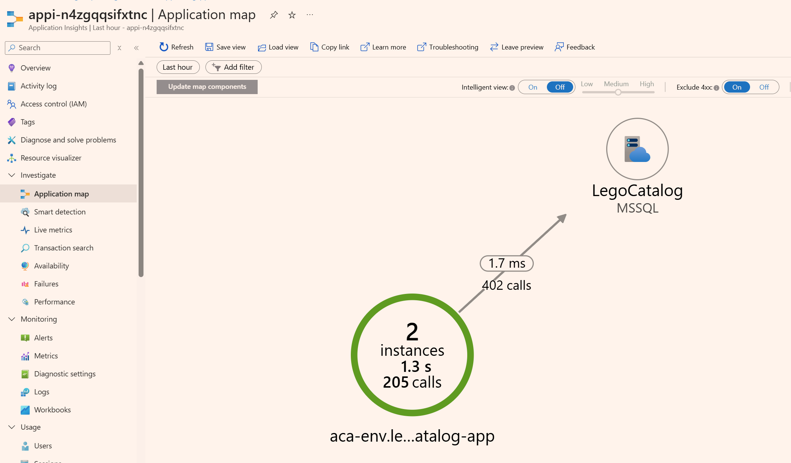

# The ten-minute demo

Use this script to open the workshop or sell it internally. Show the journey quickly: a
working-but-fragile VM catalog becomes a containerized Azure app with autoscaling, safer
releases, traces, and agent-assisted incident response.

Do not teach the full architecture in this slot. Make the audience want the hands-on work.

## Before you start

Prepare one completed run, or at least one deployed catalog app. Have access to:

- a legacy VM from [ch00](../challenges/ch00.md);
- a modernized app from [ch01](../challenges/ch01.md);
- metrics from [ch02](../challenges/ch02.md);
- a GitHub Actions workflow from [ch03](../challenges/ch03.md);
- Application Insights from [ch04](../challenges/ch04.md);
- optionally, an SRE Agent incident from [ch06](../challenges/ch06-sre-agent.md).

Optional shell variables for live commands:

```bash
RESOURCE_GROUP=rg-userNNN
CONTAINER_APP=<container-app-name>
APP_URL=https://<container-app-url>
API_KEY=<perftest-api-key>
```

Never put secrets on the projector. Use portal views whenever a command would distract.

## 1. The legacy catalog works, but it is boxed in (00:00–01:30)
**Show:** Connect to the chosen VM over RDP. Open the app inside the VM:

- .NET: `http://localhost:5000`
- Java: `http://localhost:8080`

Search, filter by category, open one figure, and show its image.

**Say:** "This is not a broken app. It has 198 products, 20 categories, search, details,
and images. The problem is the shape: one VM, app and database together, manual releases,
no autoscale, and little visibility when it slows down."

**Takeaway:** Modernization starts from a working system. The goal is safer change and
better operations.

## 2. Challenge 1 has two honest routes (01:30–02:30)
**Show:** Open [ch01](../challenges/ch01.md), then the two paths:
[ch01-A](../challenges/ch01-A.md) and [ch01-B](../challenges/ch01-B.md).

**Say:** "Path A keeps the code and moves it forward. Path B keeps the behavior and writes
a PRD before rebuilding. Both use Copilot heavily, both require human review, and both land
on the same Azure architecture. If your table has four people, split the paths and compare
notes."

**Takeaway:** The workshop is about modernization decisions, not one prescribed coding
style.

## 3. The target uses managed platform services (02:30–04:00)
**Show:** In the Azure portal, open the participant resource group and point at Azure
Container Apps, Azure Container Registry, the managed database, image storage, and
Application Insights. Then check health:

```bash
curl -I "$APP_URL/healthz"
curl -I "$APP_URL/readyz"
```

**Say:** "The app is now a container. The database is managed. Images are outside the app
process. The image was built in ACR. The Bicep was written by the participant with Copilot,
not copied from a magic shared template."

**Takeaway:** The target is understandable: container, database, registry, storage, and
monitoring.

## 4. Autoscaling becomes visible (04:00–05:30)
**Show:** Open the Container App **Metrics** blade and show **Replicas** during a recent load
test. For one quick request:

```bash
curl -H "x-api-key: $API_KEY" "$APP_URL/perftest/catalog"
```

**Say:** "On the VM there was always one instance. In Container Apps, replicas are a number
we can watch. The design question is whether the scale rule watches the right signal and
where pressure moves next, often to the database."

**Takeaway:** Autoscale is observable, and it creates new capacity questions.

## 5. Releases are reversible (05:30–07:00)
**Show:** Open the GitHub Actions run from Challenge 3. Show build, staging revision,
approval, and promotion. Then list revisions:

```bash
az containerapp revision list \
  --name "$CONTAINER_APP" \
  --resource-group "$RESOURCE_GROUP" \
  --query "[].{revision:name,active:properties.active,weight:properties.trafficWeight,health:properties.healthState}" \
  --output table
```

If you have a safe prepared rollback, move traffic back to the previous revision. Otherwise
just explain that rollback is the reverse traffic split.

**Say:** "A release creates a new revision instead of overwriting the old one. Promotion is
a traffic change. Rollback is also a traffic change. The approval gate makes production
movement explicit."

**Takeaway:** Release management becomes repeatable and reversible instead of a remote
desktop ritual.

## 6. Traces answer the slow-question (07:00–08:30)

**Show:** Open Application Insights. Use the application map or performance view. Show a
request, its database dependency, duration percentiles, and one trace sample.



**Say:** "On the VM, 'it was slow' meant searching logs and guessing. With OpenTelemetry,
we can see which operation was slow and whether time went into the app, the database, or
another dependency."

**Takeaway:** Observability changes the conversation from opinions to timings.

## 7. The incident story closes the loop (08:30–10:00)

**Show:** If Challenge 6 is prepared, show the alert, SRE Agent investigation, and
human-approved recovery action. If not, show the [ch06 guide](../challenges/ch06-sre-agent.md)
and describe the loop: observe, ask the agent, challenge the recommendation, approve the
safe fix.

Close with the [wrap-up](../challenges/wrapup.md) scorecard:

| Before | After |
| --- | --- |
| One VM instance | Replicas scale with demand |
| Database on the app server | Managed database |
| Manual release | GitHub Actions with approval |
| Hard rollback | Revision traffic rollback |
| Text logs | Traces, metrics, and dependencies |
| Human-only triage | Agent-assisted investigation with human approval |

**Say:** "This is the value of the two days: a better operating model for a familiar legacy
app. The team leaves knowing what changed, what tradeoffs they made, and what to harden
next."

**Takeaway:** Modernization is a set of observable, reversible improvements.

## One-slide summary

- Real catalog: 198 figures, 20 categories, images, search, and detail pages.
- Two stacks: .NET with SQL Server, or Java with PostgreSQL.
- Two Challenge 1 paths: modernize the code, or rewrite from a reviewed PRD.
- One Azure target: ACA, managed database, storage, ACR, Application Insights.
- Later challenges add autoscale, CI/CD, tracing, Defender, and SRE Agent response.
- Closing question: what will you change first at work?

**See also:** [Agenda](Agenda.md) · [Day-of card](DayOfCard.md) ·
[Facilitator guide](Facilitator.md) · [Glossary](Glossary.md) ·
[Cost estimate](CostEstimate.md) · [Troubleshooting](Troubleshooting.md)
