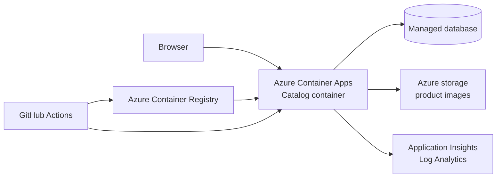
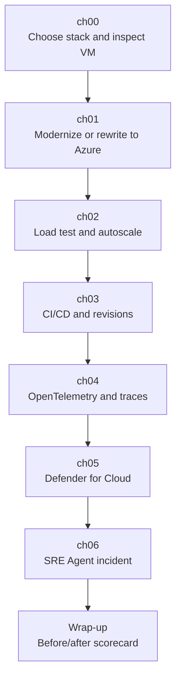

# Application Innovation workshop design

This page describes the simplified workshop: one legacy catalog, two language stacks, two
Challenge 1 paths, and one Azure target architecture.

## Design goal

Participants should experience the modernization decisions that matter in a real project:
where to put state, how to build and run containers, how to deploy safely, how to observe
the system, and how to use GitHub Copilot without outsourcing judgment.

The workshop avoids ceremony. Participants write the Bicep they need, review generated code
and plans, and verify the running application directly.

## The product

The application is a small retail catalog for collectible figures:

- 198 figures;
- 20 categories;
- one PNG image per figure;
- search, category filtering, detail pages, and health endpoints.

Shared routes: `/`, `/figure/{id}`, `/images/{file}`, `/import`, `/healthz`, `/readyz`, and
`/perftest/catalog`. The load-test route is protected by an `x-api-key` header.

## Legacy baseline

Each participant resource group, `rg-userNNN`, contains two Windows VMs. Participants pick
one in [ch00](../challenges/ch00.md) and leave the other alone.

| Stack | VM | Runtime | Database | Local URL |
| --- | --- | --- | --- | --- |
| `dotnet-sqlserver` | `vm-dotnet-userNNN` | .NET 8 Blazor Server | SQL Server 2022 Express | `http://localhost:5000` |
| `java-postgresql` | `vm-java-userNNN` | Spring Boot 3 / Java 17 | PostgreSQL 18 | `http://localhost:8080` |

The VM is intentionally old-fashioned: web app, database, and image files live on one
machine. RDP uses Just-in-Time VM access. The catalog is browsed inside the VM because the
app listens on loopback.

## Target Azure architecture

Both Challenge 1 paths end here:

The target uses Azure Container Apps for the web app, Azure SQL Database serverless for the
.NET stack, Azure Database for PostgreSQL Flexible Server for the Java stack, Azure storage
for images, Azure Container Registry for image builds, managed identity where practical,
OpenTelemetry, Application Insights, and GitHub Actions with OIDC.

Participants author the Bicep with GitHub Copilot. There is no prebuilt Bicep template to
copy from.

## Challenge flow

Optional follow-up work lives in [ch07-enterprise](../challenges/ch07-enterprise.md)
and [ch07-innovation](../challenges/ch07-innovation.md).

## Challenge 1 paths

| Path | What happens | Main review point |
| --- | --- | --- |
| **A — Modernize with GitHub Copilot** | Keep the application, upgrade the framework, containerize it, move the database, and deploy it. | Review generated diffs and deployment settings. |
| **B — Rewrite with GitHub Copilot (spec-driven)** | Use the legacy app to write a PRD, review it, plan the new app, and rebuild on a modern stack. | Review the PRD before code exists. |

Both paths keep the user-visible behavior and land on the same Azure services. The useful
comparison is which risks appeared earlier in each workflow.

## Operating model taught by later challenges

- **ch02:** scale the app under load, watch replicas, and see the managed database become
  the next bottleneck.
- **ch03:** deploy through GitHub Actions, create a staging revision, require approval, and
  roll back by changing traffic weights.
- **ch04:** add OpenTelemetry so slow requests can be explained with traces and dependency
  timing instead of guesses.
- **ch05-defender:** inspect cloud security posture and decide which findings matter.
- **ch06-sre-agent:** let an AI agent investigate an incident, then require a human to
  approve recovery.

## Design tradeoffs

The workshop deliberately chooses learning speed over production completeness:

- public database access is allowed early, then revisited in ch07-enterprise;
- image storage can begin with mounted storage and evolve toward direct blob delivery;
- scale rules start simple so participants can see cause and effect;
- CI/CD roles should be narrow, but the lab keeps the setup understandable;
- the legacy VM remains available as the "before" system throughout the workshop.

These tradeoffs are discussion points, not hidden flaws. The point is to make the path from
legacy VM to managed platform visible and repeatable.

## Related docs

[Agenda](Agenda.md) · [Demo](Demo.md) · [Glossary](Glossary.md) · [Troubleshooting](Troubleshooting.md)
