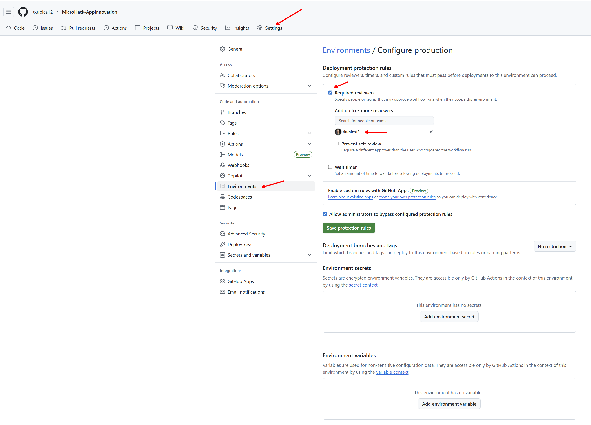
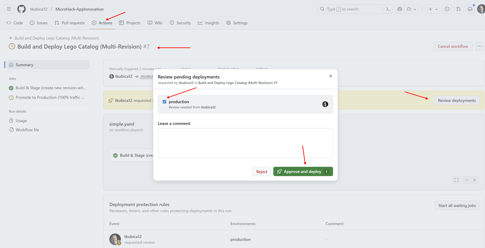

# ch03: Implement a CI/CD pipeline to deploy changes automatically

We assume the infrastructure — including the Azure Container App and the registry — is
already deployed from ch01. There are many possible workflow designs. Here we first build a
simple build-and-deploy workflow, then evolve it into a controlled promotion model with
manual approval and traffic switching between revisions.

Wherever a path below says `dotnet/`, use `java/` or your rewritten application folder
instead if that is the stack you chose.

## Simple CI/CD pipeline

Create a GitHub Actions workflow. Make sure the Dockerfile you wrote in ch01 is present in
your application folder. Use GitHub Copilot to help; example prompt:

```
Create GitHub Actions workflow and place it into .github/workflows/deploy.yaml
- Start automatically when changes are made to the `dotnet/` folder in main branch
- Add manual start as alternative
- Build and push Docker image to Azure Container Registry. Name of registry will be provided by repository variable $ACR_NAME.
- Name of Azure Container App is lego-catalog-app
- Name of Resource Group where ACA and ACR is deployed is provided via RESOURCE_GROUP_NAME repository variable.
- Azure Login will be solved using Federated Identity towards Azure User Managed Identity with AZURE_CLIENT_ID, AZURE_TENANT_ID and AZURE_SUBSCRIPTION_ID provided as repository variable.
- Check workflow syntax at #fetch https://docs.github.com/en/actions/reference/workflows-and-actions/workflow-syntax
- Use run id as container image tag
```

Create a managed identity in Azure, give it the Contributor role on the resource group, and
configure federated credentials so GitHub can obtain OIDC tokens. Point the federated
credential at your repository and the `main` branch to begin with. Use the Azure Portal, or
extend the Bicep template you wrote in ch01.

Example prompt:

```
Modify my main.bicep template to include managed identity that will be used by my GitHub Actions.
- Make this identity contributor in current Resource Group
- Configure identity federation pointing to repository https://github.com/<your-org>/MicroHack-AppInnovation in main branch
- Make repository information parameter, but fill in my details into main.bicepparam
- Document the change in the README.md file in my bicep folder
- See docs in #fetch https://learn.microsoft.com/en-us/azure/templates/microsoft.managedidentity/identities?pivots=deployment-language-bicep and https://learn.microsoft.com/en-us/azure/templates/microsoft.managedidentity/userassignedidentities/federatedidentitycredentials?pivots=deployment-language-bicep
```

Then configure repository variables under **Settings → Secrets and variables → Actions**:
`AZURE_CLIENT_ID`, `AZURE_TENANT_ID`, `AZURE_SUBSCRIPTION_ID`, `RESOURCE_GROUP_NAME`,
`ACR_NAME`.

Push a small change to your application folder and watch the workflow run.

> Using an image tag derived from the run ID rather than `latest` matters more than it
> looks. `latest` is a moving target: you cannot tell which build is running, and a restart
> can silently pull something different. An immutable tag makes a rollback a one-line
> command.

## Multi-step pipeline with approval

Now comment out (or delete) the simple workflow and build the advanced version.

Enable **multiple revision mode** on the Container App so two versions can run side by
side. Deploy the new revision with no traffic, test it on its own revision URL, then
require a manual approval before promoting it to 100% of traffic and deactivating the old
revisions. Extend the managed identity with environment-scoped federated credentials.

Example prompt:

```
Change main.bicep to enable multiple revisions in Azure Container Apps. Also add two environment-scoped federated credentials (staging, production) for the GitHub managed identity. Federated credentials cannot be configured in parallel — use proper dependsOn ordering.
```

Then change the workflow:

```
Change .github/workflows/deploy.yaml to support multiple revisions in Azure Container Apps:
- Deploy new container image as a new revision (no initial traffic).
- Output the revision-specific URL so a tester can check it.
- Require a manual approval (GitHub Environments) before promotion.
- After approval: shift 100% traffic to the new revision and deactivate previous revisions.
- Use two environments: `staging` and `production`.
```

Configure an approval rule for the `production` environment in GitHub:



In the Azure Portal, open the new revision, take its test URL, and verify the application
behaves correctly. Traffic splitting is under **Container App → Revisions and replicas**,
and can also be driven from the CLI:

```bash
az containerapp ingress traffic set \
  --name lego-catalog-app \
  --resource-group rg-userNNN \
  --revision-weight <new-revision>=100
```

When you are satisfied, approve the deployment to production in GitHub:



## Verify

- A push to your application folder starts the workflow automatically.
- The workflow authenticates to Azure with no stored password.
- A new revision appears with 0% traffic and its own test URL.
- Production traffic only moves after you approve it.
- Rolling back is a matter of shifting traffic to the previous revision, which is still
  there.

---

**Challenge:** [ch03](../../challenges/ch03.md) ·
**Previous:** [ch02](../ch02/README.md) ·
**Next:** [ch04](../ch04/README.md)
