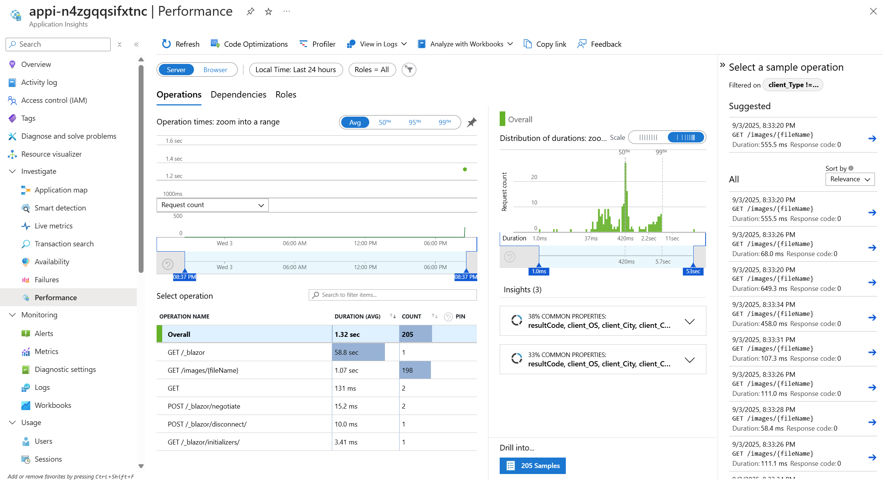

# ch04: Monitor application performance with tracing

The application is instrumented with the standard OpenTelemetry SDK and is ready to send
traces, metrics, and logs to an OTLP endpoint. We will deploy Azure Application Insights to
analyze and visualize them.

We could embed the Azure Monitor SDK directly, but to avoid vendor-specific code we use the
**OpenTelemetry Collector** integration in Azure Container Apps: it receives standard OTLP
signals and forwards them to Application Insights.

Azure Container Apps supports an OpenTelemetry Collector at the *environment* level. It
listens for OTLP data and can export to several destinations, and its connection settings
are injected automatically into running containers as environment variables — so the
application needs no change at all.

## Step 1: Add Application Insights and the collector

The application already emits telemetry, so the work is enabling the collector in the Bicep
template you wrote in ch01. Example Copilot prompt:

```
Add OpenTelemetry Collector support to main.bicep and point it to Azure Application Insights.
- Read documentation here: #fetch https://learn.microsoft.com/en-us/azure/container-apps/opentelemetry-agents?tabs=bicep%2Carm-example
- Provision Application Insights on top of a Log Analytics workspace, see #fetch https://learn.microsoft.com/en-us/azure/azure-resource-manager/bicep/scenarios-monitoring
- Export traces and logs to Application Insights
```

Deploy the template.

## Step 2: Restart the app so it picks up the endpoint

The collector settings are injected as environment variables, so the container has to start
again to see them. Creating a new revision is enough:

```bash
az containerapp revision restart \
  --name lego-catalog-app \
  --resource-group rg-userNNN \
  --revision <current-revision>
```

Both stacks read the standard `OTEL_EXPORTER_OTLP_ENDPOINT` variable, so no code change is
required. If you want to confirm what the container actually received, check the
environment variables on the revision in the portal.

## Step 3: Generate some traffic and look

Browse the catalog, run a search, open a figure, and hit `/perftest/catalog` a few times.
Then open Application Insights.

**Application map** shows the app and its dependency on the managed database:


**Performance** shows where the time goes per operation:



Worth looking at specifically:

- **Transaction search** — pick one slow request and open its end-to-end trace. You should
  see the incoming HTTP request, the database call underneath it, and how long each took.
- **Failures** — filter to 5xx and dependency failures.
- **Live metrics** — useful during the ch02 load test if you go back and rerun it.

## Step 4: Ask a question with KQL

The portal blades are convenient, but the real power is querying. Open **Logs** and try:

```kql
// Slowest operations over the last hour
requests
| where timestamp > ago(1h)
| summarize count(), avg(duration), percentile(duration, 95) by operation_Name
| order by percentile_duration_95 desc
```

```kql
// Database calls and how long they took
dependencies
| where timestamp > ago(1h)
| where type has_any ("SQL", "postgresql")
| summarize count(), avg(duration) by target, name
| order by avg_duration desc
```

Ask GitHub Copilot for KQL if you are new to it — describe what you want to see and let it
write the query, then read it critically.

## Verify

- Traces from the application appear in Application Insights within a few minutes of
  traffic.
- The application map shows the dependency on the managed database.
- You can open one request and see its database call nested inside it.
- The application code contains no Azure-specific telemetry exporter.

## BONUS

Set an alert. For example, fire when the 95th-percentile duration of the catalog page goes
above a threshold for five minutes, or when dependency failures exceed a rate. Then ask
yourself the harder question: who would act on it, and what would they do?

---

**Challenge:** [ch04](../../challenges/ch04.md) ·
**Previous:** [ch03](../ch03/README.md) ·
**Next:** [ch05-defender](../ch05-defender/README.md)
