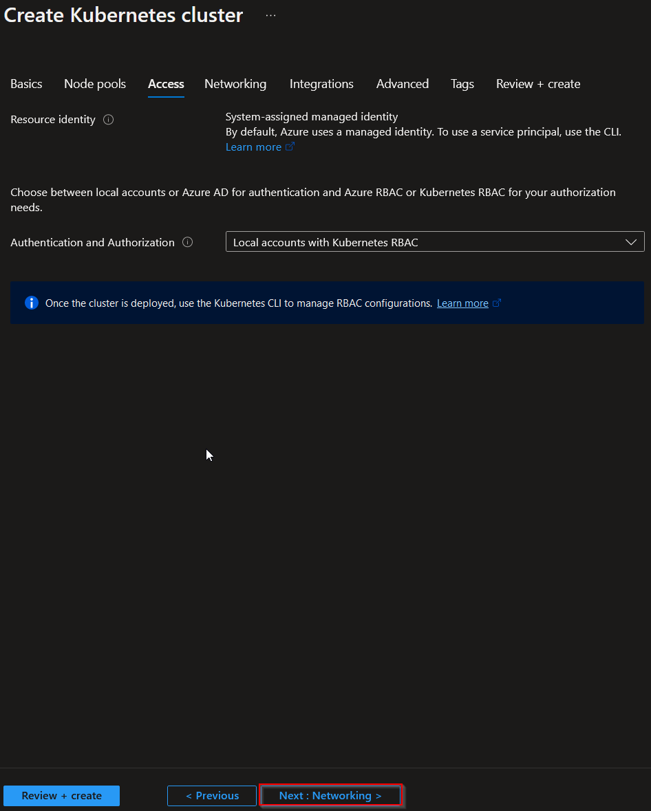

# Challenge 1: Set up the environment

**[Home](../README.md)** - [Next Challenge Solution](./02-Deploy-and-configure-solution.md)

You can create your environment using any source you want. The following links describe solutions for using the Portal, the CLI or terraform:

* [Portal](https://learn.microsoft.com/en-us/azure/aks/learn/quick-kubernetes-deploy-portal?tabs=azure-cli)
* [CLI](https://learn.microsoft.com/en-us/azure/aks/learn/quick-kubernetes-deploy-cli)
* [Terraform](https://learn.hashicorp.com/tutorials/terraform/aks)

Down below is described, how to setup everything via the Azure Portal:

## Step 1: Naming convention

It is recommended in Azure to use a naming convention, since some resources need a globally unique name.
For our microhack, we will go with the best practice convention provided by microsoft, which has the following structure:

A detailed overview of all the shortcuts can be found here [link](https://learn.microsoft.com/en-us/azure/cloud-adoption-framework/ready/azure-best-practices/resource-naming)

## Step 2: Setting up the keyvault

The first resource we are going to deploy is a KeyVault. It will be used to store our secrets.
Go to the menu 'Create new resource' in the Portal and fill the forms out as shown:

## Step 3: Setting up the AKS

Now we create the AKS as well via the portal. Therefor go again to the resource creation menu and fill everything out according to the picture. We will go with the same resource group as the keyvault:
Standard Setup:

Nodepools:

Access:

Network:

## Step 4: Accessing the resources

There are many ways of accesssing resources on Azure, like via Portal or CLI. Therefor it is mandatory to have a permission concept. Under this link you will find some best practices: [link](https://learn.microsoft.com/en-us/azure/cloud-adoption-framework/ready/landing-zone/design-area/security)
