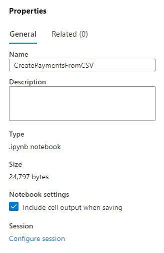
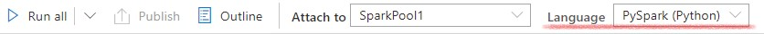
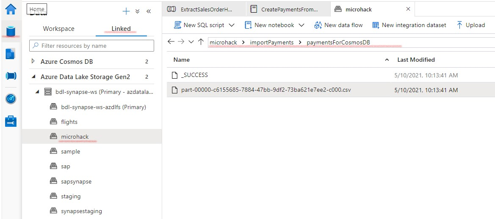

# Payment Generation

The payments are generated based on the extracted Sales Order Headers. 
The underlying logic we used :

`paymentDate = BillingdocumentDate + PayOffset +/- random(PayOffsetVariance)`.

In our example the Payment Offset and Payment Offset Variance is depending on the CustomerGroup in the Sales Order Header.

An example SPARK program is provided at [example Payment Generation](../scripts/CreatePaymentsFromCSV.ipynb).
You can off course create your own program in python, jupiter notebooks, xls, ... .

The spark program starts by reading the exported Sales Order Headers from a csv file on Azure Data Lake. So you need to create an Azure pipeline to extract the Sales Order Headers to a csv file.

## Sales Order Extraction
You can reuse the Linked Service and Integration DataSet to export the Sales Order Headers from your SAP system towards Synapse. You can find the description [here](../DataFlowConfig.md).

> Note : In this pipeline json make sure to add paramaters `convertDateToDateTime` and `convertTimeToTimespan` in order to have dates converted to data format. (Similar to the extraction towards Synapse)

As sink for your pipeline, you need to create a Integration DataSet towards Azure DataLake.

## Payment Generation
* In the development tab, create a new Notebook

* Give a name to the Notebook

* Verify the notebook language is set to `PySPark`

* Copy paste the code from [sample payment generation](../scripts/CreatePaymentsFromCSV.ipynb)

* Attach the `SampleSpark` cluster to the Notebook or create your own cluster

* Adjust the program, eg. to include your file paths, if necessary

* Publish the Notebook

* Execute `Run-All` or execute cell-by-cell by using Shift-Enter

> Note : on the first run the cluster needs to start up, so this will take some time

* You can see the result in the `Data` tab under `Linked Data`

* The resulting csv file can be uploaded to cosmos DB. For pipeline setup you can refer to <b>Pipeline Setup</b> paragraph at [Payment Generation](paymentsSetup.md).
<!-- paymentsSetup.md#pipeline-setup doesn't seem to work on gitHub>

