# MicroHack Challenge 1

## Assessment and migration with Azure Data Studio

### Contents

[Migration architecture and Azure components](#_Toc146707477)

[Generic Migration Content](#generic-migration-content)

[1. Get the SQL Managed Instance FQDN](#get-the-sql-managed-instance-fqdn)

[2. Assess the application databases for Azure SQL Database suitability using the Database Migration Assistant](#assess-the-application-databases-for-azure-sql-database-suitability-using-the-database-migration-assistant)

[3. Migrate the application databases to Azure SQL Database managed instance using the Azure Data Studio (ADS) with migration extension and identify target Azure SQL SKU](#migrate-the-application-databases-to-azure-sql-database-managed-instance-using-the-azure-data-studio-ads-with-migration-extension-and-identify-target-azure-sql-sku)

[4. Confirm application databases have been migrated to Azure SQL Managed Instance](#confirm-application-databases-have-been-migrated-to-azure-sql-managed-instance)

# Migration architecture and Azure components


# Generic Migration Content

| **Narrative**                                                                                                                     | **Notes**                                                                                                                                                                                                                                                                                                                                                                                                                                                                                                                                                                                                                                                                                                                                                                                                                                                                                                                                                                                                                                                                                                                    |
| :-------------------------------------------------------------------------------------------------------------------------------- | :--------------------------------------------------------------------------------------------------------------------------------------------------------------------------------------------------------------------------------------------------------------------------------------------------------------------------------------------------------------------------------------------------------------------------------------------------------------------------------------------------------------------------------------------------------------------------------------------------------------------------------------------------------------------------------------------------------------------------------------------------------------------------------------------------------------------------------------------------------------------------------------------------------------------------------------------------------------------------------------------------------------------------------------------------------------------------------------------------------------------------- |
| _Notes for outside of the workshop:_ _Familiarise yourself with Microsoft migration tools and the Azure Database Migration Guide_ | Azure Database Migration Guide: [https://www.microsoft.com/en-us/download/default.aspx](https://azure.microsoft.com/en-gb/services/database-migration/) DMA & download link: <https://docs.microsoft.com/en-us/sql/dma/dma-overview?view=sql-server-ver15> Azure Data Studio and Migration Extension download Links: [Download and install Azure Data Studio - Azure Data Studio \| Microsoft Learn](https://learn.microsoft.com/en-us/sql/azure-data-studio/download-azure-data-studio?view=sql-server-ver16&tabs=redhat-install%2Credhat-uninstall) [Azure SQL migration extension for Azure Data Studio - Azure Data Studio \| Microsoft Learn](https://learn.microsoft.com/en-us/sql/azure-data-studio/extensions/azure-sql-migration-extension?view=sql-server-ver16) Microsoft Migration Portal: [https://datamigration.microsoft.com/](https://www.microsoft.com/en-us/download/default.aspx) Identify the right Azure SQL Database, Azure SQL Managed Instance or SQL Server on Azure VM SKU for your on-premises database <https://docs.microsoft.com/en-us/sql/dma/dma-sku-recommend-sql-db?view=sql-server-ver15> |

# Get the SQL Managed Instance FQDN

In this section we'll connect to the Azure Portal and retrieve SQL MI information: FQDN.

| **Narrative**                                                                                                                                                                                                                                                                                                                                                                                                                         | **Screenshot**                                      | **Notes** |
| :------------------------------------------------------------------------------------------------------------------------------------------------------------------------------------------------------------------------------------------------------------------------------------------------------------------------------------------------------------------------------------------------------------------------------------ | :-------------------------------------------------- | :-------- |
| On your Win10 VM open Edge browser and got to: [**HTTPS://portal.azure.com**](HTTPS://portal.azure.com) **Username and Password:** _(see your Teams Group)_ In the Azure portal, open the **SQLHACK-SHARED** **Resource Group** and locate the **SQL managed instance** and open it. **Note the Host Name (FQDN)** sqlhackmi-xxxxx.xxxxxxx.database.windows.net. All other **details from the "DB Migration Lab and Parameters.pdf"** | 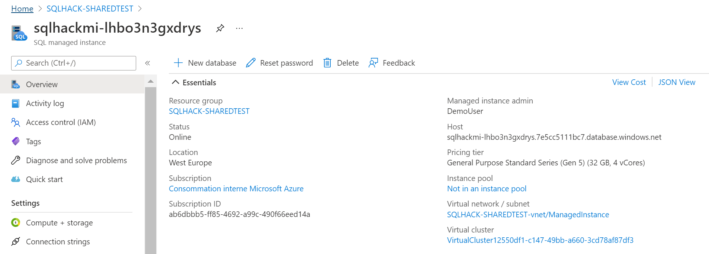 |           |

# Assess the application databases for Azure SQL Database suitability using the Database Migration Assistant

> **❗Hint:**
>
> Credentials for connecting to the VMs is DemoUser / Demo@pass1234567

In this section we will use the Data Migration Assistant (DMA) to assess the applications database for suitability for migration to Azure Cloud.

| **Narrative**                                                                                                                                                                                                                                                                                                                                                                                                                                                                                                                                                                                                                                                                                                                                                                                                                   | **Screenshot**                                                                                                                                               | **Notes**                                                                                                                                                                                                                                                                                                                                                                                                                                                                                                                                                                                                                                                                                       |
| :------------------------------------------------------------------------------------------------------------------------------------------------------------------------------------------------------------------------------------------------------------------------------------------------------------------------------------------------------------------------------------------------------------------------------------------------------------------------------------------------------------------------------------------------------------------------------------------------------------------------------------------------------------------------------------------------------------------------------------------------------------------------------------------------------------------------------ | :----------------------------------------------------------------------------------------------------------------------------------------------------------- | :---------------------------------------------------------------------------------------------------------------------------------------------------------------------------------------------------------------------------------------------------------------------------------------------------------------------------------------------------------------------------------------------------------------------------------------------------------------------------------------------------------------------------------------------------------------------------------------------------------------------------------------------------------------------------------------------- |
| We need to determine the suitability of the database(s) for migration to Azure. This includes checking for compatibility and feature support with Azure Database. You should already have a remote (Bastion) session open to your teams Win10 Management VM**,** if so run DMA from the Start menus or Desktop icon.                                                                                                                                                                                                                                                                                                                                                                                                                                                                                                            |                                            | Database Migration Assistant (DMA) is a free download from Microsoft. It can be used to assess a number of database migration & upgrade scenarios not just SQL Server to Azure SQL Database.                                                                                                                                                                                                                                                                                                                                                                                                                                                                                                    |
| You should see this screenshot to the right. Select the **"+"** to create a new **assessment** project                                                                                                                                                                                                                                                                                                                                                                                                                                                                                                                                                                                                                                                                                                                          |                                                                                                           |
| Select/Enter the following details: **Project name:** **Workshop1**<br> **Assessment type:** **Database Engine**<br> **Source server type:** **SQL Server**<br> **Target server type:** **Azure SQL Database**<br> Click **'Create'**                                                                                                                                                                                                                                                                                                                                                                                                                                                                                                                                                                                           | 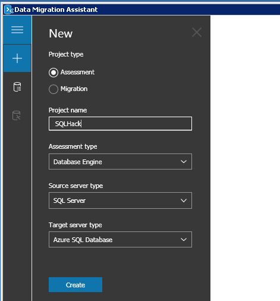                                                                                                          | Our first project assessment assumes we will be migrating to Azure SQL DB, so the options shown in the screenshot need to be selected.                                                                                                                                                                                                                                                                                                                                                                                                                                                                                                                                                          |
| Select the assessment checks (Report Type) to be made:<br> **Check database compatibility**<br> **Check feature parity**<br> Click **'Next'**                                                                                                                                                                                                                                                                                                                                                                                                                                                                                                                                                                                                                                                                                   |                                                                                                           | DMA can test for both database compatibility and feature parity compliance against the Azure target. As this is the initial evaluation, we are assessing a database(s) we will perform all of these tests.                                                                                                                                                                                                                                                                                                                                                                                                                                                                                      |
| Enter the source/legacy SQL details:<br> **Server Name:** **LEGACYSQL2012**<br> **Authentication Type:** **SQL Server Authentication**<br> **Username:** **_Will be provided during hack_**<br> **Password:** **_Will be provided during hack_**<br> **Untick "Encrypt connection"**<br> Click **'Connect'**<br> \*If you get an error logging in check that the Win10 keyboard language.                                                                                                                                                                                                                                                                                                                                                                                                                                       |                                            | When performing this within your own subscription you will enter the host, authentication and connection types according to your company guidelines and practices. _Bear in mind that DMA needs to connect to a source SQL Server using an account that belongs to the_ **sysadmin** _role._ As this document is produced within a workshop environment Active Directory, Certificates and encryption has not been setup.                                                                                                                                                                                                                                                                       |
| Select **only** the 3 databases used by your 'Online Transaction Monitor' app. These will have a **TEAMxx** prefix where XX should be replaced by your team number.<br> **TEAMxx_LocalMasterDataDb** <br> **TEAMxx_SharedMasterDb**<br> **TEAMxx_TenantDataDb**.<br> Click **'Add'** to add them to the assessment.                                                                                                                                                                                                                                                                                                                                                                                                                                                                                                             | 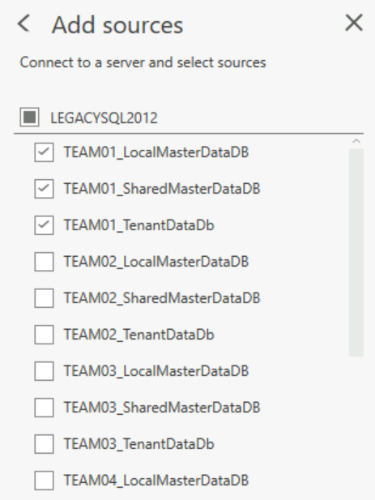                                                                                                          | DMA will show all databases located on the Source host and display them so you can decide which ones to include in this assessment project. **Note**: you can assess multiple databases at the same time.                                                                                                                                                                                                                                                                                                                                                                                                                                                                                       |
| You should now see the screen on the right with the relevant TEAMxx databases listed. Select '**Start Assessment'**                                                                                                                                                                                                                                                                                                                                                                                                                                                                                                                                                                                                                                                                                                             |                                                                                                           | **Note**: DMA allows you to either 'Add' or 'Remove' additional data sources as needed at this point. Also note that DMA provides some high-level metadata about the databases including their compatibility level the total size of each database. [Using Data Migration Assistant to assess an application's data access layer](https://techcommunity.microsoft.com/t5/microsoft-data-migration/using-data-migration-assistant-to-assess-an-application-s-data/ba-p/990430)                                                                                                                                                                                                                   |
| DMA will now show the results of the assessment using 2 separate reports:<br> **'SQL Server feature parity'** which is a server level report highlighting any server settings or components (e.g. MSDTC) that the source DBs are using that isn't supported on the target – in this case Azure SQL Database. In our assessment there are 'Unsupported" or "Partially Supported" features reported (**CLR**, **cross database queries, several trace flags**).<br><br> **'Compatibility Issues'** which is a database level report detailing individual objects that have compatibility issues. Select **TEAMxx_TenantDataDb** Note the 'Migration blockers' and 'Breaking Changes' including CLR which the database uses. CLR is not supported on Azure SQL DB but is supported by Azure SQL Database Managed Instance (SQLMI). |                                                        | **Note**: Toggle the parity and compatibility issues radio button (top left) to switch between the 2 reports. 'SQL Server feature parity' shows what features are not supported in the target data source. Under the 'Details' and 'Databases' sections on the right you will find remedial action that are required and the databases impacted. 'Compatibility Issues' shows, over the compatibility tabs, issues that need to be addressed to permit the database(s) to run, in the chosen compatibility level (e.g. 160, 150, 140, 130, 120, 110, 100). If you have multiple databases, as with the example screenshot, you need to highlight EACH database to see the compatibility issues. |
|                                                                                                                                                                                                                                                                                                                                                                                                                                                                                                                                                                                                                                                                                                                                                                                                                                 | **Because we need to migrate CLR Stored Procs, we need to repeat the assessment with Azure SQL DB Managed Instance as the target to see if it's compatible** |                                                                                                                                                                                                                                                                                                                                                                                                                                                                                                                                                                                                                                                                                                 |
| Once you've reviewed the assessment click the back arrow to see a list of current DMA projects. You should see this screenshot to the right. Select the **"+"** to create a new **assessment** project.                                                                                                                                                                                                                                                                                                                                                                                                                                                                                                                                                                                                                         |                                                                                                           |                                                                                                                                                                                                                                                                                                                                                                                                                                                                                                                                                                                                                                                                                                 |
| Select/Enter the following details:<br> **Project name:** **Workshop2**<br> **Assessment type:** **Database Engine**<br> **Source server type:** **SQL Server**<br> **Target server type:** **Azure SQL Database Managed Instance**<br> Click **'Create'**                                                                                                                                                                                                                                                                                                                                                                                                                                                                                                                                                                      |                                                                                                           | Our 2nd assessment project assumes we will be migrating to Azure SQL DB Managed Instance, so the options shown in the screenshot need to be selected.                                                                                                                                                                                                                                                                                                                                                                                                                                                                                                                                           |
| Select the assessment checks (Report Type) to be made: **Check database compatibility** **Check feature parity**<br> Click **'Next'**                                                                                                                                                                                                                                                                                                                                                                                                                                                                                                                                                                                                                                                                                           | 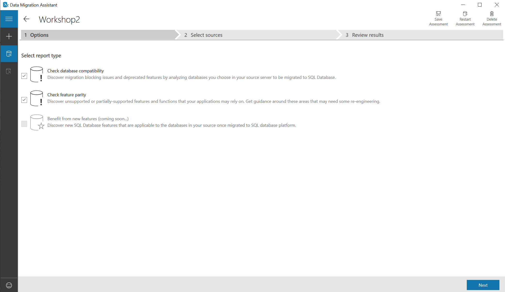                                                                                                          | As we saw previously DMA can test for both database compatibility and feature parity compliance against the chosen target. As before we will assess all the databases against all of the tests.                                                                                                                                                                                                                                                                                                                                                                                                                                                                                                 |
| Enter the source/legacy SQL details:<br> **Server Name:** **LEGACYSQL2012**<br> **Authentication Type:** **SQL Server Authentication**<br> **Username:** **_Will be provided during hack_**<br> **Password:** **_Will be provided during hack_**<br> **Untick "Encrypt connection"**<br> Click **'Connect'**                                                                                                                                                                                                                                                                                                                                                                                                                                                                                                                    |                                            | When performing this within your own subscription you will enter the host, authentication and connection types according to your company guidelines and practices. _Bear in mind that DMA needs to connect to a source SQL Server using an account that belongs to the sysadmin role._ As this document is produced within a workshop environment Active Directory, Certificates and encryption has not been setup.                                                                                                                                                                                                                                                                             |
| You should now see the screen on the right with the relevant TEAMXX databases listed. Select '**Start Assessment'**                                                                                                                                                                                                                                                                                                                                                                                                                                                                                                                                                                                                                                                                                                             |                                                                                                           | **Note**: DMA allows you to either 'Add' or 'Remove' additional data sources as needed at this point. Also note that DMA has identified what compatibility level each source database is running under.                                                                                                                                                                                                                                                                                                                                                                                                                                                                                         |
| As before DMA will now show the results from the assessment as the separate 2 reports. Note the '**SQL Server feature parity**' report will either be clean The '**Compatibility Issues**' report should be clear for all 3 databases showing that they can be migrated to Azure SQLDB Managed Instance without changes.                                                                                                                                                                                                                                                                                                                                                                                                                                                                                                        |                                                                                                           | Note: Toggle the parity and compatibility Issues radio button (top left) to see how DMA. 'SQL Server feature parity' shows what features are not supported in the target data source. Under 'Details' and 'Databases' you will find remedial action that are required and the databases impacted. 'Compatibility Issues' shows, over the compatibility tabs, issues that need to be addressed to permit the database(s) to run, in the chosen compatibility level (e.g. 160, 150,140, 130, 120, 110,100). If you have multiple databases, as with the example screenshot, you need to highlight **EACH** database to see the compatibility issues.                                              |

**We are now ready to migrate the application databases to Azure SQL Database Managed Instance**

# Migrate the application databases to Azure SQL Database managed instance using the Azure Data Studio (ADS) with migration extension and identify target Azure SQL SKU

In this section we will use the Azure Data Studio (ADS) to assess the applications database for suitability for migration to Azure Cloud.

| **Narrative**                                                                                                                                                                                                                                                                                                                                                                                                                                                                                                        | **Screenshot**                                                                                                                                                                                                                                                  | **Notes**                                                                                                                                                                                                                                                                                                                                                                                                                                                                                                                                                                                                                                   |
| :------------------------------------------------------------------------------------------------------------------------------------------------------------------------------------------------------------------------------------------------------------------------------------------------------------------------------------------------------------------------------------------------------------------------------------------------------------------------------------------------------------------- | :-------------------------------------------------------------------------------------------------------------------------------------------------------------------------------------------------------------------------------------------------------------- | :------------------------------------------------------------------------------------------------------------------------------------------------------------------------------------------------------------------------------------------------------------------------------------------------------------------------------------------------------------------------------------------------------------------------------------------------------------------------------------------------------------------------------------------------------------------------------------------------------------------------------------------ |
| We need to determine the suitability of the database(s) for migration to Azure. This includes checking for compatibility and feature support with Azure Database. You should already have an RDP (or Bastion) session open to your teams Win10 Management VM, if so run Azure Data Studio (ADS) from the Start menus or Desktop icon.                                                                                                                                                                                | 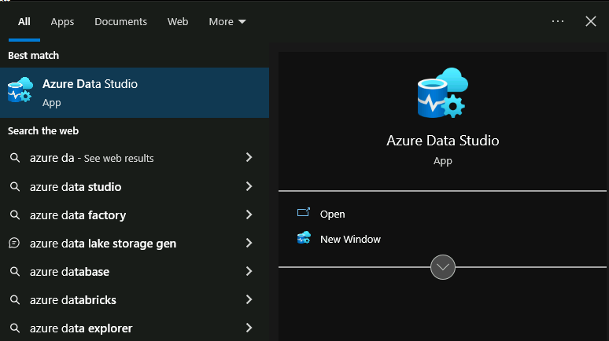                                                                                                                                                                                                             | Azure Data Studio (ADS) is a free download from Microsoft. It can be used to perform database administration as well as assess a number of database migration & upgrade scenarios not just SQL Server to Azure SQL Database. [Download and install Azure Data Studio](https://learn.microsoft.com/en-us/sql/azure-data-studio/download-azure-data-studio?view=sql-server-ver16&tabs=redhat-install%2Credhat-uninstall)                                                                                                                                                                                                                      |
| Select "extensions" icon on the bottom left ( or press : CTRL + Shift + X) and search for: "**Azure SQL migration**" in the extension market and click Install. (If extension is not compatible with the ADS version installed, upgrade ADS under Help \> Check for Updates).                                                                                                                                                                                                                                        | 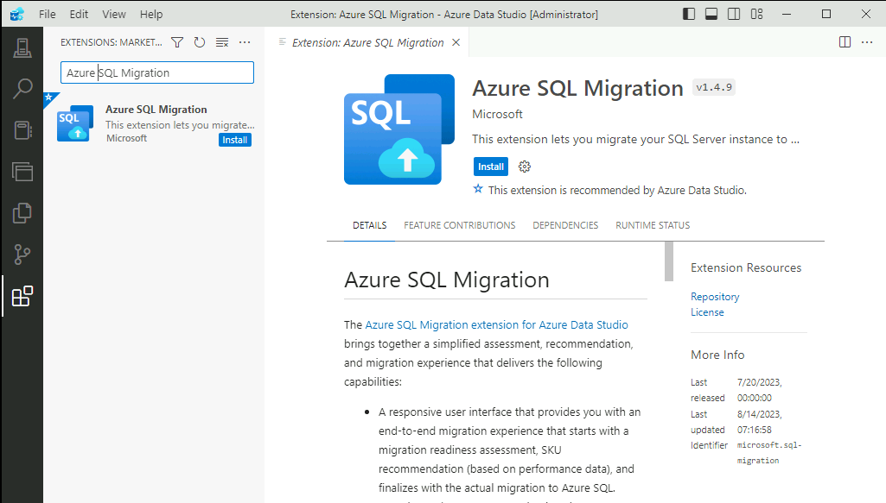                                                                                                                                                                                                             | See also: [Azure SQL migration extension for Azure Data Studio](https://learn.microsoft.com/en-us/sql/azure-data-studio/extensions/azure-sql-migration-extension?view=sql-server-ver16)                                                                                                                                                                                                                                                                                                                                                                                                                                                     |
| Open your browser and navigate to <https://portal.azure.com> Login in with the credential provided Select the Azure Storage Account "sqlhack…" in the Resource Group: "SQLHACK-SHARED" And click: Access Keys on the left.                                                                                                                                                                                                                                                                                           | 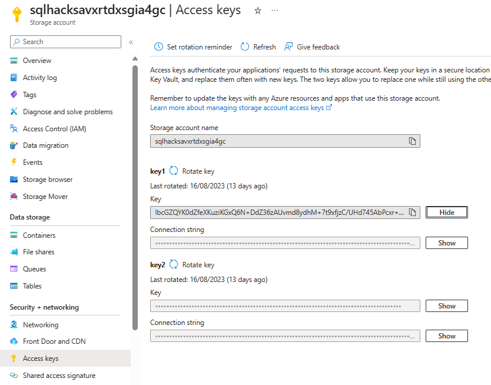                                                                                                                                                                                                             | You can note the Key to the notepad and reuse it in following steps.                                                                                                                                                                                                                                                                                                                                                                                                                                                                                                                                                                        |
| Create database backup in SSMS: Open SQL Server Management Studio (SSMS) on your Team VM.                                                                                                                                                                                                                                                                                                                                                                                                                            | 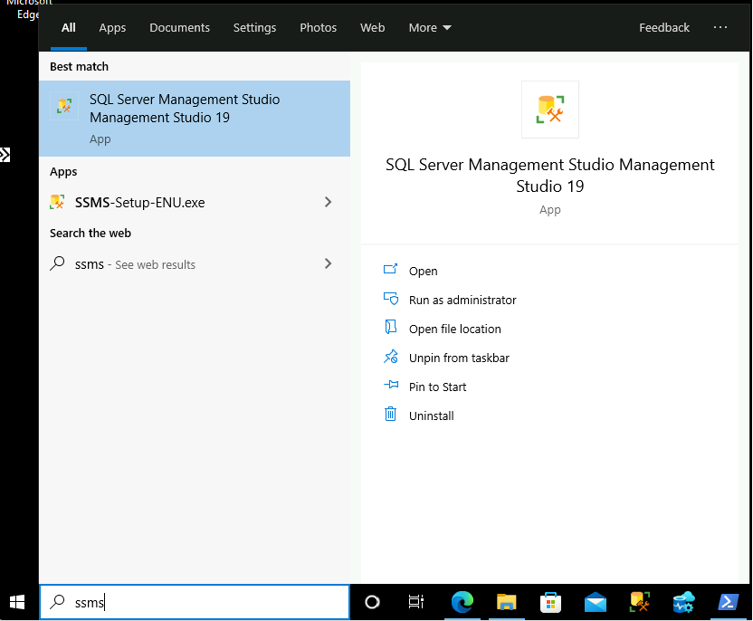                                                                                                                                                                                                             |                                                                                                                                                                                                                                                                                                                                                                                                                                                                                                                                                                                                                                             |
| In SSMS connect to: **legacysql2012**<br> Use the credentials:<br> **User**: **_Will be provided during hack_**<br> **Password**: **_Will be provided during hack_**                                                                                                                                                                                                                                                                                                                                                 | 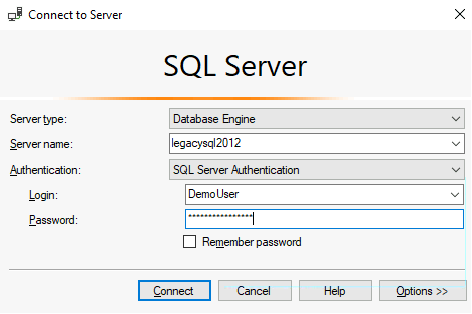                                                                                                                                                                                                             |                                                                                                                                                                                                                                                                                                                                                                                                                                                                                                                                                                                                                                             |
| **DO NOT EXECUTE THIS STEP** This is for reference only, as only a single credential is required! In SSMS open new query and create the credential using the following script: _USE [master]_ _GO_ _CREATE CREDENTIAL [Azurebackupstorage] WITH IDENTITY = '\<your storage account name\>'_ _,SECRET = '\<your storage account access key \>'_                                                                                                                                                                       | 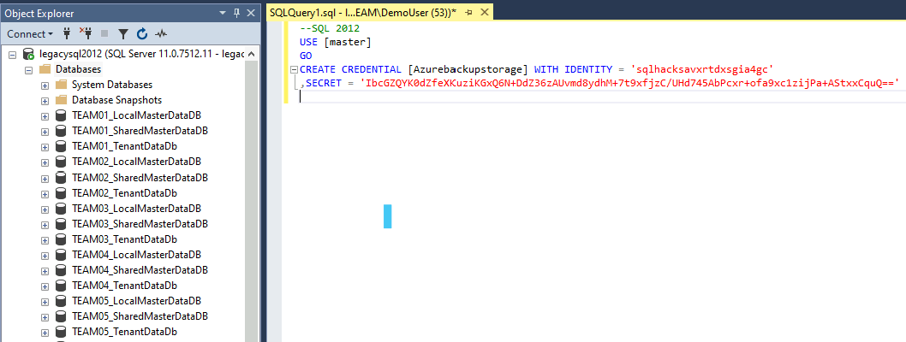                                                                                                                                                                                                             | _**This should be only done only by the trainer.**_                                                                                                                                                                                                                                                                                                                                                                                                                                                                                                                                                                                         |
| Backup your team databases: Select your 3 team databases and create a full back to URL for each database<br> **TEAMXX_TenantDataDB** **TEAMXX_LocalMasterDataDB**<br> **TEAMXX_SharedMasterDataDB**                                                                                                                                                                                                                                                                                                                  |                                                                                                                                                                                                              | This is the wizard experience in SSMS, you can also take backups using T-SQL scripts. There are some samples below, for this.                                                                                                                                                                                                                                                                                                                                                                                                                                                                                                               |
| Backup database: Select Backup to URL Select the credential "Azurebackupstorage" Make sure you enter the Azure container name as follows: **migration/team\<XX\>\_\<databasename\>** e.g. for team01 **migration\\team01_localmasterdatadb**. Repeat this process for the remaining 2 databases: **TEAMXX_LocalMasterDataDB** **TEAMXX_SharedMasterDataDB** Use SSMS like above or use TSQL commands in the right hand side.                                                                                         | 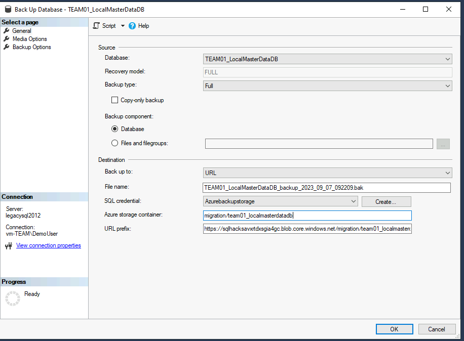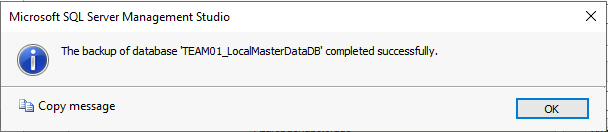                                                                                                                                                          | [**You can also directly use TSQL to BackUp your Databases**](#t-sql-backup-code)                                                                                                                                                                                                                                                                                                                                                                                                                                                                                                                                                           |
| Switch to Azure portal on your web browser. Review and check that the **full backup** exists in each folder in the Azure Storage account.                                                                                                                                                                                                                                                                                                                                                                            | __                                                                                                                                                                                                           |                                                                                                                                                                                                                                                                                                                                                                                                                                                                                                                                                                                                                                             |
| In Azure Data Studio on your Team VM Connect to legacy SQL Server 2012 using "**New Connection**"                                                                                                                                                                                                                                                                                                                                                                                                                    | 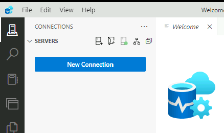                                                                                                                                                                                                             |                                                                                                                                                                                                                                                                                                                                                                                                                                                                                                                                                                                                                                             |
| Enter server name and credentials.<br> Connection string: legacysql2012<br> **User**: **_Will be provided during hack_**<br> **Password**: **_Will be provided during hack_**.<br> Click Connect                                                                                                                                                                                                                                                                                                                     | 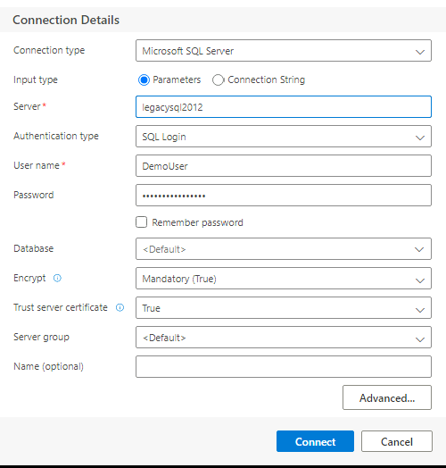                                                                                                                                                                                                             |                                                                                                                                                                                                                                                                                                                                                                                                                                                                                                                                                                                                                                             |
| Right Click on the SQL Server instance on the left hand side and select "**Manage**".                                                                                                                                                                                                                                                                                                                                                                                                                                | 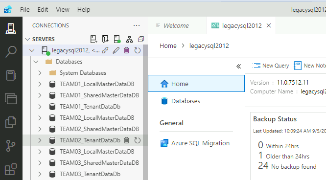                                                                                                                                                                                                             |                                                                                                                                                                                                                                                                                                                                                                                                                                                                                                                                                                                                                                             |
| Select Azure SQL migration and choose "**New migration**"                                                                                                                                                                                                                                                                                                                                                                                                                                                            |                                                                                                                                                                                                              |                                                                                                                                                                                                                                                                                                                                                                                                                                                                                                                                                                                                                                             |
| Select your team databases:<br> **TEAMXX_TenantDataDB**<br> **TEAMXX_LocalMasterDataDB**<br> **TEAMXX_SharedMasterDataDB**<br> Click Next                                                                                                                                                                                                                                                                                                                                                                            | 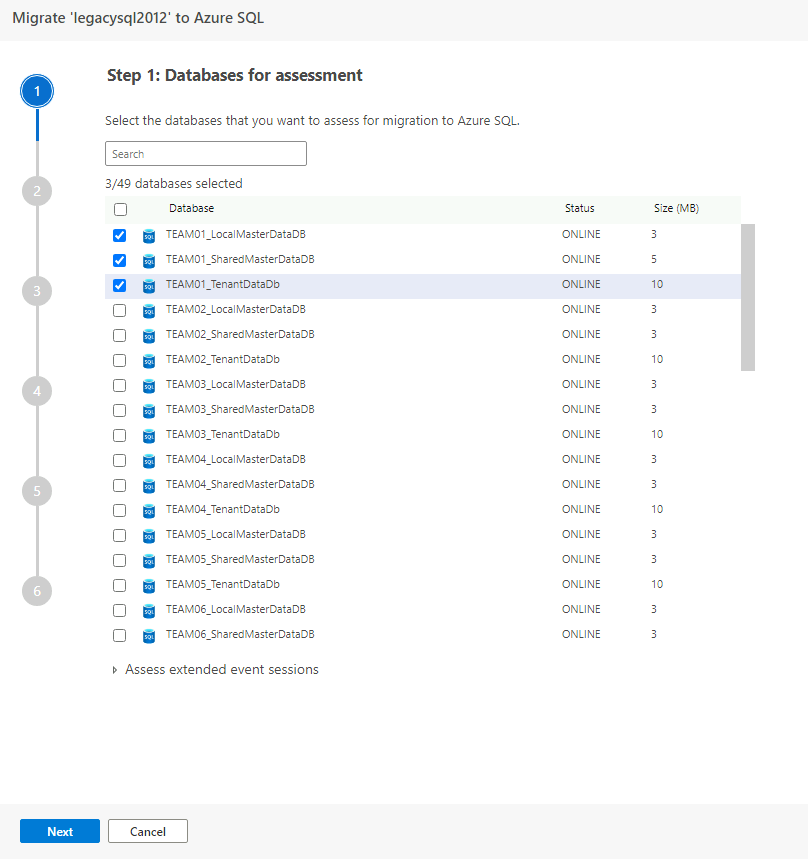                                                                                                                                                                                                             |                                                                                                                                                                                                                                                                                                                                                                                                                                                                                                                                                                                                                                             |
| Run assessment and receive recommendation Select Azure SQL target: **Azure SQL managed instance** Select "**Get Azure Recommendation**" Select the Log path: **C:\\Logs** and start the Performance Collection (If "C:\\Logs" folder doesn't exist, create this folder). You will see that data collection is in progress. Stop the performance collection **after \~10 min** by clicking on "Stop Data Collection" and review the recommended configuration which has now automatically appeared on the upper side. | 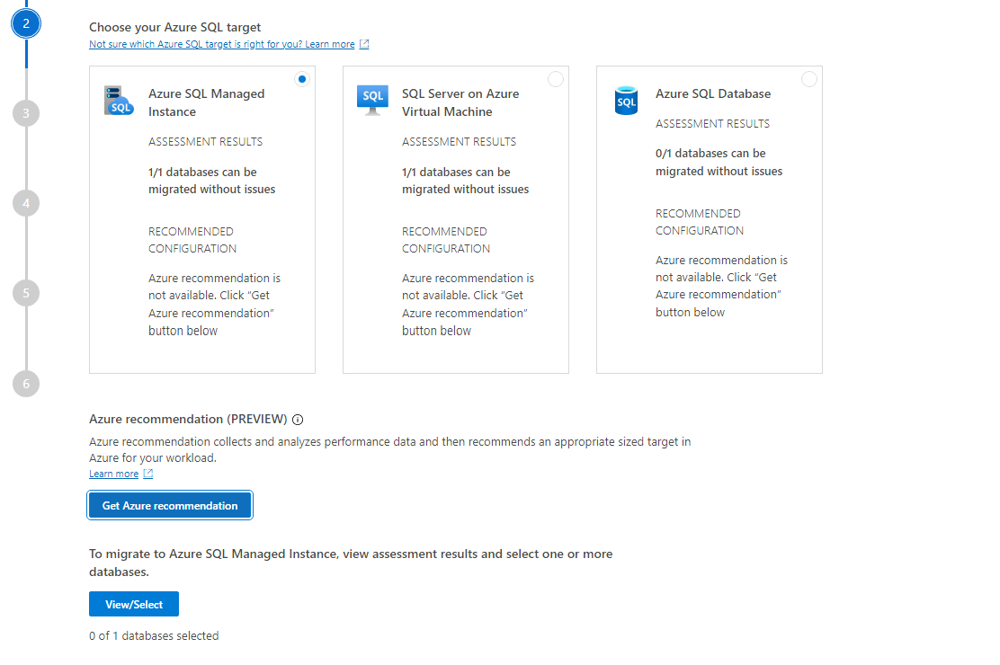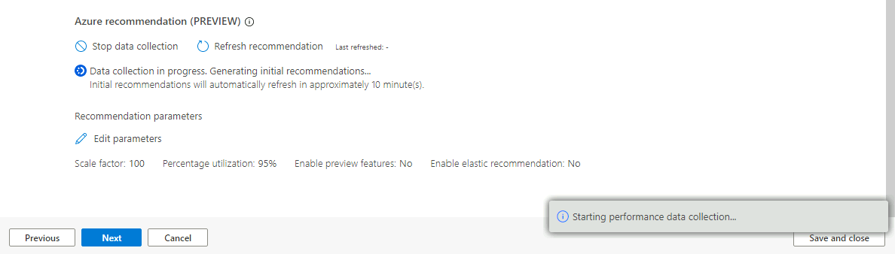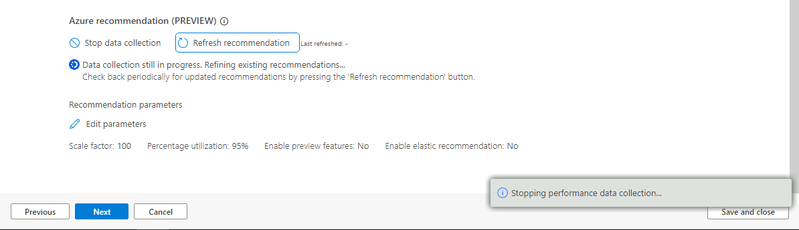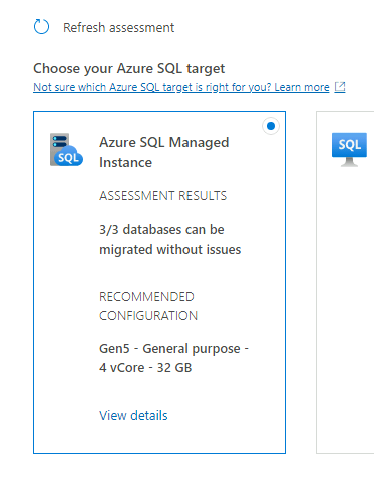 |                                                                                                                                                                                                                                                                                                                                                                                                                                                                                                                                                                                                                                             |
| Review the details of the recommended configuration in that you click on "View Details" under Azure SQL Managed Instance Tab.                                                                                                                                                                                                                                                                                                                                                                                        | 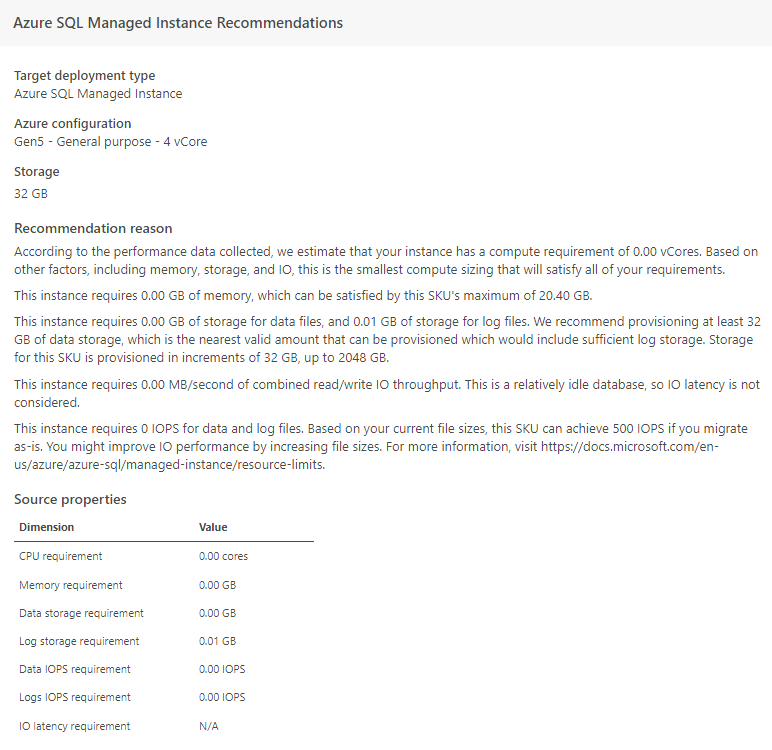                                                                                                                                                                                                             | Please note that you can also save the recommendation report                                                                                                                                                                                                                                                                                                                                                                                                                                                                                                                                                                                |
| Click on View/Select and select the 3 team databases for migration:<br> **TEAMXX_TenantDataDB**<br> **TEAMXX_LocalMasterDataDB**<br> **TEAMXX_SharedMasterDataDB**<br> Click Next                                                                                                                                                                                                                                                                                                                                    | 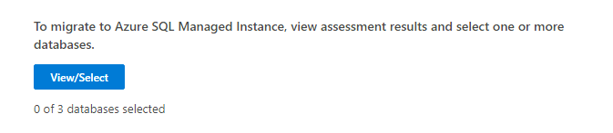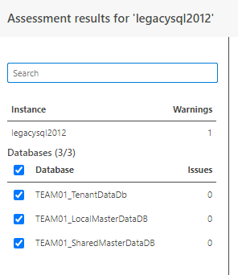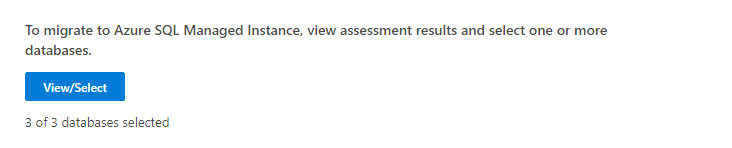                                                                                                       |                                                                                                                                                                                                                                                                                                                                                                                                                                                                                                                                                                                                                                             |
| Select Azure Target (SQL MI). For this, you need to add your account that you use to login to Azure Portal: sqlhackuser**XX**@M365x59576877.onmicrosoft.com \&sqlhack@demo\_**XX**!                                                                                                                                                                                                                                                                                                                                  | 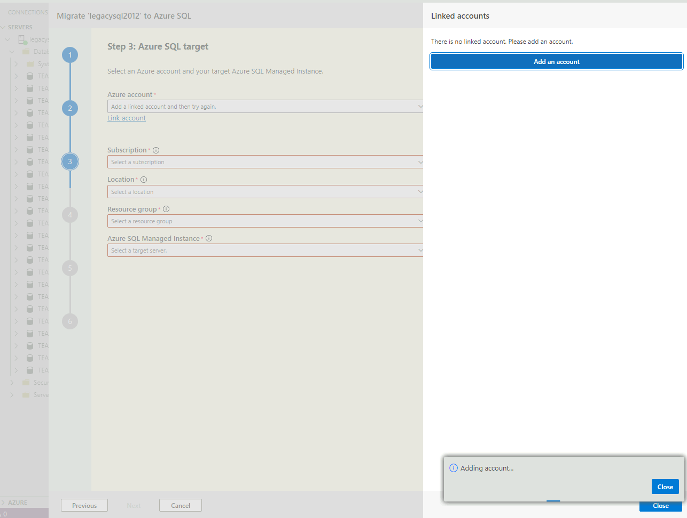                                                                                                                                                                                                             |                                                                                                                                                                                                                                                                                                                                                                                                                                                                                                                                                                                                                                             |
| Select the Azure subscription, the Location, Resource Group and Azure SQL MI FDQN Name which are automatically provided from your Account. Click Next.                                                                                                                                                                                                                                                                                                                                                               |                                                                                                                                                                                                              |                                                                                                                                                                                                                                                                                                                                                                                                                                                                                                                                                                                                                                             |
| Step 4: Select database migration service Select "**offline migration**" Select the existing Azure Database Migration Service: **sqlhack-dmsV2**                                                                                                                                                                                                                                                                                                                                                                     | 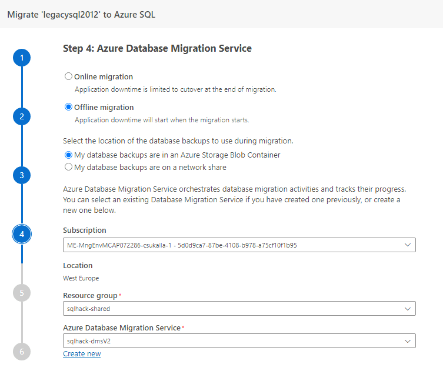                                                                                                                                                                                                             | You can also do an Online Migration for mission critical workloads using DMS. There are additional steps that you should take for this. Please use the information in the following tutorial for Online Migration:[Tutorial: Migrate SQL Server to Azure SQL Managed Instance online by using Azure Data Studio - Azure Database Migration Service \| Microsoft Learn](https://learn.microsoft.com/en-us/azure/dms/tutorial-sql-server-managed-instance-online-ads) (You can also create a new Database Migration Service within minutes of you do the exercise in your own subscription. For this you can click on "create new in Step 6") |
| In the data source configuration select the last full backup file and click Next                                                                                                                                                                                                                                                                                                                                                                                                                                     | 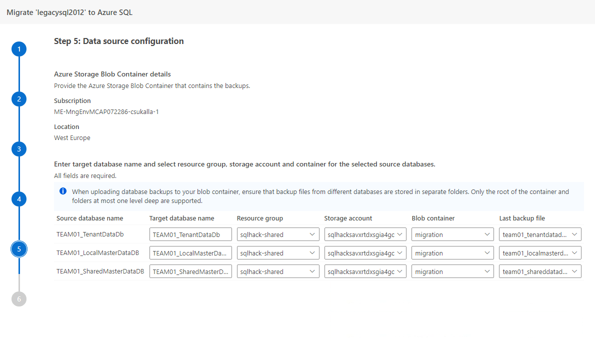                                                                                                                                                                                                             |                                                                                                                                                                                                                                                                                                                                                                                                                                                                                                                                                                                                                                             |
| Review summary and start migration.                                                                                                                                                                                                                                                                                                                                                                                                                                                                                  | 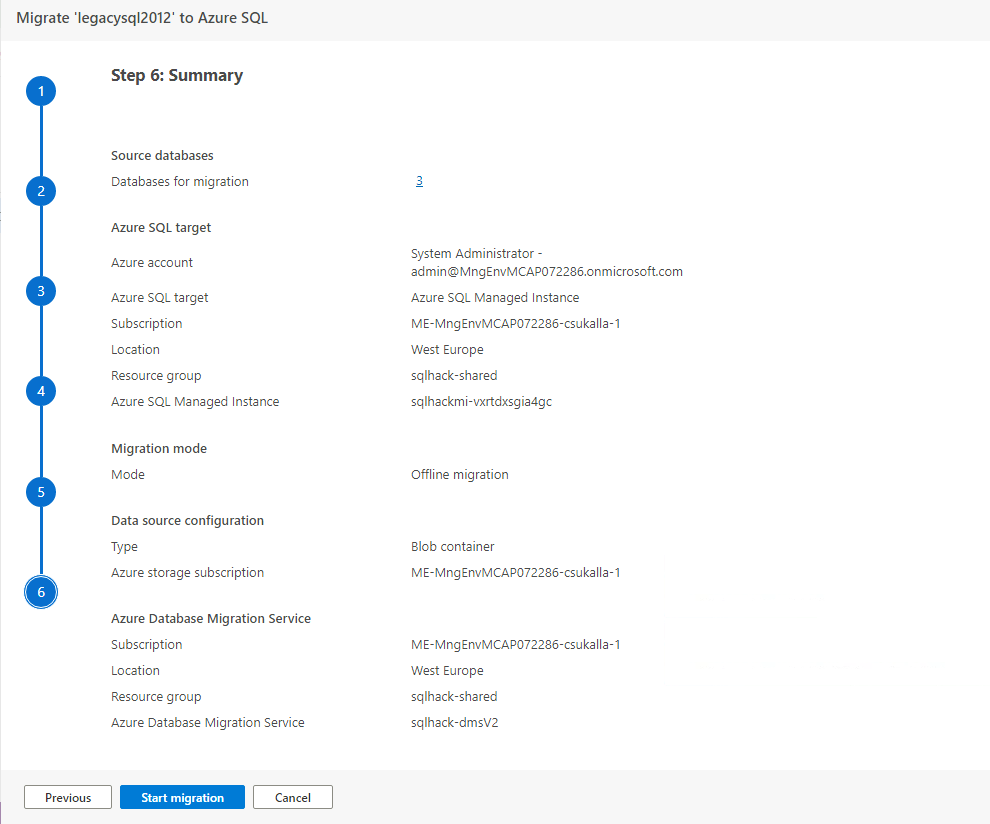                                                                                                                                                                                                             |                                                                                                                                                                                                                                                                                                                                                                                                                                                                                                                                                                                                                                             |
| Review progress in Azure Data Studio Click on Refresh from time to time to check the latest status of the migration until it succeeds.                                                                                                                                                                                                                                                                                                                                                                               | 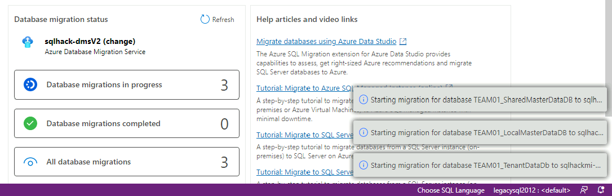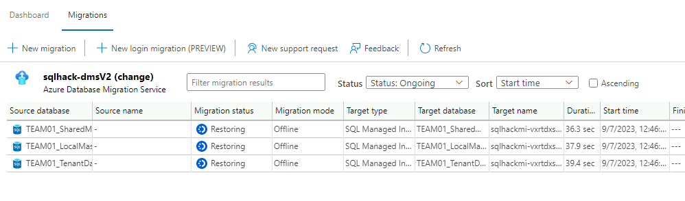                                                                                                       |                                                                                                                                                                                                                                                                                                                                                                                                                                                                                                                                                                                                                                             |

# Confirm application databases have been migrated to Azure SQL Managed Instance

# Annotations

### T-SQL Backup Code

```SQL
BACKUP DATABASE [TEAM01_LocalMasterDataDB]
TO URL = N'https://<storageaccount>].blob.core.windows.net/migration/team01_localmasterdatadb/TEAM01_LocalMasterDataDB.bak'
WITH CREDENTIAL = N'Azurebackupstorage',
NOFORMAT, NOINIT,
NAME = N'TEAM01_LocalMasterDataDB-Full Database Backup',
NOSKIP, NOREWIND, NOUNLOAD, STATS = 10
GO

BACKUP DATABASE [TEAM01_SharedMasterDataDB]
TO URL = N'https://<storageaccount>.blob.core.windows.net/migration/team01_shareddatadb/TEAM01_SharedMasterDataDB.bak'
WITH CREDENTIAL = N'Azurebackupstorage',
NOFORMAT, NOINIT,
NAME = N'TEAM01_SharedMasterDataDB-Full Database Backup',
NOSKIP, NOREWIND, NOUNLOAD, STATS = 10
GO

BACKUP DATABASE [TEAM01_TenantDataDB] TO URL = N'https://<storageaccount>.blob.core.windows.net/migration/team01_tenantdatadb/TEAM01_TenantDataDB.bak'
WITH CREDENTIAL = N'Azurebackupstorage',
NOFORMAT, NOINIT,
NAME = N'TEAM01_TenantDataDB-Full Database Backup',
NOSKIP, NOREWIND, NOUNLOAD, STATS = 10
GO
```
