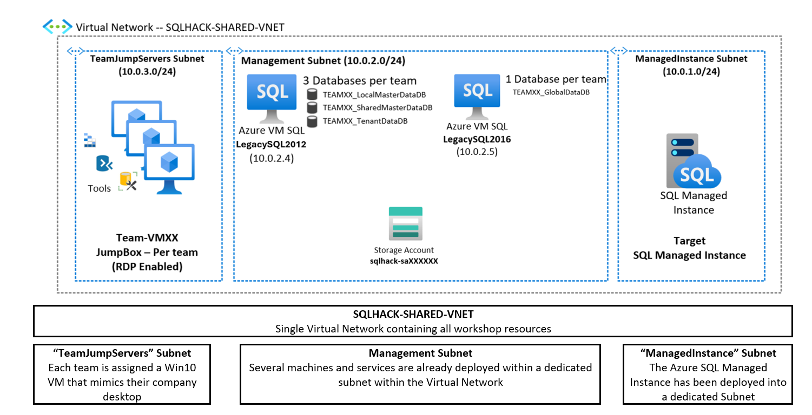
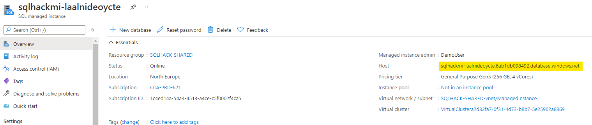
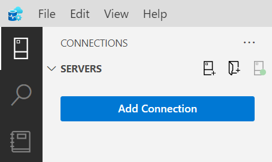
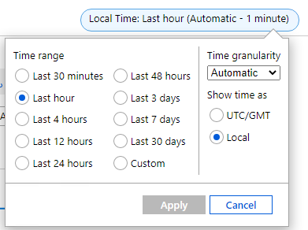
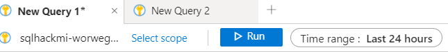
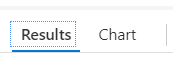
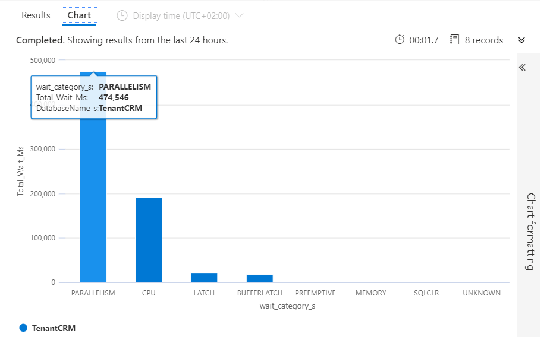

# MicroHack challenge 2

## Monitoring and Performance on Azure SQL Managed Instance

### Contents

[Migration architecture and Azure components](#migration-architecture-and-azure-components)

[Lab Overview & Background](#lab-overview--background)

[LAB 1: Identifying performance issues, their root causes and fixing the problem](#lab-1-identifying-performance-issues-their-root-causes-and-fixing-the-problem)

[1. Using DMVs and the Query Store to identify performance bottlenecks.](#using-dmvs-and-the-query-store-to-identify-performance-bottlenecks)

[2. Using the Azure Portal to identify performance bottlenecks](#using-the-azure-portal-to-identify-performance-bottlenecks)

[3. Using Log Analytics with KQL to visualize SQL MI and Database Stats](#using-log-analytics-with-kql-to-visualize-sql-mi-and-database-stats)

# Migration architecture and Azure components

# Lab Overview & Background

In this exercise you will explore how you can monitor and diagnose performance issues with Azure SQL Database Managed Instance using SQL Server Management Studio, DMVs (Dynamic Management Views) and Azure Portal tools.

## Background

We have seen that the legacy application is a multi-tenant system with a collection of 3 databases supporting the transactional workload for each customer – these are the 3 databases we have modernised by migrating to the shared Azure SQL Managed Instance.

Apart from the tenant centric transactional databases there are 2 shared databases:

-**2008DW**: A centralised Data Warehouse database that combines data from the various tenant transactional databases and is used for aggregated reporting and analytics.
-**TenantCRM**: A centralised database that is used to manage all customer relationships and order processing.

Recently you have heard complaints from users that the TenantCRM system is running slowly. Recently changes were made to some of the stored procedures in the TenantCRM database and the App dev team believe these are the source of the problem. They’ve asked for your help to track down the performance issues and its root cause.

Let’s follow the steps below to begin to troubleshoot this issue.

> **Note:** The exercises in this lab are conducted against the shared **TenantCRM** database.

# LAB 1: Identifying performance issues, their root causes and fixing the problem

## Using DMVs and the Query Store to identify performance bottlenecks.

Performance issues in SQL Server can be grouped into 1 of 2 high-level categories: *Running* or *Waiting*.

Running means a query has been allocated CPU resource and is actively processing but is taking a long time to complete. Waiting means a query is not actively being processed by the CPU but is waiting on another resource (such as memory, disk, network, etc) to pass data in so processing can continue.

Finding the bottleneck will help us determine what category issue we have so we can progress to identifying the root cause. Let’s see how to find the bottleneck using both SSMS and the Azure portal.

|**Narrative/Instructions**| **Screenshot**| **Notes**|
|:------------|:--------------|:---------|
|On your Win10 Team VM open the Azure Portal and navigate to the shared SQL Managed Instance.  Scroll down the Overview screen copy the host name of the Managed Instance and save it somewhere handy.| ****||
|On your Team Win10 VM open **Azure Data Studio** and **Add Connection** using these details:   **Server:** \<just copied\>  **Authentication: SQL Login** **Login:** **_Will be provided during hack_**  **Password:**  **_Will be provided during hack_**| **** **** ||
|**Open** the SQL script:  C:\\_SQLHACK_\\LABS\\02-Administering_Monitoring\\Part_01_Monitoring_Lab_1.sql          **Note:** Make sure you connect with the **TenantCRM** database.          Run the **PART 1** QUERY 1.  Look at the results and note the [avg_cpu_percent] value is about 70% indicating that this database is consuming a lot of the hosts CPU resources|| [[sys].[dm_db_resource_stats]](https://docs.microsoft.com/en-us/sql/relational-databases/system-dynamic-management-views/sys-dm-db-resource-stats-azure-sql-database?view=azuresqldb-current) exposes a number of key database performance metrics.  One metric every 15 seconds over the last hour.|
|Now let’s try the second query to graphically visualize the resource consumption.     **Execute** QUERY 2 and on the results, activate the **Chart view**On the RightSettings | | If more than 1 hour of statistics is needed, use the DMV [[sys].[server_resource_stats]](https://docs.microsoft.com/en-us/sql/relational-databases/system-catalog-views/sys-server-resource-stats-azure-sql-database?view=azuresqldb-current) up to 14 days|
|**Open** SQL Server Management Studio using the same details:  **Server name:** SQL MI  **Authentication: SQL Server**     **Login:**  **_Will be provided during hack_**  **Password:** **_Will be provided during hack_**| ****||
|**Open** the SQL script:  C:\\_SQLHACK_\\LABS\\02-Administering_Monitoring\\Part_02_Monitoring_Lab_1.sql          **Note:** Make sure you connect with the **TenantCRM** database.          **Run** the **PART 2** QUERY 1.  Identify the most consuming stored procedure based on the total_worker_time (CPU)|||
|Then to have further details on the most consuming stored procedure **Run** the **PART 2** QUERY 2, replace the filter clause with the stored procedure name. What is the issue? How to optimise?  **Tip:** Have a look to the execution plan| **CROSS APPLY and Table-valued Functions**  The PART 2 query joins the [sys].[dm_exec_requests] and [sys].[dm_exec_sql_text] DMVs to obtain long running batches and critically their offending SQL.  Note that [dm_exec_sql_text] is actually a table-valued function (TVF) hence the use of the CROSS APPLY as TVFs can't be used in a normal join operation. The CROSS APPLY therefore produces the required inner-join between [dm_exec_requests] and [dm_exec_sql_text].  See APPLY documentation here: [Using APPLY \| Microsoft Docs](https://docs.microsoft.com/en-us/previous-versions/sql/sql-server-2008-r2/ms175156(v=sql.105)?redirectedfrom=MSDN) and this excellent explanation on MSSQLTips: [SQL Server CROSS APPLY and OUTER APPLY (mssqltips.com)](https://www.mssqltips.com/sqlservertip/1958/sql-server-cross-apply-and-outer-apply/#:~:text=The%20CROSS%20APPLY%20operator%20returns%20only%20those%20rows,rows%20for%20the%20left%20table%20expression%20match%20only.)||
| In SSMS expand the [TenantCRM] database then expand Query Store.Remember that the Query Store collects telemetry data every 15 seconds and persists it for about 1hr.  Double click on **Overall Resource Consumption** report to open it.| ||
| For further details CPU Time, double click on the current day bar| |
| You can identify the top CPU consuming queries.  Click on bars for more details|  ||

## Using the Azure Portal to identify performance bottlenecks

As we are using Azure SQL Managed Instance we can also use the richness of the Azure Portal to help us to troubleshoot performance issues. Let us see how this is done.

|**Narrative/Instructions**| **Screenshot**| **Notes**|
|:------------|:--------------|:---------|
| Open the Azure Portal (portal.azure.com) and open the shared SQL Managed Instance.  Scroll down the **Overview** screen until you see the performance graph showing CPU utilization.  Toggle the switches next to view CPU consumption over 1 hour, 24 hours and 7 days.   Has the CPU usage pattern changed over time?     |  |           |
| Click into the graph to go into Metrics chart screen. Here you have more flexibility over the data being reported and the format of the chart. Let’s add Storage Space Used the chart.   Click **Add Metric**   In the Metric drop down select **Storage Space Used**.  .  |  | Notice that from the chart screen you can alter the type of chart (Line, Area, Bar, Scatter to data Grid), set up alerts, and pin the chart to your Azure Portal dashboard. |
| Click **Local Time** on the top right of the chart to view the data for various time intervals.|||

## Using Log Analytics with KQL to visualize SQL MI and Database Stats

Now that we can use the global monitoring tool Log Analytics to identify which SQL Managed Instance .

|**Narrative/Instructions**| **Screenshot**| **Notes**|
|:------------|:--------------|:---------|
| On the Azure Portal, on the SQL Managed Instance Resource, **click on Logs** on the left Menu. You will find several query templates You can test the **CPU utilization threshold template** And modify the parameters if needed.|||
||****||
| Create a new Query| ||
|You can try the following queries. AzureDiagnostics is the table receiving the different diagnostics. Modify the Time Range, By default 24hours     |//general queries   // query 1 without filter  AzureDiagnostics    // query 2 SQL MI Resource usage   AzureDiagnostics  \| where Resource == "SQLHACKMI-WORWEGR7VULCU" //replace with your SQL MI Instance Name  \| where Category == "ResourceUsageStats"    // query 3 on database: waits Stats   AzureDiagnostics  \| where Resource == "TENANTCRM"  \| where Category == "QueryStoreWaitStatistics"    // query 4 on database: errors  AzureDiagnostics  \| where Resource == "TENANTCRM"  \| where Category == "Errors"|  Language Reference  [SQL to Kusto query translation](https://docs.microsoft.com/en-us/azure/data-explorer/kusto/query/sqlcheatsheet) |
|On the results for each of the queries, change the to **Chart**    The chart Formatting is on the right.| // more specific queries   //Query get CPU usage   AzureDiagnostics  \| where Resource == "SQLHACKMI-WORWEGR7VULCU" and TimeGenerated \> ago(2h) //replace with your SQL MI Instance Name  \| where Category == "ResourceUsageStats"  \| project TimeGenerated, todecimal(avg_cpu_percent_s)  // visualize the resulset as a chart    // Query get database Waits Stats  AzureDiagnostics  \| where Category == "QueryStoreWaitStatistics"  \| summarize Total_Wait_Ms = max(todouble(total_query_wait_time_ms_d)) by wait_category_s, DatabaseName_s  \| order by Total_Wait_Ms desc     // visualize the resulset as a chart  ||

We’ve now seen how the various performance monitoring and diagnosis tools – the Azure Portal, DMVs and the Query Store reports all revealed that the CPU was under pressure. The DMVs and Query Store reports also allowed us to drill-down to root cause and identify the worst offending query. In the real world you would now progress to tune the offending query to reduce the overall load on the Managed Instances CPUs and thereby improve the databases and environment performance.
