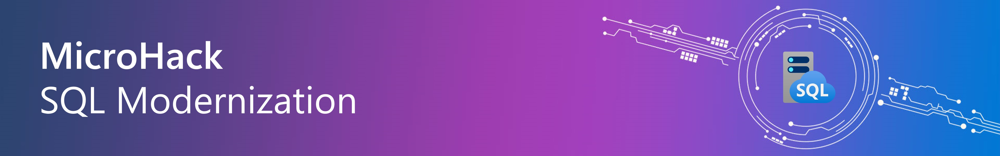

# MicroHack - SQL modernization 

- [**MicroHack introduction**](#MicroHack-introduction)
- [**MicroHack context**](#microhack-context)
- [**Objectives**](#objectives)
- [**MicroHack Challenges**](#microhack-challenges)
- [**Contributors**](#contributors)

# MicroHack introduction

This MicroHack scenario walks through the use of database migration with a focus on the best practices and the design principles. Specifically, this builds up to include working with an existing infrastructure.

This MicroHack will enhance your understanding of SQL modernization and migration paths, including how to assess and migrate SQL Server databases to Azure SQL, administer and monitor Azure SQL Managed Instance, and ensure the security of Azure SQL Managed Instance services. Specifically, to bring Azure SQL family closer to the participants, making the value of platform services more concrete and understandable through hands-on labs and presentations.

# MicroHack context
This MicroHack scenario walks through modernizing SQL Server workloads to Azure, with a focus on hands-on practice and understanding the benefits of migrating to Azure, such as cost optimization, increased flexibility and scalability, improved security and compliance, and simplified management and monitoring.

# Objectives

After completing this MicroHack you will be able to:

* Implement a proof-of-concept (PoC) for migrating an on-premises SQL Server 2012 or SQL Server 2016 database into Azure SQL Database Managed Instance  (SQL MI)  
* Perform assessments to reveal any feature parity and compatibility issues between the on-premises SQL Server database and the managed database offerings in Azure   
* Migrate the on-premises databases into Azure, using Azure migration services  
* Enable some of the advanced SQL features available in SQL MI to improve security and performance in your customer's application  
* Understand how to to implement a cloud migration solution for business-critical applications and databases  

# MicroHack challenges

## General prerequisites

This MicroHack has a few but important prerequisites

* Basic Azure knowledge [(Azure fundamentals)](https://learn.microsoft.com/en-us/training/paths/azure-fundamentals-describe-azure-architecture-services/)  
* Basic database knowledge  
* Microsoft Teams Desktop Sharing should be allowed to collaborate with other participants (only for remote deliveries)  

## Challenges

* [Challenge 1 - Assessment and migration with Azure Data Studio](challenges/challenge-01.md)  **<- Start here**
* [Challenge 2 - Monitoring and Performance on Azure SQL Managed Instance](challenges/challenge-02.md)
* [Challenge 3 - Security on Azure SQL Managed Instance](challenges/challenge-03.md)

## Solutions - Spoilerwarning

* [Solution 1 - Assessment and migration with Azure Data Studio](./walkthrough/challenge-01/solution-01.md)
* [Solution 2 - Monitoring and Performance on Azure SQL Managed Instance](./walkthrough/challenge-02/solution-02.md)
* [Solution 3 - Security on Azure SQL Managed Instance](./walkthrough/challenge-03/solution-03.md)

## Contributors
* Cornel Sukalla [LinkedIn](https://www.linkedin.com/in/cornelsukalla/)
* Mert Següner [LinkedIn](https://www.linkedin.com/in/mertsenguner/)
* Sean Cowburn [LinkedIn](https://www.linkedin.com/in/sean-cowburn/)
