# MicroHack

## Security on Azure SQL Managed Instance

### Table of Contents

[1. Introduction](#introduction)

[2 Azure SQL Database & Team VM Login Details](#azure-sql-database--team-vm-login-details)

[3 LAB 1: Data Discovery & Classification](#lab-1-data-discovery--classification)

[Data Discovery & Classification](#data-discovery--classification)

[Viewing Data Classification Recommendations](#viewing-data-classification-recommendations)

[**4.** **LAB 2 Part 1: Azure Defender for SQL – Vulnerability Assessment**](#lab-2-part-1-azure-defender-for-sql--vulnerability-assessment)

[Vulnerability Assessment](#vulnerability-assessment)

[**5.** **LAB 2 Part 2: Azure Defender for SQL – Advanced Threat Protection**](#lab-2-part-2-azure-defender-for-sql--advanced-threat-protection)

[Advanced Threat Protection](#advanced-threat-protection)

# 

# **Introduction**

This hands-on lab will introduces you to the layered security model available when running databases in Azure. The activities within this hands-on lab will progress from the outer security layers that protect the perimeter of Azure SQL through to the inner layers that protect the information contained within the data.

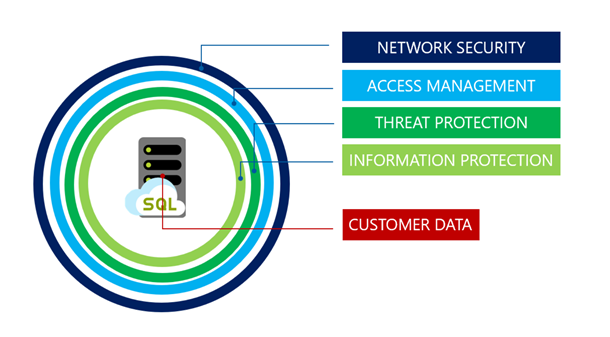

Because SQL Managed Instance always runs in a private network the Network Security layer has already been implemented at the vNet level. Equally we have already defined and implemented Azure AD and SQL Server logins, roles and permissions so the Access Management tier has also been pre-built.

So this lab will focus on the Threat Protection, Information Protection and Customer Data layers of the security model and how these are implement in Azure SQL Managed Instance through:

-   Using Data Discovery & Classification
-   Azure Defender for SQL
    -   Vulnerability Assessment
    -   Advanced Threat Protection

# **Azure SQL Database & Team VM Login Details**

All the labs run against the **TEAMXX_TenantDataDb** that you migrated earlier using either SQL Server Management Studio or the Azure Portal.

Your Win10 VM (vm-TEAMXX) login credentials are also a member of SQL Server sysadmin role.

**Username:** _Will be provided during hack_
**Password:** _Will be provided during hack_

The Azure Portal credentials are those that your proctor will supply.

# **LAB 1: Data Discovery & Classification**

## Data Discovery & Classification

Data Discovery & Classification is a built-in capability for discovering, classifying, labelling and protecting sensitive data in databases. It can be used to support many use cases including financial, healthcare, personally identifiable (PII) data and help meet data privacy standards and regulatory compliance.

More information on Data Discovery & Classification can be found in the [official documentation](https://docs.microsoft.com/en-us/azure/azure-sql/database/data-discovery-and-classification-overview).

## Viewing Data Classification Recommendations

Whenever a database is deployed or schema changes are made to an existing database, the Data Discovery & Classification engine automatically performs a scan to identify columns that may potentially contain sensitive data.

|**Narrative**| **Screenshot/Code**| 
|:------------|:--------------|
|Within the Azure Portal navigate to the shared Azure SQL Managed Instance screen. Scroll down to the list of databases and click on your teams **TEAMXX_TenantDataDb** database.|
|On the blade on the left, under the **Security** section click “**Data Discovery & Classification**”|
|The Data Discovery and Classification **Overview** shows that no data classifications have been made but based on the automatic classification scan there are a number of potential data classification recommendations as shown at the top of the report:  Click the blue information bar (highlighted in yellow) to view the data classification recommendations|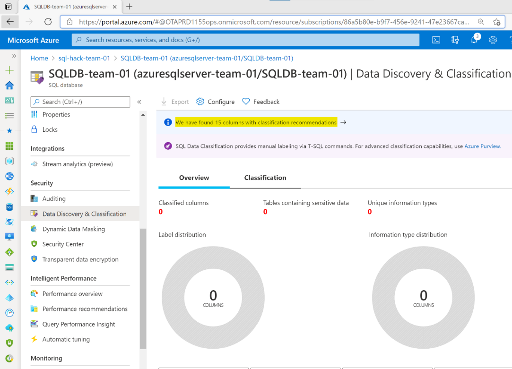|
| The recommendations show the name of the schema, table and column with intelligent information type classification and sensitivity recommendations.  As can be seen the **Customer** table in the **SalesLT** schema contains the columns **FirstName** and **LastName**. The initial data classification scan has identified that the **Information type** of these columns from a data classification perspective is **Name** and the **Sensitivity Label** for these columns is recommended to be **Confidential – GDPR**.|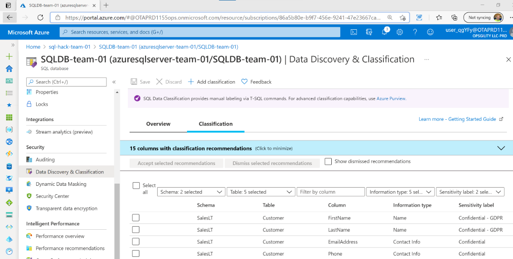|
|Select the **FirstName** and **LastName** classification recommendations by selecting the recommendation rows, click **Accept selected recommendations** and then click **Save**.  Click the **Overview** tab on the Data Discovery & Classification report to look at the saved data classifications.   There are now two columns classified from the Customer table with the information type of **Name** and the sensitivity label **Confidential – GDPR**.| 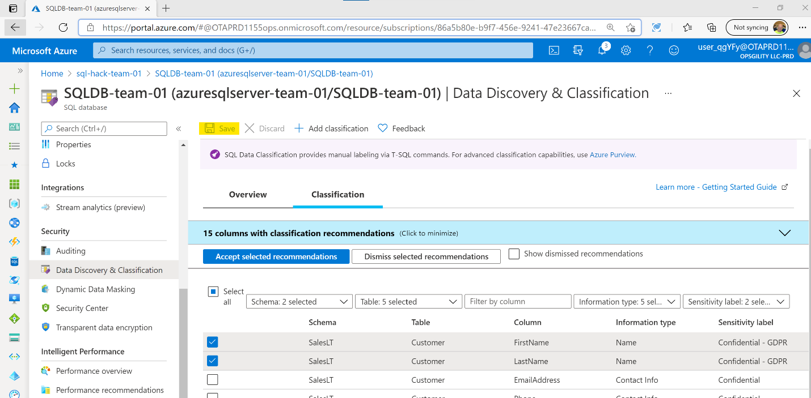|
|  Now let’s add a custom data classification which is not based on the auto recommendations.   Switch back to the **Classification** tab at the top of the report click “**+ Add classification**”.| 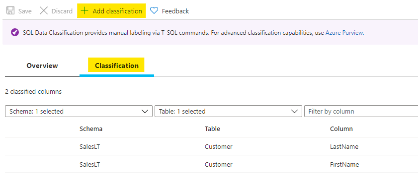|
|On the **Add Classification** blade on the far right of the screen set the following values and then click **Add Classification** and then **Save** to save your new classification. Click the **Overview** tab to look at the saved data classifications.     **Schema name**: 	SalesLT   **Table name**: 	Product   **Column name**: 	ListPrice   **Information type**: 	Financial   **Sensitivity Label**: 	Highly Confidential     **Click:** 	Add Classification  **Click:** 	Save |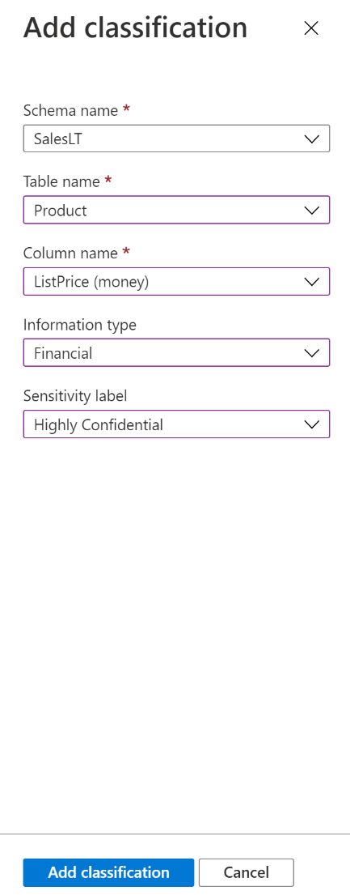|
|Open SQL Server Management Studio, connect to the shared SQL Managed Instance and open a new TSQL query window connected to your **TEAMXX_TenantDataDb** database     Run the SELECT statements opposite against your **TEAMXX_TenantDataDb** database.|\-- 1 Data Discovery & Classification   SELECT   c.FirstName  ,c.LastName  ,c.\*  FROM SalesLT.Customer c;  SELECT  p.ListPrice   FROM SalesLT.Product p;|
|Nothing out of the ordinary happens - two simple result sets should be returned containing the FirstName, LastName and ListPrice columns.||

**REMEMBER: Data Discovery and Classification is not a security mechanism – it’s a data tagging and management tool.**

# **LAB 2 Part 1: Azure Defender for SQL – Vulnerability Assessment**

When provisioning an Azure SQL Managed Instance or an Azure SQL Database logical server there is the option to enable the security feature Azure Defender for SQL.

This security feature offers two security components:

- Vulnerability Assessments
- Advanced Threat Protection

This first part of the lab will focus on Vulnerability Assessments, Part 2 will deal with Advanced Threat Protection.

## Vulnerability Assessment

A Vulnerability Assessment is an output position (or report) from a vulnerability scan.

A Vulnerability Assessment scan is the application of SQL Server best practices based on a rules engine, the goal being to improve the security posture of your Azure SQL Managed Instance or Azure SQL Database. The first scan will produce the initial vulnerability scan baseline. The first scan happens automatically once a database is deployed.

More details on Azure SQL vulnerability assessments can be found in the [official documentation](https://docs.microsoft.com/en-us/azure/azure-sql/database/sql-vulnerability-assessment).

|**Narrative**| **Screenshot/Code**| 
|:------------|:--------------|
|In the Azure portal navigate to the shared SQL Managed Instance.||
|Scroll down the Overview screen until you see the list of databases and click on your **TEAMXX_TenantDataDB** database.||
|In the **TEAMXX_TenantDataDB** database screen. On the left hand blade click **Microsoft Defender for Cloud** in the Security section    Scroll down the screen to the bottom and click the “**View additional findings in Vulnerability Assessment**” link| ****|
|The “Vulnerability Assessment” page can be used to run a scan, view scan history and will show the number of checks that have been passed and failed for the last scan with failed checks listed in the table below.   Run a scan if prompted to do so which should only take a few minutes.|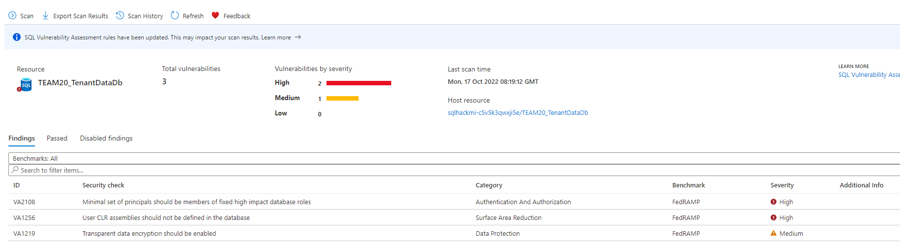|
|Review the lists of passed and failed checks. Notice that the report is specific to database you ran the scan for but does also include events against the system database and therefore flag server configuration issues.||
|In the **Findings** tab, which lists the failed checks, click on finding:| **ID:**VA1256   **Security Check:** User CLR assemblies should not be defined in the database |
|Note the detailed report lists the rule’s details, the offending CLRs and a remediation script to remove them.   However, because these 2 CLRs are an integral part of our migrated legacy application we need to keep them. But equally we don’t want them to be continuously flagged as an issue in the Vulnerability Assessment reports. To do this we can add exceptions to the Vulnerability Assessment’s “baseline” position.| **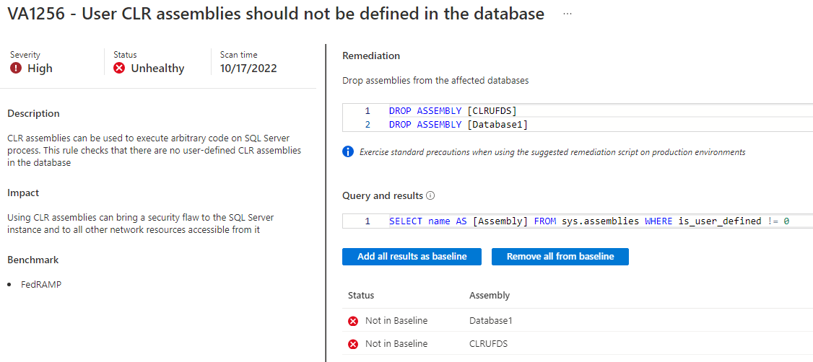**|
|On the details page for V1256 click **Add all results as baseline** and select **Yes** in the Set base line message. Adding the results as the baseline will update the Vulnerability Assessment rules engine to accept the current CLR Assemblies as allowable and set a new baseline position for the rule.     Notice, in the upper side of the details page for 1256, a warning saying There are pending baseline changes. Run a new scan to see updated results.|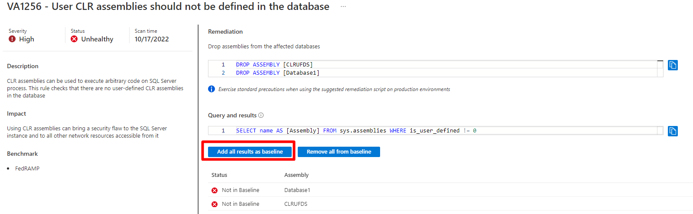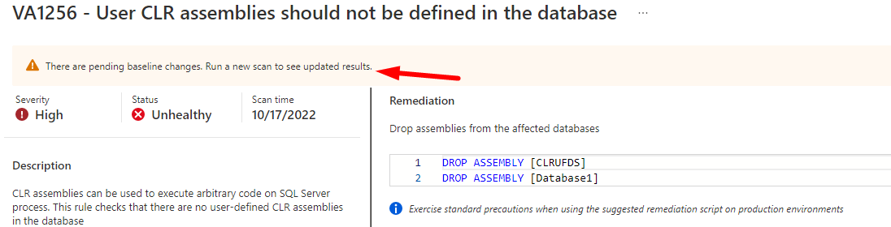|
|Close the details page for 1256 to get back to the Assessment summary page and notice the same warning|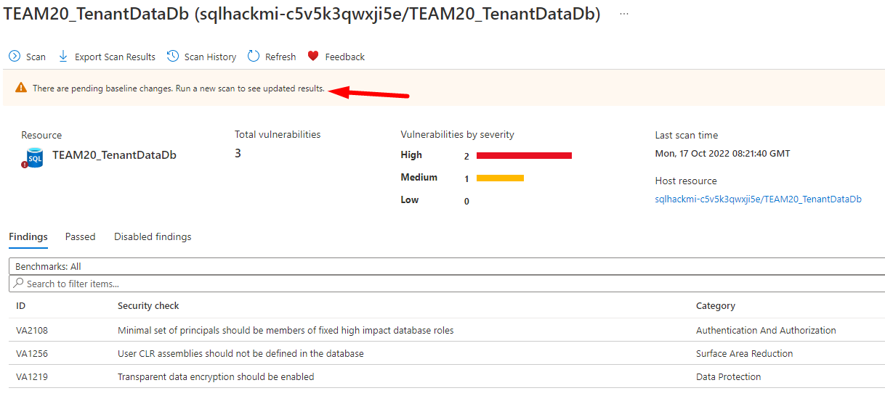|
|Click the **Scan** button to run a manual scan which will take a about a minute. Once the scan completes the finding VA1256 will be removed from the Findings list.  When making changes to a Vulnerability Assessment baseline it may be necessary for compliance reasons to export a Scan Findings report to show the security posture of the Azure SQL Database in relation to the amended baseline.    To export the results of a scan to reflect the current baseline click “**Export Scan Results**” at the top of the portal screen:  **NOTE: Excel is \*not\* installed on your lab VMs** *so you will have to copy the report to your own desktop to have a look at it.*|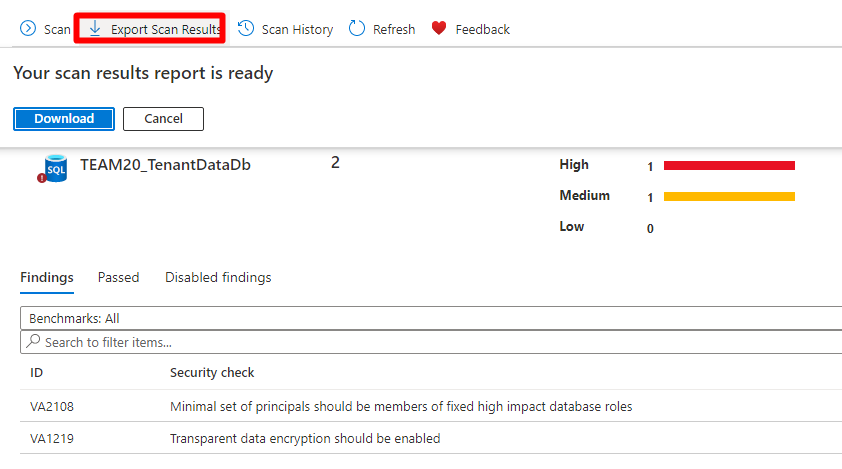|

# **LAB 2 Part 2: Azure Defender for SQL – Advanced Threat Protection**

The other security component of Azure Defender for SQL is Advanced Threat Protection.

Advanced Threat Protection provides a layer of security that can detect and respond to potential threats as they occur by providing security alerts on anomalous activities. Alerts can be generated based on suspicious database activities, potential vulnerabilities, and SQL injection attacks, as well as anomalous database access and queries patterns.

More information in Azure Defender for SQL – Advanced Threat Protection can be found in the [official documentation](https://docs.microsoft.com/en-us/azure/azure-sql/database/threat-detection-overview).

## Advanced Threat Protection
[comment]: <> ()
|**Narrative**| **Screenshot/Code**| 
|:------------|:--------------|
|In the Azure portal navigate to the shared SQL Managed Instance.|||
|Scroll down the Overview screen until you see the list of databases and click on your **TEAMXX_TenantDataDB** database.|||
|In the **TEAMXX_TenantDataDB** database screen, on the left-hand blade click **Microsoft Defender for Cloud** in the Security section   Scroll down to the **Security incidents and alters heading** – note no incidents or alerts are listed:|  **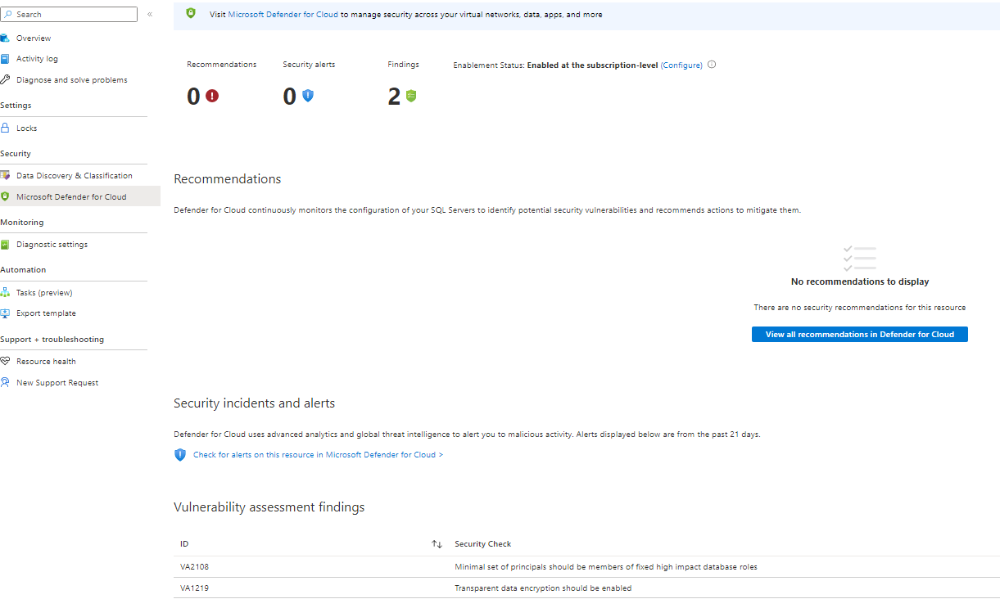**||
|On the team VM, open a new query window in SQL Server Management Studio connected to your **TEAMXX_TenantDataDB** database.|||
|To simulate a potential SQL injection query copy the following SELECT into the new query window **BUT DON’T RUN IT YET**:|--Advanced Threat Protection   SELECT \*    FROM sys.databases   WHERE database_id like '' or 1 = 1 -- ' and family = 'test1';|Notice that the logic in the WHERE clause will always equate to true and the positioning of single-quotes including in the comment represents a potential SQL injection vulnerability|
|Before running the query change the connection properties as show opposite using the **Query\\Connection\\Change Connection**… menu in SSMS.    Click **Connect**| Specify the name of the team Azure SQL Database: **TEAMXX_TenantDataDB**  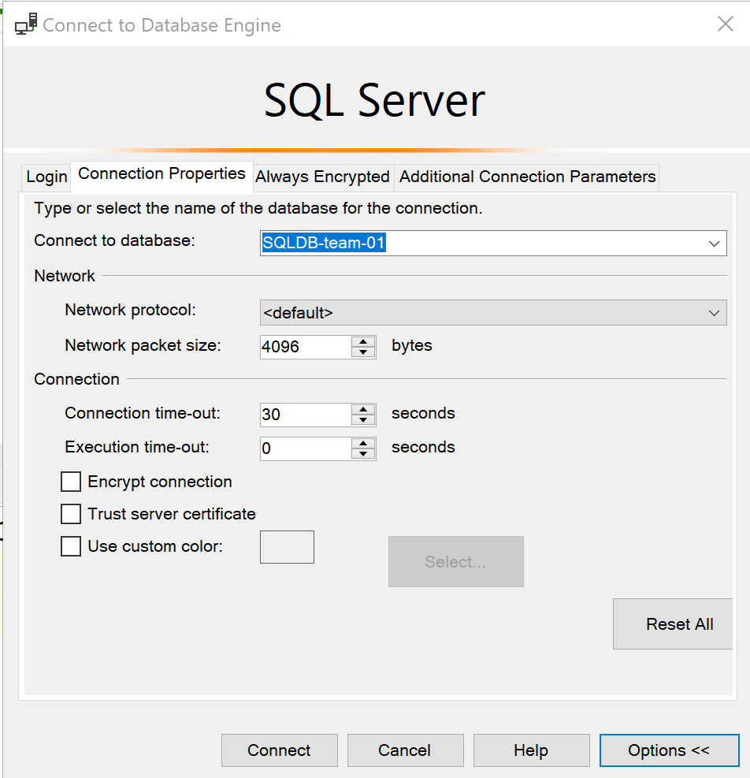   On “Additional Connection Parameters add a connection string option to specify the application name: **Application Name=webappname**   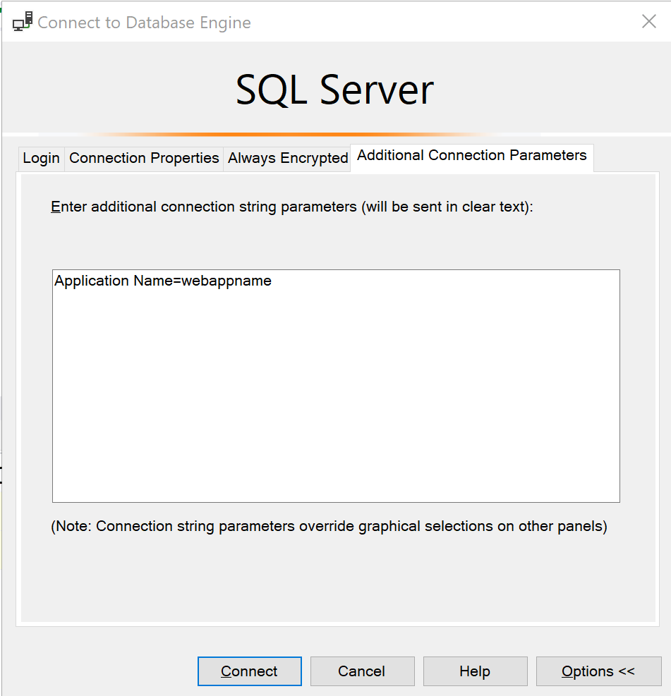 |
|Run the query.        It will return a list of databases on the server.||
|Back in the Azure Portal **Microsoft Defender for Cloud** screen, after a few minutes an Alert should be generated:    **NOTE:** It might take up to 10mins for the alert to appear in the portal| 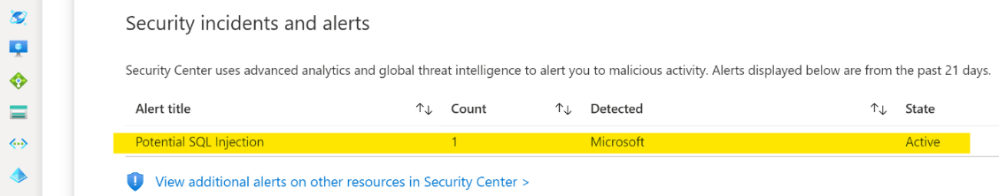|
|Once the Later appears click on it to see the details.    Depending on the progress of other teams you may see multiple entries in the details table.|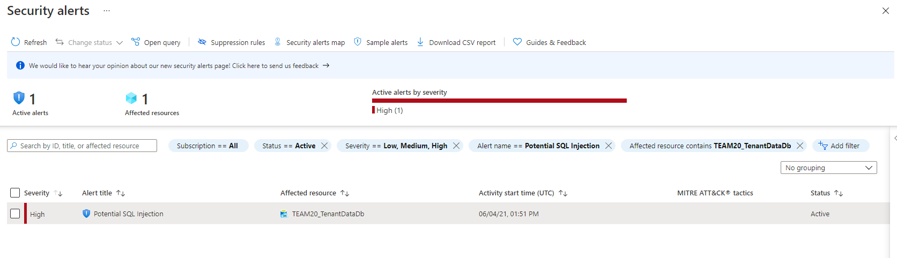|
|Try clicking on the Alert.   Note that you can drill further into the alert to see more details, get explanations and links to documentation on the alert and even advice on how negate and remediate the problem.||
