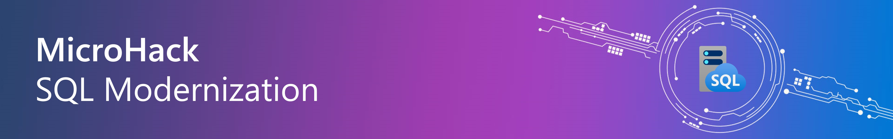

# MicroHack - SQL modernization 

- [**MicroHack introduction**](#MicroHack-introduction)
- [**MicroHack context**](#microhack-context)
- [**Objectives**](#objectives)
- [**MicroHack Challenges**](#microhack-challenges)
- [**Contributors**](#contributors)

# MicroHack introduction

This MicroHack scenario walks through the use of database migration with a focus on the best practices and the design principles. Specifically, this builds up to include working with an existing infrastructure.

This MicroHack will enhance your understanding of SQL modernization and migration paths, including how to assess and migrate SQL Server databases to Azure SQL, administer and monitor Azure SQL Managed Instance, and ensure the security of Azure SQL Managed Instance services. Specifically, to bring Azure SQL family closer to the participants, making the value of platform services more concrete and understandable through hands-on labs and presentations.

# MicroHack context
This MicroHack scenario walks through modernizing SQL Server workloads to Azure, with a focus on hands-on practice and understanding the benefits of migrating to Azure, such as cost optimization, increased flexibility and scalability, improved security and compliance, and simplified management and monitoring.

# Objectives

After completing this MicroHack you will be able to:

* Implement a proof-of-concept (PoC) for migrating an on-premises SQL Server 2012 or SQL Server 2016 database into Azure SQL Database Managed Instance  (SQL MI)  
* Perform assessments to reveal any feature parity and compatibility issues between the on-premises SQL Server database and the managed database offerings in Azure   
* Migrate the on-premises databases into Azure, using Azure migration services  
* Enable some of the advanced SQL features available in SQL MI to improve security and performance in your customer's application  
* Understand how to to implement a cloud migration solution for business-critical applications and databases  

# MicroHack challenges

## General prerequisites

This MicroHack has a few but important prerequisites

* Basic Azure knowledge [(Azure fundamentals)](https://learn.microsoft.com/en-us/training/paths/azure-fundamentals-describe-azure-architecture-services/)  
* Basic database knowledge  
* Microsoft Teams Desktop Sharing should be allowed to collaborate with other participants (only for remote deliveries)  

## Challenge 1 - Prerequisites and landing zone preparation 

### Goal 

The goal of this exercise is to migrate an on-premises SQL Server 2012 database to Azure SQL Database Managed Instance (SQL MI).

### Actions

* Perform assessments to reveal any feature parity and compatibility issues 
* Analyze workload to identify the appropriate SKU size
* Migrate the on-premises databases into Azure, using Azure migration services

### Success criteria

* You successfully assessed the databases against the SQL PaaS target architectures 
* You successfully captured the workload and received SKU sizing guidance 
* You have successfully migrated the on-premises databases to Azure SQL MI 
* You have successfully loggeg in via SSMS to Azure SQL MI 

### Learning resources
* [SQL Server to Azure SQL Managed Instance: Migration guide - Azure SQL Managed Instance](https://learn.microsoft.com/en-us/azure/azure-sql/migration-guides/managed-instance/sql-server-to-managed-instance-guide?view=azuresql) 

### Solution steps 

* [MicroHack Challenge 1]("./Challenges/01-MicroHack-database_assessment_and_migration_with_Azure_Data_Studio.md")

## Challenge 2 - Monitoring and Performance on Azure SQL Managed Instance

### Goal 

The goal of this exercise is to understand monitoring and perfomance optimzation on an Azure SQL Managed Instance. 

### Actions

* Identifying performance issues, their root causes and fixing the problem
* Use the Azure Portal to identify performance bottlenecks
* Using Log Analytics with KQL to visualize Azure SQL MI and database stats

### Success criteria

* You have identifed the most consuming stored procedure based on the total_worker_time (CPU)
* You successfully reviewed the performance graph showing CPU utilization in the Azure Portal
* You have successfully queried the AzureDiagnostics using KQL to receive the different diagnostics

### Learning resources
* [Monitor Azure SQL Managed Instance - Azure SQL Managed Instance](https://learn.microsoft.com/en-us/azure/azure-sql/managed-instance/monitoring-sql-managed-instance-azure-monitor?view=azuresql)

### Solution steps

* [MicroHack Challenge 2](./Challenges/02-MicroHack-monitoring_and_performance_on_Azure_SQL_Managed_Instance.md)

## Challenge 3 - Security on Azure SQL Managed Instance

### Goal 

The goal of this exercise is to understand the layered security model available when running databases in Azure.

### Actions

* Perform data discovery & classification as a built-in capability for discovering, classifying, labelling and protecting sensitive data in databases
* Review the Azure Defender for SQL – Vulnerability Assessment
* Azure Defender for SQL – Advanced Threat Protection

### Success criteria

* You have successfully created data classification recommendations and added custom data classification
* You successfully used Vulnerability Assessment to generate the initial vulnerability scan baseline
* You have successfully reviewed Advanced Threat Protection and created a security alerts on an anomalous activity.

### Learning resources
* [Security Overview - Azure SQL Database & Azure SQL Managed Instance & Azure Synapse Analytics](https://learn.microsoft.com/en-us/azure/azure-sql/database/security-overview?view=azuresql)

### Solution steps

* [MicroHack Challenge 3](./Challenges/03-MicroHack-security_on_Azure_SQL_Managed_Instance.md)

## Finish

Congratulations! You finished the MicroHack SQL Modernization. We hope you had the chance to learn about the how to successfully migrate your on-premises SQL Server databases to Azure with key takeaways around cost optimization, increased flexibility and scalability, improved security and compliance, and simplified management and monitoring.

If you want to give feedback please dont hesitate to open an Issue on the repository or get in touch with one of us directly.

Thank you for investing your time, we look forward to seeing you again!

## Contributors
* Cornel Sukalla [LinkedIn](https://www.linkedin.com/in/cornelsukalla/)
* Mert Següner [LinkedIn](https://www.linkedin.com/in/mertsenguner/)
* Sean Cowburn [LinkedIn](https://www.linkedin.com/in/sean-cowburn/)
