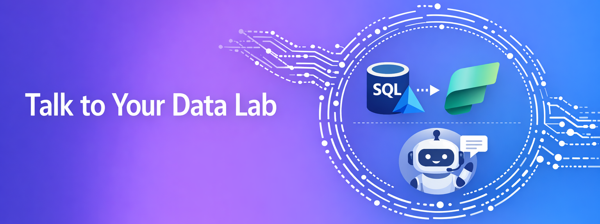

# Microsoft Migrate & Modernize MicroHack Day - Ask Analyze Act - Talk to Your Data in the Era of AI
- [**MicroHack introduction**](#MicroHack-introduction)
- [**MicroHack context**](#microhack-context)
- [**Objectives**](#objectives)
- [**MicroHack Challenges**](#microhack-challenges)
- [**Contributors**](#contributors)

# MicroHack introduction

This MicroHack *Talk to Your Data in the Era of AI* scenario walks through the use of modernizing SQL Server workloads and building an analytics‑ and AI‑ready data foundation using Microsoft Fabric and Azure SQL Managed Instance.

Through hands‑on labs, participants will explore how to break down data silos, unify operational and external data, enable governed analytics, and control how AI agents reason and respond. The scenario demonstrates the end‑to‑end journey from database mirroring and analytics enablement to Data Agent configuration and real user interaction via M365 Copilot.

# MicroHack context
This MicroHack scenario focuses on breaking down data silos through database mirroring, unifying operational and external data in OneLake, building semantic models for governed analytics, and configuring Data Agents to support natural language querying and Copilot integration. It highlights best practices for data architecture, AI readiness, and agent instruction design to enable secure, reliable, and scalable intelligent data interaction.

# Objectives

After completing this MicroHack you will be able to:

* Replicate operational data from Azure SQL Managed Instance into Microsoft Fabric OneLake using database mirroring
* Unify mirrored databases and external data sources into a single Lakehouse for centralized analytics  
* Create and optimize Semantic Models to support reliable reporting and efficient query performance
* Prepare data for AI and Copilot scenarios by defining clear data structures, relationships, and instructions
* Configure and validate a Data Agent that delivers accurate, context‑aware responses
* Publish and interact with a Data Agent through the M365 Copilot experience

# MicroHack challenges

## General prerequisites

This MicroHack has a few but important prerequisites

* Basic Azure knowledge [(Azure fundamentals)](https://learn.microsoft.com/en-us/training/paths/azure-fundamentals-describe-azure-architecture-services/)  
* Basic database knowledge  
* Microsoft Teams Desktop Sharing should be allowed to collaborate with other participants (only for remote deliveries)  

## Challenges

* [Challenge 1 - Attack the Data Silos](challenges/challenge-01.md)  **<- Start here**
* [Challenge 2 - Data Agent becomes mission control](challenges/challenge-02.md)
* [Challenge 3 - Everyone gets a jetpack](challenges/challenge-03.md)

## Solutions - Spoilerwarning

* [Solution 1 - Attack the Data Silos](./walkthrough/challenge-01/solution-01.md)
* [Solution 2 - Data Agent becomes mission control](./walkthrough/challenge-02/solution-02.md)
* [Solution 3 - Everyone gets a jetpack](./walkthrough/challenge-03/solution-03.md)

## Contributors
* Cornel Sukalla [LinkedIn](https://www.linkedin.com/in/cornelsukalla/)
* Wolf Biber [LinkedIn](https://www.linkedin.com/in/ms-wolf-biber/)
* Tobias Altmiks [LinkedIn](https://www.linkedin.com/in/tobias-altmiks-998416158/)
* Seoyoung Yoo [LinkedIn](https://www.linkedin.com/in/seoyoungfromkorea/)