# Walkthrough Challenge 1 - Attack the Data Silos

**[Home](../../README.md)** - [Back to Challenge 1 Info](../../challenges/challenge-01.md) 

## Attack the Data Silos

### Contents
[Data Architecture](#data-architecture)

[Generic Migration Content](#generic-migration-content)

[Lab overview](#lab-overview)

1. [Create a Mirrored Azure SQL Managed Instance Database](#1-create-a-mirrored-azure-sql-managed-instance-database)
2. [Start the Mirroring Process and Monitor Fabric Mirroring](#2-start-the-mirroring-process-and-monitor-fabric-mirroring)
3. [Repeat the Azure SQL Managed Instance Mirroring Setup and Monitoring Process](#3-repeat-the-azure-sql-managed-instance-mirroring-setup-and-monitoring-process)
4. [Combine Mirrored Databases and a CSV File in One Lakehouse](#4-combine-mirrored-databases-and-a-csv-file-in-one-lakehouse)

[Summary](#summary)

# Data Architecture
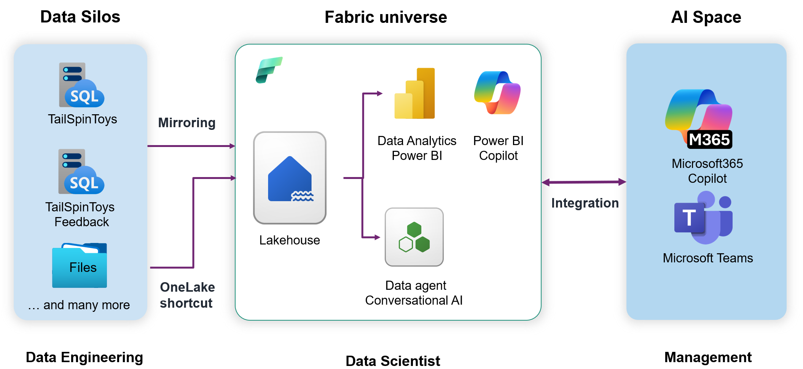

# Generic Migration Content
| **Narrative**  | **Notes**  |
|:-----|:-------|
| *Notes for outside of the workshop: Familiarise yourself with Microsoft Fabric, Data Agents, M365 Copilot and Azure databases* | **Microsoft Fabric & Mirroring Resources:** - [Microsoft Fabric Overview](https://learn.microsoft.com/en-us/fabric/fundamentals/microsoft-fabric-overview) - [OneLake Overview](https://learn.microsoft.com/en-us/fabric/onelake/onelake-overview) - [Mirroring in Fabric](https://learn.microsoft.com/en-us/fabric/mirroring/overview) - [OneLake Shortcuts](https://learn.microsoft.com/en-us/fabric/onelake/onelake-shortcuts) - [OneLake Explorer](https://learn.microsoft.com/en-us/fabric/onelake/onelake-file-explorer) - [Fabric Data Agent](https://learn.microsoft.com/en-us/fabric/data-science/concept-data-agent) - [Fabric Data Agent in Microsoft Copilot Studio](https://learn.microsoft.com/en-us/fabric/data-science/data-agent-microsoft-copilot-studio)  |

# Lab Overview
In this walkthrough, you will set up database mirroring from Azure SQL Managed Instance to Microsoft Fabric. This process enables you to replicate operational data into Fabric’s OneLake for real-time analytics, reporting, and AI—without affecting source database performance.

By using System Assigned Managed Identity (SAMI) for secure access, you will configure a mirrored database in Fabric, and start the mirroring process. You will learn to monitor synchronization and repeat the setup for additional databases.

And, you will have a synchronized, mirrored database in Microsoft Fabric that supports up-to-date analytics and downstream workloads.

By completing this lab, you will start by integrating mirrored data from Azure SQL Managed Instance and external CSV files into a single Lakehouse, enabling centralized access and unified analytics. You will then build and optimize a Semantic Model to support accurate reporting, effective time-based analysis, and high query performance.

# 1. Create a Mirrored Azure SQL Managed Instance Database

In this task, you will enable managed identity authentication on your Azure SQL Managed Instance and configure Microsoft Fabric to create a mirrored database. This step ensures secure access and sets up the foundation for data replication into Fabric’s analytical environment.

<table style="table-layout: auto; width: 100%;">
  <colgroup>
  <col style="width: 72%;">
  <col style="width: 28%;">
  </colgroup>

  <tr><th>Narrative</th><th>Notes</th></tr>
  <tr>
    <td>Go to <a href="https://app.fabric.microsoft.com">Microsoft Fabric</a>.  On the <b>Fabric Home</b> page, select <b>Fabric</b> (bottom-left) (1). Next Select Workspace (2) and choose your predeployed workspace. (3)</td>
    <td></td>
  </tr>
  <tr>
    <td colspan="2" align="center">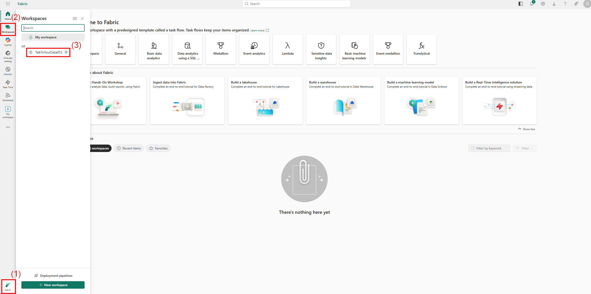</td>
  </tr>
  <tr>
    <td> In your workspace, select <b>New item (2)</b>. In the <b>New item</b> window, search for <b>Mirror (3)</b> to display all mirroring options and <b>Click Mirrored Azure SQL Managed Instance (4)</b> to start creating a mirrored database from your SQL Managed Instance.</td>
    <td></td>
  </tr>
  <tr>
    <td colspan="2" align="center">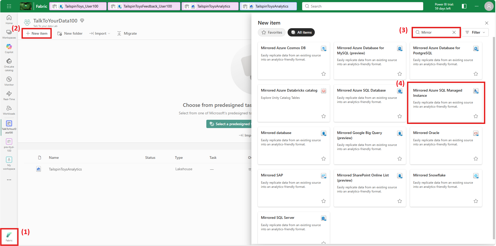</td>
  </tr>
  <tr>
    <td>In the <b>Choose a database connection to get started</b> window, select <b>Azure SQL Managed Instance</b> as the data source. Confirm that <b>Azure SQL Managed Instance</b> appears under <b>New sources</b>, then proceed to configure the connection.</td>
    <td></td>
  </tr>
  <tr>
    <td colspan="2" align="center">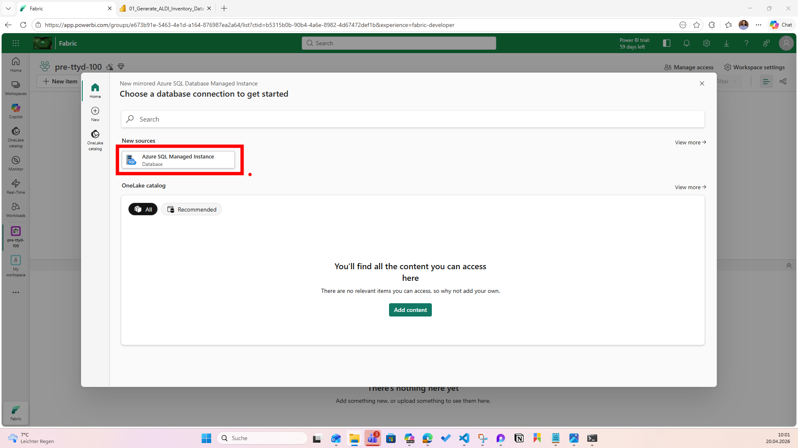</td>
  </tr>
  <tr>
    <td>In the <b>Server (1)</b> field, <b>paste the Azure SQL Managed Instance server name</b>:<code>sqlhackmi-z5v5uebsfrojm.8b4846304eec.database.windows.net</code> so that Microsoft Fabric knows exactly which database to connect to for mirroring. This step directs Fabric to the correct SQL Managed Instance, ensuring secure authentication and accurate data synchronization from your operational system to the analytics environment. </td>
    <td>Copy and paste directly.</td>
  </tr>
  <tr>
    <td colspan="2" align="center">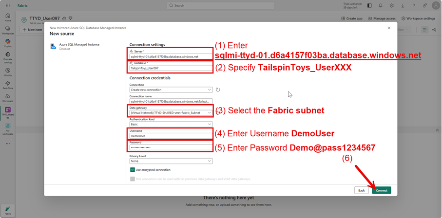</td>
  </tr>
  <tr>
    <td>In the <b>Database (2)</b> field, enter the <b>source database name:</b> <code>TailspinToys_User###</code></td>
    <td>Replace ### with your  ttyd user postfix</td>
  </tr>
  <tr>
    <td colspan="2" align="center"></td>
  </tr>
  <tr>
    <td>Select a <b>Data gateway (3)</b> after entering the server and database to enable secure data transfer between your on-premises or network-restricted Azure SQL Managed Instance and Microsoft Fabric. The data gateway acts as a bridge, allowing Fabric to access and replicate data from the source database while maintaining network security and compliance requirements.</td>
    <td></td>
  </tr>
  <tr>
    <td colspan="2" align="center">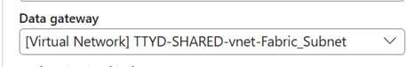</td>
  </tr>
  <tr>
    <td>For <b>Authentication Kind (4)</b>, select <b>Basic</b>. In <b>Username (5)</b>, enter: <code>demouser</code>. In <b>Password (6)</b>, enter: <code>Demo@pass1234567</code>.</td>
    <td>Username and password can be copied and pasted directly.</td>
  </tr>
  <tr>
    <td colspan="2" align="center"></td>
  </tr>
  <tr>
    <td>Ensure <b>Use encrypted connection</b> is checked to protect your data during transfer between Azure SQL Managed Instance and Microsoft Fabric. Click <b>Connect (7)</b> to validate the connection and continue.</td>
    <td>This may take a few minutes to complete.</td>
  </tr>
  <tr>
    <td colspan="2" align="center">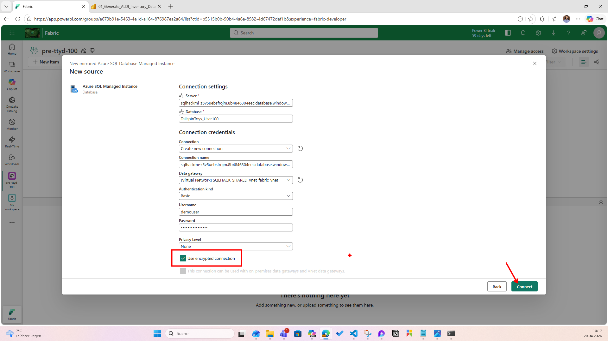</td>
  </tr>
  <tr>
    <td>Once you are successfully connected, on the <b>Choose data</b> screen, review the list of available tables. Select the tables you want to replicate (or select <b>Select all</b> if required for the lab). Click <b>Connect</b> to proceed.</td>
    <td> This may take a few minutes to connect. </td>
  </tr>
  <tr>
    <td colspan="2" align="center">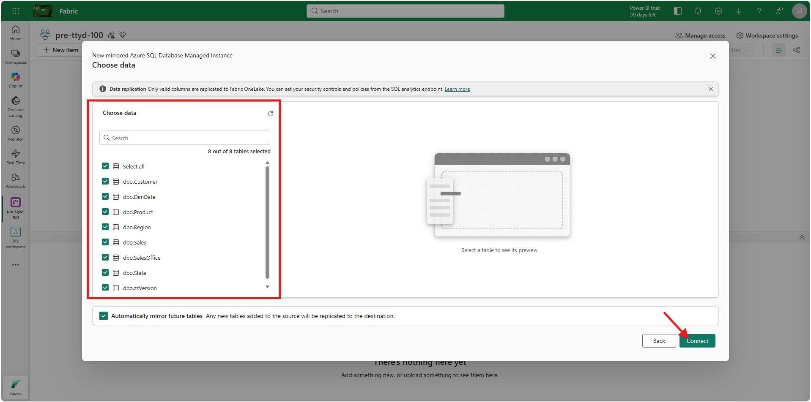</td>
  </tr>
  <tr>
    <td>In the <b>Destination</b> screen, review the <b>Name</b> of the mirrored database. Verify that <b>Azure SQL Database Managed Instance</b> is shown as the source. Click <b>Create mirrored database</b> to start the mirroring process.</td>
    <td></td>
  </tr>
  <tr>
    <td colspan="2" align="center">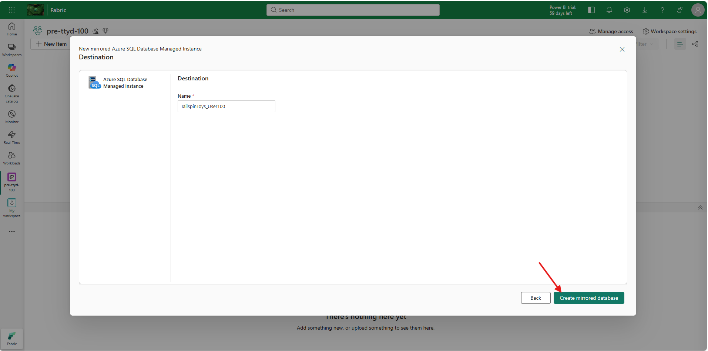</td>
  </tr>
  <tr>
    <td> <b> Please remain on this page and avoid refreshing while the system completes the database mirroring process.</b></td>
    <td>This may take a few minutes to complete.</td>
  </tr>
  <tr>
    <td colspan="2" align="center">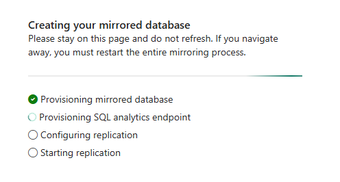</td>
  </tr>
</table>

# 2. Start the Mirroring Process and Monitor Fabric Mirroring

In this task, you will initiate the mirroring process between your Azure SQL Managed Instance and Microsoft Fabric. You will also learn how to monitor the status and health of the mirroring, ensuring continuous and reliable synchronization of data.

<table style="table-layout: auto; width: 100%;">
  <colgroup>
  <col style="width: 72%;">
  <col style="width: 28%;">
  </colgroup>

  <tr><th>Narrative</th><th>Notes</th></tr>
  <tr>
    <td>The <b>Monitor Replication</b> screen will allow you to mirror all data in the database by default.</td>
    <td>After 2-5 minutes, select Monitor Replication to see the replication status.</td>
  </tr>
  <tr>
    <td colspan="2" align="center">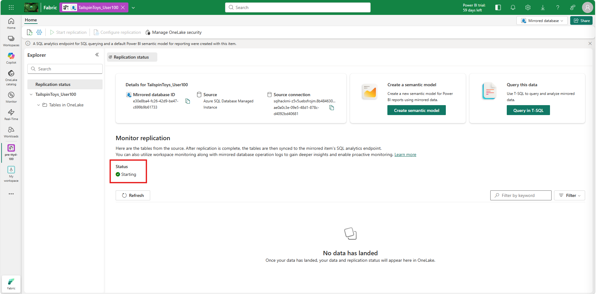</td>
  </tr>
  <tr>
    <td>Replicating Status:  <b>Running</b>: Replication is currently running, bringing snapshot and change data into OneLake.  <b>Running with warning</b>: Replication is running with transient errors.  <b>Stopping/Stopped</b>: Replication is stopped. <b>Error</b>: Fatal error in replication that can't be recovered.</td>
    <td>If you don't see the tables and corresponding replication status, wait a few seconds and refresh the pane.</td>
  </tr>
  <tr>
  <tr>
    <td colspan="2" align="center">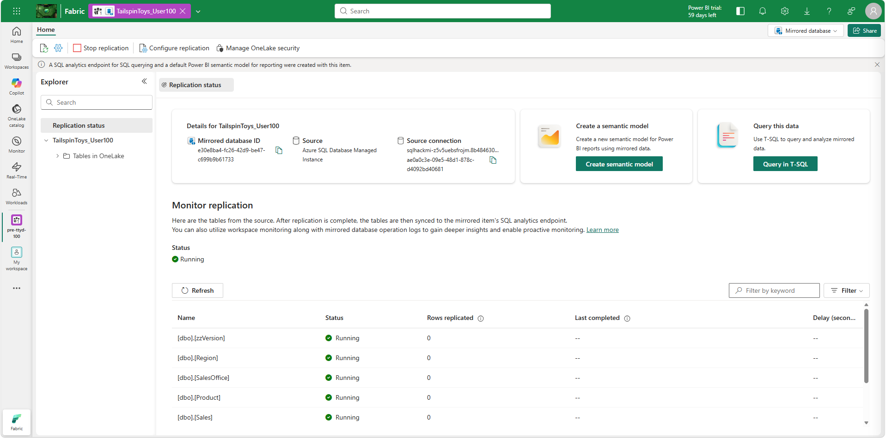</td>
  </tr>
</table>

# 3. Repeat the Azure SQL Managed Instance Mirroring Setup and Monitoring Process

In this task, you will repeat the setup and monitoring procedures for additional databases as needed. This reinforces the mirroring workflow and demonstrates how to scale data replication for multiple sources within your environment..

<table style="table-layout: auto; width: 100%;">
  <colgroup>
  <col style="width: 72%;">
  <col style="width: 28%;">
  </colgroup>

  <tr><th>Narrative</th><th>Notes</th></tr>
  <tr>
    <td> In your Fabric workspace, select <b>New item (2)</b>. In the <b>New item</b> window, search for <b>Mirror (3)</b> to display all mirroring options and <b>Click Mirrored Azure SQL Managed Instance (4)</b> to start creating a mirrored database from your SQL Managed Instance.</td>
    <td></td>
  </tr>
  <tr>
    <td colspan="2" align="center"></td>
  </tr>
  <tr>
    <td>In the <b>Choose a database connection to get started</b> window, select <b>Azure SQL Managed Instance</b> as the data source. Confirm that <b>Azure SQL Managed Instance</b> appears under <b>New sources</b>, then proceed to configure the connection.</td>
    <td></td>
  </tr>
  <tr>
    <td colspan="2" align="center"></td>
  </tr>
  <tr>
    <td>In the <b>Server (1)</b> field, <b>paste the Azure SQL Managed Instance server name</b>: <code>sqlhackmi-z5v5uebsfrojm.8b4846304eec.database.windows.net</code></td>
    <td></td>
  </tr>
  <tr>
    <td colspan="2" align="center">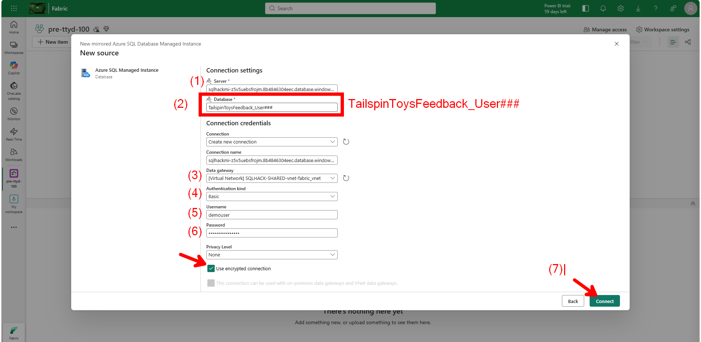</td>
  </tr>
  <tr>
    <td>In the <b>Database (2)</b> field, enter the <b>source database name:</b> <code>TailspinToysFeedback_User###</code></td>
    <td>Replace ### with your  ttyd user postfix</td>
  </tr>
  <tr>
    <td colspan="2" align="center"></td>
  </tr>
  <tr>
    <td>Select existing <b>Data gateway (3)</b></td>
    <td></td>
  </tr>
  <tr>
    <td colspan="2" align="center"></td>
  </tr>
  <tr>
    <td>For <b>Authentication kind (4) </b>, select <b>Basic</b>. In the <b>Username (5)</b> field, enter the SQL login username: <code>demouser</code> and in the <b>Password (6)</b> field, enter the corresponding password: <code>Demo@pass1234567</code>.   Ensure <b>Use encrypted connection</b> is checked. Click <b>Connect </b> to validate the connection and continue.</td>
    <td></td>
  </tr>
  <tr>
    <td colspan="2" align="center"></td>
  </tr>
  <tr>
    <td>
      

        <b>Troubleshooting</b> 
        If you see the error <b>"The specified connection name already exists. Try choosing a different name."</b>, go back to the connection name and enter a <b>new unique connection name at the end</b> (for example: <code>TailspinToysFeedback_User###_2</code>). 
        Keep the same Server, Database, Data gateway, Authentication kind, Username, and Password values, then click <b>Connect</b> again.
      

    </td>
    <td>This happens when a connection with the same name already exists in your workspace.</td>
  </tr>
  <tr>
    <td colspan="2" align="center">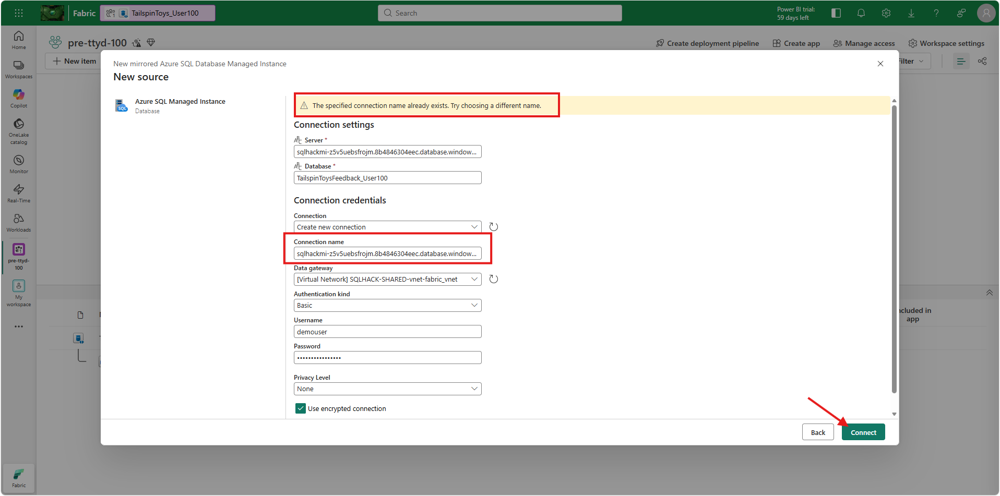
    </td>
  </tr>
  <tr>
    <td>Select all tables from the database.</td>
    <td>This may take a few minutes to complete. </td>
  </tr>
  <tr>
    <td colspan="2" align="center">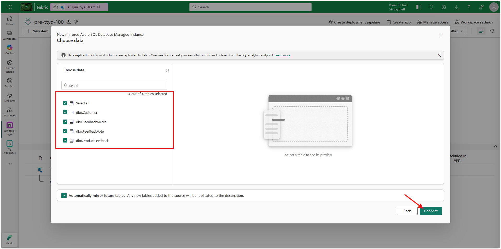</td>
  </tr>
    <tr>
    <td>In the <b>Destination</b> screen, review the <b>Name</b> of the mirrored database. Verify that <b>Azure SQL Database Managed Instance</b> is shown as the source. Click <b>Create mirrored database</b> to start the mirroring process.</td>
    <td></td>
  </tr>
  <tr>
    <td colspan="2" align="center">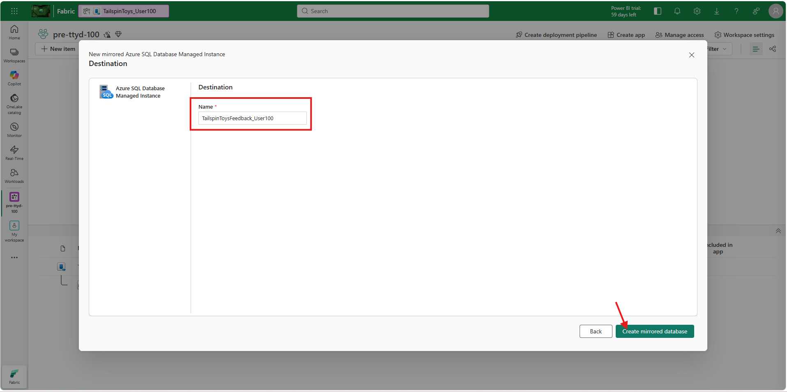</td>
  </tr>
</table>

# 4. Combine Mirrored Databases and a CSV File in One Lakehouse

In this task, you will integrate operational data mirrored from Azure SQL Managed Instance with external CSV data into a unified Lakehouse by creating shortcuts. This step enables centralized storage and analytics across multiple data sources.

<table style="table-layout: auto; width: 100%;">
<colgroup>
<col style="width: 72%;">
<col style="width: 28%;">
</colgroup>
<tr><th>Narrative</th><th>Notes</th></tr>
<tr><td><b>Recap</b>: You mirrored two databases in Challenge 1.  You need to create a Lakehouse after mirroring two databases so you can combine and centralize data from multiple sources. </td><td></td></tr>
<tr><td>Open your Workspace and Click New Item (1). In the search bar, search for Lakehouse (2) and select the Lakehouse (3).</td><td></td></tr>
<tr><td colspan="2" align="center">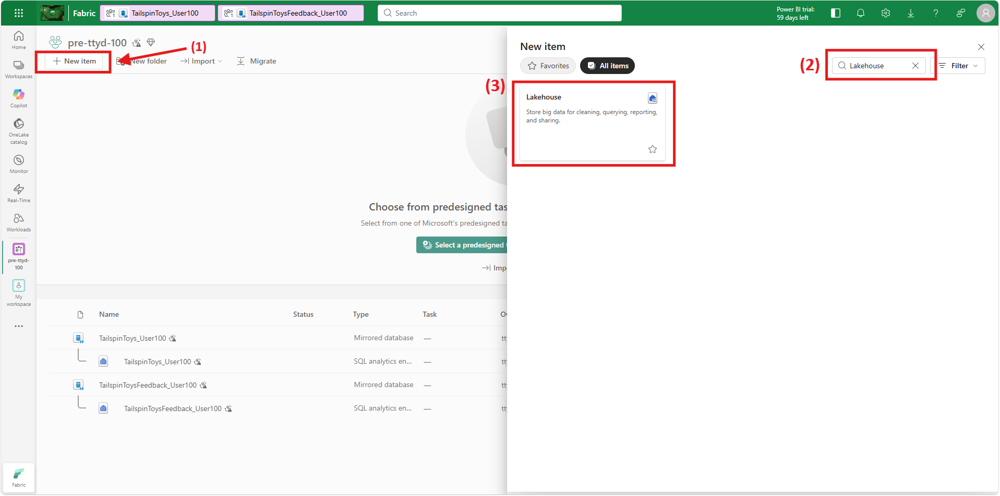</td></tr>
<tr><td>You need to enter lakehouse name and create it.</td><td>Example Name: <code>TailspinToysAnalytics</code> and Leave Lakehouse schemas enabled.</td></tr>
<tr><td colspan="2" align="center">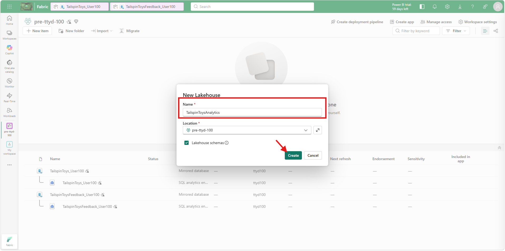</td></tr>
<tr><td>Open your new Lakehouse. Within the Tables folder navigate to dbo schema. By clicking the ellipsis (...) create shortcuts to the required tables (mirrored databases). Select <b>New table shortcut</b> </td><td></td></tr>
<tr><td colspan="2" align="center">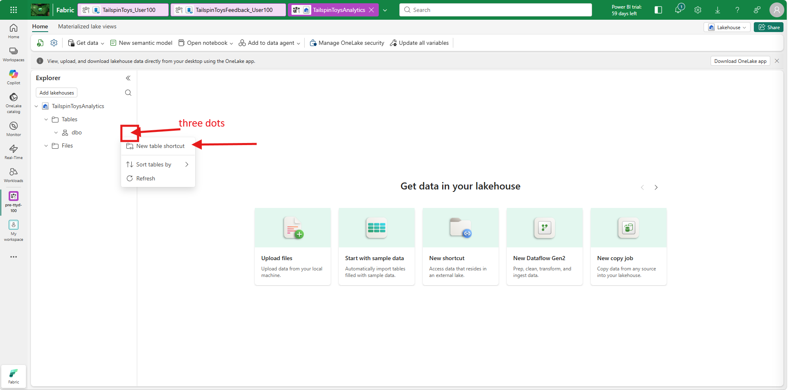</td></tr>
<tr><td>In the <b>New shortcut</b> window, under <b>Internal sources</b>, select <b>Microsoft OneLake</b>.</td><td>This option allows you to create shortcuts from mirrored databases stored in OneLake.</td></tr>
<tr><td colspan="2" align="center">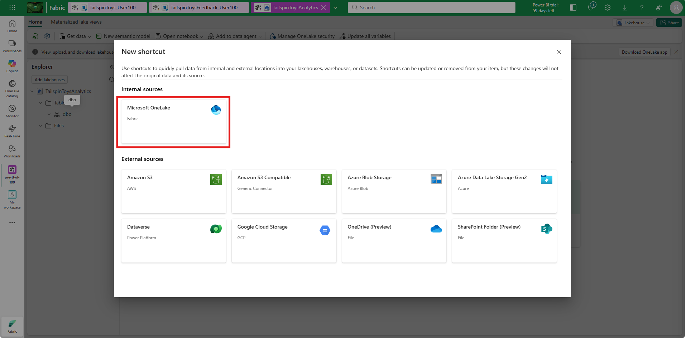</td></tr>
<tr><td>In the Select a data source type screen, locate the mirrored database <code>TailspinToys_User###</code>.</td><td> Select <code>TailspinToys_User###</code> created in Challenge 1.</td></tr>
<tr><td colspan="2" align="center">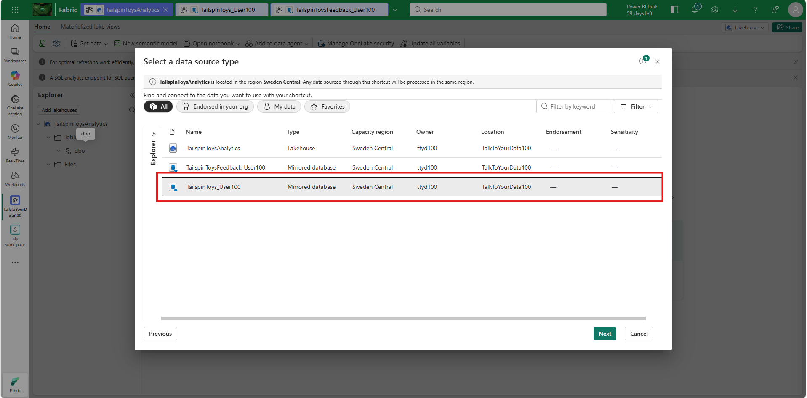</td></tr>
<tr><td>In the new shortcut screen, expand tables → dbo. Select alle tables except <b>zzVersion</b> (1). Click Next (2) to proceed.</td><td><b>Important:</b> Do NOT select <code>zzVersion</code> (this table is not required).</td></tr>
<tr><td colspan="2" align="center">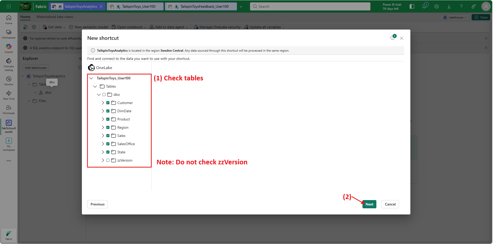</td></tr>
<tr><td>Review the Summary screen and confirm the selected tables. Verify that the shortcut location is your current Lakehouse. Click Create to create the shortcuts.</td><td></td></tr>
<tr><td colspan="2" align="center">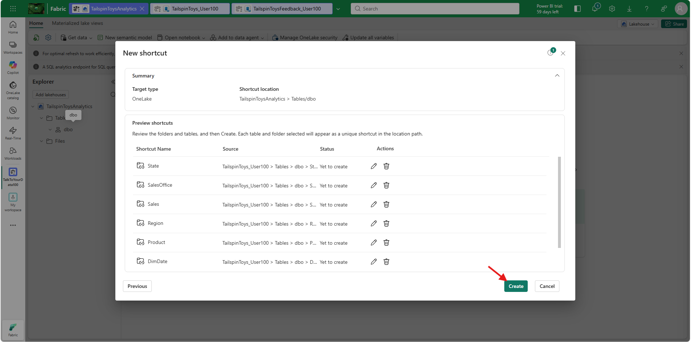</td></tr>
<tr><td>In the Explorer pane, confirm that the tables from <code>TailspinToys_User###</code> now appear under Tables. This confirms that the shortcuts were created successfully.</td><td></td></tr>
<tr><td colspan="2" align="center">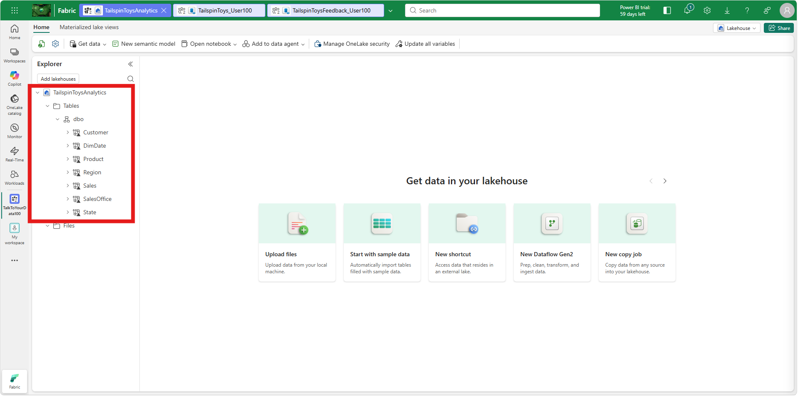</td></tr>

<td colspan="2">
  

    Repeat the process by creating another <b>New table shortcut</b>.
  

</td>

<tr><td>This time select the mirrored database <code>TailspinToysFeedback_User###</code>. Click Next to continue.</td><td></td></tr>
<tr><td colspan="2" align="center">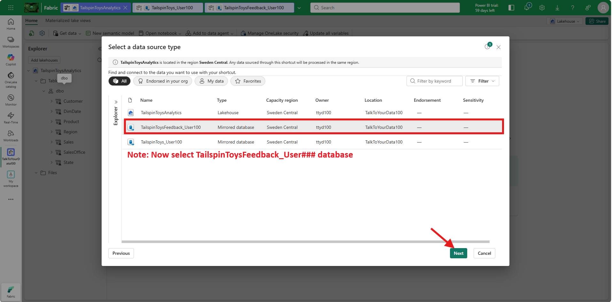</td></tr>
<tr><td>Expand Tables → dbo. Select all tables except Customer (1). Click Next (2) to proceed.</td><td><b>Important:</b> Do NOT select the Customer table, as it already exists from the first database.</td></tr>
<tr><td colspan="2" align="center">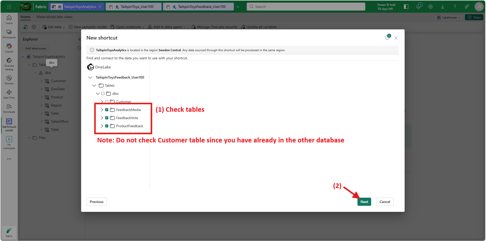</td></tr>
<tr><td>Review the Summary screen and confirm the selected tables. Verify the shortcut destination is the same Lakehouse. Click Create to finalize the shortcuts.</td><td></td></tr>
<tr><td colspan="2" align="center">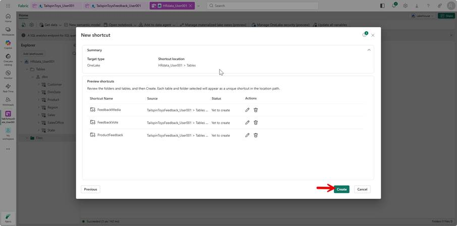</td></tr>
<tr><td>Next you create a Shortcut from a file. Therefore click the <b>ellipsis (...)</b> next to the files folder in the explorer pane. This let's you easily integrate external data, such as CSV files, alongside your mirrored databases within the same Lakehouse for centralized analysis.</td><td></td></tr>
<tr><td colspan="2" align="center">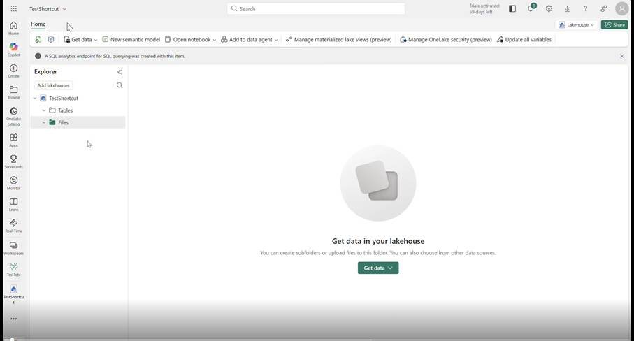</td></tr>
<tr><td>Select <b>New shortcut (2)</b> to start creating a shortcut to an external data source.</td><td></td></tr>
<tr><td colspan="2" align="center">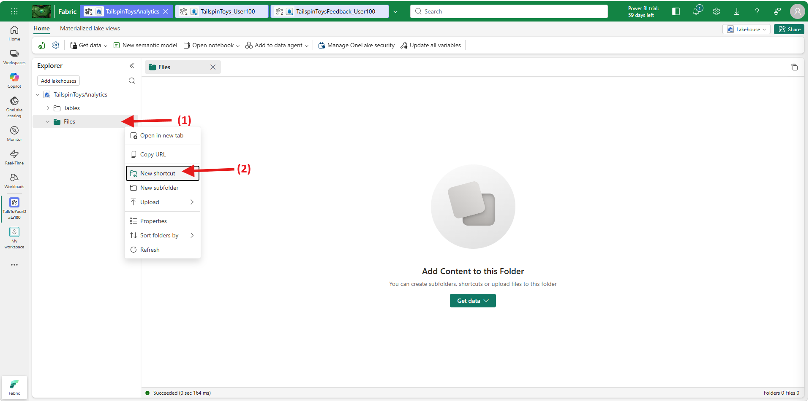</td></tr>
<tr><td>In the <b>New shortcut</b> window, choose the source type and Under <b>External sources</b>, select <b>Azure Data Lake Storage Gen2</b> so you can directly link and access files stored in your organization's data lake, enabling seamless integration of external datasets with your Lakehouse environment for unified analytics.</td><td></td></tr>
<tr><td colspan="2" align="center">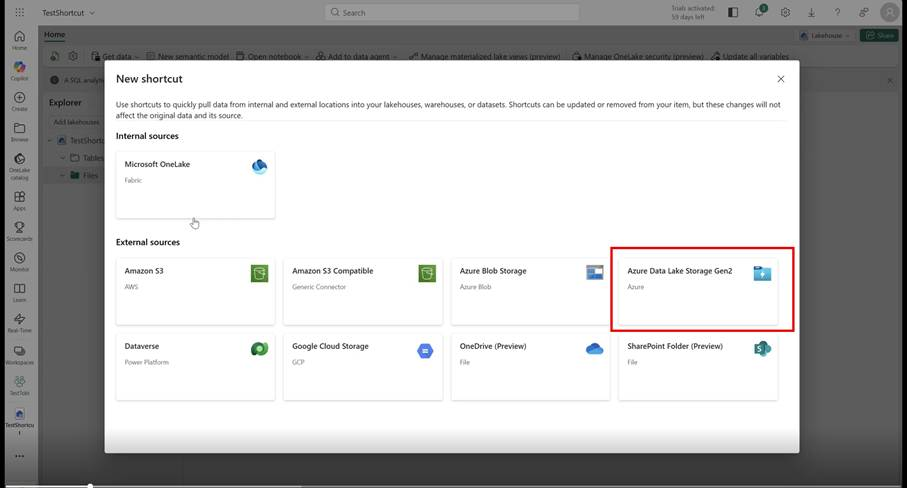</td></tr>
<tr><td>Select <b>New connection</b> and Paste DataLake Storage URL: <code>https://employeedata####.dfs.core.windows.net/</code> (1). Replace <code>####</code> in the URL with the current day and month in DDMM format (for example, <code>1206</code> for June 12). Click <b>Next (2)</b> to continue.</td><td>This ensures you are establishing a secure and direct connection to your organization’s Data Lake for accessing external files.</td></tr>
<tr><td colspan="2" align="center">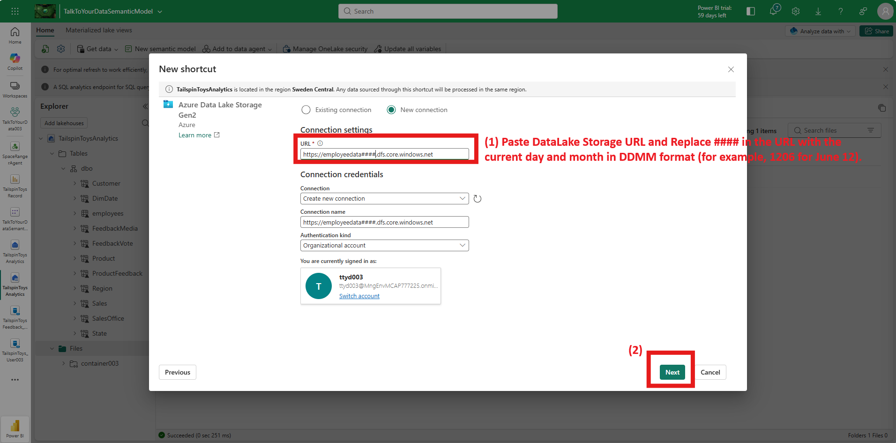</td></tr>
<tr><td>Select the folder with <b><code>your user number</code> (1)</b>. Click <b>Next (2)</b> to continue.</td><td>Selecting your user-specific folder ensures you only access and work with the files intended for your lab activities.</td></tr>
<tr><td colspan="2" align="center">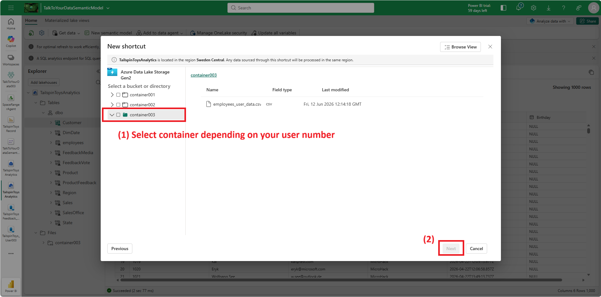</td></tr>
<tr><td>Review the <b>selected folder (1)</b> and Click <b>Skip(2)</b> as you do not need to apply any transformation before creating the shortcut.</td><td></td></tr>
<tr><td colspan="2" align="center">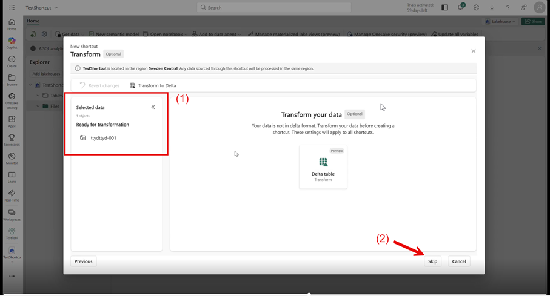</td></tr>
<tr><td>Click <b>Create</b> to create the shortcut in your Lakehouse.</td><td></td></tr>
<tr><td colspan="2" align="center">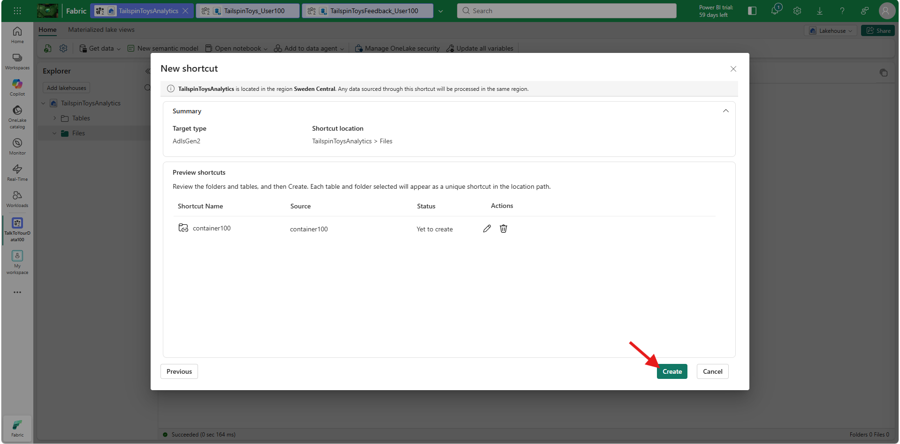</td></tr>
<tr><td>Check shortcut creation</td><td>If the shortcut does not appear immediately, click the <b>three dots</b> next to <b>Files</b> and select <b>Refresh</b>.</td></tr>
<tr><td colspan="2" align="center">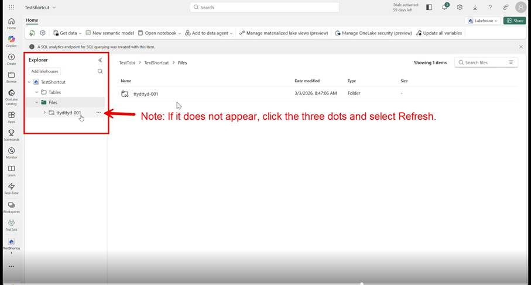</td></tr>
<tr><td>Click <b>container###</b> and verify that the CSV file is visible in this container.</td><td>Replace ### with your user number prefix/postfix.</td></tr>
<tr><td colspan="2" align="center">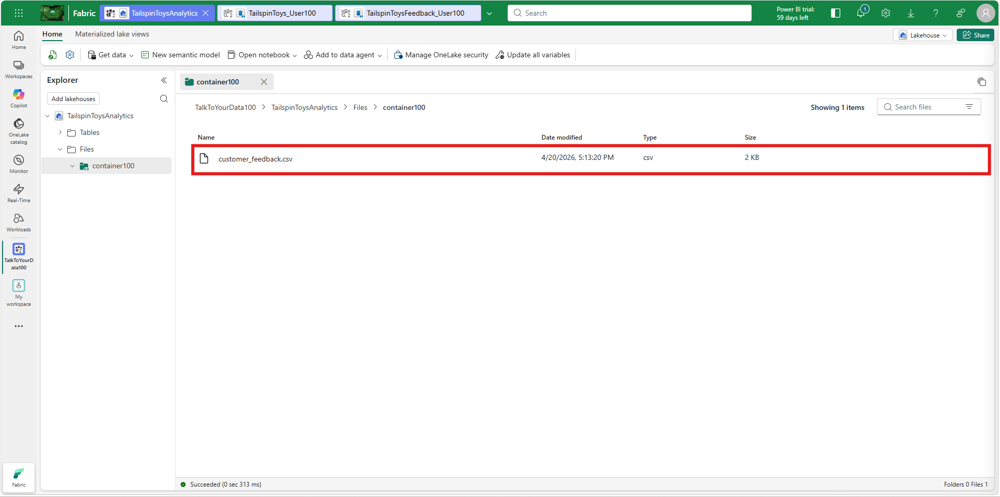</td></tr>
<tr><td>Expand the Files folder. Click the Shortcut folder with your user name. Locate the CSV file and click the three dots (⋯) (e.g. employees_user_data.csv).</td><td></td></tr>
<tr><td colspan="2" align="center">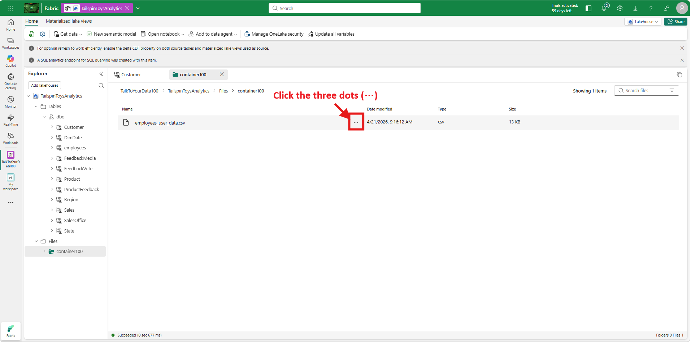</td></tr>
<tr><td>Select <b>Load to Tables (1)</b> from the context menu and Choose <b>New table (2)</b>.</td><td></td></tr>
<tr><td colspan="2" align="center">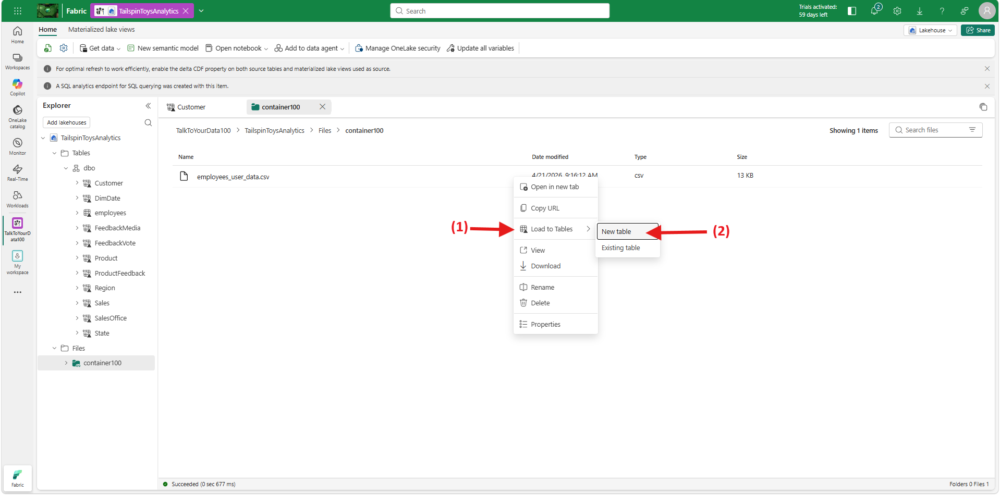</td></tr>
<tr><td>Change the table name to <b>employees</b> (1). Set the separator to <b>, (comma)</b> (2). Review the settings, then click <b>Load (3)</b>.</td><td>CSV files use commas to separate values, so selecting a comma ensures data loads into the correct columns.</td></tr>
<tr><td colspan="2" align="center">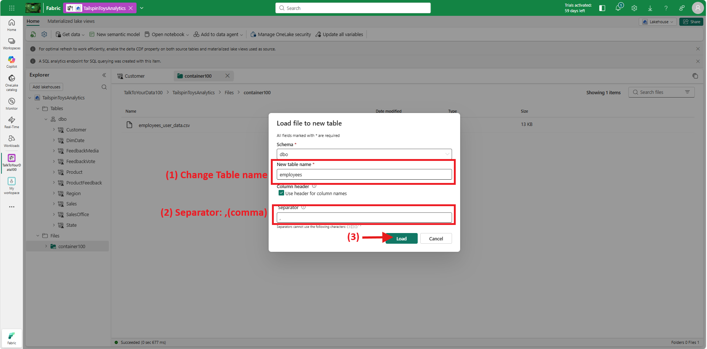</td></tr>
<tr><td>In the Explorer pane, locate Tables. Click the three dots (⋯) next to <b>Tables (1)</b>. Select <b>Refresh (2)</b>. Confirm that a table named <b>employees</b> appears under <b>Tables (3)</b>.</td><td>This confirms that the CSV data has been successfully converted into a Lakehouse table.</td></tr>
<tr><td colspan="2" align="center">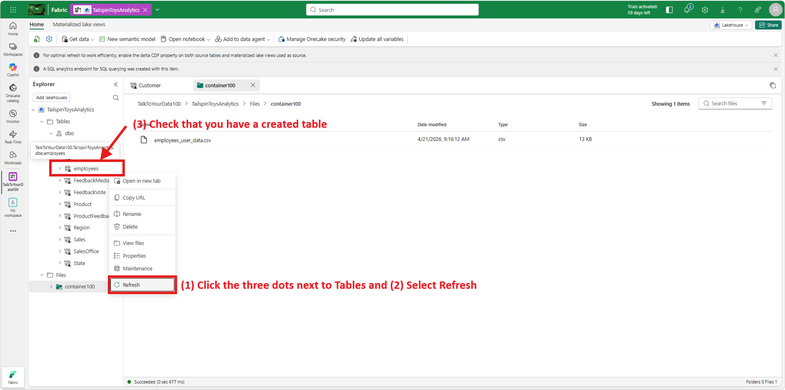</td></tr>
</table>

## Summary

In this lab, you have accomplished the following:

- Created a mirrored Azure SQL Managed Instance database to ensure high availability and data replication.
- Started the mirroring process and monitored Fabric mirroring to ensure successful synchronization and data consistency.
- Built a unified Lakehouse in Microsoft Fabric OneLake by combining mirrored Azure SQL databases with external CSV files, establishing a centralized and analytics-ready data foundation.

[Next Challenge 2 Step-by-Step Solution](../challenge-02/solution-02.md)
