# Walkthrough Challenge 1 - Attack the Data Silos

**[Home](../../README.md)** - [Back to Challenge 1 Info](../../challenges/challenge-01.md) 

## Attack the Data Silos

### Contents
[Data Architecture](#data-architecture)

[Generic Migration Content](#generic-migration-content)

[Lab overview](#lab-overview)

1. [Create a Mirrored Azure SQL Managed Instance Database](#1-create-a-mirrored-azure-sql-managed-instance-database)
2. [Start the Mirroring Process and Monitor Fabric Mirroring](#2-start-the-mirroring-process-and-monitor-fabric-mirroring)
3. [Repeat the Azure SQL Managed Instance Mirroring Setup and Monitoring Process](#3-repeat-the-azure-sql-managed-instance-mirroring-setup-and-monitoring-process)
4. [Combine Mirrored Databases and a CSV File in One Lakehouse](#4-combine-mirrored-databases-and-a-csv-file-in-one-lakehouse)

[Summary](#summary)

# Data Architecture
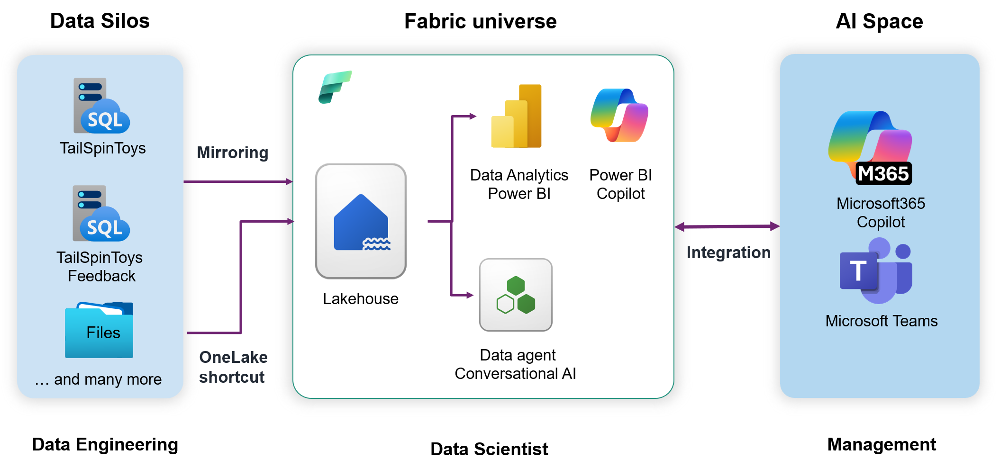

# Generic Migration Content
| **Narrative**  | **Notes**  |
|:-----|:-------|
| *Preparation: Familiarize yourself with Microsoft Fabric, Data Agents, Microsoft 365 Copilot, and Azure databases.* | **Microsoft Fabric and mirroring resources:** - [Microsoft Fabric Overview](https://learn.microsoft.com/en-us/fabric/fundamentals/microsoft-fabric-overview) - [OneLake Overview](https://learn.microsoft.com/en-us/fabric/onelake/onelake-overview) - [Mirroring in Fabric](https://learn.microsoft.com/en-us/fabric/mirroring/overview) - [OneLake Shortcuts](https://learn.microsoft.com/en-us/fabric/onelake/onelake-shortcuts) - [OneLake Explorer](https://learn.microsoft.com/en-us/fabric/onelake/onelake-file-explorer) - [Fabric Data Agent](https://learn.microsoft.com/en-us/fabric/data-science/concept-data-agent) - [Fabric Data Agent in Microsoft Copilot Studio](https://learn.microsoft.com/en-us/fabric/data-science/data-agent-microsoft-copilot-studio)  |

# Lab Overview
In this walkthrough, you will set up database mirroring from Azure SQL Managed Instance to Microsoft Fabric. This process enables you to replicate operational data into Fabric’s OneLake for real-time analytics, reporting, and AI—without affecting source database performance.

You will configure a mirrored database in Fabric, start the mirroring process, and monitor synchronization. You will then repeat the setup for an additional database.

At the end of the lab, you will have synchronized mirrored databases in Microsoft Fabric that support up-to-date analytics and downstream workloads.

By completing this lab, you will integrate mirrored data from Azure SQL Managed Instance and an external CSV file into a single Lakehouse, enabling centralized access and unified analytics.

# 1. Create a Mirrored Azure SQL Managed Instance Database

In this task, you will enable managed identity authentication on your Azure SQL Managed Instance and configure Microsoft Fabric to create a mirrored database. This step ensures secure access and sets up the foundation for data replication into Fabric’s analytical environment.

<table style="table-layout: auto; width: 100%;">
  <colgroup>
  <col style="width: 72%;">
  <col style="width: 28%;">
  </colgroup>

  <tr><th>Narrative</th><th>Notes</th></tr>
  <tr>
    <td>Go to <a href="https://app.fabric.microsoft.com">Microsoft Fabric</a> and sign in with the credentials provided for your lab environment. On the <b>Fabric Home</b> page, select <b>Fabric</b> in the bottom-left corner (1), select <b>Workspaces</b> (2), and open your predeployed workspace (3).</td>
    <td>Use the workspace assigned to you for this lab.</td>
  </tr>
  <tr>
    <td colspan="2" align="center">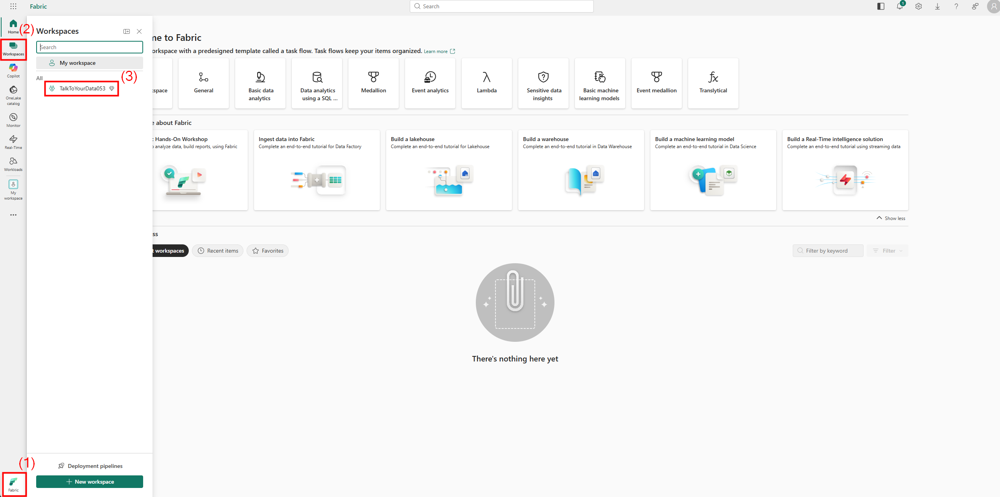</td>
  </tr>
  <tr>
    <td><b>Troubleshooting:</b> After signing in for the first time, check the <b>Workspaces</b> list. If your predeployed workspace is not visible, perform a hard refresh using <b>Ctrl+Shift+R</b> in Edge or Chrome, then open <b>Workspaces</b> again.</td>
    <td>The workspace list may initially show only <b>My workspace</b>. A hard refresh reloads the list so the assigned workspace becomes visible.</td>
  </tr>
  <tr>
    <td colspan="2" align="center">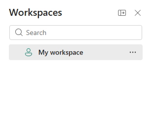</td>
  </tr>
  <tr>
    <td>In your workspace, select <b>New item (2)</b>. In the <b>New item</b> window, search for <b>Mirror (3)</b>, then select <b>Mirrored Azure SQL Managed Instance (4)</b> to start creating a mirrored database.</td>
    <td></td>
  </tr>
  <tr>
    <td colspan="2" align="center">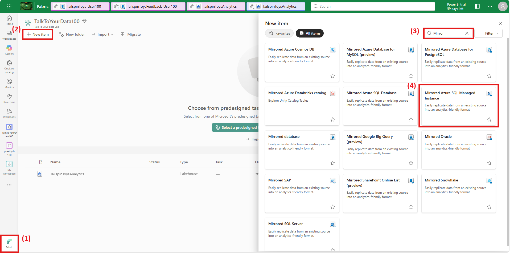</td>
  </tr>
  <tr>
    <td>In the <b>Choose a database connection to get started</b> window, select <b>Azure SQL Managed Instance</b> as the data source. Confirm that <b>Azure SQL Managed Instance</b> appears under <b>New sources</b>, then proceed to configure the connection.</td>
    <td></td>
  </tr>
  <tr>
    <td colspan="2" align="center">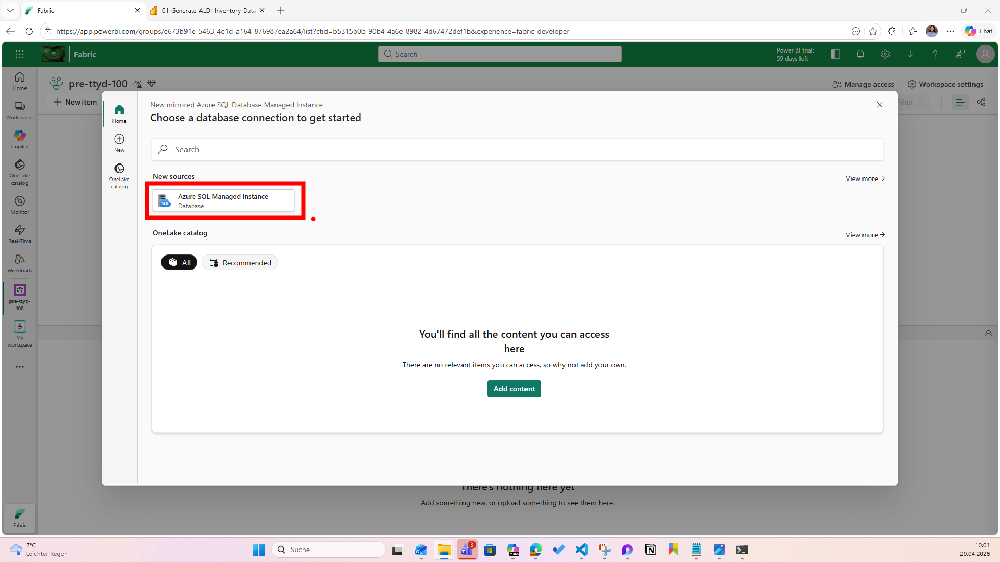</td>
  </tr>
  <tr>
    <td>In the <b>Server (1)</b> field, paste the Azure SQL Managed Instance server name: <code>sqlhackmi-z5v5uebsfrojm.8b4846304eec.database.windows.net</code>.</td>
    <td>Copy and paste the value exactly.</td>
  </tr>
  <tr>
    <td colspan="2" align="center">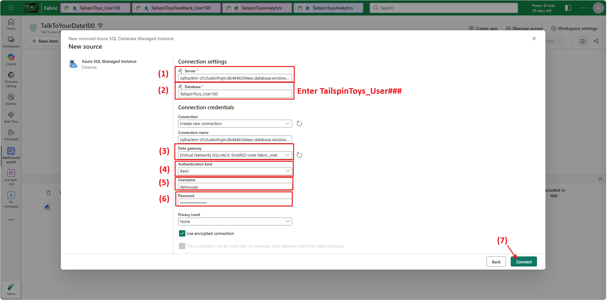</td>
  </tr>
  <tr>
    <td>In the <b>Database (2)</b> field, enter the <b>source database name:</b> <code>TailspinToys_User###</code></td>
    <td>Replace <code>###</code> with your assigned ttyd user postfix.</td>
  </tr>
  <tr>
    <td colspan="2" align="center"></td>
  </tr>
  <tr>
    <td>In the <b>Connection name</b> field, enter a short, unique name such as <code>TailspinToys_User###</code>. Use the same user postfix as the database name so that you can easily identify the connection later.</td>
    <td>Do not leave the automatically generated server name as the connection name.</td>
  </tr>
  <tr>
    <td colspan="2" align="center">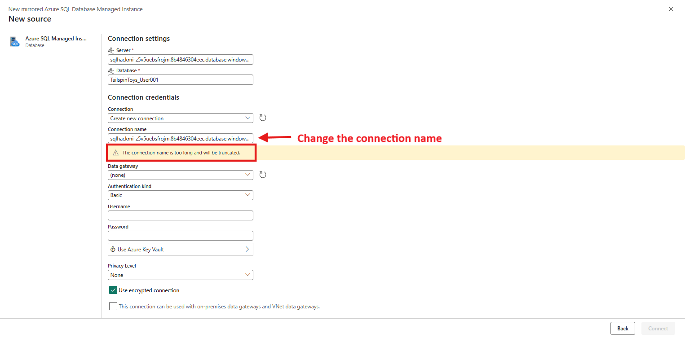</td>
  </tr>
  <tr>
    <td>
      

        <b>Troubleshooting: connection name is too long or already exists</b> 
        Fabric may show a warning that the automatically generated connection name is too long and will be truncated. Replace it with a short name such as <code>TailspinToys_User###</code> before selecting <b>Connect</b>. 
        If the shortened name is already in use, choose another short, descriptive name. Keep the Server, Database, Data gateway, Authentication kind, Username, and Password values unchanged.
      

    </td>
    <td>Connection names are workspace-scoped and must be unique.</td>
  </tr>
  <tr>
    <td colspan="2" align="center">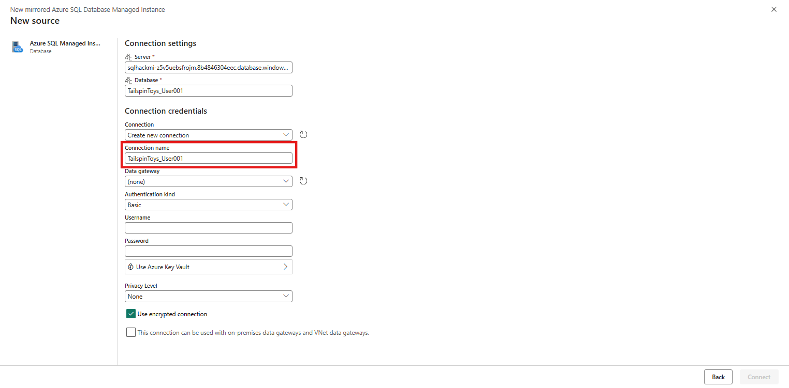</td>
  </tr>
  <tr>
    <td>Under <b>Data gateway (3)</b>, select the preconfigured gateway for the lab.</td>
    <td>If no gateway is listed, contact the lab facilitator before continuing.</td>
  </tr>
  <tr>
    <td colspan="2" align="center">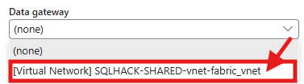</td>
  </tr>
  <tr>
    <td>For <b>Authentication Kind (4)</b>, select <b>Basic</b>. In <b>Username (5)</b>, enter: <code>demouser</code>. In <b>Password (6)</b>, enter: <code>Demo@pass1234567</code>.</td>
    <td>Username and password can be copied and pasted directly.</td>
  </tr>
  <tr>
    <td colspan="2" align="center"></td>
  </tr>
  <tr>
    <td>Ensure <b>Use encrypted connection</b> is checked to protect your data during transfer between Azure SQL Managed Instance and Microsoft Fabric. Click <b>Connect (7)</b> to validate the connection and continue.</td>
    <td>This may take a few minutes to complete.</td>
  </tr>
  <tr>
    <td colspan="2" align="center">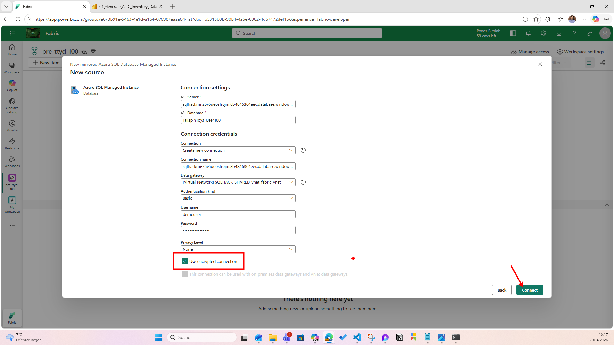</td>
  </tr>
  <tr>

  <tr>
    <td>On the <b>Choose data</b> screen, select <b>Select all</b> to replicate all available tables, then click <b>Connect</b>.</td>
    <td>This may take a few minutes.</td>
  </tr>
  <tr>
    <td colspan="2" align="center">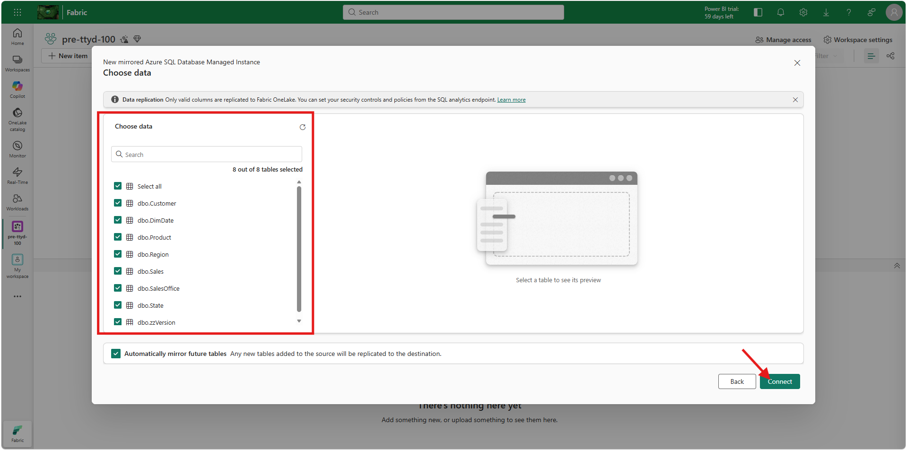</td>
  </tr>
  <tr>
    <td>On the <b>Destination</b> screen, review the mirrored database <b>Name</b> and verify that <b>Azure SQL Managed Instance</b> is shown as the source. Select <b>Create mirrored database</b> to start the mirroring process.</td>
    <td></td>
  </tr>
  <tr>
    <td colspan="2" align="center">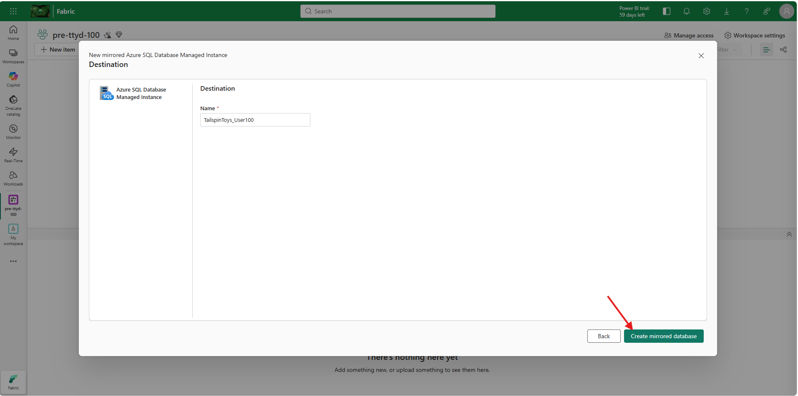</td>
  </tr>
  <tr>
    <td><b>Remain on this page and do not refresh it while Fabric completes the database mirroring setup.</b></td>
    <td>This may take a few minutes to complete.</td>
  </tr>
  <tr>
    <td colspan="2" align="center">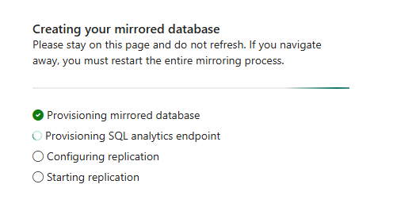</td>
  </tr>
</table>

# 2. Start the Mirroring Process and Monitor Fabric Mirroring

In this task, you will initiate the mirroring process between your Azure SQL Managed Instance and Microsoft Fabric. You will also learn how to monitor the status and health of the mirroring, ensuring continuous and reliable synchronization of data.

<table style="table-layout: auto; width: 100%;">
  <colgroup>
  <col style="width: 72%;">
  <col style="width: 28%;">
  </colgroup>

  <tr><th>Narrative</th><th>Notes</th></tr>
  <tr>
    <td>Open the <b>Monitor Replication</b> screen to view the replication status and confirm that the selected tables are being synchronized.</td>
    <td>Wait 2–5 minutes, then select <b>Monitor Replication</b>.</td>
  </tr>
  <tr>
    <td colspan="2" align="center">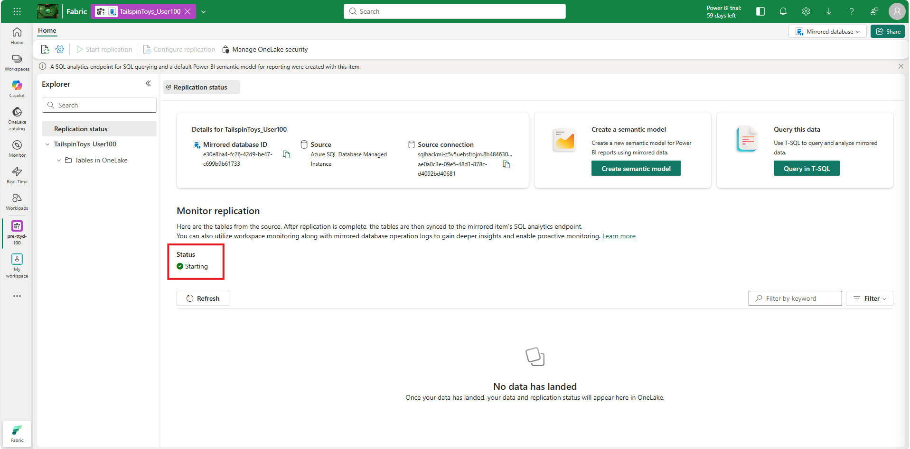</td>
  </tr>
  <tr>
    <td><b>Replication status:</b> <b>Running</b>: Replication is bringing snapshot and change data into OneLake. <b>Running with warning</b>: Replication is running with transient errors. <b>Stopping/Stopped</b>: Replication is not running. <b>Error</b>: Fabric reported a replication failure that requires investigation.</td>
    <td>If the tables or status are not visible, wait a few seconds and refresh the pane.</td>
  </tr>
  <tr>
    <td colspan="2" align="center">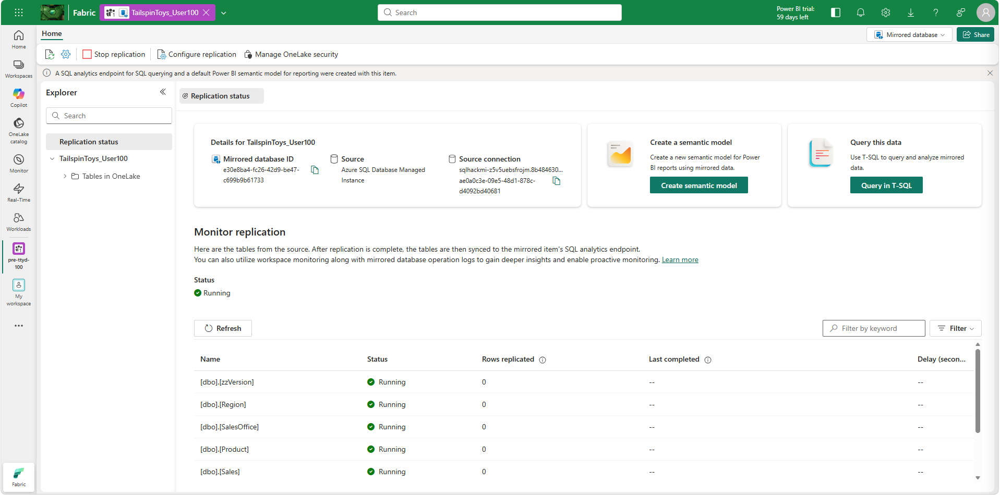</td>
  </tr>
</table>

# 3. Repeat the Azure SQL Managed Instance Mirroring Setup and Monitoring Process

In this task, you will repeat the setup and monitoring procedures for additional databases as needed. This reinforces the mirroring workflow and demonstrates how to scale data replication for multiple sources within your environment..

<table style="table-layout: auto; width: 100%;">
  <colgroup>
  <col style="width: 72%;">
  <col style="width: 28%;">
  </colgroup>

  <tr><th>Narrative</th><th>Notes</th></tr>
  <tr>
    <td>Repeat the mirroring workflow in your Fabric workspace: select <b>New item (2)</b>, search for <b>Mirror (3)</b>, and select <b>Mirrored Azure SQL Managed Instance (4)</b>.</td>
    <td></td>
  </tr>
  <tr>
    <td colspan="2" align="center"></td>
  </tr>
  <tr>
    <td>In the <b>Choose a database connection to get started</b> window, select <b>Azure SQL Managed Instance</b> as the data source. Confirm that <b>Azure SQL Managed Instance</b> appears under <b>New sources</b>, then proceed to configure the connection.</td>
    <td></td>
  </tr>
  <tr>
    <td colspan="2" align="center"></td>
  </tr>
  <tr>
    <td>In the <b>Server (1)</b> field, paste <code>sqlhackmi-z5v5uebsfrojm.8b4846304eec.database.windows.net</code>.</td>
    <td>Use the same SQL Managed Instance server as in the first mirroring setup.</td>
  </tr>
  <tr>
    <td colspan="2" align="center">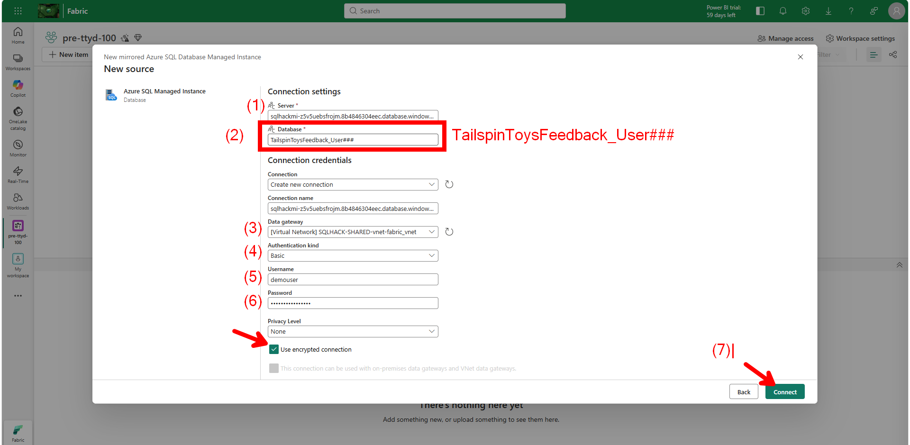</td>
  </tr>
  <tr>
    <td>In the <b>Database (2)</b> field, enter the <b>source database name:</b> <code>TailspinToysFeedback_User###</code></td>
    <td>Replace <code>###</code> with your assigned ttyd user postfix.</td>
  </tr>
  <tr>
    <td colspan="2" align="center"></td>
  </tr>
  <tr>
    <td>In the <b>Connection name</b> field, enter a short, unique name such as <code>TailspinToysFeedback_User###</code>. Use the same user postfix as the database name.</td>
    <td>Do not leave the automatically generated server name as the connection name.</td>
  </tr>
  <tr>
    <td colspan="2" align="center"></td>
  </tr>
    <tr>
    <td>
      

        <b>Troubleshooting</b> 
        If you see the error <b>"The specified connection name already exists. Try choosing a different name."</b>, go back to the connection name and choose another <b>short, descriptive name</b>. 
        Keep the same Server, Database, Data gateway, Authentication kind, Username, and Password values, then click <b>Connect</b> again.
      

    </td>
    <td>This happens when a connection with the same name already exists in your workspace.</td>
  </tr>
  <tr>
    <td colspan="2" align="center">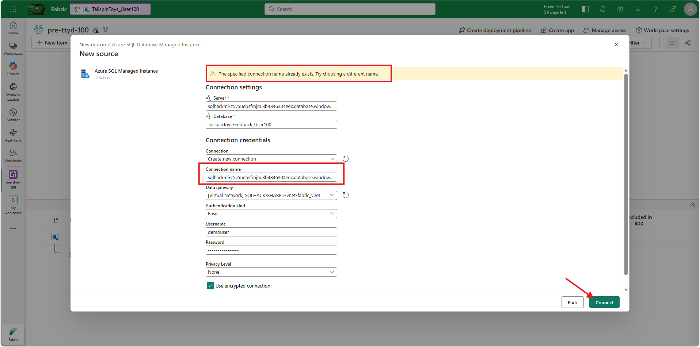
    </td>
  </tr>
  <tr>
    <td>Under <b>Data gateway (3)</b>, select the preconfigured gateway for the lab.</td>
    <td>If no gateway is listed, contact the lab facilitator before continuing.</td>
  </tr>
  <tr>
    <td colspan="2" align="center"></td>
  </tr>
  <tr>
    <td>For <b>Authentication kind (4)</b>, select <b>Basic</b>. Enter <code>demouser</code> in <b>Username (5)</b> and <code>Demo@pass1234567</code> in <b>Password (6)</b>. Ensure <b>Use encrypted connection</b> is checked, then select <b>Connect</b>.</td>
    <td>This validates the SQL Managed Instance connection.</td>
  </tr>
  <tr>
    <td colspan="2" align="center"></td>
  </tr>
  <tr>
    <td>On the <b>Choose data</b> screen, select all tables, then click <b>Connect</b>.</td>
    <td>This may take a few minutes.</td>
  </tr>
  <tr>
    <td colspan="2" align="center">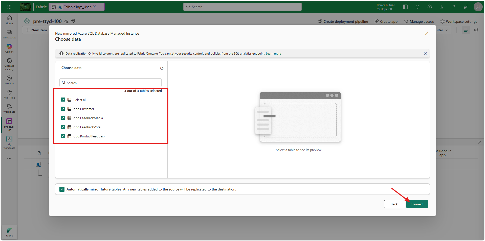</td>
  </tr>
    <tr>
    <td>In the <b>Destination</b> screen, review the <b>Name</b> of the mirrored database. Verify that <b>Azure SQL Database Managed Instance</b> is shown as the source. Click <b>Create mirrored database</b> to start the mirroring process.</td>
    <td></td>
  </tr>
  <tr>
    <td colspan="2" align="center">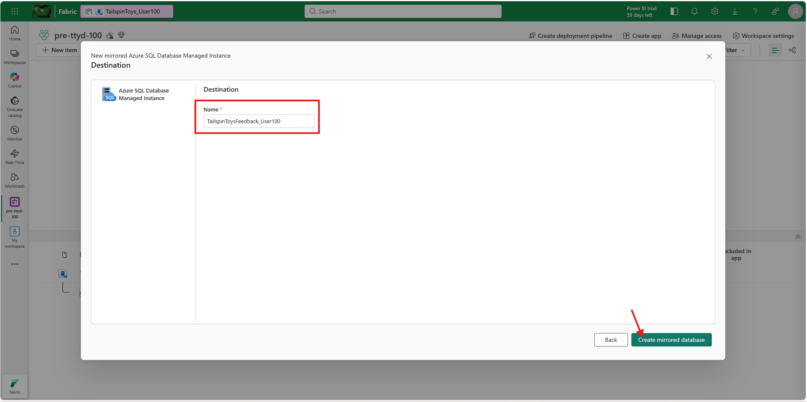</td>
  </tr>
</table>

# 4. Combine Mirrored Databases and a CSV File in One Lakehouse

In this task, you will integrate operational data mirrored from Azure SQL Managed Instance with external CSV data into a unified Lakehouse by creating shortcuts. This step enables centralized storage and analytics across multiple data sources.

<table style="table-layout: auto; width: 100%;">
<colgroup>
<col style="width: 72%;">
<col style="width: 28%;">
</colgroup>
<tr><th>Narrative</th><th>Notes</th></tr>
<tr><td><b>Recap:</b> You mirrored two databases in the previous steps. Now create a Lakehouse so you can combine and centralize data from multiple sources.</td><td></td></tr>
<tr><td>Open your workspace, select <b>New item (1)</b>, search for <b>Lakehouse (2)</b>, and select <b>Lakehouse (3)</b>.</td><td></td></tr>
<tr><td colspan="2" align="center">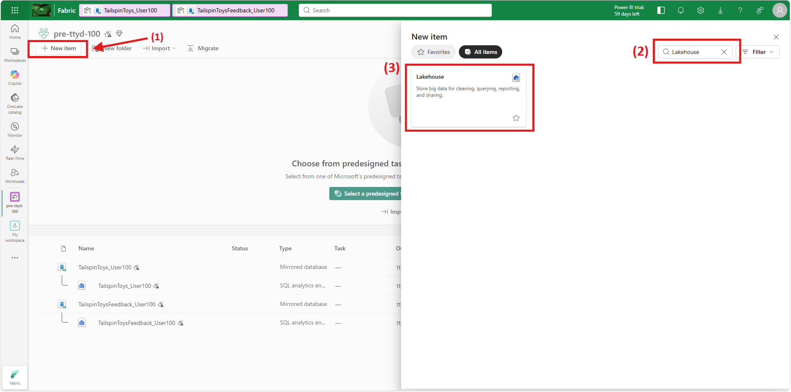</td></tr>
<tr><td>Enter a name for the Lakehouse and select <b>Create</b>.</td><td>Use <code>TailspinToysAnalytics</code> as the name and leave <b>Lakehouse schemas</b> enabled.</td></tr>
<tr><td colspan="2" align="center">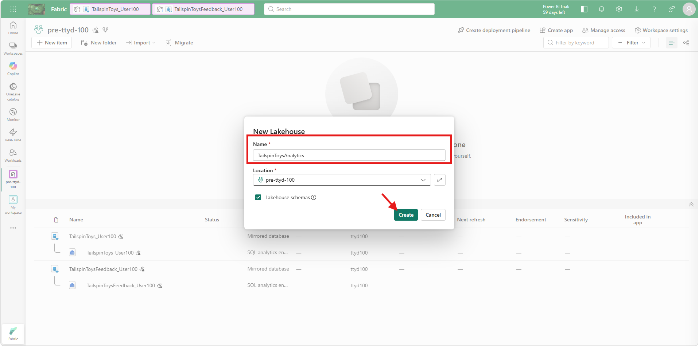</td></tr>
<tr><td>Open your new Lakehouse. In the <b>Tables</b> folder, open the <b>dbo</b> schema, select the ellipsis (...), and choose <b>New table shortcut</b>.</td><td>Create shortcuts to the required tables from the mirrored databases.</td></tr>
<tr><td colspan="2" align="center">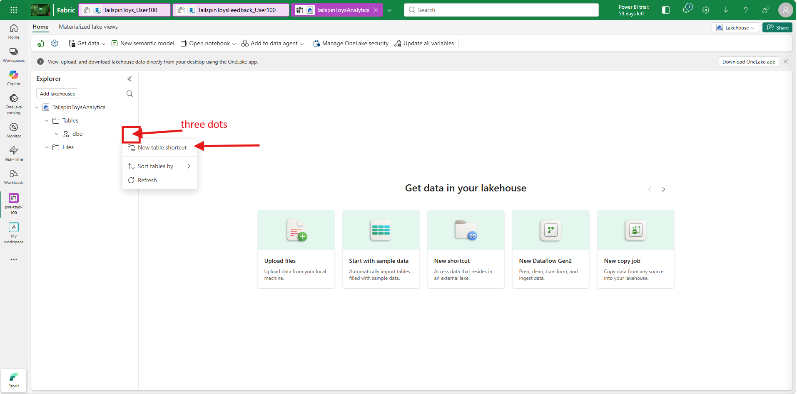</td></tr>
<tr><td>In the <b>New shortcut</b> window, under <b>Internal sources</b>, select <b>Microsoft OneLake</b>.</td><td>This option allows you to create shortcuts from mirrored databases stored in OneLake.</td></tr>
<tr><td colspan="2" align="center">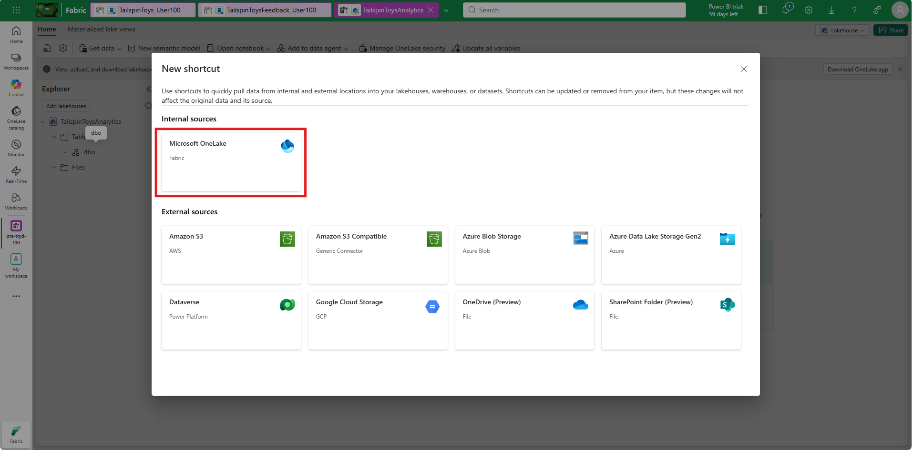</td></tr>
<tr><td>On the <b>Select a data source type</b> screen, locate the mirrored database <code>TailspinToys_User###</code>.</td><td>Select the <code>TailspinToys_User###</code> database created in this challenge.</td></tr>
<tr><td colspan="2" align="center">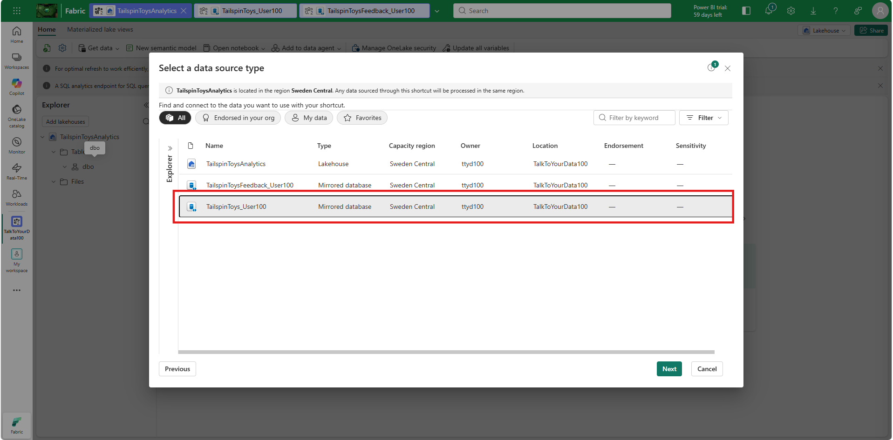</td></tr>
<tr><td>After the Data Lake Storage connection is validated, the <b>Connection method</b> dialog opens. Leave <b>Passthrough identity</b> selected. This uses each user's own permissions and is the recommended option for this lab. Click <b>Connect</b> to continue.</td><td>Use <b>Delegated identity</b> only when the lab explicitly requires a shared credential for all users.</td></tr>
<tr><td colspan="2" align="center">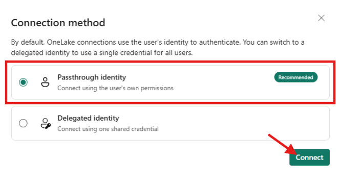</td></tr>
<tr><td>In the <b>New shortcut</b> screen, expand <b>Tables → dbo</b>. Select all tables except <b>zzVersion</b> (1), then click <b>Next (2)</b>.</td><td><b>Important:</b> Do not select <code>zzVersion</code>; it is not required for this lab.</td></tr>
<tr><td colspan="2" align="center">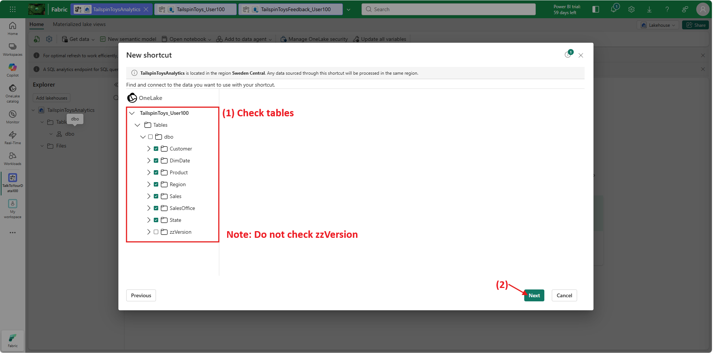</td></tr>
<tr><td>Review the Summary screen and confirm the selected tables. Verify that the shortcut location is your current Lakehouse. Click Create to create the shortcuts.</td><td></td></tr>
<tr><td colspan="2" align="center">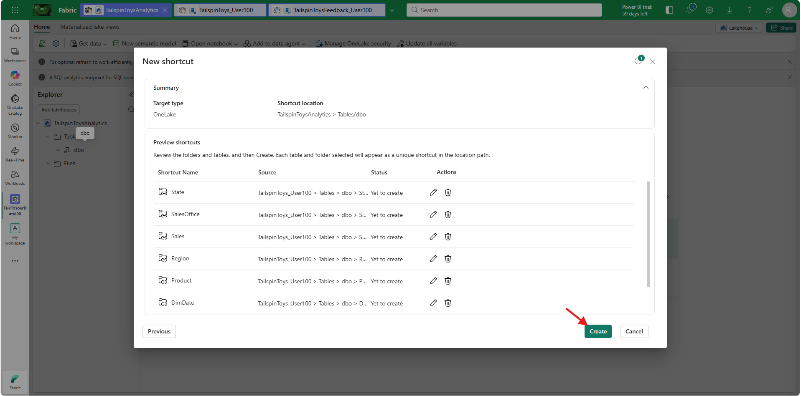</td></tr>
<tr><td>In the Explorer pane, confirm that the tables from <code>TailspinToys_User###</code> now appear under Tables. This confirms that the shortcuts were created successfully.</td><td></td></tr>
<tr><td colspan="2" align="center">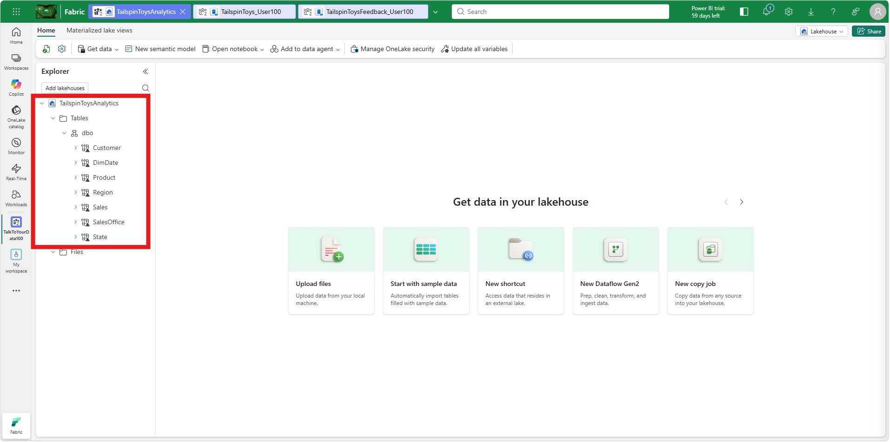</td></tr>

<tr><td colspan="2">
  

    Repeat the process by creating another <b>New table shortcut</b>.
  

</td></tr>

<tr><td>This time select the mirrored database <code>TailspinToysFeedback_User###</code>. Click Next to continue.</td><td></td></tr>
<tr><td colspan="2" align="center">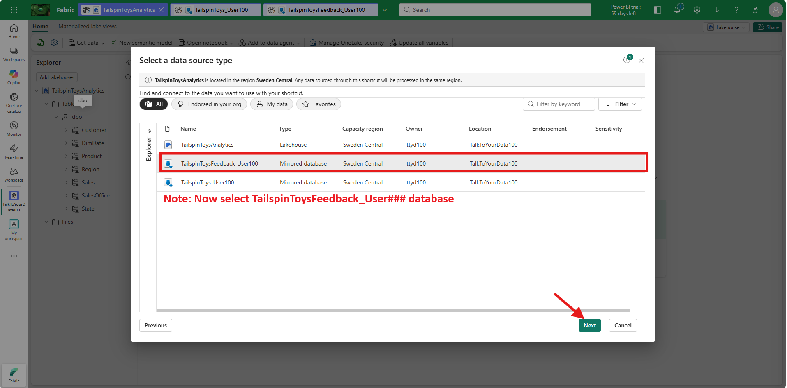</td></tr>
<tr><td>Expand <b>Tables → dbo</b>. Select all tables except <b>Customer</b> (1), then click <b>Next (2)</b>.</td><td><b>Important:</b> Do not select <b>Customer</b>; it already exists from the first mirrored database.</td></tr>
<tr><td colspan="2" align="center">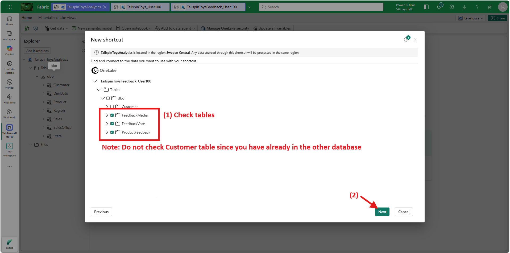</td></tr>
<tr><td>Review the Summary screen and confirm the selected tables. Verify the shortcut destination is the same Lakehouse. Click Create to finalize the shortcuts.</td><td></td></tr>
<tr><td colspan="2" align="center">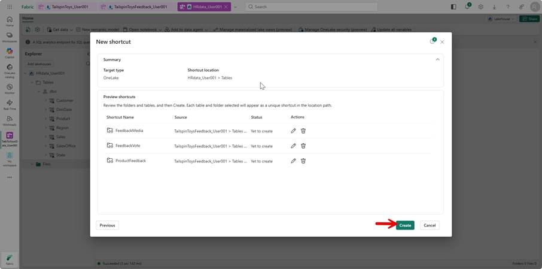</td></tr>
<tr><td>Next, create a file shortcut. Select the <b>ellipsis (...)</b> next to the <b>Files</b> folder in the Explorer pane.</td><td>This lets you integrate the external CSV data with the mirrored databases in the same Lakehouse.</td></tr>
<tr><td colspan="2" align="center">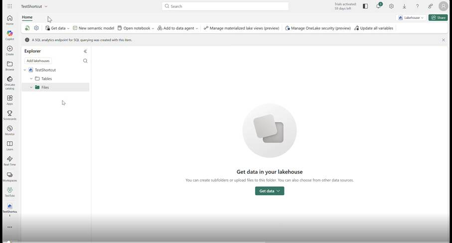</td></tr>
<tr><td>Select <b>New shortcut (2)</b> to start creating a shortcut to an external data source.</td><td></td></tr>
<tr><td colspan="2" align="center">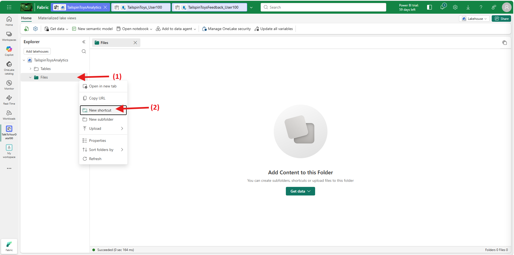</td></tr>
<tr><td>In the <b>New shortcut</b> window, under <b>External sources</b>, select <b>Azure Data Lake Storage Gen2</b>.</td><td>This connects the Lakehouse to the external files used in the lab.</td></tr>
<tr><td colspan="2" align="center">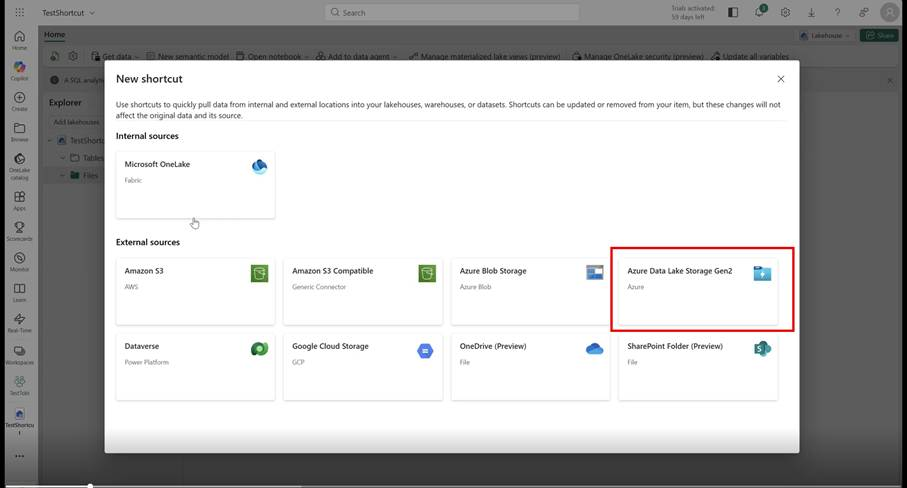</td></tr>
<tr><td>Select <b>New connection</b> and paste <code>https://employeedata0409.dfs.core.windows.net/</code> (1). Click <b>Next (2)</b> to continue.</td><td>Confirm the deployment date with the lab facilitator or deployment output if needed.</td></tr>
<tr><td colspan="2" align="center">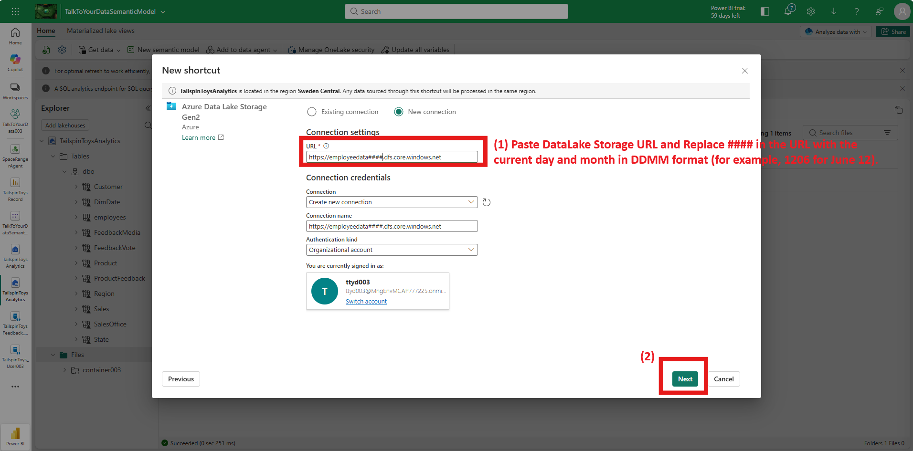</td></tr>
<tr><td>Select the folder with <b><code>your user number</code> (1)</b>. Click <b>Next (2)</b> to continue.</td><td>Selecting your user-specific folder ensures you only access and work with the files intended for your lab activities.</td></tr>
<tr><td colspan="2" align="center">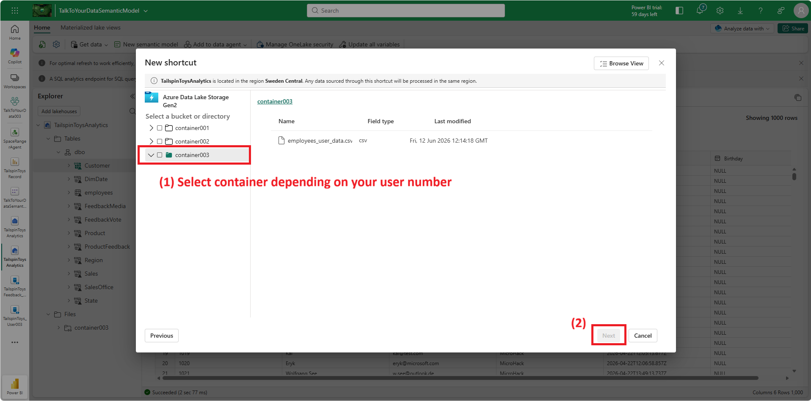</td></tr>
<tr><td>Review the <b>selected folder (1)</b> and click <b>Skip (2)</b>. No transformation is required before creating the shortcut.</td><td></td></tr>
<tr><td colspan="2" align="center">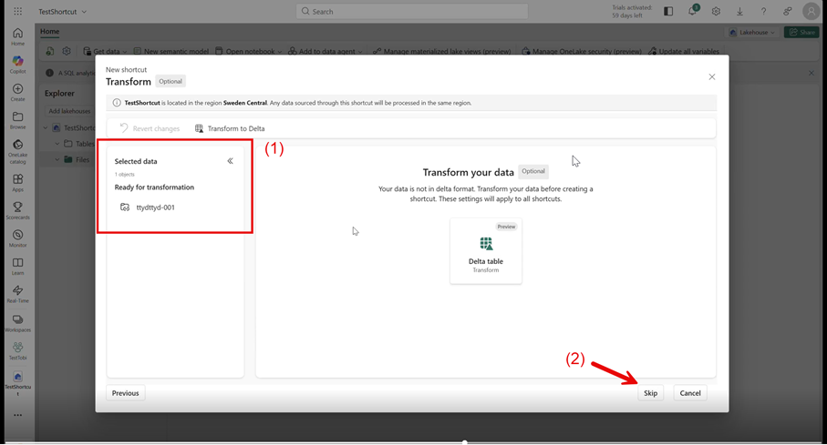</td></tr>
<tr><td>Click <b>Create</b> to create the shortcut in your Lakehouse.</td><td></td></tr>
<tr><td colspan="2" align="center">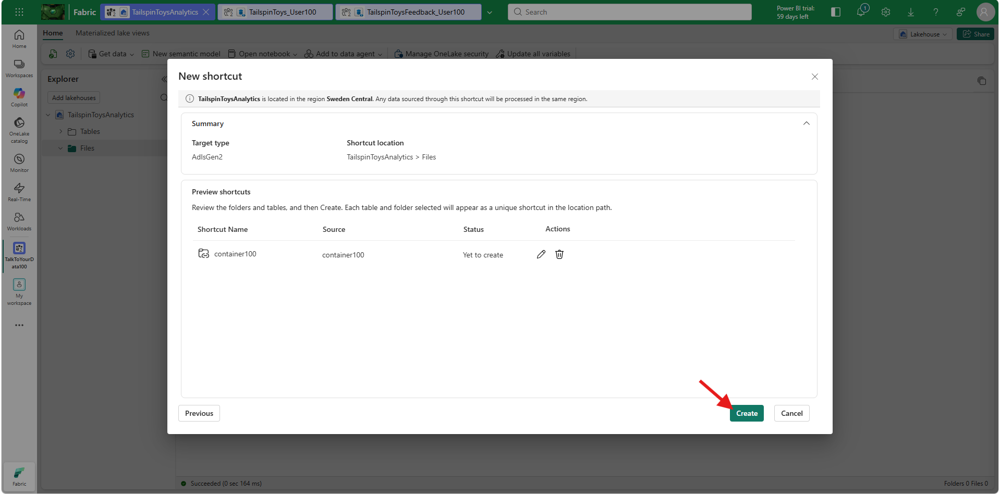</td></tr>
<tr><td>Verify that the shortcut was created.</td><td>If it does not appear immediately, select the ellipsis (...) next to <b>Files</b> and choose <b>Refresh</b>.</td></tr>
<tr><td colspan="2" align="center">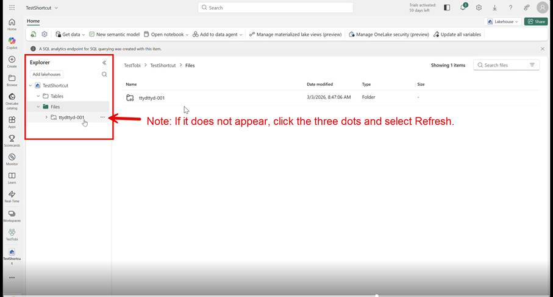</td></tr>
<tr><td>Open <b>container###</b> and verify that the CSV file is visible.</td><td>Replace <code>###</code> with the user number shown in your environment.</td></tr>
<tr><td colspan="2" align="center">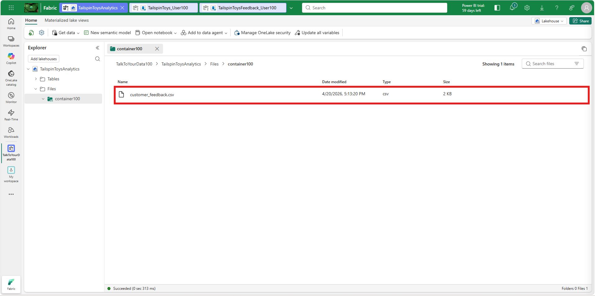</td></tr>
<tr><td>Expand the <b>Files</b> folder, open the shortcut folder with your user name, locate the CSV file (for example, <code>employees_user_data.csv</code>), and select its ellipsis (...).</td><td></td></tr>
<tr><td colspan="2" align="center">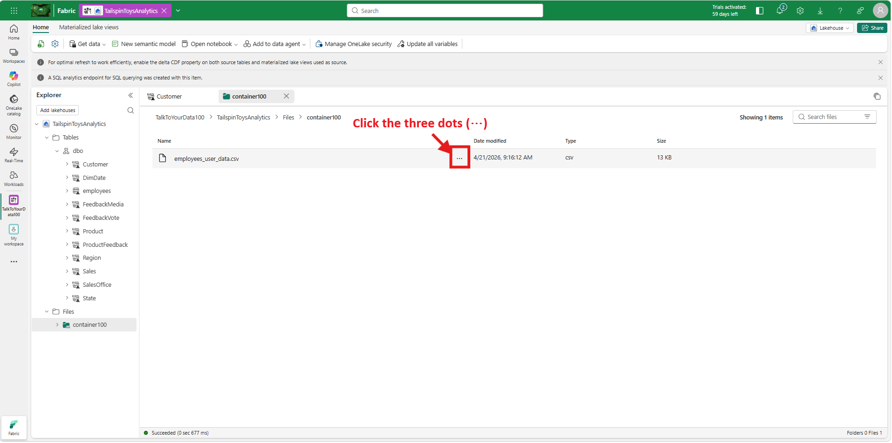</td></tr>
<tr><td>From the context menu, select <b>Load to Tables (1)</b>, then choose <b>New table (2)</b>.</td><td></td></tr>
<tr><td colspan="2" align="center">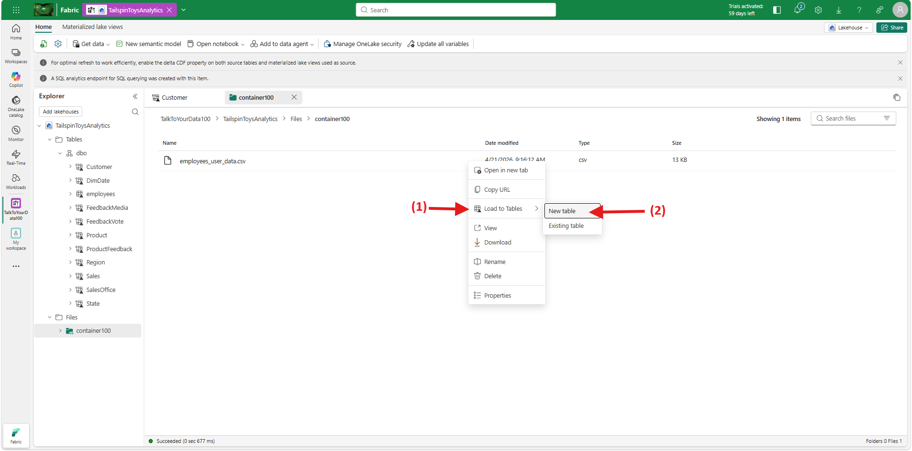</td></tr>
<tr><td>Change the table name to <b>employees</b> (1). Set the separator to <b>, (comma)</b> (2). Review the settings, then click <b>Load (3)</b>.</td><td>CSV files use commas to separate values, so selecting a comma ensures data loads into the correct columns.</td></tr>
<tr><td colspan="2" align="center">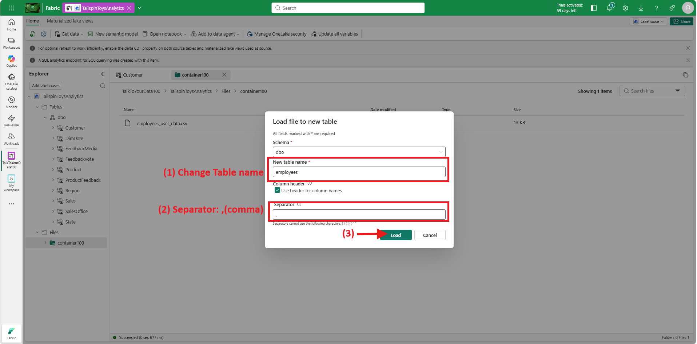</td></tr>
<tr><td>In the Explorer pane, locate Tables. Click the three dots (⋯) next to <b>Tables (1)</b>. Select <b>Refresh (2)</b>. Confirm that a table named <b>employees</b> appears under <b>Tables (3)</b>.</td><td>This confirms that the CSV data has been successfully converted into a Lakehouse table.</td></tr>
<tr><td colspan="2" align="center">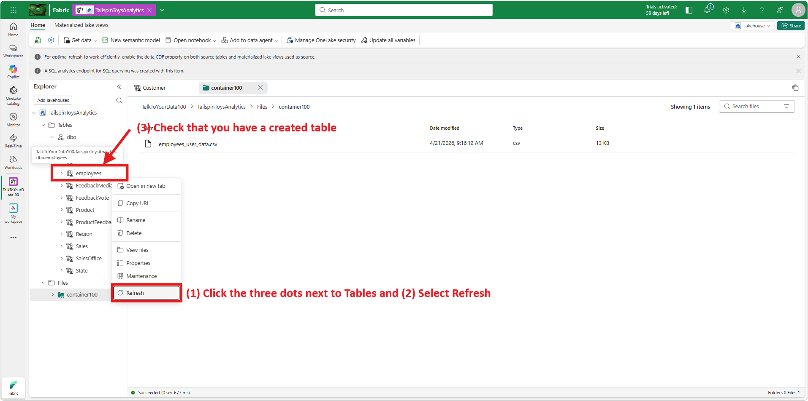</td></tr>
</table>

## Summary

In this lab, you have accomplished the following:

- Created mirrored Azure SQL Managed Instance databases to replicate operational data into OneLake.
- Started the mirroring process and monitored Fabric mirroring to ensure successful synchronization and data consistency.
- Built a unified Lakehouse in Microsoft Fabric OneLake by combining mirrored Azure SQL databases with external CSV files, establishing a centralized and analytics-ready data foundation.

[Next Challenge 2 Step-by-Step Solution](../challenge-02/solution-02.md)
