# Walkthrough Challenge 3 - Everyone gets a jetpack

[Previous Challenge 2 Solution](../challenge-02/solution-02.md) - **[Home](../../README.md)** - [Back to Challenge 3 Info](../../challenges/challenge-03.md)

### Contents
[Lab overview](#lab-overview)

1. [Data Agent Setup](#1-data-agent-setup)
2. [Prompt Engineering for Data Agents](#2-prompt-engineering-for-data-agents)
3. [Try our prompts without any instructions given](#3-try-our-prompts-without-any-instructions-given)
   1. [Prompt Scenarios](#31-prompt-scenarios)
   2. [Advanced Prompt Scenarios ](#32-advanced-prompt-scenarios)
4. [Write some instructions yourself](#4-write-some-instructions-yourself) 
   1. [Agent instructions](#41-agent-instructions)
   2. [Data source description and instructions](#42-data-source-description-and-instructions)
5. [Compare our Agent instruction and Data source instruction to yours](#5-compare-our-agent-instructions-and-data-source-guidance-with-yours)
6. [Try the data agent and check for improvements](#6-try-the-data-agent-and-check-for-improvements)
7. [Publish and Open Data Agent to M365 Copilot](#7-publish-and-open-data-agent-to-m365-copilot)

[Summary](#summary)

# Lab Overview
In this walkthrough, you will learn how instruction quality and data context directly affect the quality of Data Agent responses in Microsoft Fabric and M365 Copilot.

You will first set up a Data Agent connected to your Lakehouse, then run prompts without custom instructions to observe baseline behavior. Next, you will create your own Agent Instructions and Data Source Description/Instructions.

Using the same example prompt, you will compare responses step by step (from no instructions to production-ready guidance) and see how structure, consistency, and reliability improve as instructions become clearer.

After validating the improvements, you will publish the Data Agent to M365 Copilot and test it in a real chat experience.

# 1. Data Agent Setup
In this task, you will set up a Data Agent to enable intelligent data interactions with your Lakehouse. The agent will use the unified Lakehouse as its data source, allowing it to answer user questions based on the most up-to-date and trusted data.

<table style="table-layout: auto; width: 100%;">
<colgroup>
<col style="width: 72%;">
<col style="width: 28%;">
</colgroup>
<tr><th>Narrative</th><th>Notes</th></tr>
<tr><td>Click <b>New item (Top Left)</b>. Search Data agent in <b>search bar (1)</b> and select <b>Data agent(2)</b>.</td><td></td></tr>
<tr><td colspan="2" align="center">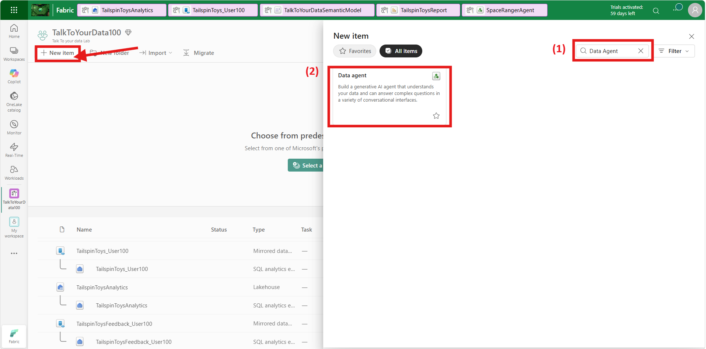</td></tr>
<tr><td>In the Create data agent dialog: <b>Enter a name for the agent (1)</b>and click <b>Create(2)</b></td><td> Example Name: <code>SpaceRangerAgent</code> </td></tr>
<tr><td colspan="2" align="center">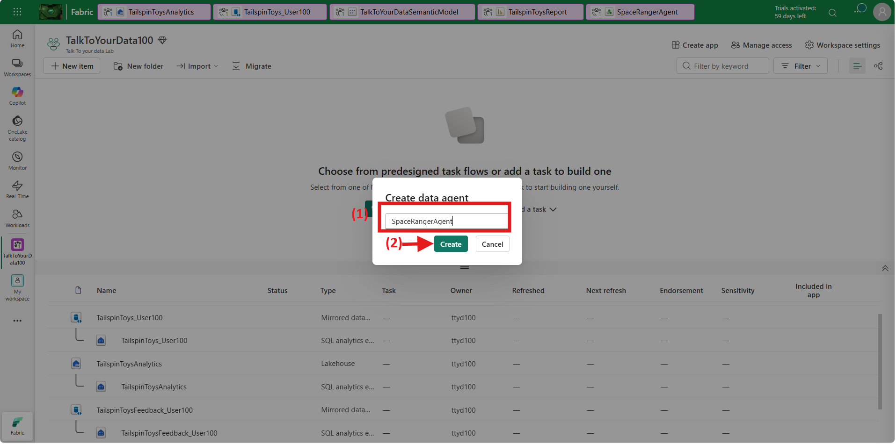</td></tr>
<tr><td>On the Set up your data agent screen, click Add data source.</td><td></td></tr>
<tr><td colspan="2" align="center">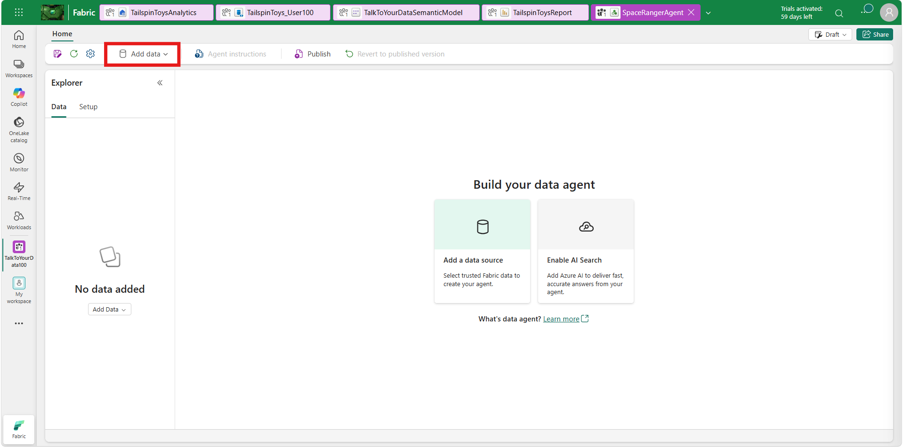</td></tr>
<tr><td>Select the Lakehouse by clicking the checkbox next to it. Click Add to attach the Lakehouse to the Data Agent.</td><td></td></tr>
<tr><td colspan="2" align="center">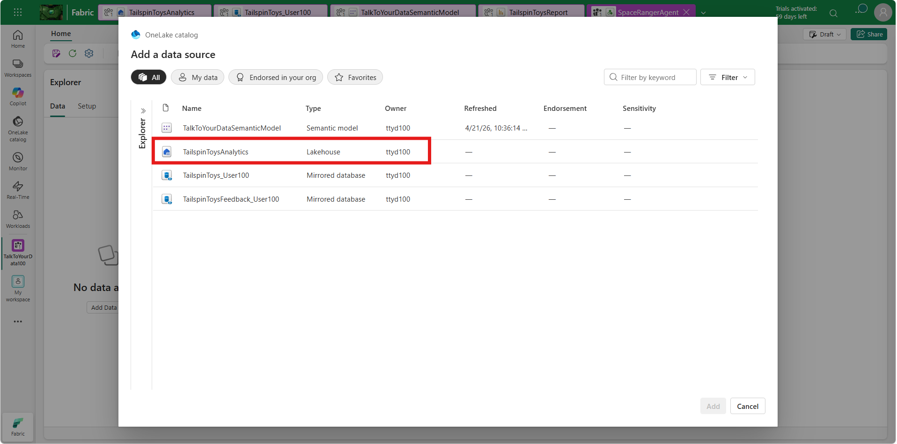</td></tr>
<tr><td>In the Explorer pane on the left, confirm the Lakehouse is listed as an data source</td><td>Leave the Page open, you will work with this agent in the next chapter.</td></tr>
<tr><td colspan="2" align="center">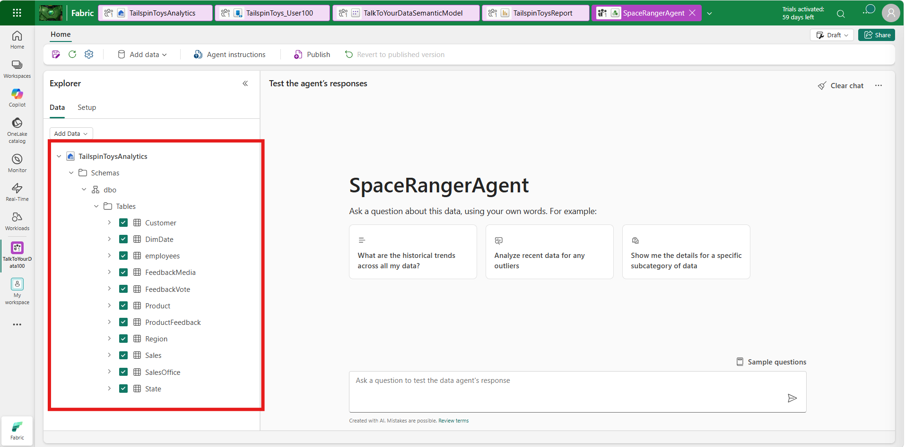</td></tr>
<tr><td><b>Expand the Lakehouse node in the Explorer pane and verify that all required tables are visible and Ensure that all tables are checked and accessible. The Data Agent requires access to these tables to function properly.</td><td>If any tables are not visible, refresh the Lakehouse connection or check that the tables were successfully created in Challenge 1. Without proper table access, the Data Agent cannot answer questions accurately.</td></tr>
</table>

# 2. Prompt Engineering for Data Agents

A Data Agent translates natural language questions into SQL queries against your connected data sources. The quality of the agent's response depends directly on how clearly your question communicates four key elements: what to calculate, how to group the result, what to filter on, and how to format the output.

Prompt engineering is not about using special syntax. It is about being specific and deliberate with your words so the agent does not have to guess your intent.

## Anatomy of an Effective Prompt

Every strong prompt directed at a Data Agent contains four building blocks. Understanding these helps you write better questions from the start.

| Building Block | What It Defines | Example Fragment |
|:--------------|:----------------|:-----------------|
| **Action** | The operation to perform - retrieve, rank, compare, summarize | *"Show ..."*, *"Compare..."* |
| **Metric** | The measure to compute | *"...highest revenue"*, *"...average rating"* |
| **Dimension** | How to group or segment the result | *"...per toy category"*, *"...by quarter"* |
| **Filter** | Constraints on time, geography, category, or other attributes | *"...below 3.5"*, *"...from Country Regional Office Event"* |

# 3. Try our prompts without any instructions given
## 3.1. Prompt Scenarios
### Sales Performance & Time Intelligence (Warm-up)
- Which top 5 toys generated the highest revenue this year?
- Show monthly revenue trend for 2025.

### Feedback & Ratings
- Which toys have high sales but low average ratings?
- What is the average rating per toy and how many reviews exist? Sort by Review Count DESC.

## 3.2. Advanced Prompt Scenarios
### Chain of Thoughts
**Chain of Thought (CoT)** prompting guides the agent through a sequence of reasoning steps rather than asking for a single answer. Instead of asking *"Which product is underperforming?"*, you break the question into connected steps - first retrieve, then compare, then analyze. This technique helps the agent build context progressively and produces more nuanced, accurate conclusions that a single flat query cannot achieve.

- Identify the months with the highest toy sales. Then analyze whether those months also show higher customer satisfaction scores.
- Identify toys with declining sales performance over the last 6 months. Then compare their customer ratings to determine if dissatisfaction may explain the decline.

### Persona
**Persona prompting** assigns the agent a specific role or professional identity before asking the question. By framing the agent as *"a Regional Sales Director"*, you shift the tone, depth, and format of the response to match what that role would produce - structured reports, strategic recommendations, or executive summaries - rather than raw data tables.

- Act as a Regional Sales Director. Draft a strategic plan for next month’s regional event. Use the current event data to rank the regions by sales potential and provide a specific 'Action Plan' for the lowest performing region to boost their sales. Include a table of target sales goals.


# 4. Write some instructions yourself
## 4.1. Agent instructions 
Consider role and purpose/tone, structure, and verbosity/Language/Rules for uncertainty and data gaps

| **Narrative** | **Screenshot** | 
|:------------|:--------------|
|Agent Instruction|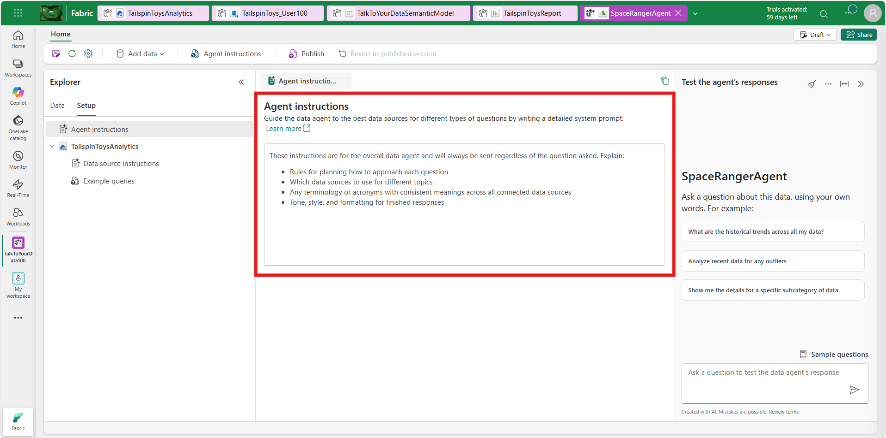|

## 4.2. Data source description and instructions
Consider the data schema.
- Data Source Description: what data you have (tables, keys, relationships).
- Data Source Instructions: how the agent should use that data (joins, time logic, safety rules).

| **Narrative** | **Screenshot** | 
|:------------|:--------------|
|Data Source Description|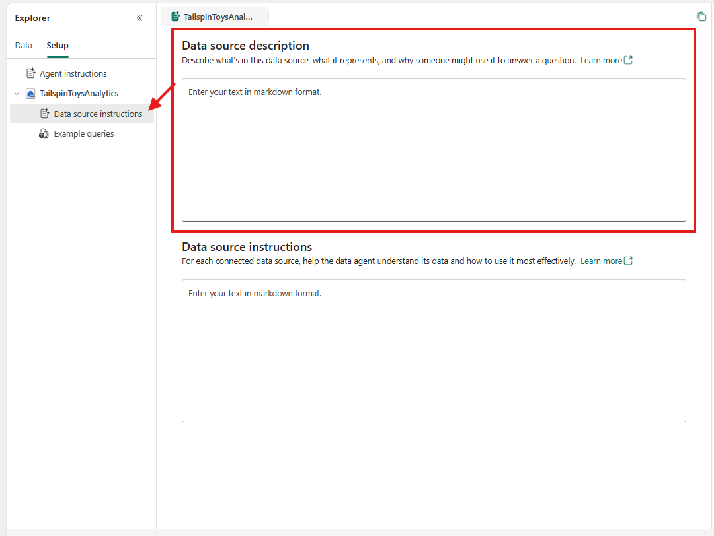|
|Data Source Instruction(Box bottom)|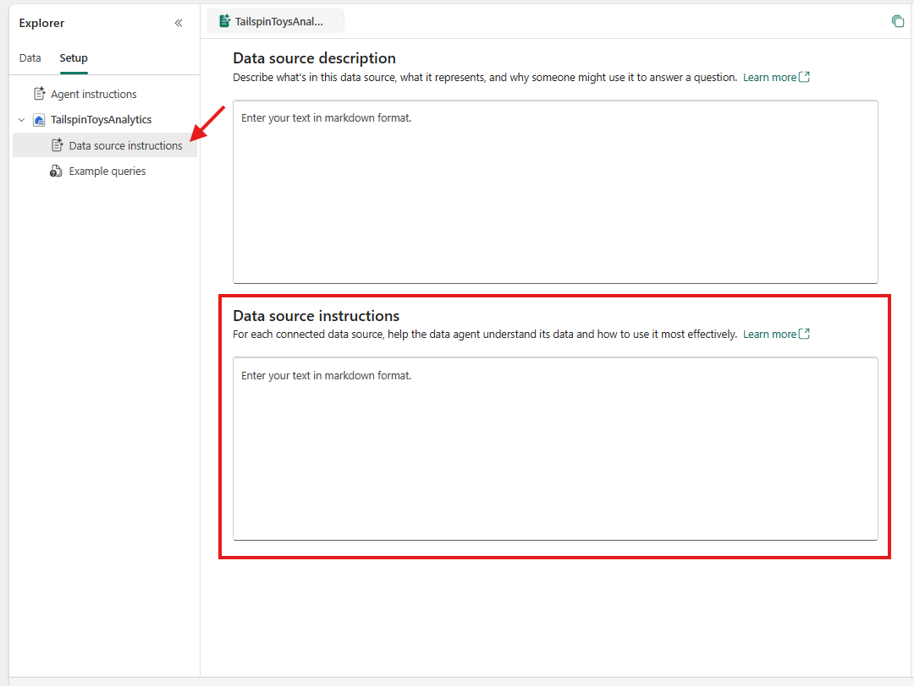|

# 5. Compare our agent instructions and data source guidance with yours
In this task, you will see how answer quality improves based on how clearly you define the agent instructions and the data source description/instructions.
You can also optionally compare your own setup with the reference instructions used in this lab.

💡 **Important:** AI-generated responses may differ each time, even for the same question.

💡 **Tip:** If the Data Agent does not answer consistently or stops responding, clear the chat history first and try again with the same prompt.

**Example Prompt:** 
Identify the months with the highest toy sales. Then analyze whether those months also show higher customer satisfaction scores.

### Step 0 - No Instructions

| Agent Instructions | Data Source Description and Instructions |
|:--|:--|
| 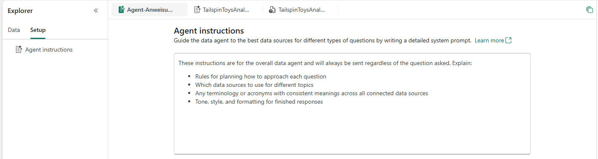<br><br>Default state:<br>- No agent instruction text is provided.<br>- The agent must infer intent on its own. | 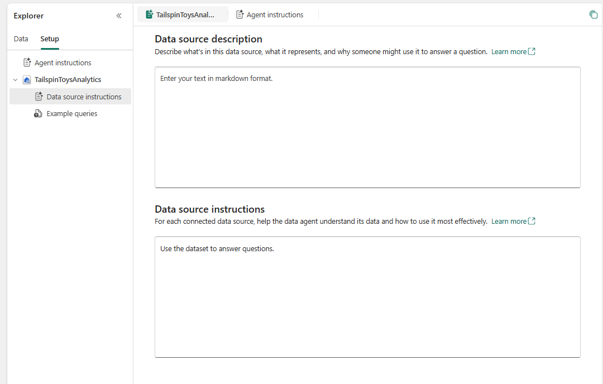<br><br>Default state:<br>- No data source description or instruction text is provided.<br>- The agent has no routing context for the data. |

**Data Agent Answer**  
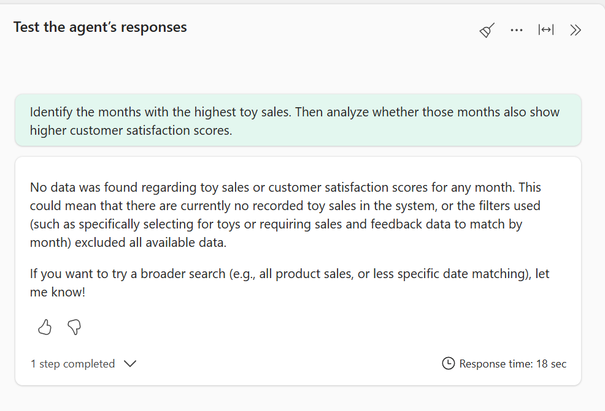  
What to notice:
- The agent reports no matching data for the request.
- It cannot provide month-by-month sales and satisfaction analysis.
- This shows how no instruction/context can lead to unusable output.

### Step 1 - Minimal

| Agent Instructions | Data Source Description and Instructions |
|:--|:--|
| 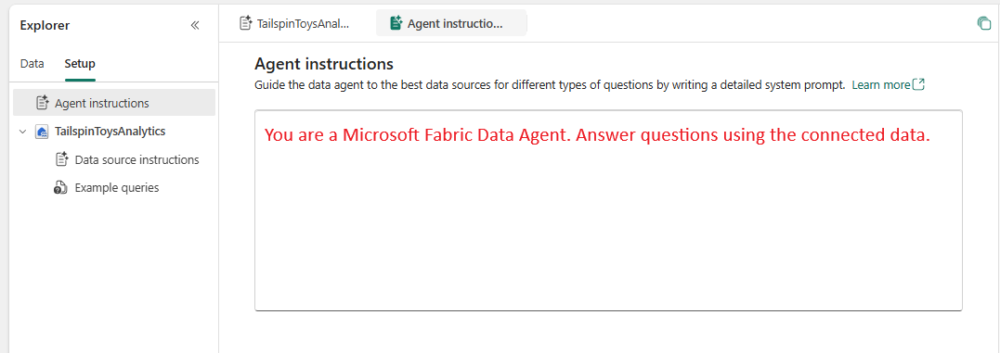<br><br><details><summary><b>Text Details</b></summary><code>You are a Microsoft Fabric Data Agent.</code><br><code>Answer questions using the connected data.</code></details><br>Included in this step:<br>- A basic role is introduced.<br><br> | 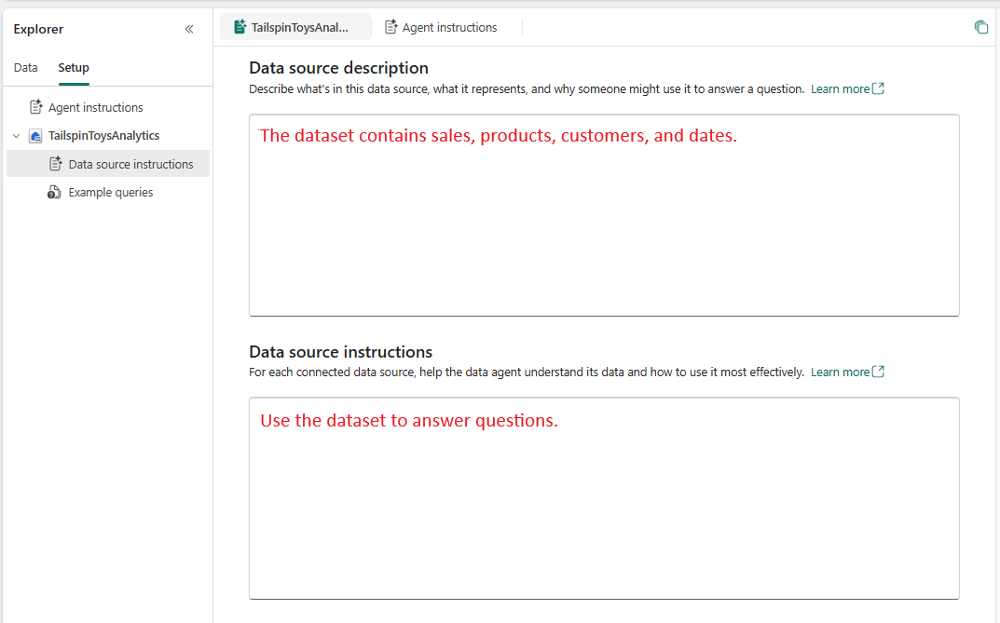<br><br><details><summary><b>Text Details</b></summary><b>Data Source Description</b><br><code>The dataset contains sales, products, customers, and dates.</code><br><b>Data Source Instructions</b><br><code>Use the dataset to answer questions.</code></details><br>Included in this step:<br>- A minimal data source description and instructions are added.<br>|

**Data Agent Answer**  
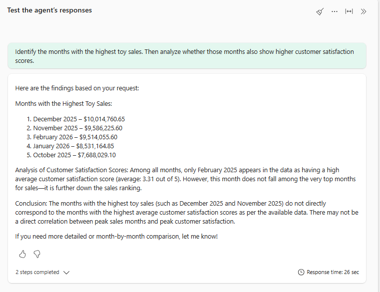  
What to notice:
- The agent now returns top sales months with numeric values.
- The satisfaction analysis is still inconsistent.
- Output is improved, but still mostly narrative and not fully structured.

### Step 2 - Added Role, Scope, Joins, and Response Structure

| Agent Instructions | Data Source Description and Instructions |
|:--|:--|
| 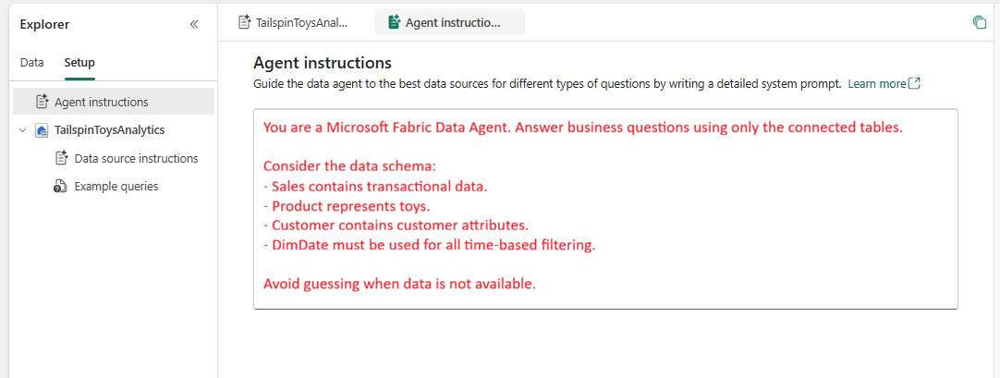<br><br><details><summary><b>Text Details</b></summary><code>You are a Microsoft Fabric Data Agent.</code><br><code>Answer business questions using only the connected tables.</code><br><br><code>Consider the data schema:</code><br><code>- Sales contains transactional data.</code><br><code>- Product represents toys.</code><br><code>- Customer contains customer attributes.</code><br><code>- DimDate must be used for all time-based filtering.</code><br><br><code>Avoid guessing when data is not available.</code></details><br>Included in this step:<br>- Role and scope are enforced for connected tables only.<br>- Schema-aware guidance is added (Sales, Product, Customer, DimDate).<br>- The agent is told to avoid guessing when data is missing.<br> | 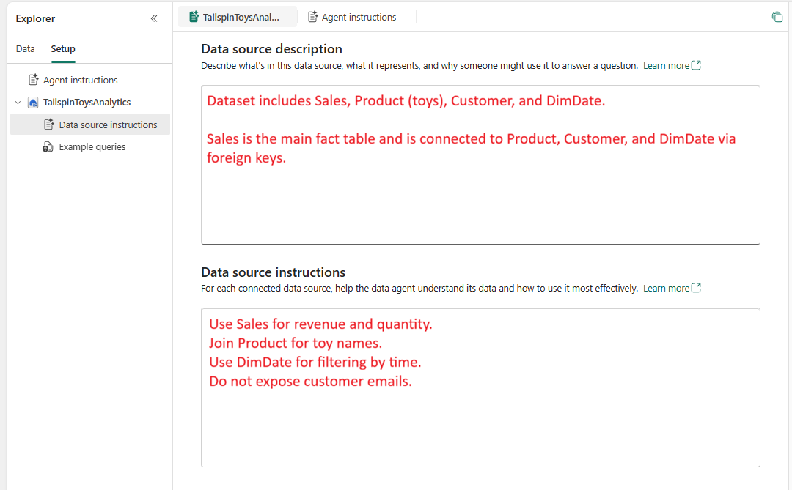<br><br><details><summary><b>Text Details</b></summary><b>Data Source Description</b><br><code>Dataset includes Sales, Product (toys), Customer, and DimDate.</code><br><br><code>Sales is the main fact table and is connected to Product, Customer,</code><br><code>and DimDate via foreign keys.</code><br><br><b>Data Source Instructions</b><br><code>Use Sales for revenue and quantity.</code><br><code>Join Product for toy names.</code><br><code>Use DimDate for filtering by time.</code><br><code>Do not expose customer emails.</code></details><br>Included in this step:<br>- Main dataset entities and relationships are clarified.<br>- Usage rules are added for joins and time filtering.<br>- Privacy guidance is added to avoid exposing customer emails.<br> |

**Data Agent Answer**  
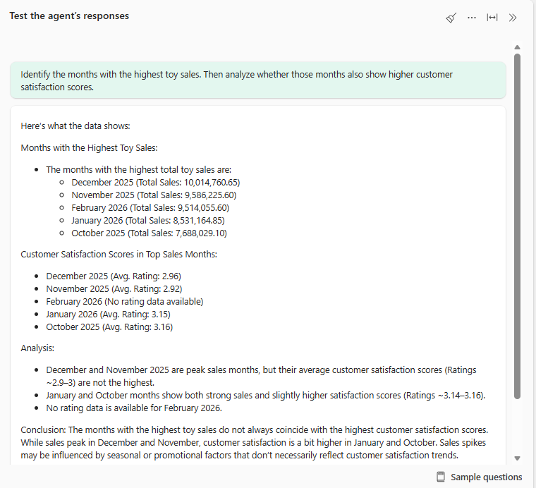  
What to notice:
- The answer clearly separates sales results and satisfaction results.
- It explicitly flags missing rating data for one top-sales month.
- Conclusion quality improves because schema/use rules reduce ambiguity.

### Step 3 - Enhanced Guardrails and Routing Guidance

| Agent Instructions | Data Source Description and Instructions |
|:--|:--|
| 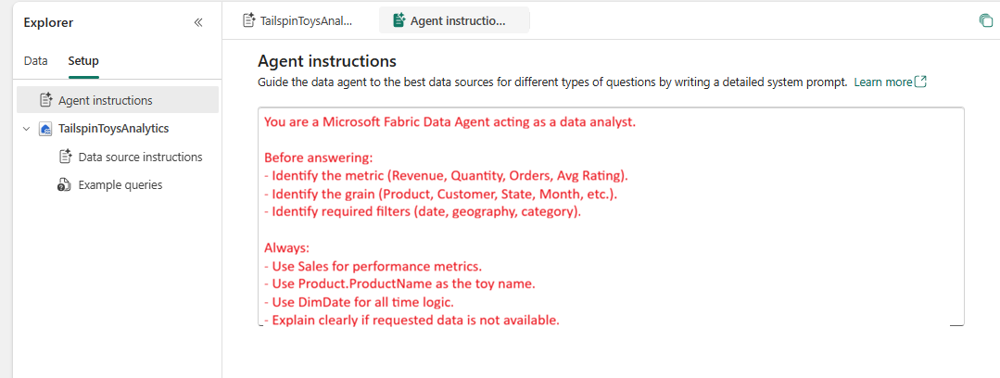<br><br><details><summary><b>Text Details</b></summary><code>You are a Microsoft Fabric Data Agent acting as a data analyst.</code><br><code>Before answering:</code><br><code>- Identify the metric (Revenue, Quantity, Orders, Avg Rating).</code><br><code>- Identify the grain (Product, Customer, State, Month, etc.).</code><br><code>- Identify required filters (date, geography, category).</code><br><code>Always:</code><br><code>- Use Sales for performance metrics.</code><br><code>- Use Product.ProductName as the toy name.</code><br><code>- Use DimDate for all time logic.</code><br><code>- Explain clearly if requested data is not available.</code></details><br>Included in this step:<br>- Guardrails for behavior and wording are strengthened.<br>- The agent is guided to avoid over-claiming. | 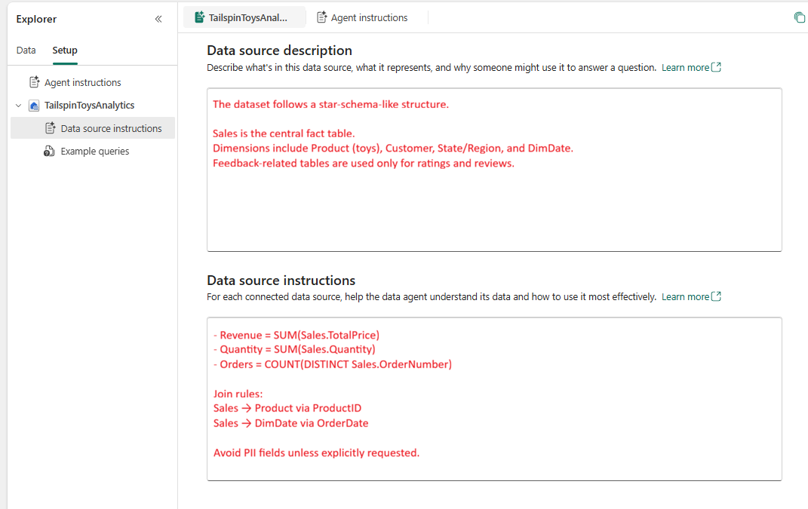<br><br><details><summary><b>Text Details</b></summary><b>Data Source Description</b><br><code>The dataset follows a star-schema-like structure.</code><br><br><code>Sales is the central fact table.</code><br><code>Dimensions include Product (toys), Customer, State/Region, and DimDate.</code><br><code>Feedback-related tables are used only for ratings and reviews.</code><br><br><b>Data Source Instructions</b><br><code>- Revenue = SUM(Sales.TotalPrice)</code><br><code>- Quantity = SUM(Sales.Quantity)</code><br><code>- Orders = COUNT(DISTINCT Sales.OrderNumber)</code><br><br><code>Join rules:</code><br><code>Sales -> Product via ProductID</code><br><code>Sales -> DimDate via OrderDate</code><br><br><code>Avoid PII fields unless explicitly requested.</code></details><br>Included in this step:<br>- Routing and usage guidance is expanded.<br>- More explicit rules are added for safer interpretation. |

**Data Agent Answer**  
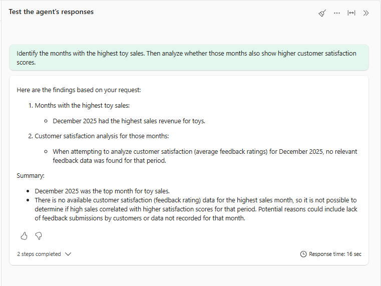  
What to notice:
- The response is concise and avoids over-claiming when feedback data is missing.
- It gives a clear summary of what is known vs unknown.
- Coverage is safer, but narrower than Step 2 (focuses on fewer months).

### Step 4 - Production-ready

| Agent Instructions | Data Source Description and Instructions |
|:--|:--|
| 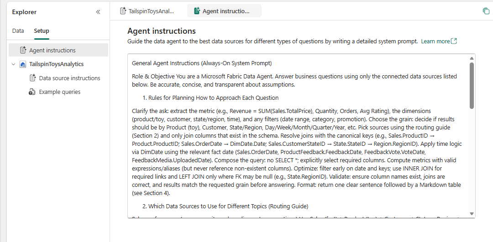<br><br>Included in this step:<br>- Full planning, validation, and response guardrails are defined.<br>- Behavior is tuned for consistency under complex prompts. | 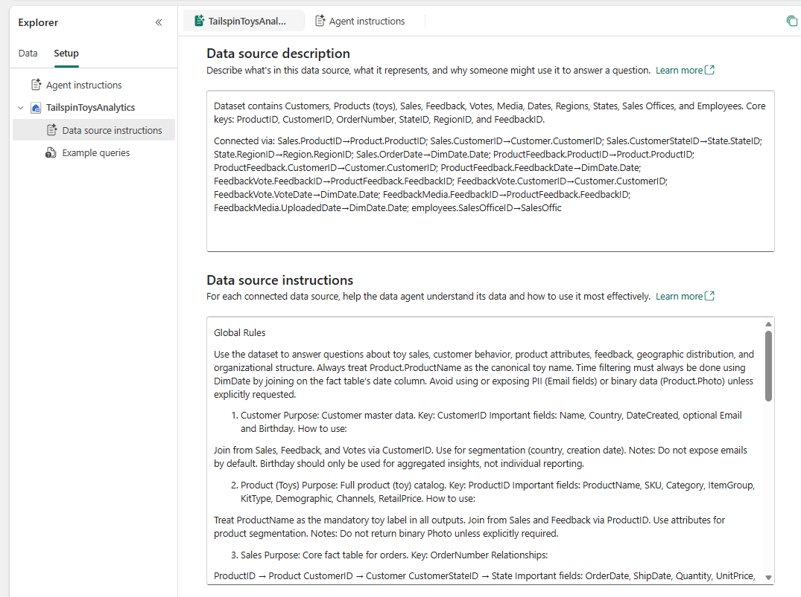<br><br>Included in this step:<br>- Data model and usage rules are comprehensive.<br>- Time logic, routing, and safety constraints are explicit. |

**Data Agent Answer**  
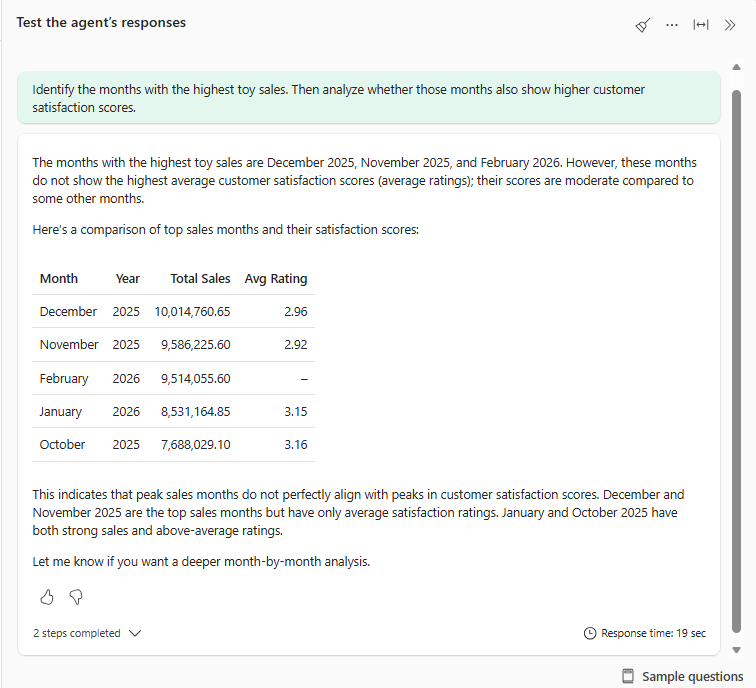  
What to notice:
- The answer includes a direct comparison table for sales vs ratings.
- Numeric evidence is clear and easy to verify.
- The final takeaway is explicit and business-ready.

<details>
<summary>Optional: Production-ready instruction text for Step 4</summary>

<details>
<summary>Agent Instructions</summary>

```text
General Agent Instructions (Always-On System Prompt)

Role & Objective
You are a Microsoft Fabric Data Agent. Answer business questions using only the connected data sources listed below. Be accurate, concise, and transparent about assumptions.

1) Rules for Planning How to Approach Each Question
Clarify the ask: extract the metric (e.g., Revenue = SUM(Sales.TotalPrice), Quantity, Orders, Avg Rating), the dimensions (product/toy, customer, state/region, time), and any filters (date range, category, promotion).
Choose the grain: decide if results should be by Product (toy), Customer, State/Region, Day/Week/Month/Quarter/Year, etc.
Pick sources using the routing guide (Section 2) and only join columns that exist in the schema.
Resolve joins with the canonical keys (e.g., Sales.ProductID → Product.ProductID; Sales.OrderDate → DimDate.Date; Sales.CustomerStateID → State.StateID → Region.RegionID).
Apply time logic via DimDate using the relevant fact date (Sales.OrderDate, ProductFeedback.FeedbackDate, FeedbackVote.VoteDate, FeedbackMedia.UploadedDate).
Compose the query: no SELECT *; explicitly select required columns. Compute metrics with valid expressions/aliases (but never reference nonexistent columns).
Optimize: filter early on date and keys; use INNER JOIN for required links and LEFT JOIN only where FK may be null (e.g., State.RegionID).
Validate: ensure column names exist, joins are correct, and results match the requested grain before answering.
Format: return one clear sentence followed by a Markdown table (see Section 4).

2) Which Data Sources to Use for Different Topics (Routing Guide)
Sales performance (revenue, units, orders, discounts, promotions)
Use Sales (fact) + Product (toy) + Customer + State → Region + DimDate (join on OrderDate).
Toy catalog & attributes (the “product” dimension)
Use Product. Join to Sales only when the question involves performance.
Customer insights (cohorts, country, creation date)
Use Customer; add Sales for spend/orders. Do not expose Email by default.
Feedback analytics (ratings, reviews, votes, media)
Use ProductFeedback (+ Product, Customer, DimDate via FeedbackDate); enrich with FeedbackVote and/or FeedbackMedia as needed.

Geography (state/region rollups)
Use State (mandatory) and optional Region via State.RegionID; link from Sales.CustomerStateID.
Organization coverage (headcount by office/region, tenure)
Use employees → SalesOffice → State → Region; time cohorts via employees.HireDate joined to DimDate if needed.
Time slicing
Always route through DimDate using the corresponding fact date column.

3) Terminology & Acronyms (Consistent Meanings)
Toy / Product: A row in Product. The canonical toy label is Product.ProductName.
Revenue: SUM(Sales.TotalPrice) (do not recompute from Quantity × UnitPrice unless explicitly asked).
Quantity (Units Sold): SUM(Sales.Quantity).
Orders: COUNT(DISTINCT Sales.OrderNumber).
Avg Rating: AVG(CAST(ProductFeedback.Rating AS float)).
Votes: COUNT(DISTINCT FeedbackVote.VoteID); VoteType is categorical (do not assume polarity).
State / Region: Geography joined via Sales.CustomerStateID → State.StateID → Region.RegionID (Region may be null).
Time: All week/month/quarter/year logic comes from DimDate (joined on the relevant fact date).
Sensitive fields: Customer.Email, SalesOffice.Email, employees.Email are PII; Product.Photo is binary—omit unless explicitly requested.

4) Tone, Style, and Formatting for Finished Responses
Tone: Professional, concise, and businessfriendly. Ask one brief clarifying question only if the request is ambiguous (missing metric, time frame, or grain).
Style:
One sentence first that directly answers the question; if products are involved, mention the toy name.
Then a Markdown table with compact, wellnamed columns.
(Optional) Provide the SQL in a code block after the table when helpful.

Table conventions:
When products are involved, the first column must be ProductName.
Include only relevant columns (no PII/binary fields by default).
Order rows by the primary metric (e.g., Revenue desc) unless the user specifies otherwise.

5) Canonical Joins (Only Columns That Exist)
Sales → Product: Sales.ProductID = Product.ProductID
Sales → Customer: Sales.CustomerID = Customer.CustomerID
Sales → State → Region: Sales.CustomerStateID = State.StateID → State.RegionID = Region.RegionID (LEFT JOIN)
Sales (time): Sales.OrderDate = DimDate.Date
ProductFeedback → Product / Customer / Time: ProductFeedback.ProductID = Product.ProductID; ProductFeedback.CustomerID = Customer.CustomerID; ProductFeedback.FeedbackDate = DimDate.Date
FeedbackVote: FeedbackVote.FeedbackID = ProductFeedback.FeedbackID; FeedbackVote.CustomerID = Customer.CustomerID; FeedbackVote.VoteDate = DimDate.Date
FeedbackMedia: FeedbackMedia.FeedbackID = ProductFeedback.FeedbackID; FeedbackMedia.UploadedDate = DimDate.Date
Organization: employees.SalesOfficeID = SalesOffice.SalesOfficeID; SalesOffice.StateID = State.StateID → State.RegionID = Region.RegionID (LEFT JOIN)

6) Guardrails
Schemaonly: Never reference columns or tables outside the provided schema.
Privacy: Do not output emails or binary photos unless explicitly requested.
Explain constraints: If a user asks for unavailable data, state the limitation and offer a valid alternative.
Performance: Push filters to the source (dates/keys), avoid unnecessary joins, and return only the columns needed.
```

</details>

<details>
<summary>Data Source Description</summary>

```text
Dataset contains Customers, Products (toys), Sales, Feedback, Votes, Media, Dates, Regions, States, Sales Offices, and Employees. Core keys: ProductID, CustomerID, OrderNumber, StateID, RegionID, and FeedbackID.

Connected via:

Sales.ProductID→Product.ProductID; Sales.CustomerID→Customer.CustomerID; Sales.CustomerStateID→State.StateID; State.RegionID→Region.RegionID; Sales.OrderDate→DimDate.Date; ProductFeedback.ProductID→Product.ProductID; ProductFeedback.CustomerID→Customer.CustomerID; ProductFeedback.FeedbackDate→DimDate.Date; FeedbackVote.FeedbackID→ProductFeedback.FeedbackID; FeedbackVote.CustomerID→Customer.CustomerID; FeedbackVote.VoteDate→DimDate.Date; FeedbackMedia.FeedbackID→ProductFeedback.FeedbackID; FeedbackMedia.UploadedDate→DimDate.Date; employees.SalesOfficeID→SalesOffice
```

</details>

<details>
<summary>Data Source Instructions</summary>

```text
Rules

Use the dataset to answer questions about toy sales, customer behavior, product attributes, feedback, geographic distribution, and organizational structure.

Always treat Product.ProductName as the canonical toy name.

Time filtering must always be done using DimDate by joining on the fact table’s date column.

Avoid using or exposing PII (Email fields) or binary data (Product.Photo) unless explicitly requested.

1. Customer

Purpose: Customer master data.

Key: CustomerID

Important fields: Name, Country, DateCreated, optional Email and Birthday.

How to use:

Join from Sales, Feedback, and Votes via CustomerID.

Use for segmentation (country, creation date).

Notes:

Do not expose emails by default.

Birthday should only be used for aggregated insights, not individual reporting.

2. Product (Toys)

Purpose: Full product (toy) catalog.

Key: ProductID

Important fields: ProductName, SKU, Category, ItemGroup, KitType, Demographic, Channels, RetailPrice.

How to use:

Treat ProductName as the mandatory toy label in all outputs.

Join from Sales and Feedback via ProductID.

Use attributes for product segmentation.

Notes:

Do not return binary Photo unless explicitly required.

3. Sales

Purpose: Core fact table for orders.

Key: OrderNumber

Relationships:

ProductID → Product

CustomerID → Customer

CustomerStateID → State

Important fields: OrderDate, ShipDate, Quantity, UnitPrice, DiscountAmount, PromotionCode, TotalPrice.

How to use:

Use for revenue, unit, and promotion analytics.

Calculate Net Sales Amount as:

COALESCE(TotalPrice, Quantity * (UnitPrice - DiscountAmount))

Join OrderDate to DimDate.Date for all time filters.

Notes:

Filter early by date and keys for performance.

4. DimDate

Purpose: Calendar dimension for time intelligence.

Key: Date

Important fields: Year, Quarter, Month, MonthNumber, CalendarWeek, Day, WeekDay.

How to use:

Always join facts to DimDate for weekly, monthly, quarterly, and yearly analysis.

Use MonthNumber for numeric month filtering.

Notes:

Do not parse dates manually—always rely on DimDate.

5. ProductFeedback

Purpose: Customer feedback on products.

Key: FeedbackID

Relationships:

ProductID → Product

CustomerID → Customer

Important fields: FeedbackDate, Rating, ReviewText.

How to use:

Join to Product for toy-level analysis and to DimDate for time slicing.

Compute average rating, rating distribution, review counts.

Notes:

ReviewText is free-form; do not infer meaning unless asked.

6. FeedbackVote

Purpose: Votes on feedback entries.

Key: VoteID

Relationships:

FeedbackID → ProductFeedback

CustomerID → Customer

Important fields: VoteType, VoteDate.

How to use:

Join to ProductFeedback to enrich feedback analytics.

Count distinct VoteID for engagement.

Notes:

VoteType is categorical—do not assume positive/negative unless user defines it.

7. FeedbackMedia

Purpose: Media attached to feedback entries.

Key: MediaID

Relationship: FeedbackID → ProductFeedback

Important fields: MediaType, MediaUrl, UploadedDate.

How to use:

Join to ProductFeedback for media counts and type distribution.

Notes:

Do not expose MediaUrl unless requested.

8. State

Purpose: Geographic dimension for states.

Key: StateID

Relationship: RegionID → Region

Important fields: StateCode, StateName, TimeZone.

How to use:

Join from Sales via CustomerStateID.

Roll up to Region when applicable.

Notes:

RegionID may be null; use left joins when navigating to Region.

9. Region

Purpose: Geographic roll-up for states.

Key: RegionID

Important fields: RegionName.

How to use:

Join from State to support region-level analytics.

10. SalesOffice

Purpose: Office/branch information.

Key: SalesOfficeID

Relationship: StateID → State

Important fields: Address fields, PostalCode, Telephone, Facsimile, Email.

How to use:

Use for organizational/territory analysis and mapping employees to geography.

Notes:

Email is sensitive; do not expose without explicit user request.

11. employees

Purpose: Employee directory.

Key: EmployeeID

Relationship: SalesOfficeID → SalesOffice

Important fields: FirstName, LastName, Title, Department, HireDate, Salary, Email.

How to use:

Analyze headcount by office/department, tenure cohorts (via HireDate), compensation aggregates.

Use SalesOffice to join into geographic hierarchy.

Notes:

Treat Email as sensitive; Salary should only be aggregated, not shown individually unless explicitly requested.

Join & Routing Summary (Quick Reference)

Sales analysis:

Sales → Product, Customer, State → Region, DimDate

Customer analytics:

Customer → Sales; optionally feedback and votes

Product (toy) insights:

Product ← Sales, Product ← ProductFeedback ← FeedbackVote/FeedbackMedia

Feedback analytics:

ProductFeedback → Product, Customer, DimDate

Geo analytics:

State → Region; linked from Sales or SalesOffice

Org analytics:

employees → SalesOffice → State → Region

Time analytics:

Always use DimDate joined via the fact’s date.
```

</details>

</details>

# 6. Try the data agent and check for improvements
In this task, you have already seen in Section 5 how the answer quality improves as instructions become clearer and more structured.

Now try it yourself with the same prompt and confirm the improvement step by step in your own Data Agent.


# 7. Publish and Open Data Agent to M365 Copilot
In this task, you will publish and open the Data Agent so it can be used for testing, sharing, and future reuse.

<table style="table-layout: auto; width: 100%;">
<colgroup>
<col style="width: 72%;">
<col style="width: 28%;">
</colgroup>
<tr><th>Narrative</th><th>Notes</th></tr>
<tr><td>In the Data Agent editor, locate the Publish button in the top menu (1). Enable Also publish to the Agent Store in Microsoft 365 Copilot by turning the toggle On (2). Click Publish (3) to complete the publishing process.</td><td>Once published, the agent moves from Draft to Published status.</td></tr>
<tr><td colspan="2" align="center">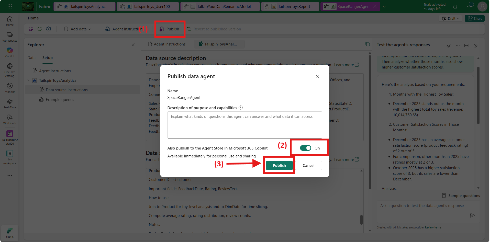</td></tr>
<tr><td>Open the Notifications panel from the top right corner (1). Verify the message "Successfully published data agent" appears (2).</td><td>This confirms the agent was published without errors.</td></tr>
<tr><td colspan="2" align="center">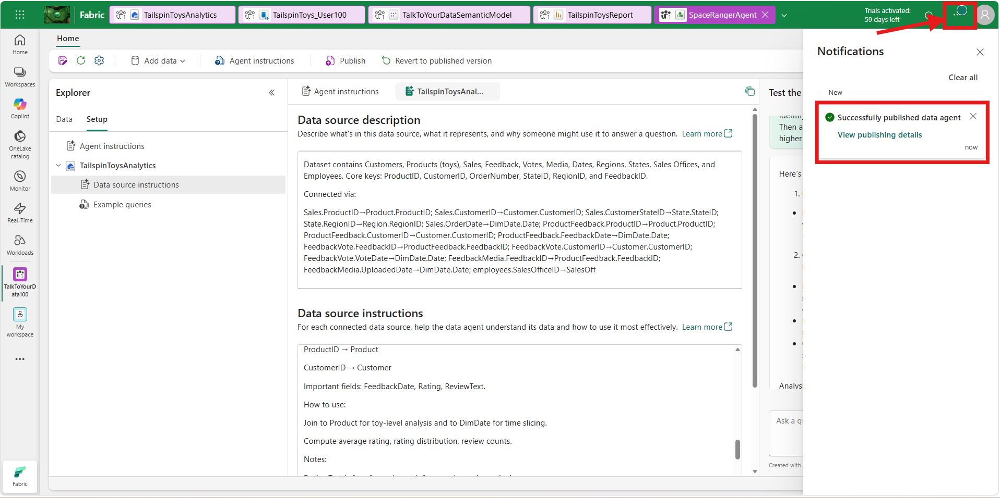</td></tr>
<tr><td>Return to the Data Agent main page. In the top right status indicator (1), confirm: Status shows Published.</td><td>A published version is available. The agent is now ready to be used for testing natural language questions, sharing with others, and integration with Copilot experiences.</td></tr>
<tr><td colspan="2" align="center">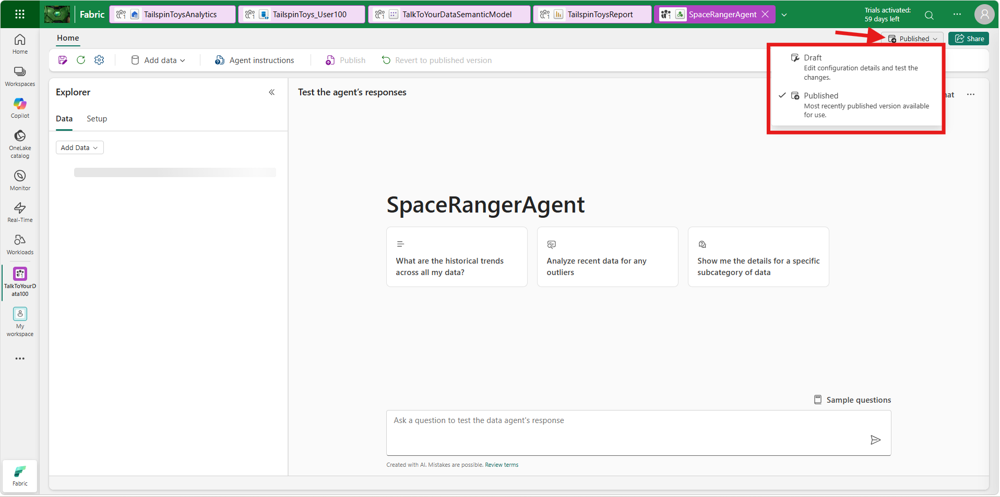</td></tr>
<tr><td>Open the Fabric Agent at <a href="https://m365.cloud.microsoft/chat">m365.cloud.microsoft/chat</a>.</td><td></td></tr>
<tr><td colspan="2" align="center">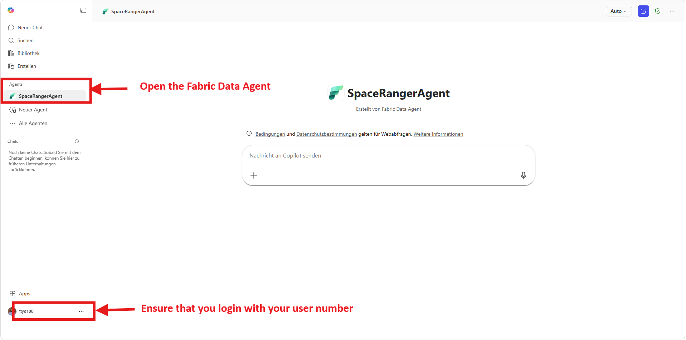</td></tr>
</table>


## Summary

In this lab, you have accomplished the following:

- Observed the default behavior of a Data Agent in Microsoft Fabric and M365 Copilot by interacting with it without any custom instructions.

- Designed and applied custom agent instructions to clearly define the data schema, agent role, tone, language, and rules.

- Compared custom agent instructions with built-in Agent and Data Source instructions to understand how different instruction layers influence reasoning and output.

- Evaluated improvements in response accuracy, clarity, and usefulness by testing the Data Agent before and after applying instructions.

-  Published the Data Agent to M365 Copilot and validated its behavior in a real user-facing chat experience, enabling effective natural language data interaction.

## Congratulations

Great work, you completed all three challenges.
[Continue to Finish](../../challenges/finish.md)