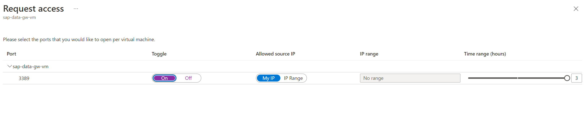
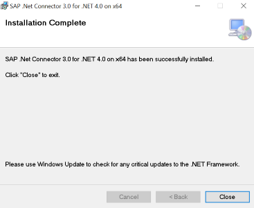

# Deploy the Microhack environment with Terraform
To avoid problems we will use Terraform to deploy a new Resource Group, Virtual Network, Subnet and Virtual Machine which will be used as the Gateway server. You can also deploy the Synapse workspace if preferred. If you don't want to deploy the Synapse workspace with Terraform you have to rename or remove the file `Synapse.tf`.

To trigger the Terraform deployment, follow the steps below:
1. Login to Azure cloud shell https://shell.azure.com/

2. Check the subscription you will be using for the Microhack:
```
az account show
``` 

 \
If the subscription shown is not the right one change this with:
```
az account set --subscription "YourSubscriptionName"
```

By default the Azure CLI uses JSON as output format, if this is not the case change this to avoid errors while executing the Terraform script. Check if you changed the core output value:
```
az config get core.output
```

If the value is not set you are good to go, otherwise if you set the `core.output` to another value change this back to `json`:
```
az config set core.output=json
```

3. Clone the GitHub repository with the Terraform scripts:
```
git clone https://github.com/thzandvl/microhack-sap-data
```


4. Change Directory into the terraform folder:
```
cd microhack-sap-data/terraform
```


5. Check the default values defined in `variables.tf` and change them if required. You can do this with: 
```
nano variables.tf
```

Remember the username and password which you will need to login to the Gateway VM once deployed and these credentials will also be used for the Synapse workspace.

6. Download the AzureRM resource provider:
```
terraform init
```


7. Run apply to start the deployment, and choose `yes` once prompted to deploy the script:
```
terraform apply
```

...


8. Once the script is finished you will get a public IP address, this is the public IP address of the Gateway VM just deployed.


9. You can check if you can already access the RDP session by executing step 10 as the Terraform opens this port. Microsoft policies automatically remove open RDP ports after an hour. Therefore, after this time, you need to enable Just-in-time VM access (JIT). In the deployed resource group click on the GW VM. Navigate in the left pane to `Settings -> Configuration` and click on `Enable just-in-time`.


After you pressed the button you should get a notification that JIT is successfully enabled. The button will be replaced by the following message where you can directly navigate to `Open Azure Security Center`.


You will get a next screen with your VM's. Select the GW VM and choose `Request Access`.


Change the `toggle` option to `On` and choose `Open ports` in the right bottom corner of the screen.



The port should now be open. Continue to the next step.

10. Use `Remote Desktop Connection` to login to the new VM and continue with the next section.

Enter the IP address shown at the end of the Terraform script


## Prepare
In this step, we'll prepare an Azure Virtual Machine to host the Integration Runtime needed by the SAP Table Connector of the Azure Synapse Pipeline.
We'll also install the SAP .net connector to enable RFC Connectivity to the SAP System.

### Install the SAP .Net Connector
The downloads can best be done directly to the Gateway VM.

Open `Microsoft Edge` on the GW VM. The SAP .Net Connector can be downloaded from the [SAP Service Marketplace](https://support.sap.com/en/product/connectors/msnet.html). Make sure to download the version compiled with .Net Framework 4.0 for Windows 64-bit.

* Extract the SAP connector and open the folder 


* Start the executable, choose the latest version


* Press `Next` until the following screen 


* Choose `Install assemblies to GAC`


 
 * Finally press `Next` 



* Again press `Next` and choose `Close`

The installation of the SAP .Net Connector is complete, continue to the [next](SynapseWorkspace.md) step.
