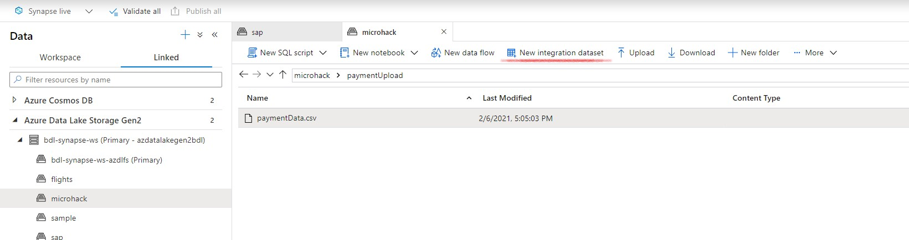
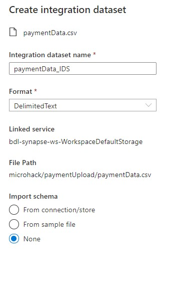
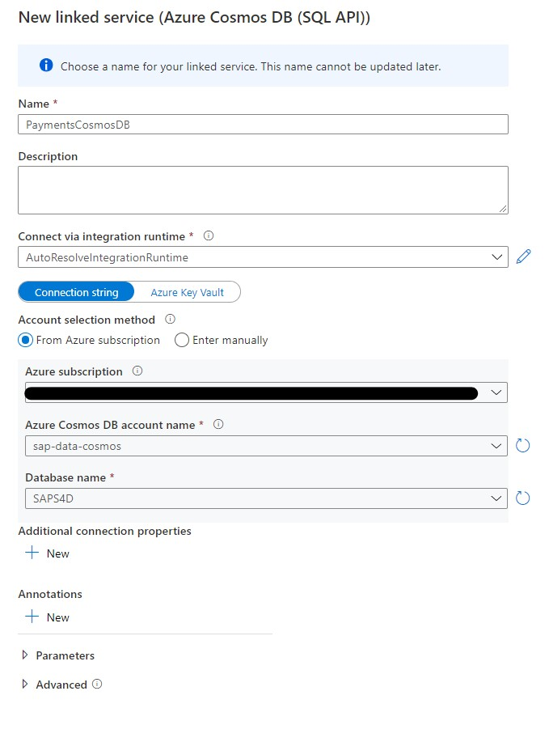
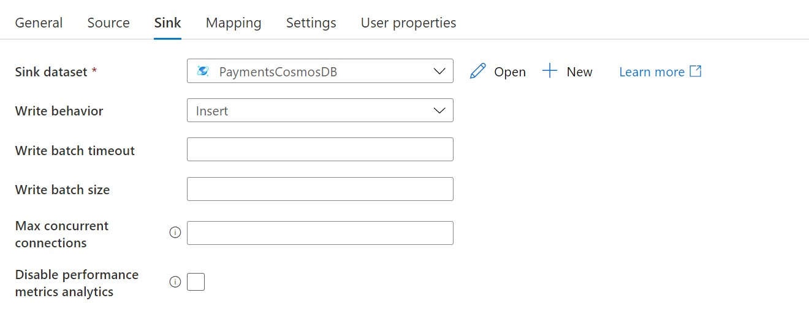

# Payments
The payments are generated based on the extracted Sales Order Headers. 
The underlying logic we used :

`paymentDate = BillingdocumentDate + PayOffset +/- random(PayOffsetVariance)`.

In our example the Payment Offset and Payment Offset Variance is depending on the CustomerGroup in the Sales Order Header.

In order to upload the payments to cosmosDB, you can either :

* upload a pregenerated file. The provided file is generated from Sales Orders availabla in S4/HANA Fully Activated Appliance - 1909.
* use a Spark program to generate the payments based upon extract Sales Orders (see [Payment Generation](generatePayments.md))
* Create you own program

## Payment upload from pregenerated file
We used Azure Cosmos DB as container for the Payments. You need to create a Synapse Pipeline to pick up the generated Payments and import them in a Cosmos DB Collection.

* Pre-generated payment data files for different SAP CAL images are available at : [paymendData](../data/)
* This file needs to be copied to a directory on for example Azure Data Lake. A Synapse pipeline can pick up the payments from there and copy them to CosmosDB

### Pipeline Setup
* When the Terrafrom scripts are executed, an Azure Synapse is deployed with an underlying Azure Data Lake. In this datalake you can create a directory to store the paymentData csv file. You can do this from the Azure Synapse Workspace

>Note : When you generate your own payments, you'll need to setup a similar pipeline.

#### Source Setup - Azure Data Lake
* Create a Linked Service to connect to Azure Data Lake
You can do this by selecting `New Integration dataset`. 

* Enter a name for you Integration DataSet
* Enter 'DelimitedText' as format
* Import Schema : None

* In the created Integration DataSet
    * Select `Semicolon` as Column Delimiter
    * Select `First Row as Header`

* Use the `Preview Data`to test your Integration DataSet

* Publish the Integration Dataset

#### Sink Setup - CosmosDB
The terraform scripts have created a CosmosDB account with a SQL Database `SAPS4D` and Container `paymentData`for the payments.

* Create a Linked Service to connect CosmosDB
    * Select `Azure CosmosDB (SQL API)`
    * Enter a name for your Linked Service and select the cosmosDB details from your subscription
    

>Note : later on you can resuse this Linked Service to extract the payments from CosmosDB

* Create an Integration Dataset
    * Select `Azure CosmosDB (SQL API)`
    AzureCosmosDBSQLAPI.jpg
    * Enter a name for your Integration Dataset
    * Select your Linked Service created earlier
    

* Create a pipeline to copy the data from Azure Data Lake to CosmosDB
    * In your Azure Synapse Workspace, select `Integrate`and `+ > New Pipeline`
    
    
    * Enter a name in the `properties`tab
    
    
    * Use the `Copy data`activity
    

    * Source
    

    * Sink
    

    * Publish and trigger the pipeline
    
    

* Verify the result in cosmosDB
    * Switch to your cosmosDB in the Azure Portal

    * Select `Data Explorer`
    
    
    * Select your db, payment container
    
    * select `items`
    

If you want to generate your own payments, switch to [Payment Generation](generatePayments.md)

