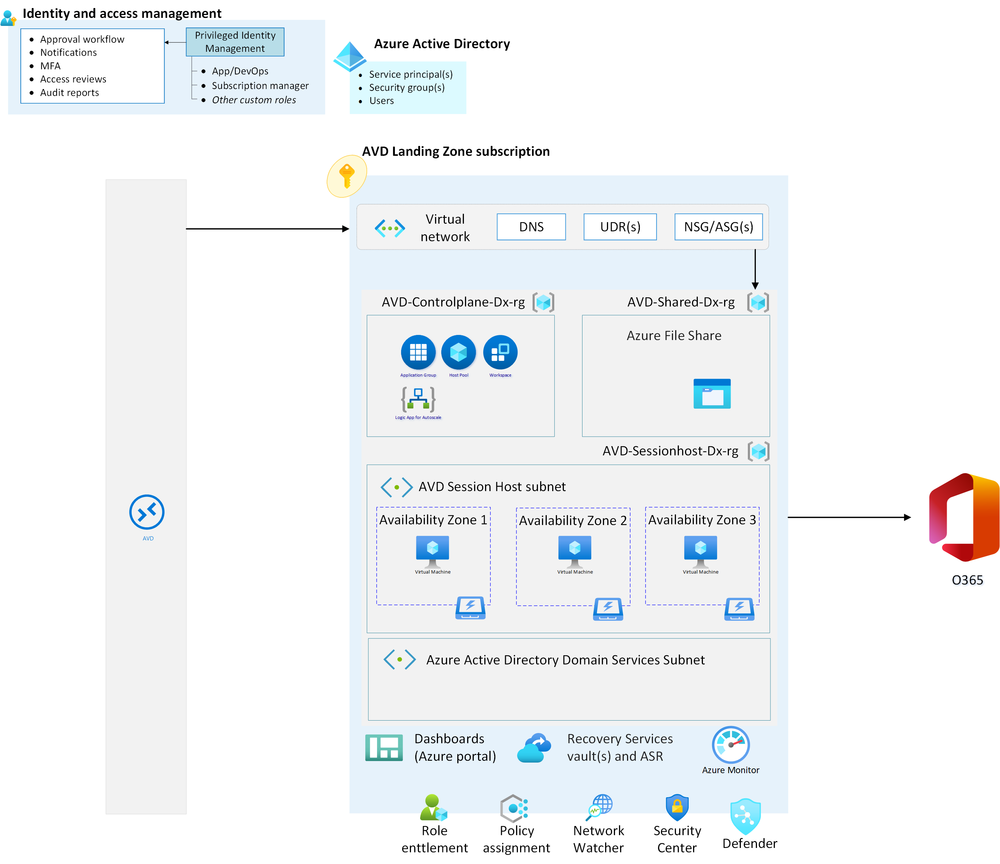

# Getting started

**[Home](../readme.md)** - [Challenge One](./01-Personal-Hostpools.md)

## Introduction

Azure Virtual Desktop is a service that gives users easy and secure access to their virtualized desktops and RemoteApps. This topic will tell you a bit more about the general structure of the Azure Virtual Desktop environment.

This introduction is to ensure that all the pre-requisites and/or concepts to start the planning and deployment for Azure Virtual Desktop (AVD) are in place.

## Architecture
The following image shows the overall conceptual reference architecture that demonstrates design areas and best practices. 

For this MicroHack we simplify the deployment down to Microsoft Entra ID joined sessionhosts only so there are no dependencies on Domain Controllers (except in challenge 4,
where you will need hybrid identities for FSLogix profiles).  

The architecture will be like 

## Components
Azure Virtual Desktop service architecture is similar to Windows Server Remote Desktop Services. Microsoft manages the infrastructure and brokering components, while enterprise customers manage their own desktop host virtual machines (VMs), data, and clients.

## Components Microsoft manages
Microsoft manages the following Azure Virtual Desktop services, as part of Azure:

### Web Access:
The Web Access service within Azure Virtual Desktop lets users access virtual desktops and remote apps through an HTML5-compatible web browser as they would with a local PC, from anywhere on any device. You can secure Web Access using multifactor authentication in Microsoft Entra ID.
### Gateway:
The Remote Connection Gateway service connects remote users to Azure Virtual Desktop apps and desktops from any internet-connected device that can run an Azure Virtual Desktop client. The client connects to a gateway, which then orchestrates a connection from a VM back to the same gateway.
### Connection Broker:
The Connection Broker service manages user connections to virtual desktops and remote apps. The Connection Broker provides load balancing and reconnection to existing sessions.
### Diagnostics:
Remote Desktop Diagnostics is an event-based aggregator that marks each user or administrator action on the Azure Virtual Desktop deployment as a success or failure. Administrators can query the event aggregation to identify failing components.
### Extensibility components:
Azure Virtual Desktop includes several extensibility components. You can manage Azure Virtual Desktop using Windows PowerShell or with the provided REST APIs, which also enable support from third-party tools.

## Components you manage
Customers manage these components of Azure Virtual Desktop solutions:

### Azure Virtual Network:
Azure Virtual Network lets Azure resources like VMs communicate privately with each other and with the internet. By connecting Azure Virtual Desktop host pools to an Active Directory domain, you can define network topology to access virtual desktops and virtual apps from the intranet or internet, based on organizational policy. You can connect an Azure Virtual Desktop to an on-premises network using a virtual private network (VPN), or use Azure ExpressRoute to extend the on-premises network into the Azure cloud over a private connection.

### Microsoft Entra ID:
Azure Virtual Desktop uses Microsoft Entra ID for identity and access management. Microsoft Entra ID integration applies Microsoft Entra ID security features like conditional access, multi-factor authentication, and the Intelligent Security Graph, and helps maintain app compatibility in domain-joined VMs.

### Microsoft Entra ID and FSLogix (challenge 5):
In challenge 5, you need to create an Azure Files share to store FSLogix profiles that can be accessed by hybrid user identities authenticated with Microsoft Entra ID (Microsoft Entra ID). Microsoft Entra ID users can now access an Azure file share using Kerberos authentication. This configuration uses Microsoft Entra ID to issue the necessary Kerberos tickets to access the file share with the industry-standard SMB protocol. End-users can access Azure file shares over the internet without requiring a line-of-sight to domain controllers from Hybrid Microsoft Entra ID-joined and Microsoft Entra ID-joined VMs. If you want to setup Azure Files with Microsoft Entra ID authenticaion you have to apply the steps from [this guide](https://learn.microsoft.com/en-us/azure/virtual-desktop/create-profile-container-azure-ad)

> **Note**: Cloud-only identities aren't currently supported. Therefore the user identities must be synced once from Active Directory Domain Service to Microsoft Entra ID 
[Microsoft Entra ID Connect](https://learn.microsoft.com/en-us/azure/active-directory/hybrid/whatis-azure-ad-connect).

### Azure Virtual Desktop session hosts:
A host pool can run the following operating systems:

- Windows 10 Enterprise
- Windows 10 Enterprise Multi-session
- Windows 11 Enterprise
- Windows 11 Enterprise Multi-session
- Windows Server 2012 R2 and above

Custom Windows system images with pre-loaded apps, group policies, or other customizations are supported as well. You can also choose from a variaty of VM sizes including GPU-enabled VMs. Each session host has a Azure Virtual Desktop host agent, which registers the VM as part of the Azure Virtual Desktop workspace or tenant. Each host pool can have one or more app groups, which are collections of remote applications or desktop sessions that users can access.

### Azure Virtual Desktop workspace:
The Azure Virtual Desktop workspace or tenant is a management construct to manage and publish host pool resources.

### Personal and pooled desktops
Personal desktop solutions, sometimes called persistent desktops, allow users to always connect to the same specific session host. Users can typically modify their desktop experience to meet personal preferences and save files in the desktop environment. This scenario allows assigning dedicated resources to a specific user, which can be helpful for some manufacturing or development use cases.

Pooled desktop solutions, also called non-persistent desktops, assign users to whichever session host is currently available, depending on the load-balancing algorithm. Because the users don't always return to the same session host each time they connect, they usually don´t have administrator access.

### User accounts and groups:
Your users need accounts that are in Microsoft Entra ID. To successful conduct challenge 4, these accounts will need to be [hybrid identities](https://learn.microsoft.com/en-us/azure/active-directory/hybrid/whatis-hybrid-identity), which means the user account is synchronized. 

### Role-based Access Control:

You'll need an Azure account with an active subscription to deploy Azure Virtual Desktop. If you don't have one already, you can create an account for free. Your account must be assigned the contributor or owner role on your subscription.

You also need to make sure you've registered the Microsoft.DesktopVirtualization resource provider for your subscription. 

## Relationships between key logical components
The relationships between host pools, workspaces and other key logical components vary. The following diagram summarises these relationships.

### Relationships between key logical components

The bracketed numbers relate to the diagram above.

1. An application group that contains a published desktop cannot contain any other published resources and is called a desktop application group.
2. Application groups assigned to the same host pool must be members of the same workspace.
3. A user account can be assigned to an application group either directly or via an Microsoft Entra ID group. It's possible to assign no users to an application group but then it cannot service any.
4. It's possible to have an empty workspace but it cannot service users.
5. It's possible to have an empty host pool but it cannot service users.
6. It's possible for a host pool not to have any application groups assigned to it but it cannot service users.
7. Microsoft Entra ID is required for AVD. This is because Microsoft Entra ID user accounts and groups must always be used to assign users to AVD application groups. Microsoft Entra ID is also used to authenticate users into the AVD service. AVD session hosts can also be members of an Microsoft Entra ID domain and in this situation the AVD published applications and desktop sessions will also be launched and run (not just assigned) using Microsoft Entra ID accounts.
- 7. Alternatively AVD session hosts can be members of an AD DS (Active Directory Domain Services) domain and in this situation the AVD published applications and desktop sessions will be launched and run (but not assigned) using AD DS accounts. To reduce user and administrative overhead AD DS can be synchronized with Microsoft Entra ID using Microsoft Entra ID Connect.
- 7. Finally AVD session hosts can, instead, be members of an Microsoft Entra ID DS (Microsoft Entra ID Domain Services) domain and in this situation the AVD published applications and desktop sessions will be launched and run (but not assigned) using Microsoft Entra ID DS accounts. Microsoft Entra ID is automatically synchronized with Microsoft Entra ID DS, one way from Microsoft Entra ID to Microsoft Entra ID DS only.

## Learning resources
- [Azure Virtual Desktop Prerequisites](https://learn.microsoft.com/en-us/azure/virtual-desktop/prerequisites)
- The Azure Virtual Desktop construction set from the [Cloud Adoption Framework](https://learn.microsoft.com/en-us/azure/cloud-adoption-framework/scenarios/wvd/enterprise-scale-landing-zone)
- Azure Virtual Desktop for the enterprise - [Architecture Center](https://learn.microsoft.com/en-us/azure/architecture/example-scenario/wvd/windows-virtual-desktop)
- Azure Virtual Desktop Documentation - [Doc](https://learn.microsoft.com/en-us/azure/virtual-desktop/)
