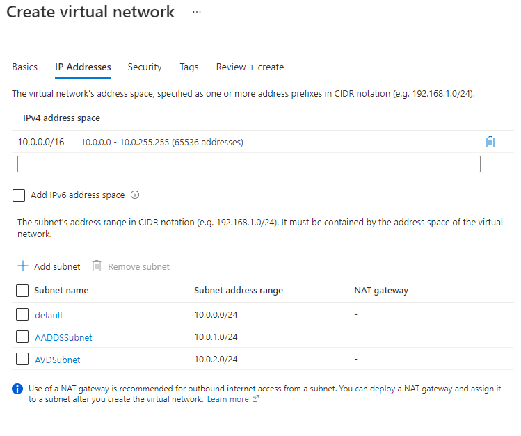
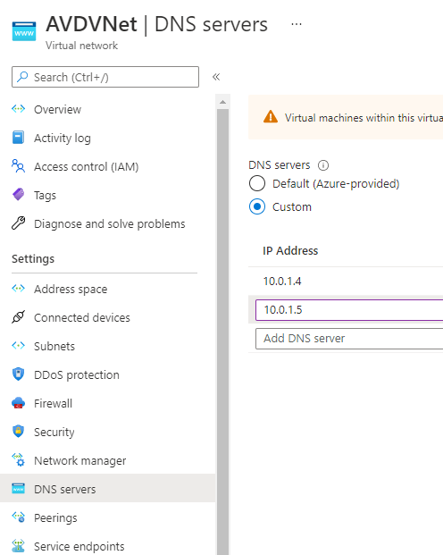

# Getting started

**[Home](../readme.md)** - [Challenge One](./01-Personal-Hostpools.md)

## Introduction

Azure Virtual Desktop is a service that gives users easy and secure access to their virtualized desktops and RemoteApps. This topic will tell you a bit more about the general structure of the Azure Virtual Desktop environment.

This introduction is to ensure that all the pre-requisites and/or concepts to start the planning and deployment for Azure Virtual Desktop (AVD) are in place.

## Architecture
The following image shows the overall conceptual reference architecture that demonstrates design areas and best practices. 

For this MiniHack we simplify the deployment down to Azure AD joined sessionhosts only so there are no dependencies on Domain Controllers.  

The architecture will be like 

***"ADD NEW PICTURE HERE"***

## Setup your networking and resource groups structure

You can setup your networking infrastrcuture with this script and jump to directly to the Azure Active Directory Domain Services konfiguration or do it via the Azure Portal see the Azure Active Directory Domain Services guide below.

- Open Visual Studio Code and log in to Azure Cloud Shell at https://shell.azure.com/ and select Bash

  `az login`

- Ensure Azure CLI and extensions are up to date:

  `az upgrade --yes`

  `az biceps upgrade ` or `az biceps install` (to install it)

- If necessary select your target subscription:
  
  `az account set --subscription <Name or ID of subscription>`

- Update and set the `parameters-aa-join-example.json`
- Update and set the `main.bicep` parameters.

- Run the deployment with e.g. 

`$location = "WestEurope"`

`$name="<your name>"`

`az deployment sub create --location $location -f ./main.bicep --parameters name=$name --parameters @parameters-ad-join-example.json -c`

## Components
Azure Virtual Desktop service architecture is similar to Windows Server Remote Desktop Services. Microsoft manages the infrastructure and brokering components, while enterprise customers manage their own desktop host virtual machines (VMs), data, and clients.

### Components Microsoft manages
Microsoft manages the following Azure Virtual Desktop services, as part of Azure:

#### Web Access:
The Web Access service within Window Virtual Desktop lets users access virtual desktops and remote apps through an HTML5-compatible web browser as they would with a local PC, from anywhere on any device. You can secure Web Access using multifactor authentication in Azure Active Directory.
#### Gateway:
The Remote Connection Gateway service connects remote users to Azure Virtual Desktop apps and desktops from any internet-connected device that can run an Azure Virtual Desktop client. The client connects to a gateway, which then orchestrates a connection from a VM back to the same gateway.
#### Connection Broker:
The Connection Broker service manages user connections to virtual desktops and remote apps. The Connection Broker provides load balancing and reconnection to existing sessions.
#### Diagnostics:
Remote Desktop Diagnostics is an event-based aggregator that marks each user or administrator action on the Azure Virtual Desktop deployment as a success or failure. Administrators can query the event aggregation to identify failing components.
#### Extensibility components:
Azure Virtual Desktop includes several extensibility components. You can manage Azure Virtual Desktop using Windows PowerShell or with the provided REST APIs, which also enable support from third-party tools.

### Components you manage
Customers manage these components of Azure Virtual Desktop solutions:

#### Azure Virtual Network:
Azure Virtual Network lets Azure resources like VMs communicate privately with each other and with the internet. By connecting Azure Virtual Desktop host pools to an Active Directory domain, you can define network topology to access virtual desktops and virtual apps from the intranet or internet, based on organizational policy. You can connect an Azure Virtual Desktop to an on-premises network using a virtual private network (VPN), or use Azure ExpressRoute to extend the on-premises network into the Azure cloud over a private connection.

#### Azure AD:
Azure Virtual Desktop uses Azure AD for identity and access management. Azure AD integration applies Azure AD security features like conditional access, multi-factor authentication, and the Intelligent Security Graph, and helps maintain app compatibility in domain-joined VMs.

#### AD DS:
Azure Virtual Desktop VMs must domain-join an AD DS service, and the AD DS must be in sync with Azure AD to associate users between the two services. You can use Azure AD Connect to associate AD DS with Azure AD.

#### Azure Active Directory Domain Services

<a id="step4">Step 4: Configure Azure AD Domain Services</a>
1. Create a Virtual Network in the selected region. Name it **AVDVNet**

Keep the VNet IP range at **10.0.0.0/16**

Add 2 Subnets:

- **AADDSSubnet 10.0.1.0/24**

- **AVDSubnet 10.0.2.0/24**

2. Create Azure AD Domain Services
Click on **Create a resource** and type **Azure AD Domain Services**
Click on **Create**
Use the following settings:
- Resource group: Create a new one named **AADDSRG**
- DNS domain name: Keep the automativally filled one (should be like somethingoutlook.onmicrosoft.com)
- Region: The same you selected for the Virtual Network
- SKU: **Standard**
- Forest Type: User

Click **next**
- Virtual Network: Select **AVDVNet**
- Subnet: Select **AADDSSubnet**

Click **next**
- AAD DC Administrators: Click on **Manage Group Membership**. Select the first account that you created in step 3. The outlook.com account you are logged in would not work. 
- After this, click on the breadcrumb (top of white part of page) **Create Azure AD Domain Services** to get back to the wizard
- Click next until you reach the end of the wizard, then click **Create**

The creation of AADDS should take about 1 hour. After this, you need to wait for another hour until your Azure AD Domain Services Overview page no longer shows **Deploying**

## <a id="step5">Step 5: Change the Virtual Network DNS settings</a>
You need to change the DNS settings of your Virtual network to point to the domain controller IP addresses for Azure Active Directory Domain Services
1. In the Azure portal, go to your Azure AD Domain Services. Go to **Properties** and get the two values from IP addresses. They should be 10.0.1.4 and 10.0.1.5
2. Go to **AVDVNet** **DNS Servers**
3. Change to **Custom** and enter the 2 IP addresses from step 1 (one by one)
4. Click **Save**

## <a id="step6">Step 6: Change user passwords</a>
After deploying Azure AD Domain Services, in order to synchronize passwords, you need to change the passwords of all synchronized users. So in our case, these are the 2 users created in [step 3](#step3). 
1. Open an InPrivate tab in your browser
2. Go to [myapps.microsoft.com](https://myapps.microsoft.com)
3. Log in with the first account you created in step 3 (user name can be found under **User principal name** in the Azure Active Directory Users list)
4. Change the password to a new one
5. Repeat steps 1-4 for the other user

When you are asked to join an Active Directory domain, use the following data:
- Domain name: same as your Azure ad domain name (somethingoutlook.onmicrosoft.com)
- User for joining the domain: The first user you created in step 3 (the one you added to Azure AD administrators) with it's new password

In challenge 3 (FSLogix), you have to apply the steps from [this guide](https://docs.microsoft.com/en-us/azure/virtual-desktop/create-profile-container-adds)

#### Azure Virtual Desktop session hosts:
A host pool can run the following operating systems:

- Windows 7 Enterprise
- Windows 10 Enterprise
- Windows 10 Enterprise Multi-session
- Windows Server 2012 R2 and above

Custom Windows system images with pre-loaded apps, group policies, or other customizations
You can choose VM sizes, including GPU-enabled VMs. Each session host has a Azure Virtual Desktop host agent, which registers the VM as part of the Azure Virtual Desktop workspace or tenant. Each host pool can have one or more app groups, which are collections of remote applications or desktop sessions that users can access.

#### Azure Virtual Desktop workspace:
The Azure Virtual Desktop workspace or tenant is a management construct to manage and publish host pool resources.

#### Personal and pooled desktops
Personal desktop solutions, sometimes called persistent desktops, allow users to always connect to the same specific session host. Users can typically modify their desktop experience to meet personal preferences, and save files in the desktop environment. Personal desktop solutions:

Let users customize their desktop environment, including user-installed applications and saving files within the desktop environment.
Allow assigning dedicated resources to a specific user, which can be helpful for some manufacturing or development use cases.

Pooled desktop solutions, also called non-persistent desktops, assign users to whichever session host is currently available, depending on the load-balancing algorithm. Because the users don't always return to the same session host each time they connect, they have limited ability to customize the desktop environment and don't usually have administrator access.

## Relationships between key logical components
The relationships between host pools, workspaces and other key logical components vary. The following diagram summarises these relationships.

### Relationships between key logical components

The bracketed numbers relate to the diagram above.

1. An application group that contains a published desktop cannot contain any other published resources and is called a desktop application group.
2. Application groups assigned to the same host pool must be members of the same workspace.
3. A user account can be assigned to an application group either directly or via an Azure AD group. It's possible to assign no users to an application group but then it cannot service any.
4. It's possible to have an empty workspace but it cannot service users.
5. It's possible to have an empty host pool but it cannot service users.
6. It's possible for a host pool not to have any application groups assigned to it but it cannot service users.
7. Azure AD is required for AVD. This is because Azure AD user accounts and groups must always be used to assign users to AVD application groups. Azure AD is also used to authenticate users into the AVD service. AVD session hosts can also be members of an Azure AD domain and in this situation the AVD published applications and desktop sessions will also be launched and run (not just assigned) using Azure AD accounts.
- 7. Alternatively AVD session hosts can be members of an AD DS (Active Directory Domain Services) domain and in this situation the AVD published applications and desktop sessions will be launched and run (but not assigned) using AD DS accounts. To reduce user and administrative overhead AD DS can be synchronized with Azure AD using Azure AD Connect.
- 7. Finally AVD session hosts can, instead, be members of an Azure AD DS (Azure Active Directory Domain Services) domain and in this situation the AVD published applications and desktop sessions will be launched and run (but not assigned) using Azure AD DS accounts. Azure AD is automatically synchronized with Azure AD DS, one way from Azure AD to Azure AD DS only.

## Learning resources
- The Azure Virtual Desktop construction set from the [Cloud Adoption Framework](https://docs.microsoft.com/en-us/azure/cloud-adoption-framework/scenarios/wvd/enterprise-scale-landing-zone)
- Azure Virtual Desktop for the enterprise - [Architecture Center](https://docs.microsoft.com/en-us/azure/architecture/example-scenario/wvd/windows-virtual-desktop)
- Azure Virtual Desktop Documentation - [Doc](https://docs.microsoft.com/en-us/azure/virtual-desktop/)
