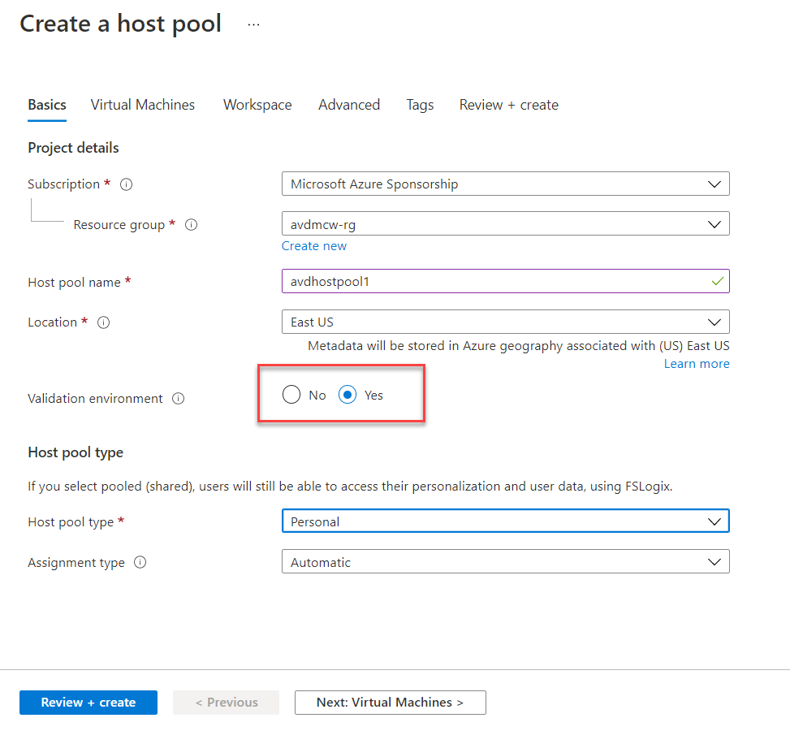
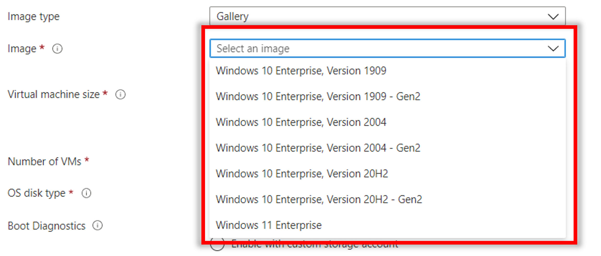
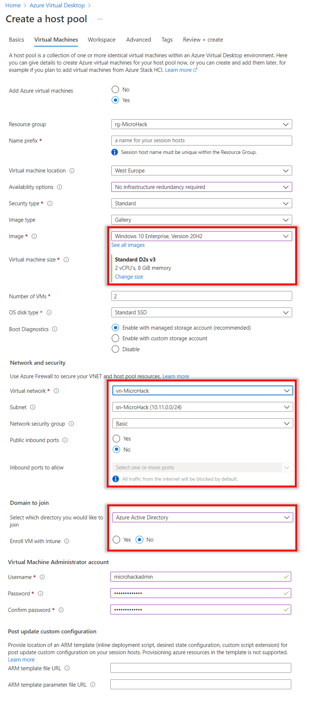

## Exercise 1: Create a host pool for personal desktops

Duration:  45 minutes

[Previous Challenge](./00-Pre-Reqs.md) - **[Home](../readme.md)** - **[Next Challenge solution](02-multi-session-Hostpools-solution.md)**

In this exercise we will be creating an Azure Virtual Desktop host pool for personal desktops. This is a set of computers or hosts which operate on an as-needed basis. In a pooled configuration we will be hosting multiple non-persistent sessions, with no user profile information stored locally. This is where FSLogix Profile Containers provide the users profile to the host dynamically. This provides the ability for an organization to fully utilize the compute resources on a single host and lower the total overhead, cost, and number of remote workstations.

**Additional Resources**

  |              |            |  
|----------|:-------------:|
| Description | Links |
| Create a host pool with the Azure portal | https://docs.microsoft.com/en-us/azure/virtual-desktop/create-host-pools-azure-marketplace |
  |              |            | 

### Task 1: Create a new Host Pool and Workspace

1.  Sign in to the [Azure Portal](https://portal.azure.com/).

2.  Search for **Azure Virtual Desktop** and select it from the list.

        

3.  Under Manage, select **Host pools** and select **+ Create**.
   
    

4.  On the Basics page, refer to the following screenshot to fill in the required fields. Select your Subscription, Resource Group and define a Hostpool name. As Location choose **West Europe**. 

:warning: This will only effect Meta data. The Datacenter location for virtual machines will follw. 

Change **Validation environment** to **Yes**.
Once complete, select **Next: Virtual Machines**.

    

5.  On the Virtual Machines page, provision a Virtual machine with the **Windows 10 multi-user + M365 apps**. Once complete, select **Next: Workspace**.
   
6.  For the **Image**, select **Browse all images and disks** and search to find **Windows 10 Enterprise multi-session, Version 2004 + Microsoft 365 Apps** and select that image.
    >**Note**: Selecting this image is very important. You will need the Microsoft 365 for assigning apps in this exercise.

    

    

7.  On the Workspace page, select **Yes** to register a new desktop app group. Select **Create new** and provide a **Workspace name**. Select **OK** and **Review + create**.

    

8.  On the Create a host pool page, select **Create**.

### Task 2: Create a friendly name for the workspace

The name of the Workspace is displayed when the user signs in. Available resources are organized by Workspace. For a better user experience, we will provide a friendly name for our new Workspace. 

>**Note**: The workspace will not appear until Task 1 has completed deployment. 

1.  Sign in to the [Azure Portal](https://portal.azure.com/).

2.  Search for **Azure Virtual Desktop** and select it from the list.

    

3.  Under Manage, select **Workspaces**. Locate the Workspace you want to update and select the name.

    

4.  Under Settings, select **Properties**.

5.  Update the **Friendly name** field to your desired name.

    

6.  Select **Save**.

    

### Task 3: Assign an Azure AD User to the desktop application group

In the new Azure Virtual Desktop ARM portal, we now can use Azure Active Directory groups to manage access to our host pools.

1.  Sign in to the [Azure Portal](https://portal.azure.com/).

2.  Search for **Azure Virtual Desktop** and select it from the list.

    ![This image shows where to search for Azure Virtual Desktop from the Azure portal search bar.]../Images/01-searchavd.png "Search for Azure Virtual Desktop")

3.  Under Manage, select **Application groups**.
    
4.  Locate the Application group that was created as part of Task 1 (**\<poolName\>-DAG**). Select the name to manage the Application group.

    

5.  Under Manage, select **Assignments** and select **+ Add**.

    

6.  In the fly out, enter **AVD** in the search to find the name of your Azure AD group. In this exercise we will select **AVD Pooled Desktop Users** and **AAD DC Administrators**.
    >**Note**: AAD DC Administrators will allow you to use your Azure tenant login to access resources in Exercise 7.

    

7.  Choose **Select** to save your changes.

    

With the assignment added, you can move on to the next exercise. The users in the Azure AD group can be used to validate access to the new host pool in a later exercise.
