# Exercise 1: Create a host pool for personal desktops

Duration:  30 minutes

**[Home](../Readme.md)** - [Next Challenge Solution](./02-Create-a-custom-golden-image-solution.md)

In this exercise we will be creating an Azure Virtual Desktop host pool for personal desktops. This is a set of computers or hosts which operate on an as-needed basis. This personal desktop will also function as a jump host in the following exercises.

**Additional Resources**
|              |            |  
|----------|:-------------|
| Description | Links |
| Create a host pool with the Azure portal | https://learn.microsoft.com/en-us/azure/virtual-desktop/create-host-pools-azure-marketplace |
| Configure the personal desktop host pool assignment type | https://learn.microsoft.com/en-us/azure/virtual-desktop/configure-host-pool-personal-desktop-assignment-type | 
| Connect with the Windows Desktop Client | https://learn.microsoft.com/en-us/azure/virtual-desktop/users/connect-windows?tabs=subscribe#install-the-windows-desktop-client  | 

## Task 1: Create a new Personal Host Pool and Workspace

1.  Sign in to the [Azure Portal](https://portal.azure.com/).

2.  Search for **Azure Virtual Desktop** and select it from the list.

3.  Under Manage, select **Host pools** and select **+ Create**.
   

4.  On the Basics page, refer to the following screenshot to fill in the required fields. Select your Subscription, Resource Group and define a Hostpool name. As Location choose **West Europe**. 

> **Info:** This will only effect metadata. The Datacenter location for virtual machines will follow. 

Change **Validation environment** to **Yes**.
Once complete, select **Next: Virtual Machines**.

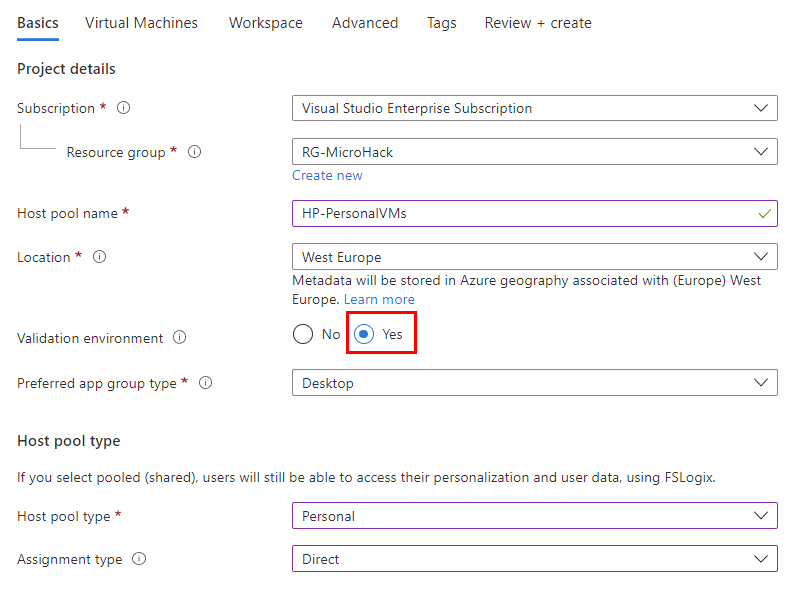

5.  On the Virtual Machines page, provision a Virtual machine with the **Windows 11 Enterprise**.
   
6.  For the **Image**, select **Browse all images and disks** and search to find **Windows 11 Enterprise** and select that image.
    >**Note**: Selecting this image is very important. You will need the Microsoft 365 for assigning apps in this exercise.

    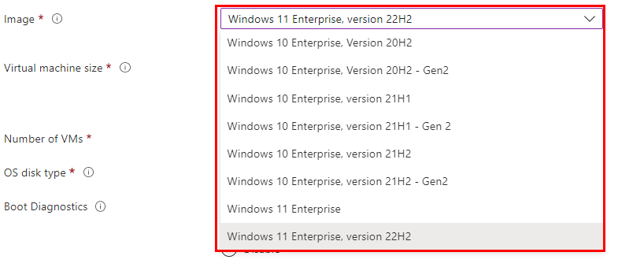

    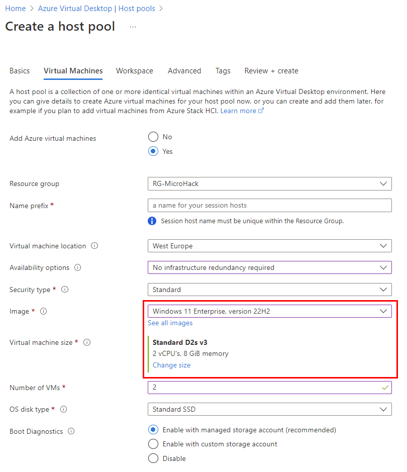

     

7.  On the Workspace page, select **Yes** to register a new desktop app group. Select **Create new** and provide a **Workspace name**. Select **OK** and **Review + create**.

    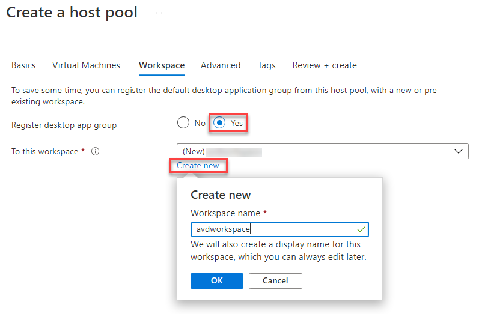

8.  On the Create a host pool page, select **Create**.

## Task 2: Create a friendly name for the workspace

The name of the Workspace is displayed when the user signs in. Available resources are organized by Workspace. For a better user experience, we will provide a friendly name for our new Workspace. 

>**Note**: The workspace will not appear until Task 1 has completed deployment. 

1.  Sign in to the [Azure Portal](https://portal.azure.com/).

2.  Search for **Azure Virtual Desktop** and select it from the list.

    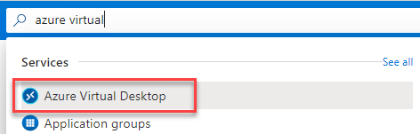

3.  Under Manage, select **Workspaces**. Locate the Workspace you want to update and select the name.

    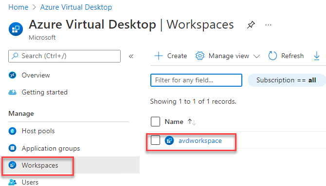

4.  Under Settings, select **Properties**.

5.  Update the **Friendly name** field to your desired name.

    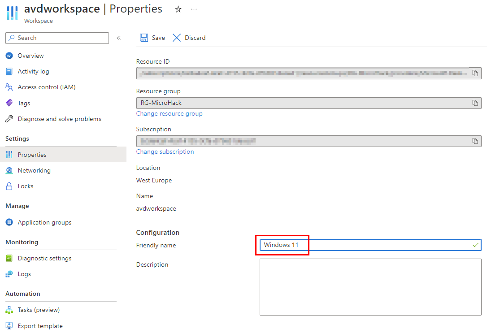

6.  Select **Save**.

## Task 3: Assign an Azure AD User to the desktop application group

In the new Azure Virtual Desktop ARM portal, we now can use Azure Active Directory groups to manage access to our host pools.

1.  Sign in to the [Azure Portal](https://portal.azure.com/).

2.  Search for **Azure Virtual Desktop** and select it from the list.

3.  Under Manage, select **Application groups**.
    
4.  Locate the Application group that was created as part of Task 1 (**\<poolName\>-DAG**). Select the name to manage the Application group.

    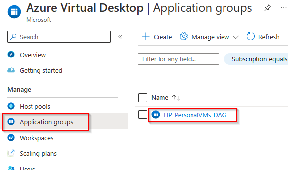

5.  Under Manage, select **Assignments** and select **+ Add**.

    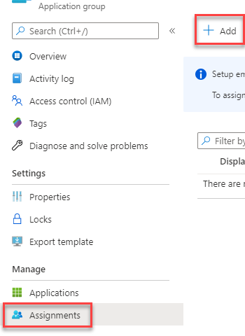

6.  In the fly out, enter **AAD Username or AAD Group** in the search to find the name of your Azure AD group. In this exercise we will select **Alex Wilber**.

    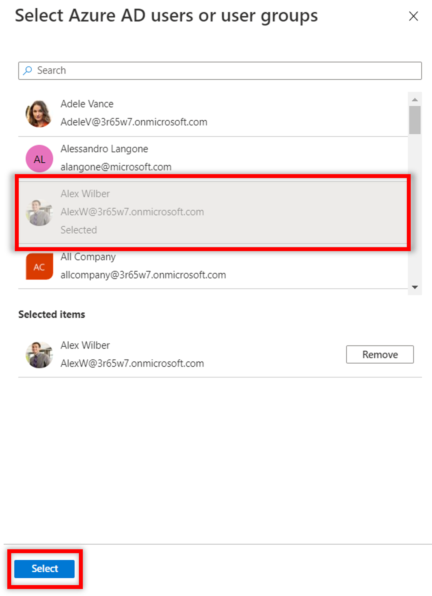

7.  Choose **Select** to save your changes.

    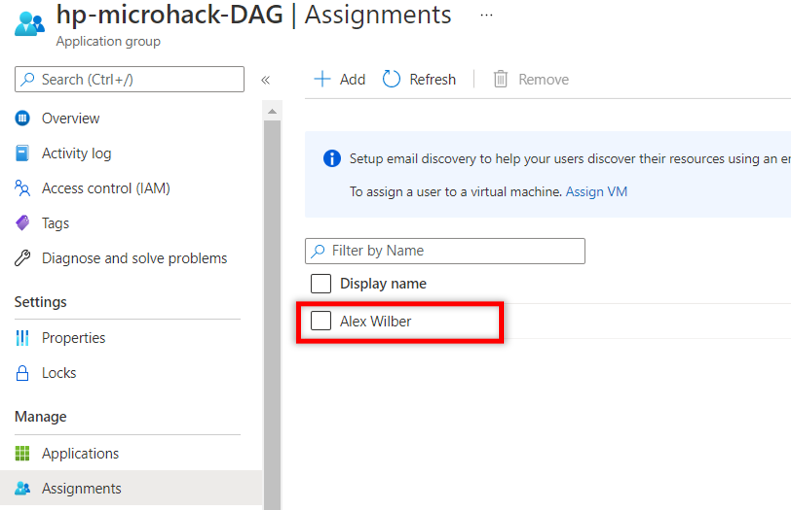

With the assignment added, you can move on to the resource group and configure the RBAC permission so the selected user can access the desktop via AAD only.

1.  Go to the resource group e.g. **rg-microhack** and select **Access Control (IAM)**.

    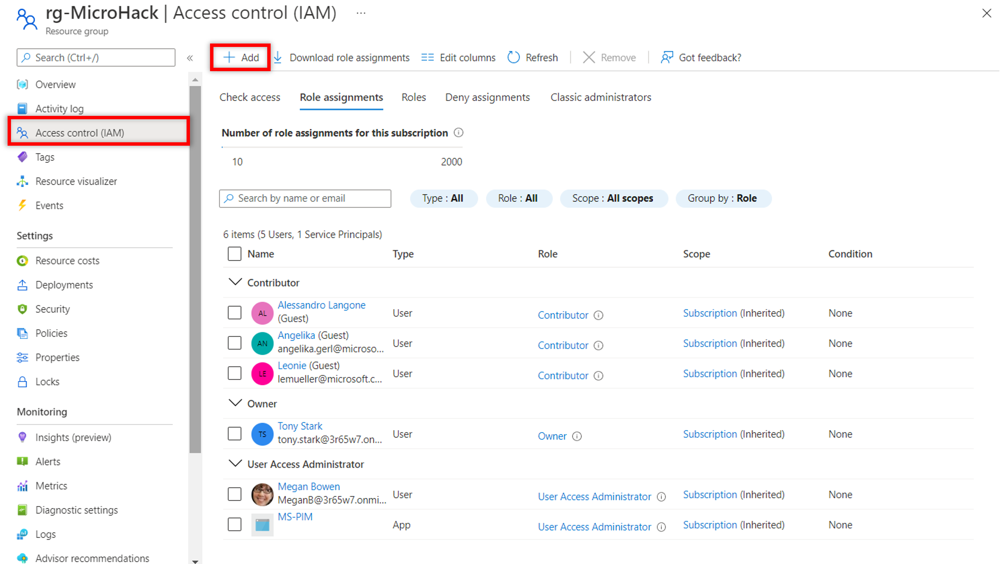

2. Select **Add** and search for **Virtual Machine User Login** or **Virtual Machine Administator Login** to access the session with local admin rights.

     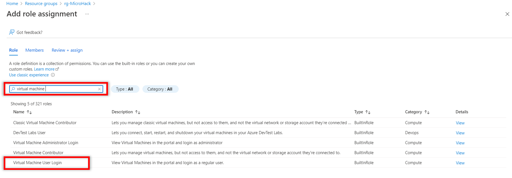

3. Select and add the **User or Group** and apply the Role assignment. 

    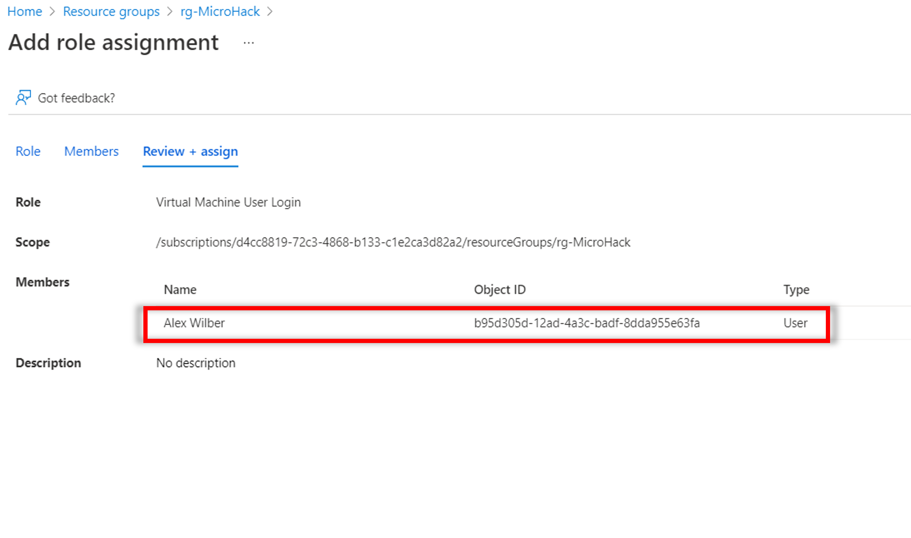

With this assignment you now can test the first connection to your AVD session host.

> **Note**: If you are trying to access your virtual desktop from Windows devices or other devices that are not connected to Azure AD, add **targetisaadjoined:i:1** as a custom RDP property to the host pool. [More information here](https://learn.microsoft.com/en-us/azure/virtual-desktop/deploy-azure-ad-joined-vm#access-azure-ad-joined-vms)
