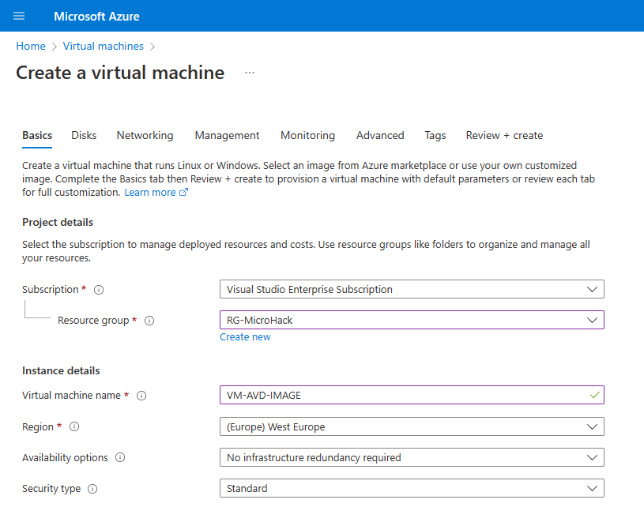
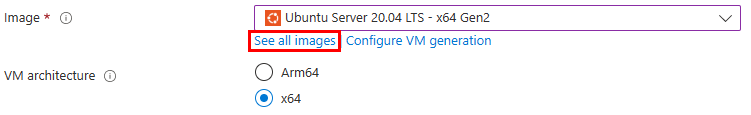
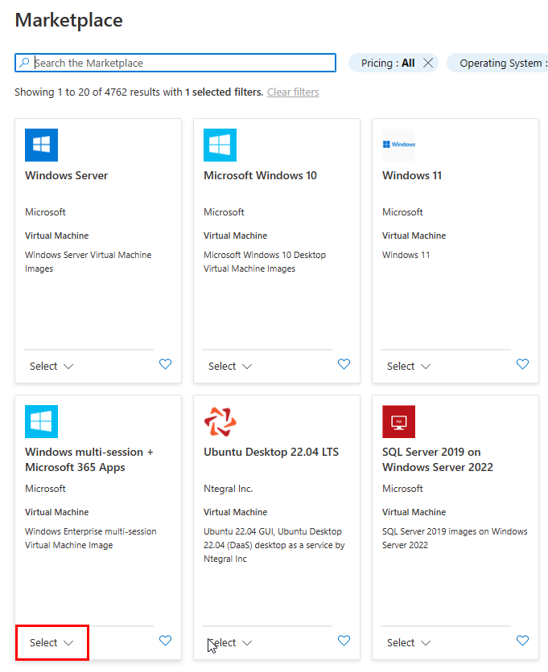
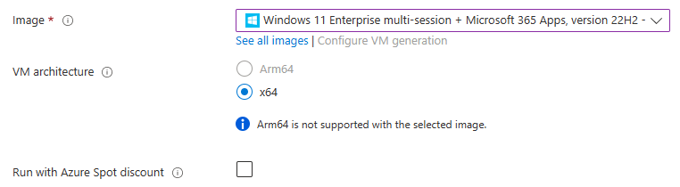
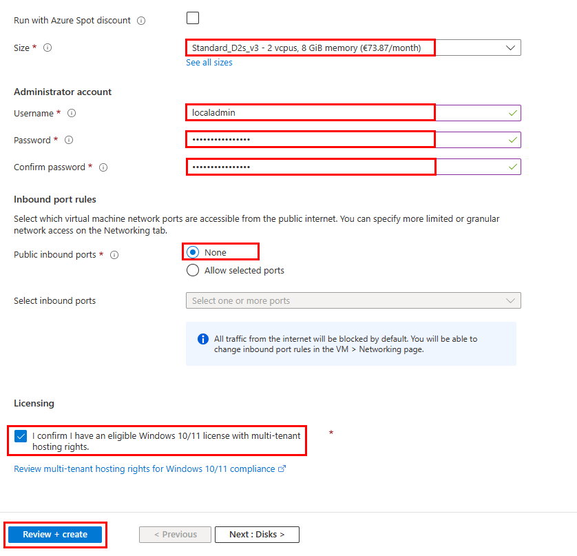
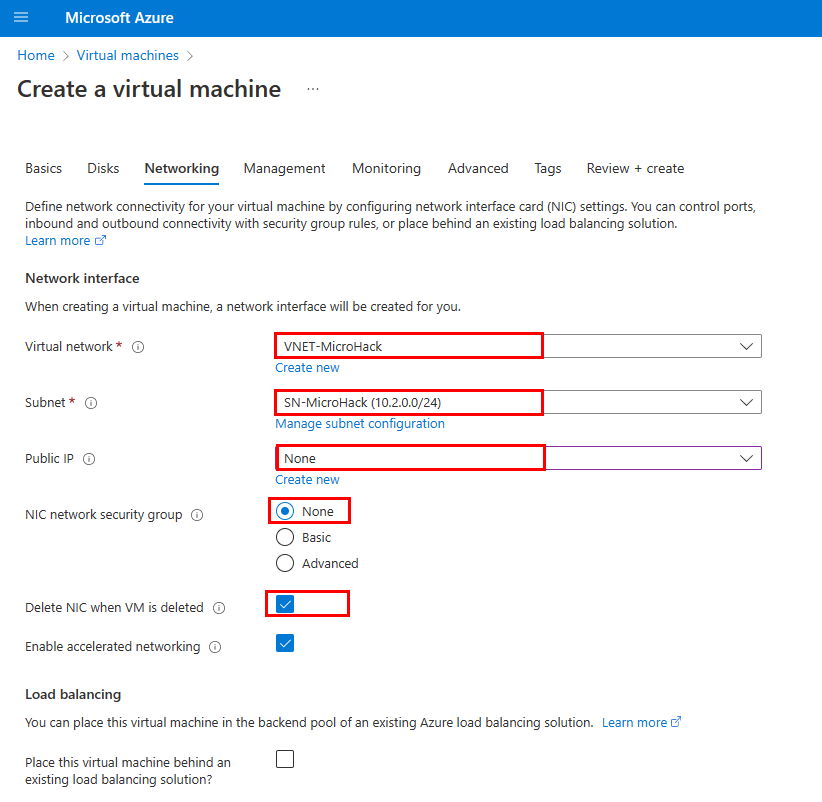
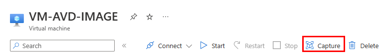
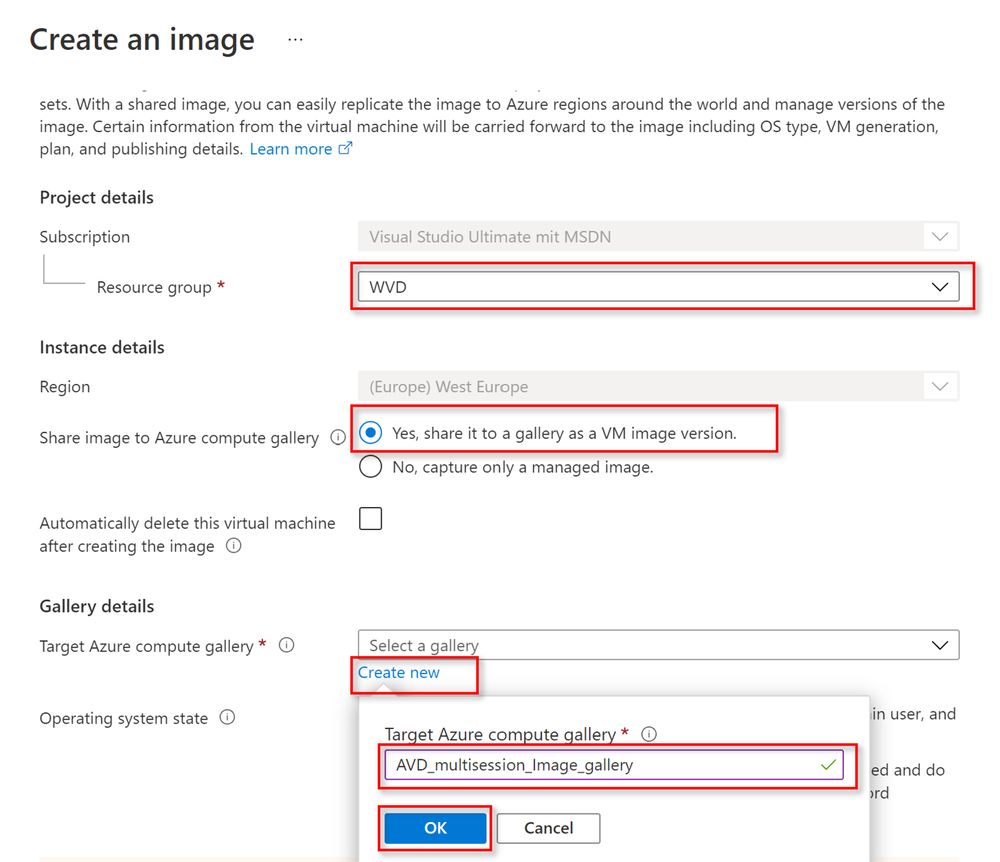
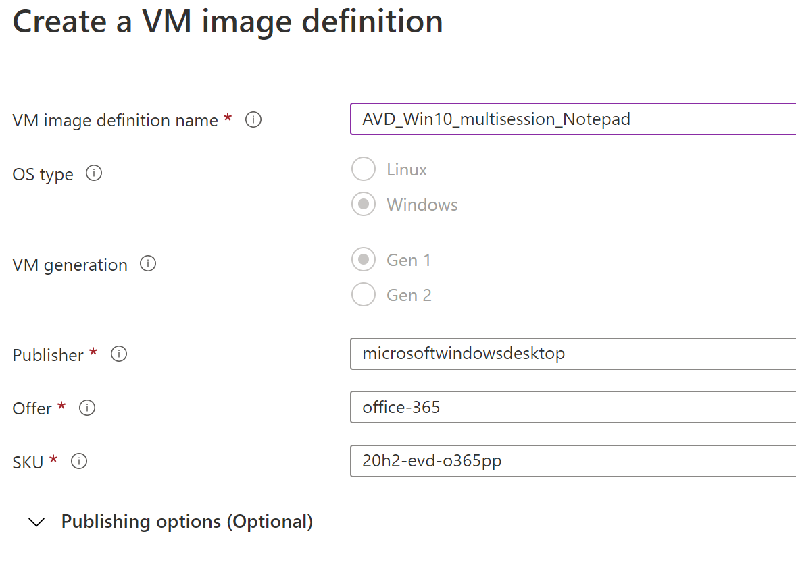
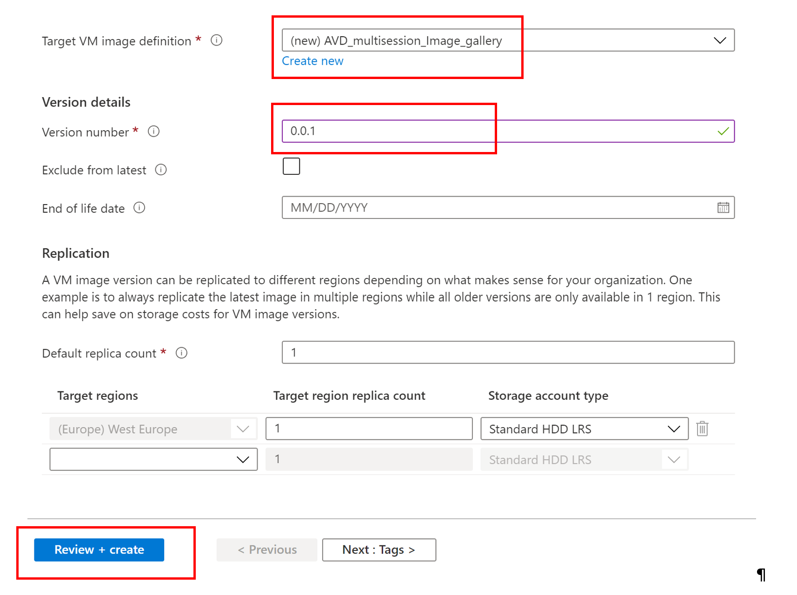

# Exercise 2: Create a custom golden image

Duration: 45 min

[Previous Challenge Solution](./01-Personal-Hostpools-solution.md) - **[Home](../Readme.md)** - [Next Challenge Solution](./03-start-VM-on-connect-solution.md)

In this challenge you will create a new virtual machine in Azure which will be used as foundation for the custom golden image. After deployment you will connect to the machine over your previously created personal host pool, deploy Notepad++, create an Image from the Azure VM and upload the image to the Image gallery. 


**Additional Resources**
|              |            |  
|----------|:-------------|
| Description | Links |
| Create a golden image in Azure | https://learn.microsoft.com/en-us/azure/virtual-desktop/set-up-golden-image |
| Capture an image of a VM using the portal |  https://learn.microsoft.com/en-us/azure/virtual-machines/capture-image-portal | 
| Create a host pool with the Azure portal | https://learn.microsoft.com/en-us/azure/virtual-desktop/create-host-pools-azure-marketplace |
| Configure the personal desktop host pool assignment type | https://learn.microsoft.com/en-us/azure/virtual-desktop/configure-host-pool-personal-desktop-assignment-type | 


## Task 1: Create a new imaging VM and install applications

1.  Open the [Azure Virtual Machine site](https://azvm.cmd.ms/) and create new virtual machine for manual creation of a custom image. 

2. **Select your subscription, the resource group, and define a temporary name for the virtual machine** that will be deleted after the custom image is captured. The region is filled automatically based on the resource group region. The availability options and security type do not need to be changed. 



3. For the image, you need to find the **Windows 11 Enterprise Multi-Session + Microsoft 365 Apps** via the **Show all images** link.
    >**Note**: Selecting an image with Microsoft 365 Apps is very important. You will need the apps for assigning them in a later challenge.





> The VM architecture is automatically filled in based on the selected image.

Please leave the **Run with Azure Spot discount** option disabled. 



4. Select the VM size, enter your preferred local administrator credentials, select **None** for public incoming ports, and answer the license questions.  



5. Click **Next : Disk >** and change the disk settings if you want, otherwise click **Next : Network >** so we can **disable the Public IP** creation.  

Select **None** for the public IP and the network security group NIC and enable the **Delete NIC when deleting the VM** option. 

>Note: The imaging VM should be accessible from the AVD session hosts. You can deploy the imaging VM on the same virtual network, because the VM will be deleted after the image is created. 



6. Next click **Review + Create** and then click **Create**.

7. Log in to the personal AVD host pool you created in challenge 1. From there you can reach the Imaging VM via RDP. Open **mstsc** and use the private IP address to connect to the Imaging VM. Log in with the credentials of the local administrator that you specified a few steps earlier. 

8. Next, **install some applications what you want**, for example [Visual Studio Code](https://aka.ms/vscode-win32-x64-system-stable) or the special application [Notepad++](https://github.com/notepad-plus-plus/notepad-plus-plus/releases/download/v8.4.7/npp.8.4.7.Installer.x64.exe).

9. Clean up the browsing history and delete the entire **C:\Windows\Panther** folder. Then run **sysprep to generalize the VM**. 

Open a CMD terminal as administrator and execute the following commands:

``` CMD 
rmdir /s C:\Windows\Panther

%windir%\system32\sysprep\sysprep.exe /oobe /generalize /mode:vm /shutdown
```

For more information check this [link](https://learn.microsoft.com/en-us/azure/virtual-machines/generalize).

10. Deallocate the imaging VM completely from the Azure portal. 

> Note: A shutdown within a VM does not unassign the VM in Azure, it only stops the VM. 

### Create Image with generalized option and upload it to the shared image gallery

1. Navigate to [Azure Virtual Machine site](https://azvm.cmd.ms/) and select the imaging VM, where you installed your applications. Then select **Capture**.



2. Select the **Subscription and Resource group details**. Then enter the information for the shared image as in the screenshots below.  



- Share image to Azure compute gallery: **Yes, share it to a gallery as a VM image version**
- Target Azure compute gallery: **Select create new, insert a name AVD_multisession_Image_gallery**
- Operating system state: **Generalized: VMs created from this image require hostname, admin user, and other VM related setup to be completed on first boot**


- Target VM image definition: **Select Create new**
- Insert name: **AVD_multisession_Image_gallery**
- Publisher: **microsoftwindowsdesktop**
- Offer: **office-365**
- SKU: **win11-21h2-avd-m365pp**



- Select your recently created Target VM image definition **AVD_multisession_Image_gallery**
- Enter an image version number, type **0.0.1**
- If you want this version to be included when you specify latest for the image version, then leave Exclude from latest unchecked.
- if you want, you can select an End of life date. This date can be used to track when older images need to be retired.
- Under Replication, select a default replica count and then select any additional regions where you would like your image replicated.
- When you are done, select **Review + create**.
