# Exercise 2: Create a custom golden image

Duration: 45 min

[Previous Challenge Solution](./01-Personal-Hostpools-solution.md) - **[Home](../Readme.md)** - [Next Challenge Solution](./03-start-VM-on-connect-solution.md)

In this challenge, you will learn about creating a customized Azure Virtual Desktop image using the Azure VM Image Builder and then offering that image through the Azure Compute Gallery. There are several ways to create a custom golden image. This can be done manually by first creating an Azure VM and then generalizing and capturing it. Alternatively, PowerShell commands, ARM templates, or the Custom Image Template feature accessible from the Azure Portal GUI can be used. This feature guides you through the prerequisites and process of using Azure Image Builder. You should use the Custom Image Template in this challenge. 

**Additional Resources**
|              |            |  
|----------|:-------------|
| Description | Links |
| Create an Azure Virtual Desktop image by using VM Image Builder and PowerShell |  https://learn.microsoft.com/en-us/azure/virtual-machines/windows/image-builder-virtual-desktop | 
| Custom image templates in Azure Virtual Desktop (preview) | https://learn.microsoft.com/en-us/azure/virtual-desktop/custom-image-templates |
| Use Custom image templates to create custom images in Azure Virtual Desktop (preview) | https://learn.microsoft.com/en-us/azure/virtual-desktop/create-custom-image-templates |
| Manage user-assigned managed identities | https://learn.microsoft.com/en-us/azure/active-directory/managed-identities-azure-resources/how-manage-user-assigned-managed-identities?pivots=identity-mi-methods-azp |
| Create or update Azure custom roles using the Azure portal | https://learn.microsoft.com/en-us/azure/role-based-access-control/custom-roles-portal |
| Azure VM Image Builder overview | https://learn.microsoft.com/en-us/azure/virtual-machines/image-builder-overview?tabs=azure-powershell |

# Task 1 - Create user-managed identity and assign minimum permissions

>[!note]By default, Image Builder supports using scripts, or copying files from multiple locations, such as GitHub and Azure storage. To use these, they must be publicly accessible. Beginning of June 2020 you need to use an Azure User-Assigned Managed Identity, defined by you, to allow Image Builder access Azure Storage, as long as the identity has been granted a minimum of **Storage Blob Data Reader*** on the Azure storage account. This means you do not need to make the storage blobs externally accessible, or setup SAS Tokens.

1. Open the [Azure managed identity site](https://azmi.cmd.ms/) and select **Create** to create a new managed identity.

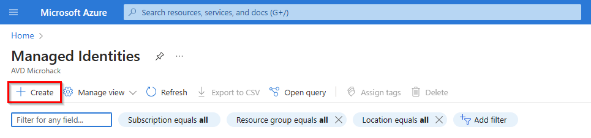

2. In the **Basics** tab, enter the following information.

| Field | Value | Notes
|:---------|:---------|:---------|
| Subscription | ME-AVDMicrohack-1 |
| Resource Group | RG-MicroHack | Select your own resource group.
| Region | West Europe | 
| Name | ID-AIB-MicroHack | Select your own managed identity.

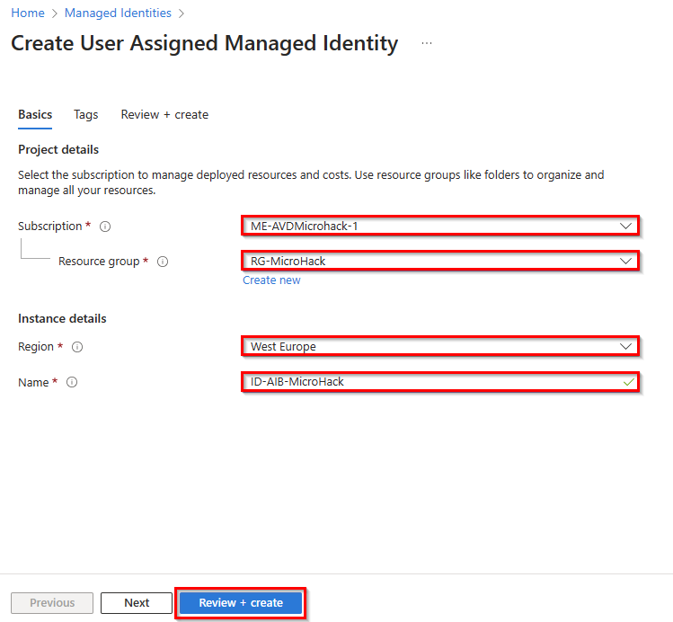

And then click **Review + create**.

3. Then review your managed identity settings and confirm with **Create**.

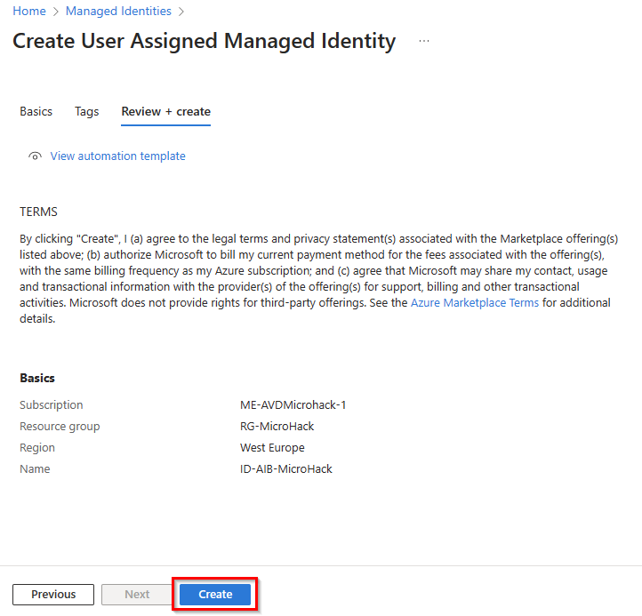

4. Next, open the [Azure Resource groups blade](https://azrg.cmd.ms/) and select your resource group.

5. Select **Access control (IAM)** to create and assign a new custom role. 

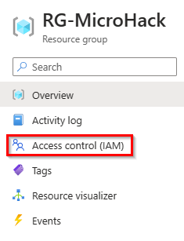

6. Then select **+ Add** and **Add custom role**.

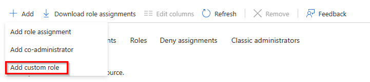

7. Enter a **customer role name**, e.g. "Azure Image Builder Role" and select **Start from scratch** then click **Next**.

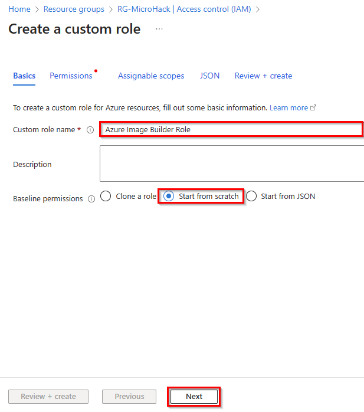

8. Now you can skip the Permissions and Assignable Scopes tab and move on to the JSON tab. Select **Edit** to add some permission actions to the empty JSON file.

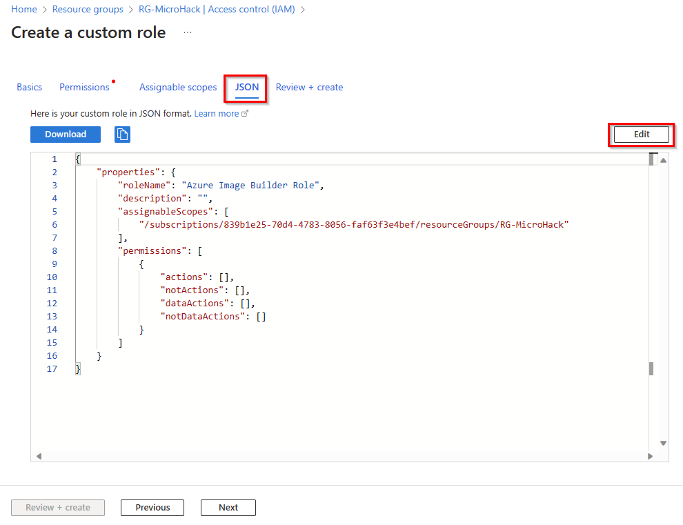

9. Enter the **following permissions as actions** and then save your changes.

```
"Microsoft.Compute/galleries/read",
"Microsoft.Compute/galleries/images/read",
"Microsoft.Compute/galleries/images/versions/read",
"Microsoft.Compute/galleries/images/versions/write",
"Microsoft.Compute/images/write",
"Microsoft.Compute/images/read",
"Microsoft.Compute/images/delete"
```
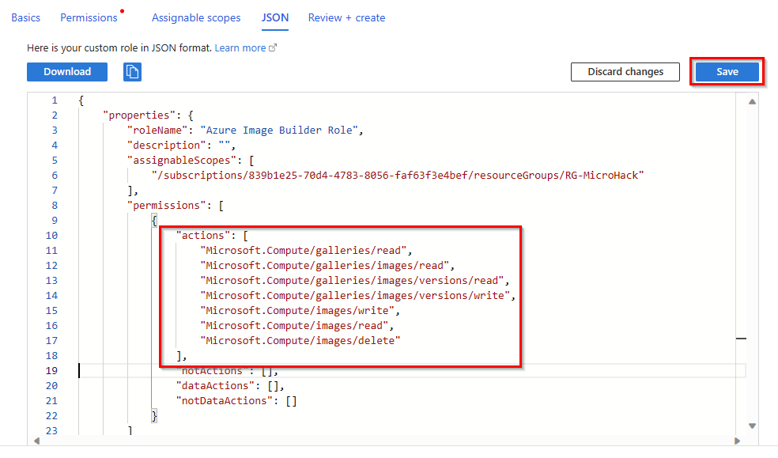

Click **Review + create** to continue. 


10. Select **Create** to create your new custom role. 

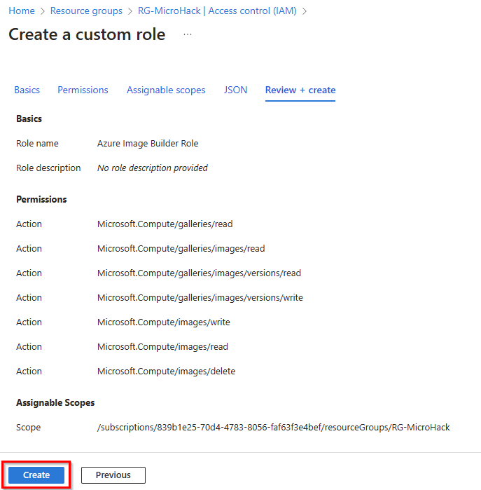

If the custome rule is created successfully, you will see the following pop-up information:

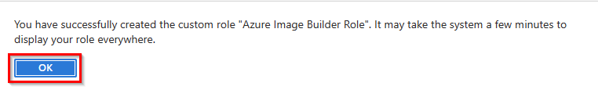

11. Next, we need to assign this custom role to your previously created managed identity. Select **+Add** and then **Add Role Assignment**:

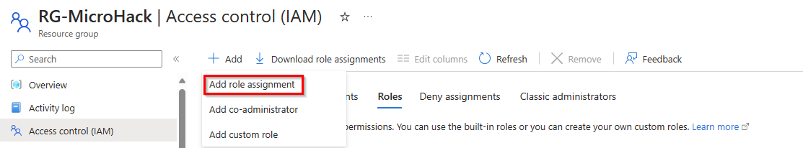

12. Search for your custom role, such as Azure Image Builder, and **select your role**, and then click **Next**.

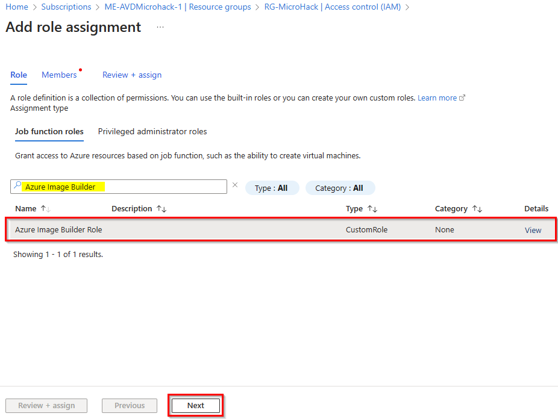

13. On the Members tab, select **Managed Identity** to assign access and click **+ Select Members**.

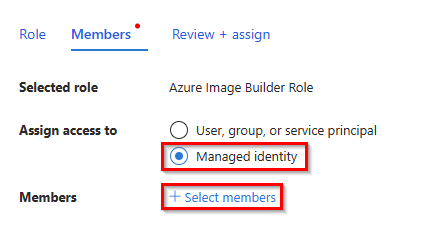

14. Next, you select the subscription and then you have the option to find your managed identity. You can **search for it by name** or **select your managed identity from the drop-down list**.

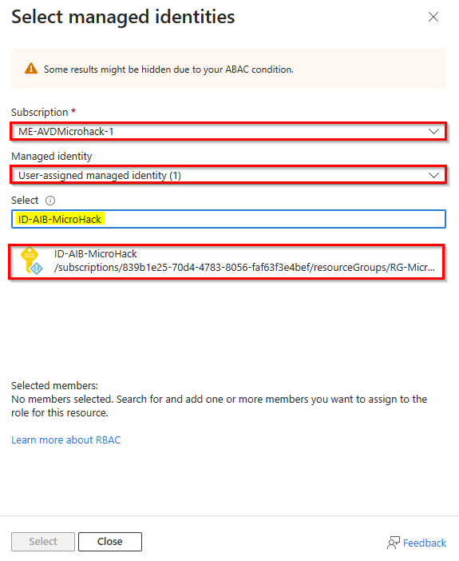

15. When you have selected your managed identity, click **Select**.

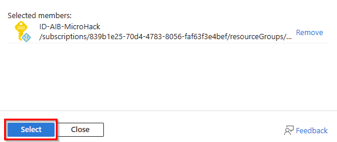

16. In the last step, select **Check + Assign**.

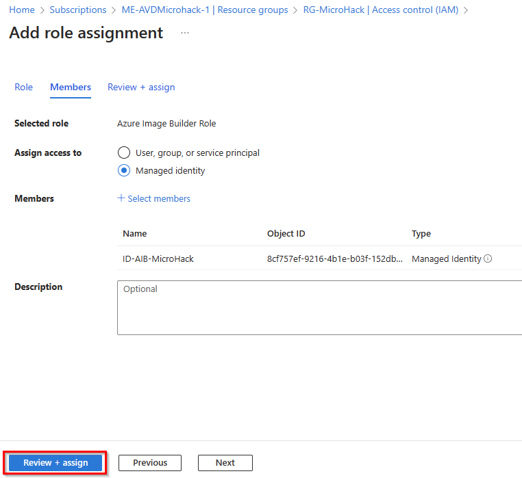

If the custome rule is assign successfully, you will see something like this pop-up information:

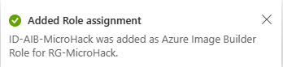

**Task 1 has been completed** 
# Task 2 - Create Azure Compute Gallery

>[!hint]There is no extra charge for using the Azure Compute Gallery service. You will be charged for the following resources:
>
>- Storage costs of storing the Shared Image versions. Cost depends on the number of replicas of the image version and the number of regions the version is replicated to. For example, if you have 2 images and both are replicated to 3 regions, then you will be charged for 6 managed disks based on their size. For more information, see [Managed Disks pricing](https://azure.microsoft.com/en-us/pricing/details/managed-disks/).
>- Network egress charges for replication of the first image version from the source region to the replicated regions. Subsequent replicas are handled within the region, so there are no additional charges.

1. Open the [Azure portal site](https://portal.azure.com/) and search for **Azure Compute Gallery**. 

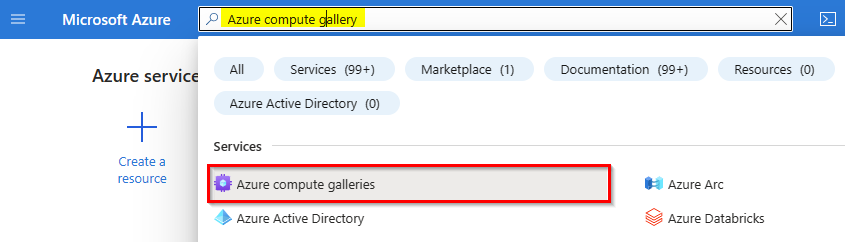

2. Select **+Create** to create a new Azure Compute Gallery.
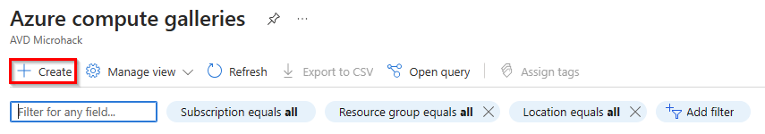

3. In the **Basics** tab, enter the following information.

| Field | Value | Notes
|:---------|:---------|:---------|
| Subscription | ME-AVDMicrohack-1 |
| Resource Group | RG-MicroHack | Select your own resource group.
| Name | WIN11AVDCoreApps | Enter a custom gallery name.
| Region | West Europe | 

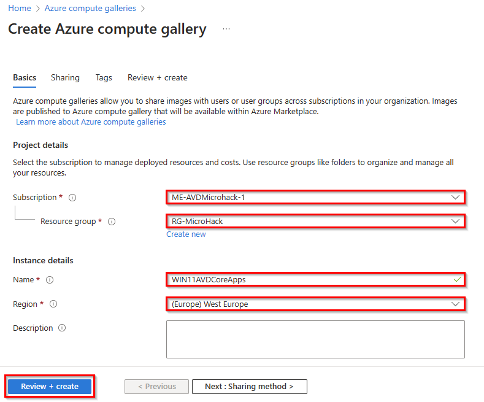

Then, click **Review + create**.

4. Select **Create**. 

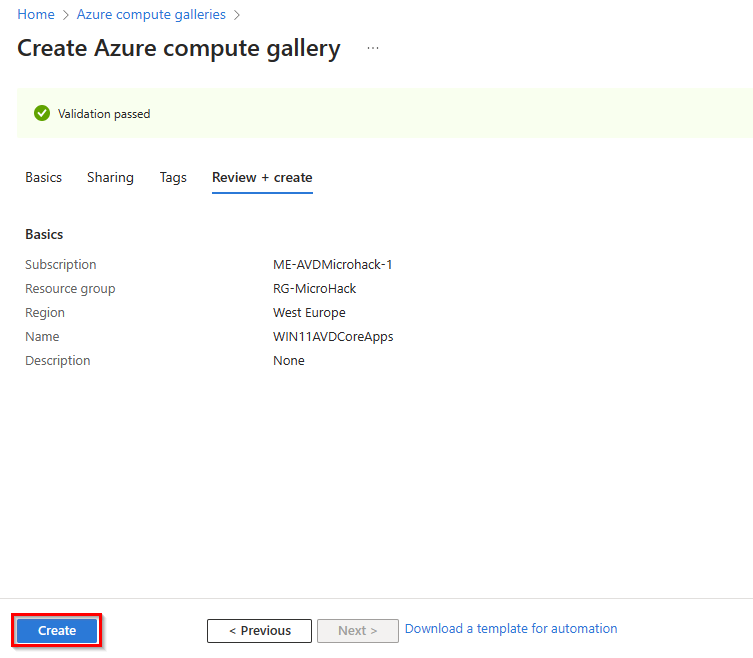

5. Once the Azure Compute gallery is successfully created, click **Go to Resource** as we also need to add an image definition.

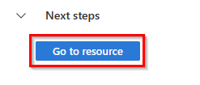

6. In your Azure compute gallery, select **+Add** and then **VM image definition**.

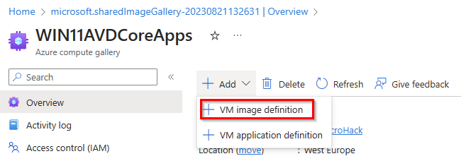

7. In the **Basics** tab, enter the following information.

| Field | Value | Notes
|:---------|:---------|:---------|
| Region | West Europe | 
| VM image definition name | WIN11AVDCoreAppsDefinition | Enter an image definition name.
| OS Type | Windows | 
| Security Type | Standard | 
| VM generation | Gen 2 | 
| VM architecture | x64 | 
| OS state | Generalized | 
| Publisher | MicroHack| Enter a publisher name.
| Offer | CoreApps | Enter an offer name.
| SKU | WIN11-AVD-M365-CoreApps | Enter a SKU name.

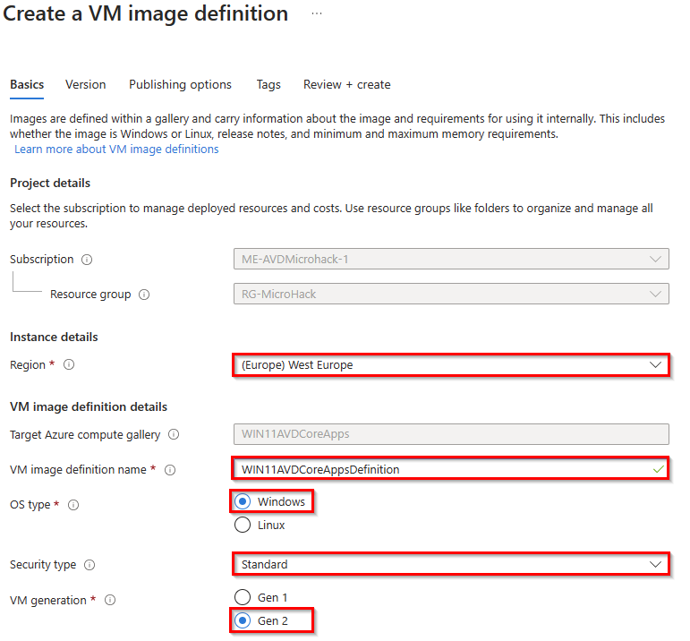

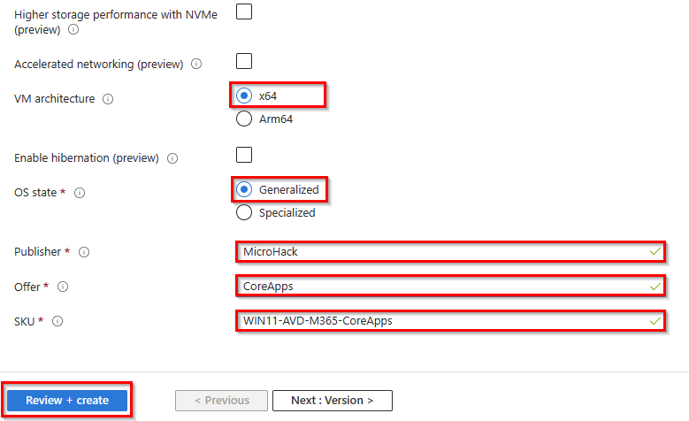

Then, select **Review + create**.

8. Review your details and click **Create**.

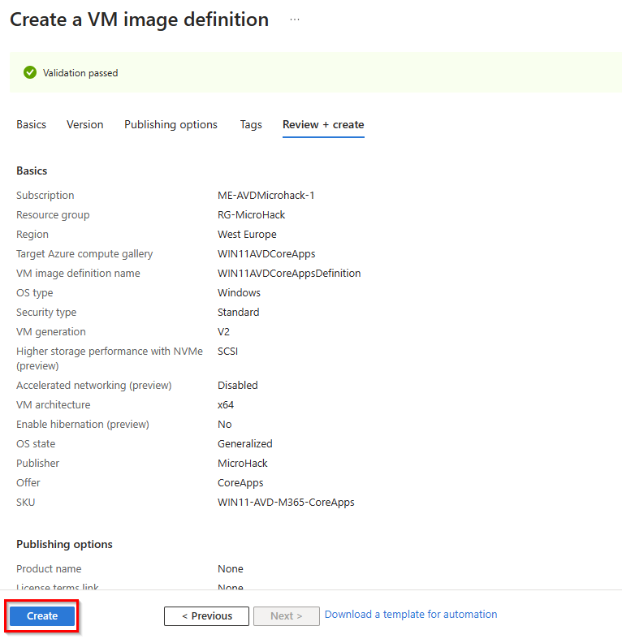

To allow Azure VM Image Builder to distribute images to either the managed images or to a Azure Compute Gallery, you will need to provide **Contributor** permissions for the service "**Azure Virtual Machine Image Builder**" (ApplicationId: **cf32a0cc-373c-47c9-9156-0db11f6a6dfc**) on the resource group.

9. Open the **Access Control (IAM)** menu for your resource group again and select **+Add** and then **Add Role Assignment**.

10. In the **Role** tab, select **Privileged administrator roles** then **Contributor** and click **Next**.

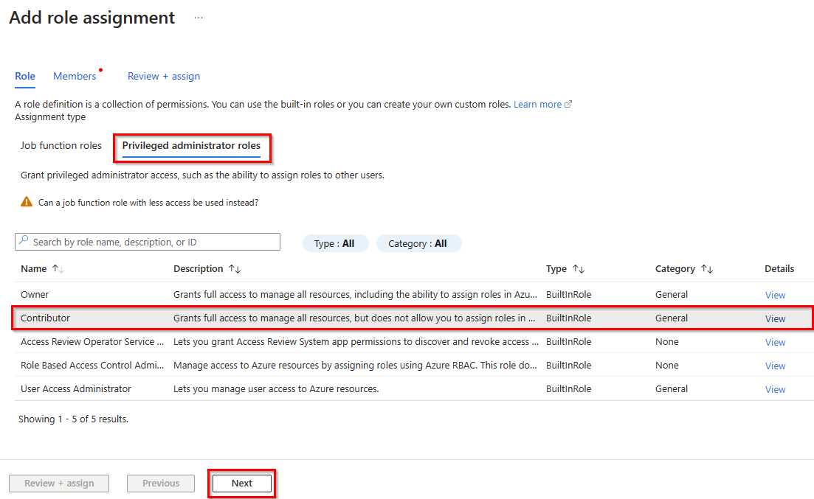

11. Click **+Select members** to find the Azure Virtual Machine Image Builder service.

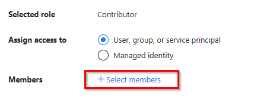

12. Search for **Azure Virtual Machine Image Builder** and select this service, then click **Select**.

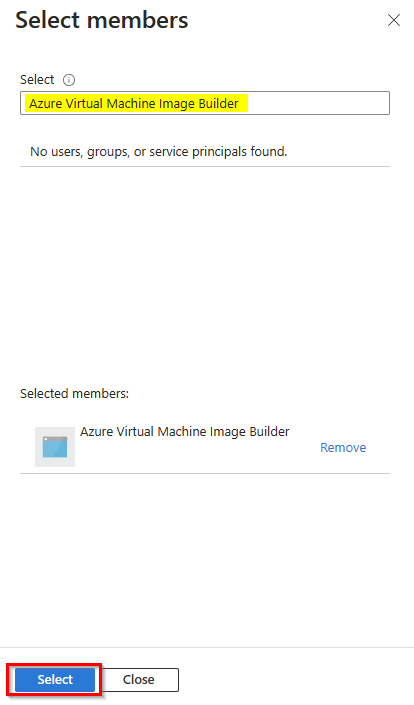

 13. Click **Review + assign**.

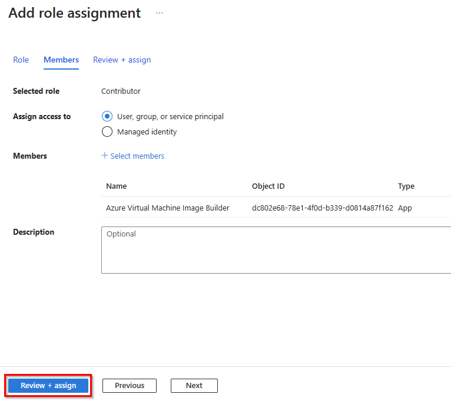

14. Check your details and click **Review + assign** again. 

**Task 2 has been completed** 

# Task 3 - Use AVD Custom Image Template to create new Golden Master Image

1. Open the [Azure Portal site](https://portal.azure.com/) and search for **Create** to create a new managed identity.

2. Next, select **Custom image templates** in the menu on the left side of the screen.

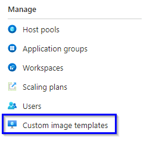

3. Select **Add custom image template**.

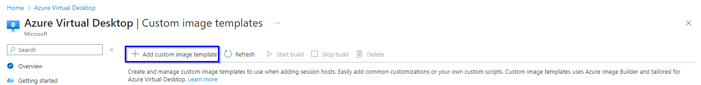

4. In the **Basics** tab, enter the following information.

| Field | Value | Notes
|:---------|:---------|:---------|
| Template name | CIT-WIN11-AVD-CoreApps | Enter a template name.
| Import from existing template | No  | 
| Subscription | ME-AVDMicrohack-1 |
| Resource Group | RG-MicroHack | Choose your own resource group.
| Managed identity | ID-AIB-MicroHack | Choose your own managed identity.

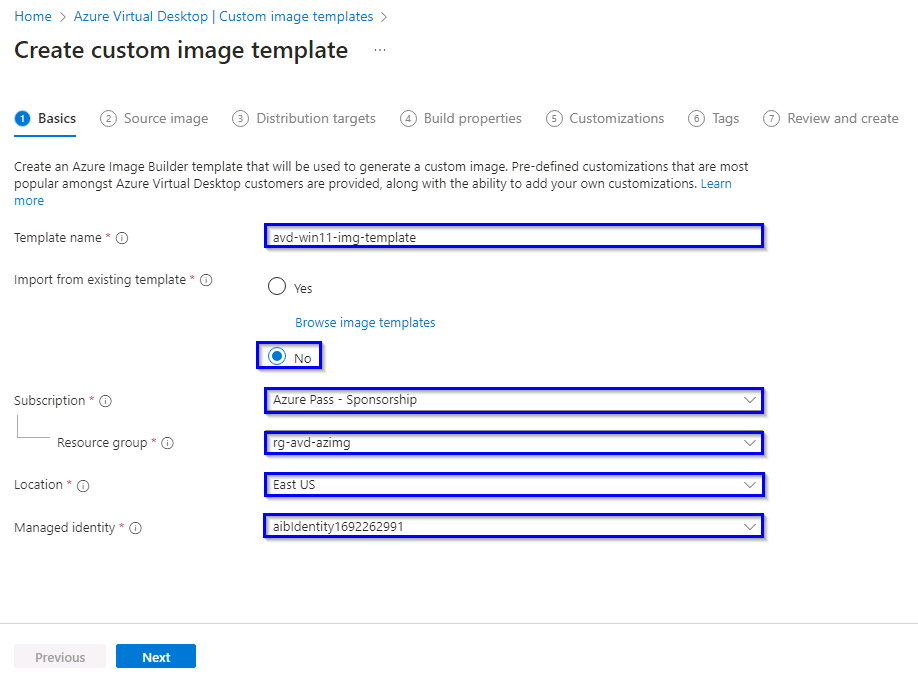

Select **Next**.

5. Then select the following **Source image information**:

| Field | Value | Notes
|:---------|:---------|:---------|
| Source type |Platform image (marketplace) |
| Select image | Windows 11 Enterprise multi-session + Microsoft 365 Apps, Version 22H2  | 

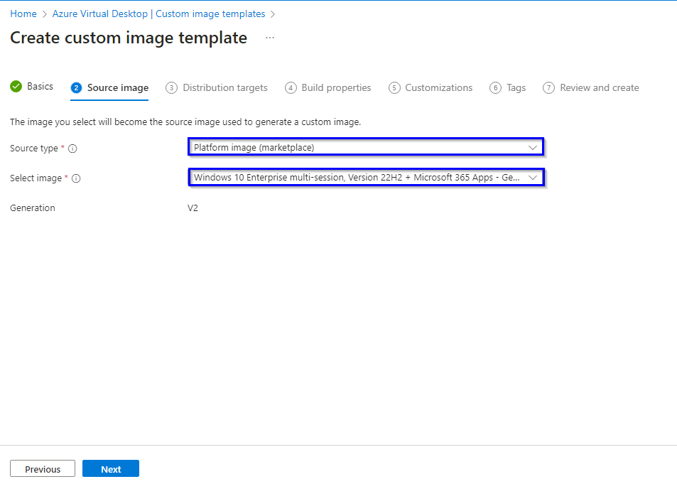

Select **Next**.

6. In the distibution targets tag, select **Azure Compute Gallery** and enter the following information:

>[!alert]If you want to deploy your session hosts to one of the regions currently not supported by Azure Image Builder (or if you just want to have your image made available in other regions) we recommend to use the Azure Compute Gallery to distribute your managed image to other locations. The primary purpose of using the Azure Compute Gallery is to replicate your master image to other Azure regions automatically. You can accomplish that by appending a second region to the Replication regions list. 

>If you are building your master image in the same region as your CONTOSODC AND if the Azure Image Builder service is available there ([Azure Image Builder Regions](https://docs.microsoft.com/en-us/azure/virtual-machines/linux/image-builder-overview?toc=/azure/virtual-machines/windows/toc.json&bc=/azure/virtual-machines/windows/breadcrumb/toc.json#regions)), then you may leave the Replication region parameter in the table below. Remember that the managed image has to be available in the Azure region you are planning to create session hosts. Additionally, session host VM require a direct line of sight to your DC.

| Field | Value | Notes
|:---------|:---------|:---------|
| Gallery name | WIN11AVDCoreApps |
| Gallery image definition | WIN11AVDCoreAppsDefinitions  | 
| Gallery Image version | 0.0.1 | It's optional.
| Run output name | WIN11AVDCoreApps | This value can be anything, it is just the name for the temporary resource group
| Replication regions | West Europe | 
| Exclude from latest | No | It's the first version.
| Storage account type | Standard_LRS |

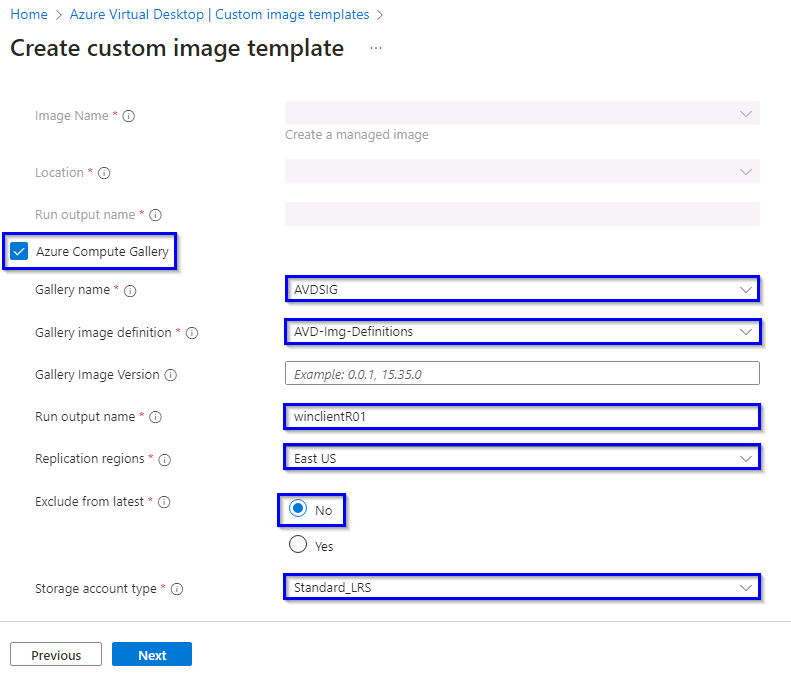

Select **Next**.

7. Next, you can change some build properties, but you can skip that for now and click **Next**.

8. On the Customizations tab, click **Add built-in Script**.

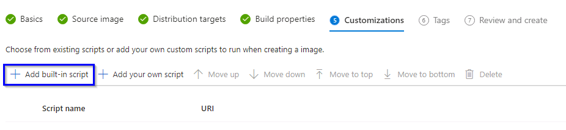

9. Next, you can add some built-in scripts to customize your Azure image and select the following scripts and customizations here.

**Operating system specific scripts:**

| Field | Value | Notes
|:---------|:---------|:---------|
| Time zone redirection | Enabled |

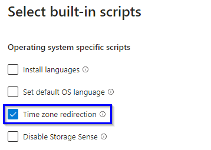


**Application scripts:**

| Field | Value | Notes
|:---------|:---------|:---------|
| Remove Appx packages | Enabled |
| Valid packages | Microsoft.GamingApp; Microsoft.XboxApp; Microsoft.Xbox.TCUI; Microsoft.XboxGameOverlay; Microsoft.XboxGamingOverlay; Microsoft.XboxIdentityProvider; Microsoft.XboxSpeechToTextOverlay; Microsoft.ZuneMusic; Microsoft.ZuneVideo   |


Select **Save**.

10. Then select **Add Custom Script** to add your automation script, for example, to install Visual Studio Code in your custom image.

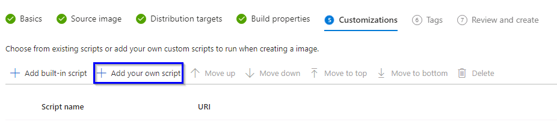


11. Enter the following information:

| Field | Value | Notes
|:---------|:---------|:---------|
| Script name | InstallApps.ps1 | Enter your custom script name.
| URI | https://raw.githubusercontent.com/dweppeler-msft/MicroHack/main/03-Azure/01-03-Infrastructure/01_Azure_Virtual_Desktop/modules/InstallApps.ps1 | Enter your custom script URL.

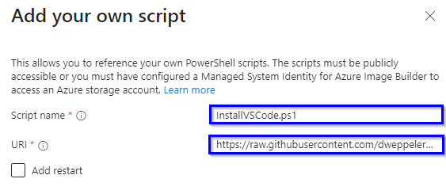

Select **Save**.

12.  Click **Next** to go to the Tags tab, which can be skipped, so **Next** again to the last tab **Check and Create**.

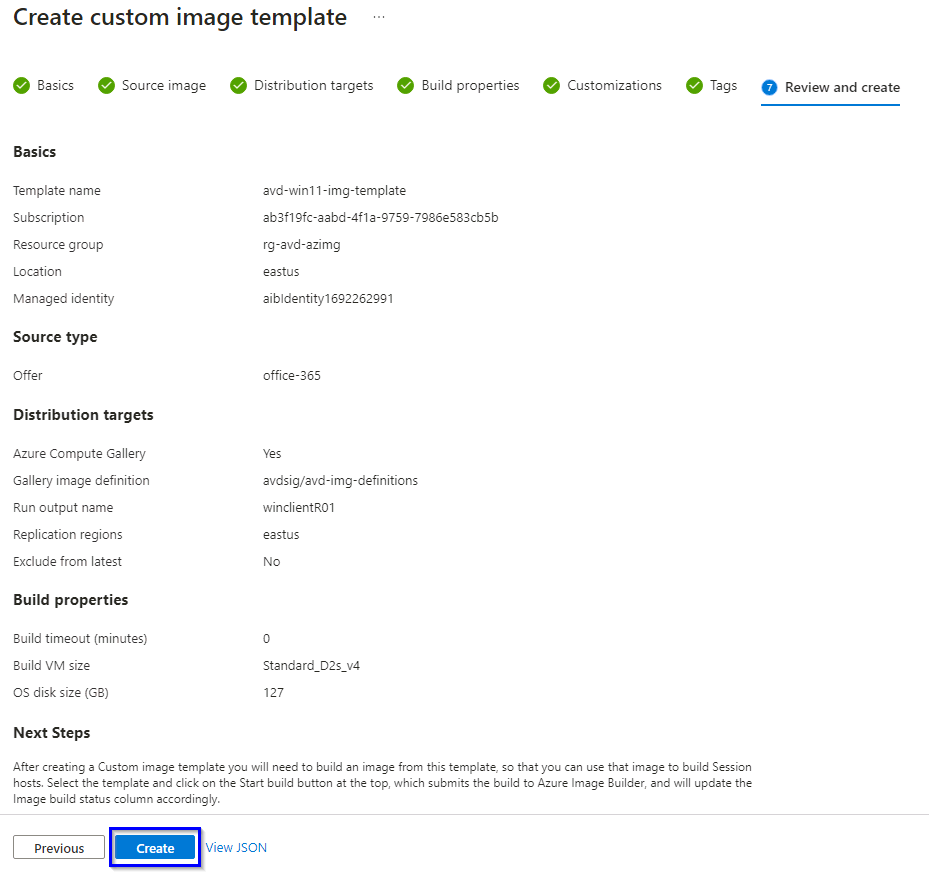


13. The last step is to click **Create** to create this custom image template, but this does not start the creation process yet.

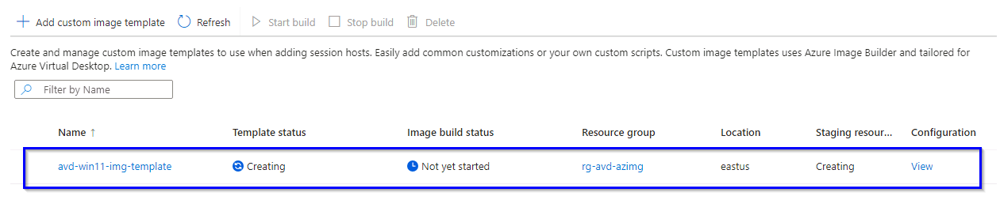

>**Info:** If the template creation fails because of the West Europe region, you need to recreate the template and use North Europe as the region, but for the replication region both (West Europe and North Europe).

14. When the customer image template is successfully created, you can start the image creation process by clicking **Start build**.

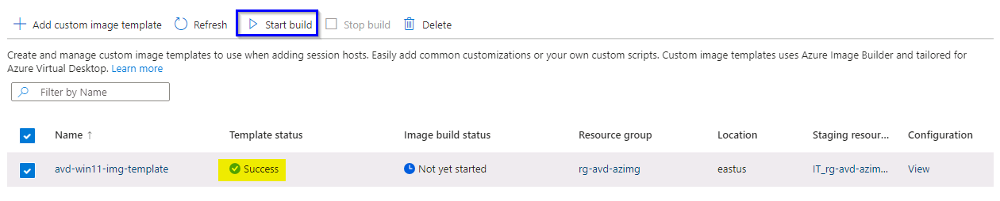


In the background, Azure Image Builder will create a staging resource group in your subscription. This resource group is used for the image build. It's in the format: **IT_%DestinationResourceGroup%_%TemplateName%**.

>**Warning:** Do not delete the staging resource group directly. Delete the image template artifact, this will cause the staging resource group to be deleted.

In the meantime, open with a browser the Azure portal and navigate to the **All resources** view. You should see - depending on the build task's progress - the staging resource group, a storage account and the new VM image.

```PowerShell-notab
https://portal.azure.com/
```
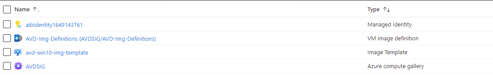

>[!important]The distribution process may take some time (approx. 60-90 minutes) to complete. You will not be able to complete exercise 2 before your custom image is available in your replication region. 

>[!knowledge]The time it takes to replicate to different regions depends on the amount of data being copied and the number of regions the version is replicated to. This can take a few hours in some cases. While the replication is happening, you can view the status of replication per region. Once the image replication is complete in a region, you can then deploy a VM or scale-set using that image version in the region.

**Task 3 has been completed** 
