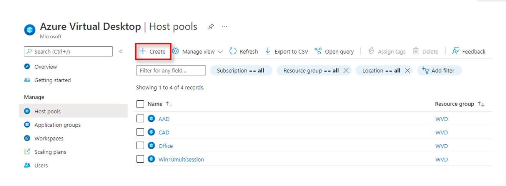
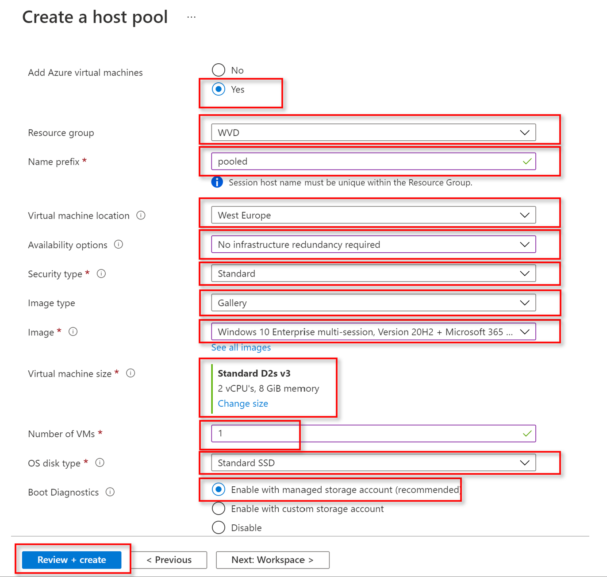
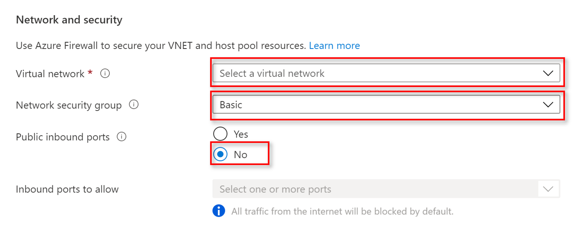
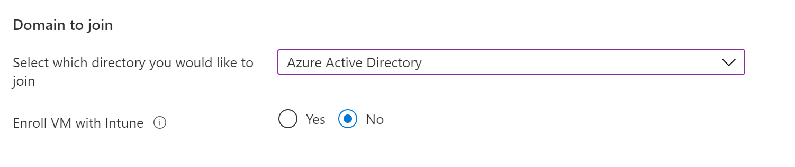
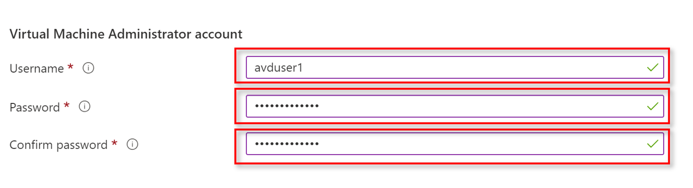
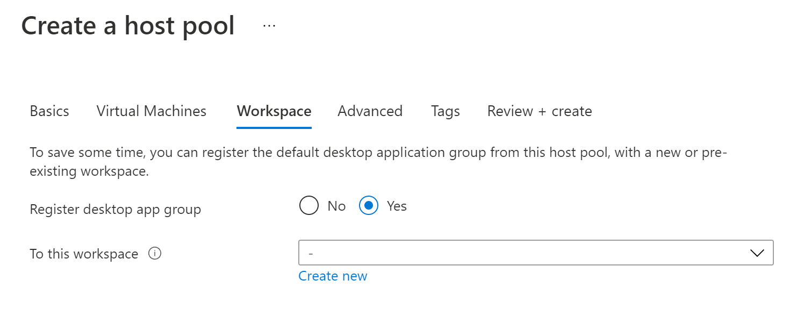
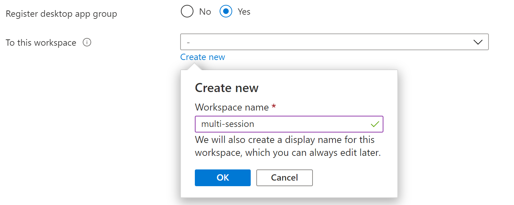
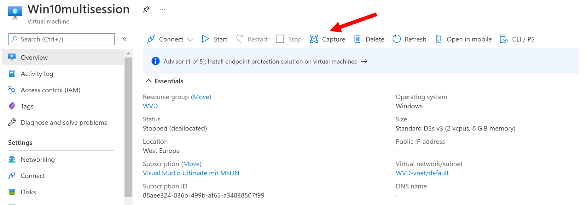

# Exercise 2: Create a host pool for multi-session desktops

## Task 1:

Create multi-session Hostpool joined in Azure Active Directory with the following settings:
- West Europe Region
- Metadata located in West Europe
- Mark as Validation environment
- Host Pool type: Pooled
- Add 1 Virtual machine with a Windows 10 Enterprise multi-session Version 20H2 + Microsoft 365 Apps Gallery image
- Domain to join: Azure Active Directory (Enroll with Intune “No”)
- Register desktop app group to new workspace
- Assign users

### Basics:
- choose your appropriate subscription
- choose the Resource group 
- Host pool name: Multi-session
- Location: West Europe
- Validation environment: yes (:bulb:as we are using the Azure AD join preview feature)
- Host pool type: Pooled
- Load balancing algorithm: Breath-first
- Max session limit: 15

klick next: Virtual machines

### Virtual machines:

Add Azure Virtual Machines: select yes

- Resource group: choose the appropriate Resource group
- Name prefix: pooled
- Virtual machine location: West Europe
- Availability options: no infrastructure redundandcy required
- Security type: Standanrd
- Image type: Gallery
- Image: Select an Image: Windows 10 Enterprise multi-session, Version 20H2 + Microsoft 365 Apps
- Virtual machine size: Standard D2s v 3 (2vCPU's, 8 GiB memory)
- number of VMs: 1
- OS disk type: Standard SSD
- Boot Diagnostics: Enable with managed storage account (recommended)

#### Network and Security:

- Virtual Network: Select your Virtual network
- Network security group: Basic
- Public inbound ports: No

#### Domain to join:

- Select which directory you would like to join: Select Azure Active Directory
- Enroll VM with Intune: No

#### Virtual Machine Administrator account:

- Username: avduser1
- Password: avdPa$$w0rd1!
- Confirm password: avdPa$$w0rd1!

click Next: Workspace

### Workspace:

Register desktop app group: Yes

To this workspace: click "Create new"
Enter workspace name: multi-session

click Review + create

## Task2:

### Assign user access to host pools

After you've created your host pool, you must assign users access to let them access their resources. To grant access to resources, add each user to the app group. Follow the instructions in Manage app groups to assign user access to apps and desktops. We recommend that you use user groups instead of individual users wherever possible.

For Azure AD-joined VMs, you'll need to do two extra things on top of the requirements for Active Directory or Azure Active Directory Domain Services-based deployments:

Assign your users the Virtual Machine User Login role so they can sign in to the VMs.
Assign administrators who need local administrative privileges the Virtual Machine Administrator Login role.
To grant users access to Azure AD-joined VMs, you must [configure role assignments for the VM](https://docs.microsoft.com/en-us/azure/active-directory/devices/howto-vm-sign-in-azure-ad-windows#configure-role-assignments-for-the-vm). 
You can assign the Virtual Machine User Login or Virtual Machine Administrator Login role either on the VMs, the resource group containing the VMs, or the subscription. We recommend assigning the Virtual Machine User Login role to the same user group you used for the app group at the resource group level to make it apply to all the VMs in the host pool.

### Add role assignment page in Azure portal

To configure role assignments for your Azure AD enabled VMs:

Select Access control (IAM).

Select Add > Add role assignment to open the Add role assignment page.

Assign the following role. For detailed steps, see Assign Azure roles using the Azure portal.

| Setting	| Value | 
| --------| ------| 
|Role	| Virtual Machine Administrator Login and Virtual Machine User Login |
| Assign access to	| User, group, service principal, or managed identity |

## Task 3:
### Login to the session host and create image

Login as a user with local administrative privileges (:bulb: therefore we added the role assignment "Virtual Machine Administrator Login" in Task 2)
You can Login either with the [AVD Webclient](https://rdweb.wvd.microsoft.com/arm/webclient/index.html) or with the [Windows Desktop Client](https://rdweb.wvd.microsoft.com/arm/webclient/index.html)

### Install Notepad++
[Download Notepad++](https://notepad-plus-plus.org/downloads/) and Install Notepad++

Log off

### Create Image with generalized option and upload it to the shared image gallery

- Navigate to Virtual machines and select the VM, where you installed Notepad++

- Select Capture, add Subscription and Resource group details

- Share image to Azure compute gallery: Yes, share it to a gallery as a VM image version
- Operating system state: Generalized: VMs created from this image require hostname, admin user, and other VM related setup to be completed on first boot
- Target VM image definition: Select Create new

