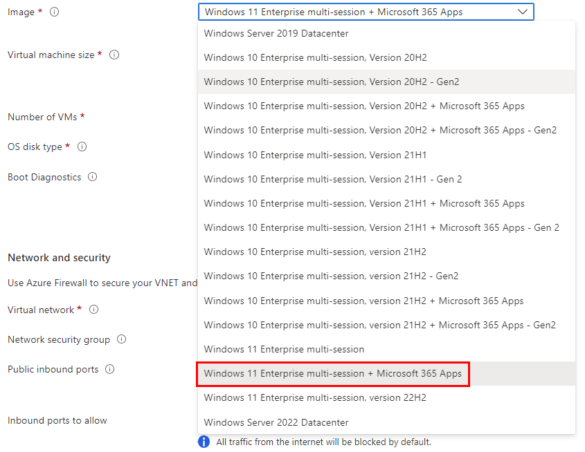
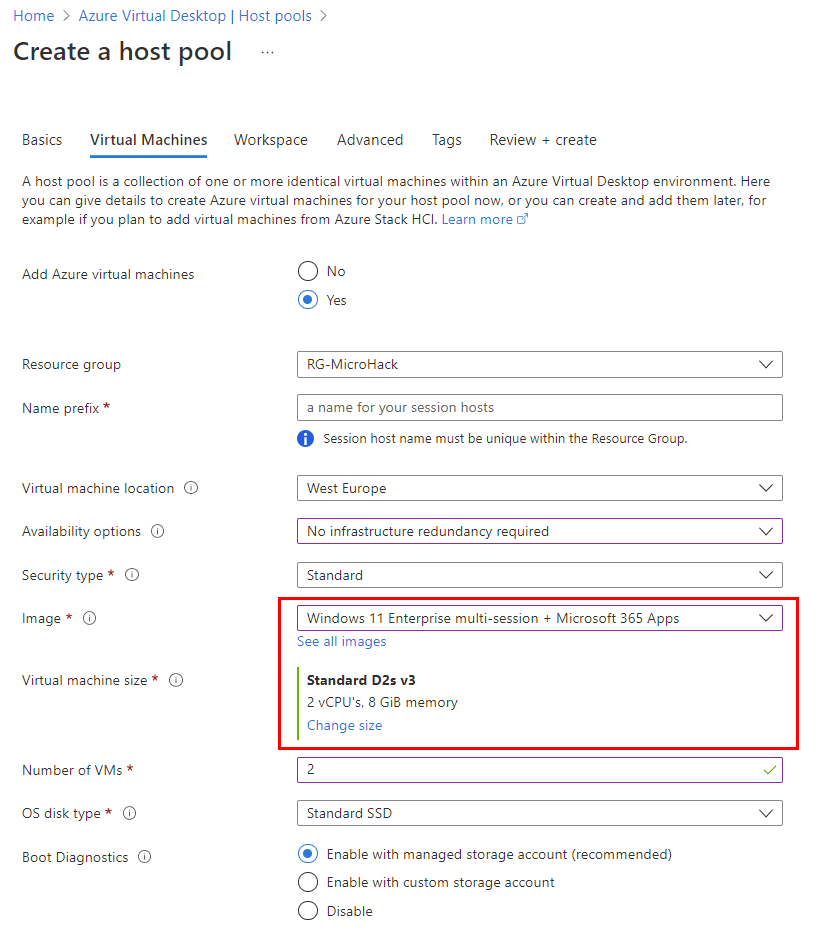
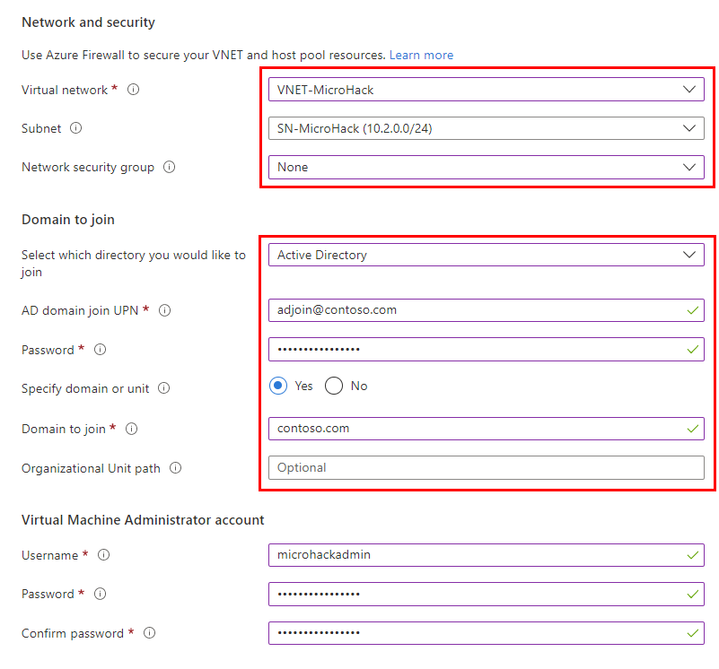
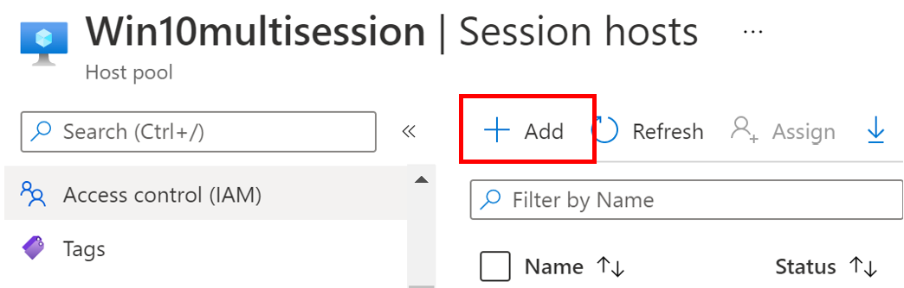
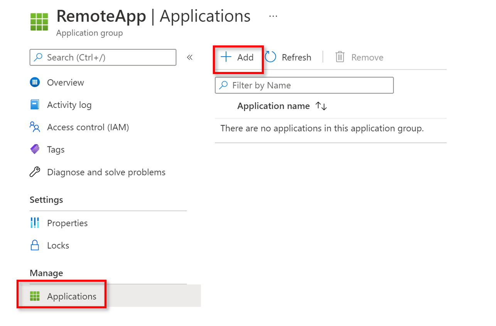
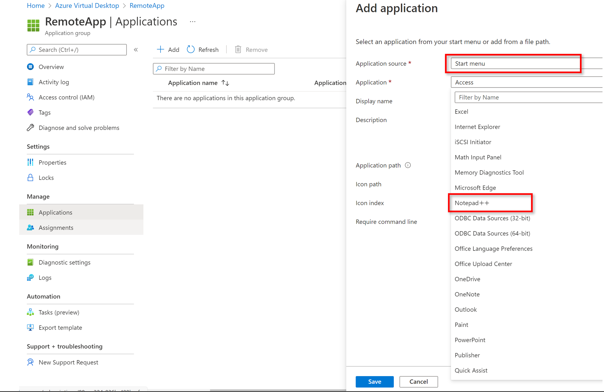
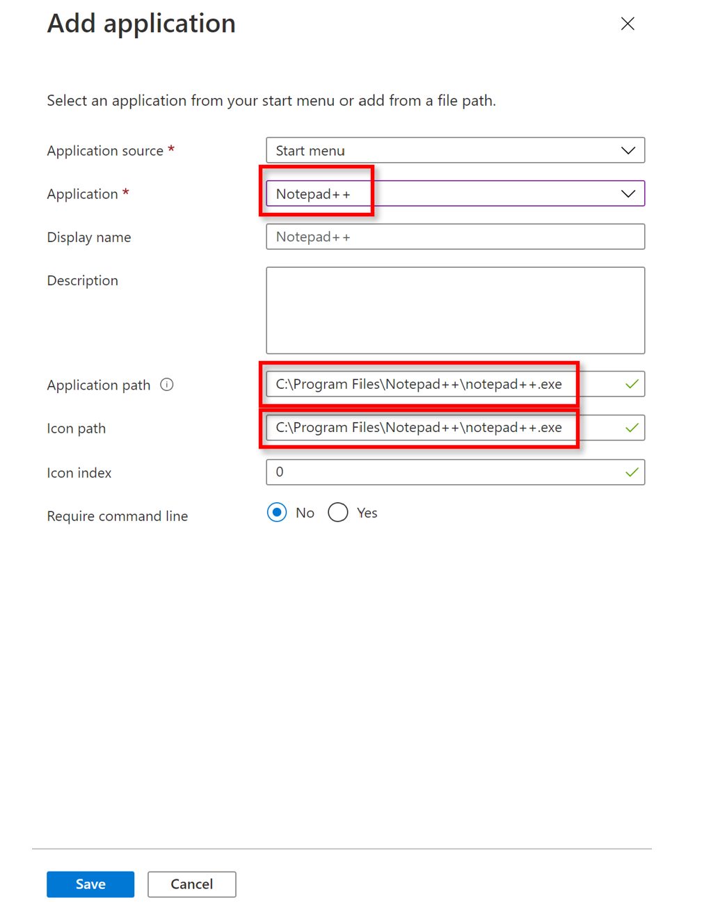
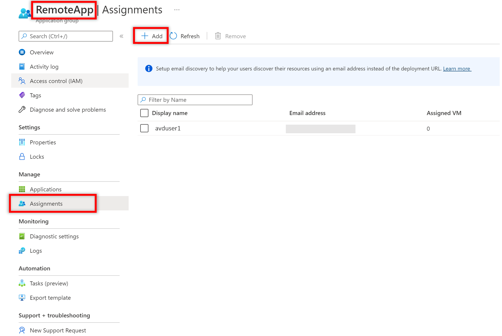

# Exercise 2: Create a host pool for multi-session

Duration: 45 min

[Previous Challenge Solution](./01-Personal-Hostpools-solution.md) - **[Home](../Readme.md)** - [Next Challenge Solution](03-Implement-FSLogix-Profile-Solution.md)

In this challenge you will create Azure Active Directory Domain Service joined pooled desktops used as a jump box. After deployment you will connect to the jumpbox, deploy Notepad++, 
create an Image and upload the image to the Image gallery. You will deploy a new hostpool from this image and deploy 2 Session hosts. Then you will provide Remote Apps to user

In a pooled configuration we will be hosting multiple non-persistent sessions, with no user profile information stored locally. This is where FSLogix Profile Containers provide the users profile to the host dynamically. This provides the ability for an organization to fully utilize the compute resources on a single host and lower the total overhead, cost, and number of remote workstations.

**Additional Resources**

  |              |            |  
|----------|:-------------:|
| Description | Links |
| Create Azure Virtual Desktop Hostpool | https://learn.microsoft.com/en-us/azure/virtual-desktop/create-host-pools-azure-marketplace?tabs=azure-portal |
| Capture an image of a VM using the portal |  https://learn.microsoft.com/en-us/azure/virtual-machines/capture-image-portal | 
| Manage app groups for Azure Virtual Desktop portal |  https://learn.microsoft.com/en-us/azure/virtual-desktop/manage-app-groups   | 
| Connect with the Windows Desktop Client |  https://learn.microsoft.com/en-us/azure/virtual-desktop/users/connect-windows?tabs=subscribe#install-the-windows-desktop-client  | 
  |              |            | 

## Task 1: Create a new Pooled Host Pool and Workspace

1.  Sign in to the [Azure Portal](https://portal.azure.com/).

2.  Search for **Azure Virtual Desktop** and select it from the list.

3.  Under Manage, select **Host pools** and select **+ Create**.
   

4.  On the Basics page, refer to the following screenshot to fill in the required fields. Select your Subscription, Resource Group and define a Hostpool name. As Location choose **West Europe**. 

> **Info:** This will only effect metadata. The Datacenter location for virtual machines will follow. 

Change **Validation environment** to **Yes**.
Once complete, select **Next: Virtual Machines**.

5.  On the Virtual Machines page, provision a Virtual machine with the **Windows 11 Enterprise multi-session + Microsoft 365 Apps**. Once complete, select **Next: Workspace**.
   
6.  For the **Image**, select **Browse all images and disks** and search to find **Windows 11 Enterprise multi-session + Microsoft 365 Apps** and select that image.
    >**Note**: Selecting this image is very important. You will need the Microsoft 365 for assigning apps in this exercise.

    

    

     

7.  On the Workspace page, select **Yes** to register a new desktop app group. Select **Create new** and provide a **Workspace name**. Select **OK** and **Review + create**.

    

8.  On the Create a host pool page, select **Create**.
## Task2:

### Assign user access to host pools

After you've created your host pool, you must assign users access to let them access their resources. To grant access to resources, add each user to the app group. Follow the instructions in Manage app groups to assign user access to apps and desktops. We recommend that you use user groups instead of individual users wherever possible.

1. Assign your users the Virtual Machine User Login role so they can sign in to the VMs.

2. Assign administrators who need local administrative privileges the Virtual Machine Administrator Login role.
To grant users access to Azure AD-joined VMs, you must [configure role assignments for the VM](https://docs.microsoft.com/en-us/azure/active-directory/devices/howto-vm-sign-in-azure-ad-windows#configure-role-assignments-for-the-vm). 

### Add role assignment page in Azure portal

To configure Virtual machine Administrator login for **AVDuser3**, follow the following steps:

1. Select Access control (IAM).

2. Select Add > Add role assignment to open the Add role assignment page.

3. Assign the following role. For detailed steps, see [Assign Azure roles using the Azure portal](https://docs.microsoft.com/en-us/azure/role-based-access-control/role-assignments-portal?tabs=current).

| Setting	| Value | 
| --------| ------| 
|Role	| Virtual Machine Administrator Login |
|Assign access to	| User, group, service principal, or managed identity |

## Task 3:
### Login to the session host and create image

Login with your administrative user account **avduser3 with local administrative privileges** (:bulb: therefore we added the role assignment "Virtual Machine Administrator Login" in Task 2)
You can Login either with the [AVD Webclient](https://client.wvd.microsoft.com/arm/webclient/index.html) or with the [Windows Desktop Client](https://aka.ms/AVDClient)

### Install Notepad++

Next, install Notepad++ for all users and then log off. 

Here you can download the Notepad++ source: [https://notepad-plus-plus.org/downloads/](https://notepad-plus-plus.org/downloads/) 

### Create Image with generalized option and upload it to the shared image gallery

1. Navigate to Virtual machines and select the VM, where you installed Notepad++

2. Select **Capture** and select the Subscription and Resource group details.

- Share image to Azure compute gallery: **Yes, share it to a gallery as a VM image version**
- Target Azure compute gallery: **Select create new, insert a name AVD_multisession_Image_gallery**
- Operating system state: **Generalized: VMs created from this image require hostname, admin user, and other VM related setup to be completed on first boot**

- Target VM image definition: **Select Create new**
- Insert name: **AVD_multisession_Image_gallery**
- Publisher: **microsoftwindowsdesktop**
- Offer: **office-365**
- SKU: **win11-21h2-avd-m365pp**

- Select your recently created Target VM image definition **AVD_multisession_Image_gallery**
- Enter an image version number, type **0.0.1**
- If you want this version to be included when you specify latest for the image version, then leave Exclude from latest unchecked.
- if you want, you can select an End of life date. This date can be used to track when older images need to be retired.
- Under Replication, select a default replica count and then select any additional regions where you would like your image replicated.
- When you are done, select **Review + create**.

## Task 4:
### Create 2 session hosts from your recently created image

- Navigate to your multisession hostpool and select **Session host**
- Click **Add**

- On the top, navigate to **Virtual Machines**
- Image type: **Gallery**
- Select **see all images**

- On the top, go to: **My Items**
- select: **Shared Images**
- click on your recently created image

- Image: your recently created image should show up
- Number of VMs: **2**
- click: **Review + Create**

After the VMs are created, login and verify, if Notepad++ is installed.

## Task 5: create Remote Apps

- Navigate to the Azure Virtual Desktop and select **Application Groups**
- Click **Create**

Create a new Application group
- **Select your Resource group**
- **Select your multi-session AVD Host pool**
- Application group type: **Remote App (RAIL)**
- Application group name: **RemoteApp**
- click **create**

Select Workspace in the creation wizard
- Register application group: **Yes**
- Register application group: **Multi-Session** 
- Click **Review + create**

> If another application group in the AVD host pool has already been registered then this app group will also be registered to that same workspace.

Navigate to your Windows 11 multisession Hostpool, on the left side below Manage, select **Application groups**
click on your recently created Application group named **RemoteApp**

- In your Application group RemoteApp, on the left side below Manage, select **Applications** 
- Click on **Add**

- Application source: **Startmenu**
- Application: **Select Notepad++**

 
- Application: **Notepad++ should appear**
- Application path and Icon path should automatically appear
- Click on **Save**

 

- Navigate to **Assignments**
- Assign the AVDUsers group to the Application group

Next, start your Remote Desktop Client App, refresh the AVD Workspace and launch the Notepad++ application.
