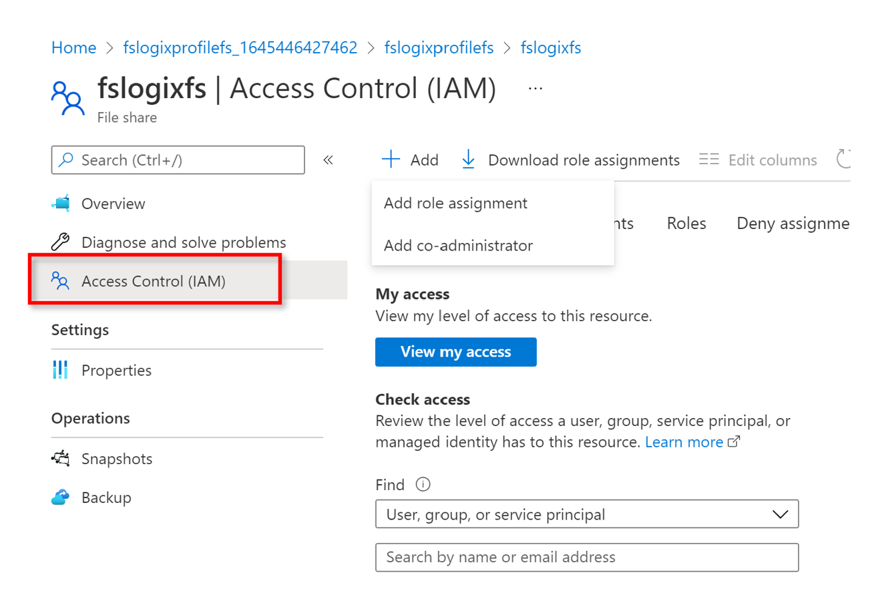
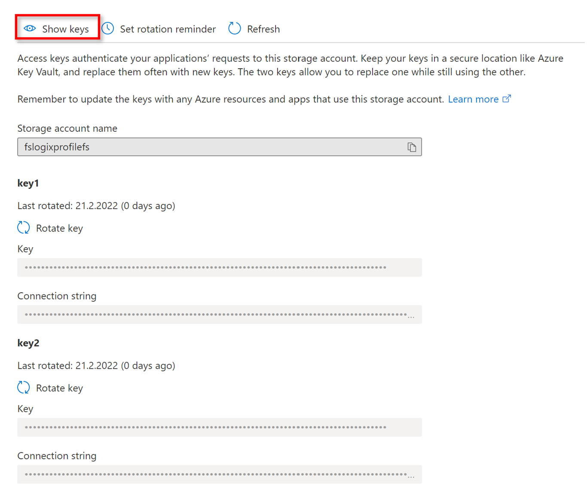
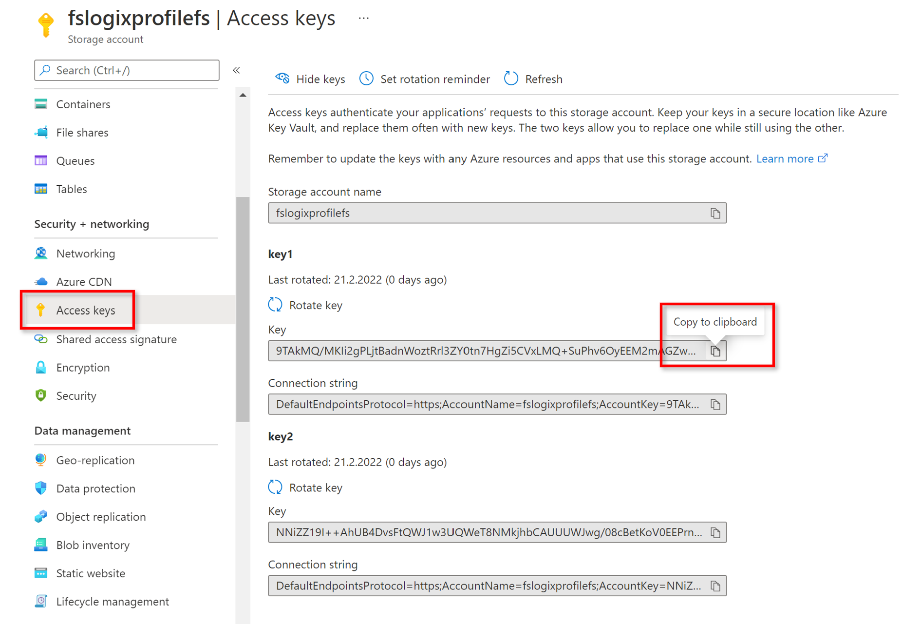

## Exercise 3: Create FSLogix Profile Solution

Duration: 45 minutes

[Previous Challenge Solution](./02-multi-session-Hostpools-solution.md) - **[Home](../readme.md)** - [Next Challenge Solution](04-start-VM-on-connect-solution.md)

In this challenge you will learn how to implement the FSLogix profile solution for multi-session hostpools
The Azure Virtual Desktop service recommends FSLogix profile containers as a user profile solution. FSLogix is designed to roam profiles in remote computing environments, such as Azure Virtual Desktop. It stores a complete user profile in a single container. At sign in, this container is dynamically attached to the computing environment using natively supported Virtual Hard Disk (VHD) and Hyper-V Virtual Hard disk (VHDX). The user profile is immediately available and appears in the system exactly like a native user profile.

**Additional Resources**

  |              |            |  
|----------|:-------------:|
| Description | Links |
| Create a storage account | https://docs.microsoft.com/en-us/azure/storage/common/storage-account-create?tabs=azure-portal |
| Create an Azure file share | https://docs.microsoft.com/en-us/azure/storage/files/storage-how-to-create-file-share?tabs=azure-portal |
|Create a profile container with Azure Files and Azure Active Directory  |  https://docs.microsoft.com/en-us/azure/virtual-desktop/create-profile-container-azure-ad   | 
  |              |            | 

### Task 1: Create a storage account
Azure file shares are deployed into storage accounts, which are top-level objects that represent a shared pool of storage. This pool of storage can be used to deploy multiple file shares.

Azure supports multiple types of storage accounts for different storage scenarios customers may have, but there are two main types of storage accounts for Azure Files. Which storage account type you need to create depends on whether you want to create a standard file share or a premium file share:

General purpose version 2 (GPv2) storage accounts: GPv2 storage accounts allow you to deploy Azure file shares on standard/hard disk-based (HDD-based) hardware. In addition to storing Azure file shares, GPv2 storage accounts can store other storage resources such as blob containers, queues, or tables. File shares can be deployed into the transaction optimized (default), hot, or cool tiers.

To create a storage account via the Azure portal, select + Create a resource from the dashboard. In the resulting Azure Marketplace search window, search for storage account and select the resulting search result. This will lead to an overview page for storage accounts; select Create to proceed with the storage account creation wizard.

FileStorage storage accounts: FileStorage storage accounts allow you to deploy Azure file shares on premium/solid-state disk-based (SSD-based) hardware. FileStorage accounts can only be used to store Azure file shares; no other storage resources (blob containers, queues, tables, etc.) can be deployed in a FileStorage account.

Create a genera-purposev2 storage account with the following settings:
- Resource group: select your Resource group
- Storage account name: fslogixprofilefs (or something similar)
- Region: West Europe
- Performance: Standard
- Redundancy: Geo-redundant storage (GRS)
- Click Review + create

Note: The advanced, Networking, Data protection and Encryption settings we don't need to change anything as we choose default settings

