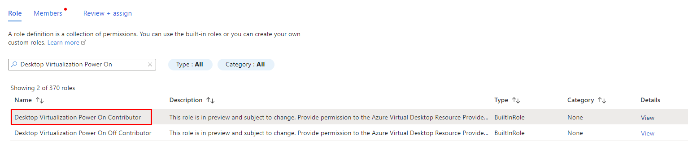
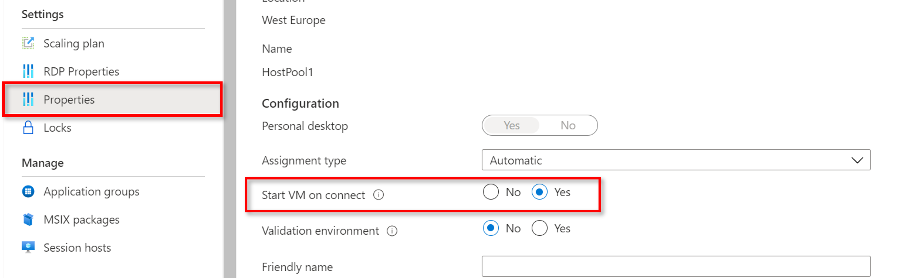

# Exercise 3: Implement Start VM on Connect

Duration: 15mins

[Previous Challenge Solution](./02-Create-a-custom-golden-image-solution.md) - **[Home](../Readme.md)** - [Next Challenge Solution](./04-multi-session-Hostpools-solution.md)

**Additional Resources**

  |              |            |  
|----------|:-------------:|
| Description | Links |
|Enable start VM on connect feature for AVD  |  https://learn.microsoft.com/en-us/azure/virtual-desktop/start-virtual-machine-connect   | 
| Grant a user access to Azure resources using the Azure portal | https://learn.microsoft.com/en-us/azure/role-based-access-control/quickstart-assign-role-user-portal |
  |              |            | 

## Task 1:

In this first part of the challenge we have to assign an Azure builtin role **Desktop Virtualization Power On Contributor**. Once assigned, this role enables Azure Virtual Desktop to turn on VMs.

### Assign custom role:

- Make sure you are still working in the subscription where you AVD virtual machines are stored.
- Navigate again to Access Control (IAM) on the left side menu and click on Add on the top left and then Add Role Assignment (compare image below)

- Under the Role tab select the role **Desktop Virtualization Power On Contributor**

- Navigate to the Members tab:
  - Here you select the first option **user, group or service principal** 
  - Click on **Select Members**, search for **Windows Virtual Desktop** and select the option
- Navigate to **Review and Assign** to create the role assignment (by doing so you give Azure Virtual Desktop the permission to turn on VMs) 

 
## Task 2:

In a second step we want to enable the feature **Start VM on Connect** for the single session host-pool, which we created in a previous challenge. This will work only if the builtin role, as described above, is assigned to Azure Virtual Desktop - otherwise Azure Virtual Desktop does not have the permission to turn on VMs. 

### Enable the Start VM on Connect feature: 

- In the Azure Portal move to the single session host-pool, which you created in one of the previous challenges
- On the left-side menu navigate to Properties
- Within the properties window, select **Yes** for start VM on connect (compare image below) 

Test: Make sure that all VMs in the host-pool are turned off and try to connect to the single session with an eligible user. If the feature is enabled successfully, you are able to connect even if no VM from the host-pool is turned on at the moment. 
